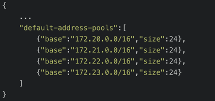

- [Docker 入门终极指南](https://mp.weixin.qq.com/s/G4e0SQnaFkXqcJbyXFz3Nw)
- [一篇文章搞定 Docker 入门](https://mp.weixin.qq.com/s/nHL5ANuzr83NsvW4yVRKEw)

1. 虚拟机

虚拟化硬件,虚拟机 Virtual Machine 指通过软件模拟的**具有完整硬件系统功能的、运行在一个完全隔离环境中的完整计算机系统**。在实体计算机中能够完成的工作在虚拟机中都能够实现。

在计算机中创建虚拟机时，需要将实体机的部分硬盘和内存容量作为虚拟机的硬盘和内存容量。**每个虚拟机都有独立的 CMOS、硬盘和操作系统，可以像使用实体机一样对虚拟机进行操作。**

虚拟机技术的代表，是 VMWare 和 OpenStack

2. 容器：将操作系统层虚拟化，是一个标准的软件单元

随处运行：容器可以将代码与配置文件和相关依赖库进行打包，从而确保在任何环境下的运行都是一致的。

高资源利用率：容器提供进程级的隔离，因此可以更加精细地设置 CPU 和内存的使用率，进而更好地利用服务器的计算资源。

快速扩展：每个容器都可作为单独的进程予以运行，并且可以共享底层操作系统的系统资源，这样一来可以加快容器的启动和停止效率。

3. 区别与联系

虚拟机虽然可以隔离出很多「子电脑」，但占用空间更大，启动更慢。虚拟机软件可能还要花钱，例如VMWare；

容器技术不需要虚拟出整个操作系统，只需要虚拟一个小规模的环境，类似「沙箱」；

运行空间，虚拟机一般要几 GB 到 几十 GB 的空间，而容器只需要 MB 级甚至 KB 级；


-----

Docker的整个生命周期由三部分组成：镜像（image）+容器（container）+ 仓库（repository）

每台宿主机（电脑），它下载好了Docker后，可以生成多个镜像，每个镜像，可以创建多个容器。发布到仓库时，以镜像为单位。可以理解成：一个容器就是一个独立的虚拟操作系统，互不影响，而镜像就是这个操作系统的安装包。想要生成一个容器，就用安装包（镜像）生成一次

镜像就是根据dockerFile文件配置打包出来的一个包，然后是根据镜像生成一个独立的容器

仓库就是制作好的镜像，就把它放到镜像仓库，方便其他人直接用镜像部署。

Docker 本身并不是容器，它是创建容器的工具，是应用容器引擎；

镜像是一个可执行包，其包含运行应用程序所需的代码、运行时、库、环境变量和配置文件，容器是镜像的运行时实例。

## docker常用参数/命令
```docker
FROM：
#指定基础镜像，所有构建的镜像都必须有一个基础镜像，且 FROM 命令必须是 Dockerfile 的第一个命令
FROM <image> [AS <name>] 指定从一个镜像构建起一个新的镜像名字
FROM <image>[:<tag>] [AS <name>] 指定镜像的版本 Tag
示例：FROM mysql:5.0 AS database

MAINTAINER：
#镜像维护人的信息
MAINTAINER <name>
示例：MAINTAINER Jartto Jartto@qq.com

RUN：
#构建镜像时要执行的命令
RUN <command>
示例：RUN [executable, param1, param2]

ADD：
#将本地的文件添加复制到容器中去，压缩包会解压，可以访问网络上的文件，会自动下载
ADD <src> <dest>
示例：ADD *.js /app 添加 js 文件到容器中的 app 目录下

COPY：
#功能和 ADD 一样，只是复制，不会解压或者下载文件

CMD：
#启动容器后执行的命令，和 RUN 不一样，RUN 是在构建镜像是要运行的命令
当使用 docker run 运行容器的时候，这个可以在命令行被覆盖
示例：CMD [executable, param1, param2]

ENTRYPOINT：
#也是执行命令，和 CMD 一样，只是这个命令不会被命令行覆盖
ENTRYPOINT [executable, param1, param2]
示例：ENTRYPOINT [donnet, myapp.dll]

LABEL：
#为镜像添加元数据，key-value 形式
LABEL <key>=<value> <key>=<value> ...
示例：LABEL version=1.0 description=这是一个web应用

ENV：
#设置环境变量，有些容器运行时会需要某些环境变量
ENV <key> <value> 一次设置一个环境变量
ENV <key>=<value> <key>=<value> <key>=<value> 设置多个环境变量
示例：ENV JAVA_HOME /usr/java1.8/

EXPOSE：
#暴露对外的端口（容器内部程序的端口，虽然会和宿主机的一样，但是其实是两个端口）
EXPOSE <port>
示例：EXPOSE 80
容器运行时，需要用 -p 映射外部端口才能访问到容器内的端口

VOLUME：
#指定数据持久化的目录，官方语言叫做挂载
VOLUME /var/log 
#指定容器中需要被挂载的目录，会把这个目录映射到宿主机的一个随机目录上，实现数据的持久化和同步

VOLUME /var/data var/log 
#指定容器中的 var/log 目录挂载到宿主机上的 /var/data 目录，这种形式可以手动指定宿主机上的目录

WORKDIR：
#设置工作目录，设置之后 ，RUN、CMD、COPY、ADD 的工作目录都会同步变更
WORKDIR <path>
示例：WORKDIR /app/test

USER：
#指定运行命令时所使用的用户，为了安全和权限起见，根据要执行的命令选择不同用户
USER <user>:[<group>]
示例：USER test

ARG：
#设置构建镜像是要传递的参数
ARG <name>[=<value>]
ARG name=sss
```

## dock compose

```docker
services:
  next-app:
    container_name: next-app
    build:
      context: $PWD
      dockerfile: Dockerfile
      args:
        ENV_VARIABLE: ${ENV_VARIABLE}
        NEXT_PUBLIC_ENV_VARIABLE: ${NEXT_PUBLIC_ENV_VARIABLE}
    restart: always
    ports:
      - 3000:3000
    environment:
      API: ""
    env_file:
        - .env
```

- build args用于在**构建Docker**镜像时传递参数。
- environment用于在容器**运行时**设置环境变量。这些变量对容器内部运行的应用程序是可见的，但不需要在构建镜像时使用。
- env_file用于从文件中读取环境变量的配置，并在容器**运行时加载**这些变量。

## Note

### `docker-compose up` 报错: Error response from daemon

failed to create network xx_app_default: Error response from daemon: could not find an available, non-overlapping IPv4 address pool among the defaults to assign to the network

- Reason: Docker默认支持**30**个不同的自定义bridge网络，如果超过这个限制，就会提示上面的错误。

可以使用命令 `docker network ls` 来查看创建的网络，其中 bridge、host、none，是docker默认网络，且不能删除。

- 统计数量：

```shell
docker network ls | wc -l
```

- 解决办法

1. 删除没使用的网络：`docker network prune`。
   这个方法能比较快速的临时解决问题。

2. 指定网络配置 不推荐,此方法 需要修改 docker-compose.yml 文件

3. 修改docker默认网络地址（推荐）

在 /etc/docker/daemon.json 追加



### 查看实时控制台
可以使用`docker logs`和`docker attach`命令。

`docker logs`命令用于查看容器的日志输出。它可以显示容器的标准输出和标准错误输出。

```shell
docker logs [OPTIONS] CONTAINER
```
`OPTIONS`是可选的参数，`CONTAINER`是容器的名称或ID。

**选项**:

- `-f, --follow`: 实时跟踪日志输出
- `-tail="all"`: 显示最后N行日志，默认为所有日志
- `--since`: 仅显示指定时间之后的日志
- `--until`: 仅显示指定时间之前的日志
- `--timestamps`: 显示时间戳

**Example是**
```shell
# 查看容器的实时日志输出
docker logs -f CONTAINER
# 查看容器的最后10行日志
docker logs --tail=10 CONTAINER

#查看容器的最后10分钟日志
docker logs --since 10m CONTAINER

# 查看容器的时间戳日志
docker logs --timestamps CONTAINER
```

#### 使用docker attach命令

`docker attach`命令用于连接到正在运行的容器的实时控制台。
```shell
docker attach [OPTIONS] CONTAINER
```
`OPTIONS`是可选的参数，`CONTAINER`是容器的名称或ID。

**注意**: `docker attach`命令将进入容器的实时控制台，并将当前终端连接到容器内部的标准输入、输出和错误输出。要从容器的实时控制台退出，可以按下`Ctrl + C`键。
### 常用命令

- `docker ps -a`:列出当前 Docker 主机上的所有容器
- docker-compose up：启动Compose文件中定义的服务，创建并启动所有容器。

- docker-compose down：停止Compose文件中定义的服务，删除所有容器和网络。

- docker-compose ps：显示Compose文件中定义的所有容器的状态。

- docker-compose logs：显示Compose文件中定义的所有容器的日志。

- docker-compose build：根据Compose文件中定义的Dockerfile构建所有服务的镜像。

- docker-compose pull：拉取Compose文件中定义的所有服务的镜像。

- docker-compose restart：重启Compose文件中定义的所有服务。

- docker-compose stop：停止Compose文件中定义的所有服务。

- docker-compose start：启动Compose文件中定义的所有服务。

- docker-compose exec：在Compose文件中定义的容器中执行命令。

- docker-compose run：在Compose文件中定义的容器中运行命令。

- docker-compose config：检查Compose文件的语法，并显示Compose文件中定义的所有服务的配置。
