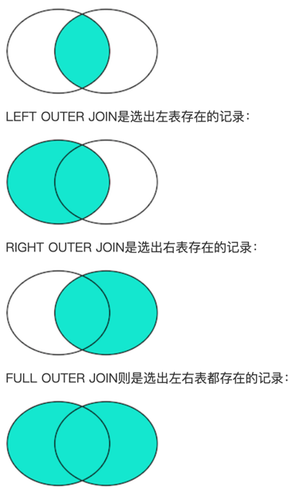

# Summary

## 查询
### 基本查询
`SELECT * FROM <表名>`,`SELECT`是关键字，表示将要执行一个查询，`*`表示“所有列”，FROM表示将要从哪个表查询，

不带FROM子句的SELECT语句有一个有用的用途，就是用来判断当前到数据库的连接是否有效。许多检测工具会执行一条`SELECT 1;`来测试数据库连接。

### 条件查询
`SELECT * FROM <表名> WHERE <条件表达式>`

eg: `SELECT * FROM students WHERE score >= 80`,其中，`WHERE`关键字后面的`score >= 80`就是条件。`score`是列名，该列存储了学生的成绩，因此，`score >= 80`就筛选出了指定条件的记录：

条件表达式可以用`<条件1> AND <条件2>`表达满足条件1并且满足条件2。

eg: `SELECT * FROM students WHERE score >= 80 AND gender = 'M';`

还可以是：`<条件1> OR <条件2>`,`NOT <条件>`

要组合三个或者更多的条件，就需要用小括号()表示如何进行条件运算

eg:`SELECT * FROM students WHERE (score < 80 OR score > 90) AND gender = 'M';`

### 投影查询

只查询对应的列：
`SELECT 列1, 列2, 列3 FROM ...`

eg: `SELECT id, score points, name FROM students WHERE gender = 'M';`

score 后的points 是别名，查询除来的列是叫points

### 排序

`ORDER BY`, eg: `SELECT id, name, gender, score FROM students ORDER BY score;`

`ORDER BY score DESC;` 倒序

### 分页查询

`LIMIT <N-M> OFFSET <M>`, eg:
```sql
SELECT id, name, gender, score
FROM students
ORDER BY score DESC
LIMIT 3 OFFSET 0;
```

* LIMIT总是设定为pageSize；
* OFFSET计算公式为`pageSize * (pageIndex - 1)`。


### 聚合查询

`COUNT()`函数查询统计，eg: `SELECT COUNT(*) FROM students;`

#### 分组聚合
`SELECT class_id, COUNT(*) num FROM students GROUP BY class_id;` 各个班级的学生人数

聚合查询的列中，只能放入分组的列。

### 多表查询
`SELECT * FROM <表1> <表2>`

查询的结果是一个二维表，它是表1和<表2>表的“乘积”

eg:
```sql
SELECT
    s.id sid,
    s.name,
    s.gender,
    s.score,
    c.id cid,
    c.name cname
FROM students s, classes c
WHERE s.gender = 'M' AND c.id = 1;
```
`students s`,s是students的别名，方便后面` s.id sid,`给列取别名

### 连接查询

连接查询是另一种类型的多表查询。连接查询对多个表进行JOIN运算，简单地说，就是先确定一个主表作为结果集，然后，把其他表的行有选择性地“连接”在主表结果集上。

eg:
```sql
SELECT s.id, s.name, s.class_id, c.name class_name, s.gender, s.score
FROM students s
INNER JOIN classes c
ON s.class_id = c.id;
```
假设查询语句是：
`SELECT ... FROM tableA ??? JOIN tableB ON tableA.column1 = tableB.column2;`

把tableA看作左表，把tableB看成右表，

那么INNER JOIN是选出两张表都存在的记录：


## 修改数据

关系数据库的基本操作就是增删改查，即CRUD：Create、Retrieve、Update、Delete。其中，对于查询，即上面的select

而对于增、删、改，对应的SQL语句分别是：

* INSERT：插入新记录；
* UPDATE：更新已有记录；
* DELETE：删除已有记录

### INSERT

INSERT 语句的基本语法是：`INSERT INTO <表名> (字段1, 字段2, ...) VALUES (值1, 值2, ...);`

eg: 
```sql
INSERT INTO students (class_id, name, gender, score) VALUES (2, '大牛', 'M', 80);
```

```sql
INSERT INTO students (class_id, name, gender, score) VALUES
  (1, '大宝', 'M', 87),
  (2, '二宝', 'M', 81);
```
### UPDATE
`UPDATE <表名> SET 字段1=值1, 字段2=值2, ... WHERE ...;`
```sql
UPDATE students SET name='大牛', score=66 WHERE id=1;
```
eg:把所有80分以下的同学的成绩加10分：
```sql
UPDATE students SET score=score+10 WHERE score<80;
```

### DELETE
```sql
DELETE FROM <表名> WHERE ...;
```
删除id=5,6,7的记录
```sql
DELETE FROM students WHERE id>=5 AND id<=7;
```
`DELETE FROM students;` 整个表的所有记录都会被删除

## 事务

例如，一个转账操作：

```sql
-- 从id=1的账户给id=2的账户转账100元
-- 第一步：将id=1的A账户余额减去100
UPDATE accounts SET balance = balance - 100 WHERE id = 1;
-- 第二步：将id=2的B账户余额加上100
UPDATE accounts SET balance = balance + 100 WHERE id = 2;
```

比如两条SQL语句必须全部执行，或者，由于某些原因，如果第一条语句成功，第二条语句失败，就必须全部撤销。这种把多条语句作为一个整体进行操作的功能，被称为数据库**事务**。

数据库事务可以确保该事务范围内的所有操作都可以全部成功或者全部失败。如果事务失败，那么效果就和没有执行这些SQL一样，不会对数据库数据有任何改动。

数据库事务具有ACID这4个特性：

* A：Atomic，原子性，将所有SQL作为原子工作单元执行，要么全部执行，要么全部不执行；
* C：Consistent，一致性，事务完成后，所有数据的状态都是一致的，即A账户只要减去了100，B账户则必定加上了100；
* I：Isolation，隔离性，如果有多个事务并发执行，每个事务作出的修改必须与其他事务隔离；
* D：Duration，持久性，即事务完成后，对数据库数据的修改被持久化存储。

对于单条SQL语句，数据库系统自动将其作为一个事务执行，这种事务被称为**隐式事务**。

要手动把多条SQL语句作为一个事务执行，使用BEGIN开启一个事务，使用COMMIT提交一个事务，这种事务被称为显式事务，例如，把上述的转账操作作为一个显式事务：

```sql
BEGIN;
UPDATE accounts SET balance = balance - 100 WHERE id = 1;
UPDATE accounts SET balance = balance + 100 WHERE id = 2;
COMMIT;
```
