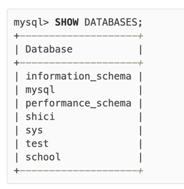

# Mysql

- SQL（发音为字母S-Q-L或sequel）是结构化查询语言（Structured Query
  Language）的缩写。SQL是一种专门用来与数据库通信的语言。

`SHOW DATABASES;` 列出所有数据库，末尾的分号要加上



其中，`information_schema`、`mysql`、`performance_schema`和`sys`是系统库，不要去改动它们。其他的是用户创建的数据库。

- 创建一个新数据库: `CREATE DATABASE test;`
- 删除一个数据库: `DROP DATABASE test;`,删除一个数据库将导致该数据库的所有表全部被删除。
- 切换为当前数据库：`USE test;`

### 表

- 列出当前数据库的所有表： `SHOW TABLES;`
- 查看一个表的结构: `DESC students;`
- 查看创建表的SQL语句：`SHOW CREATE TABLE students;`
- 删除表: `DROP TABLE students;`

```sql
CREATE TABLE `students` (
`id` bigint(20) NOT NULL AUTO_INCREMENT,
`class_id` bigint(20) NOT NULL,
`name` varchar(100) NOT NULL,
`gender` varchar(1) NOT NULL,
`score` int(11) NOT NULL,
PRIMARY KEY (`id`)
) ENGINE=InnoDB AUTO_INCREMENT=1 DEFAULT CHARSET=utf8
```

#### 列

- 增加列：给students表新增一列birth： `ALTER TABLE students ADD COLUMN birth VARCHAR(10) NOT NULL;`
- 修改列：把列名改为birthday，类型改为VARCHAR(20)：`ALTER TABLE students CHANGE COLUMN birth birthday VARCHAR(20) NOT NULL;`
- 删除列: `ALTER TABLE students DROP COLUMN birthday;`
