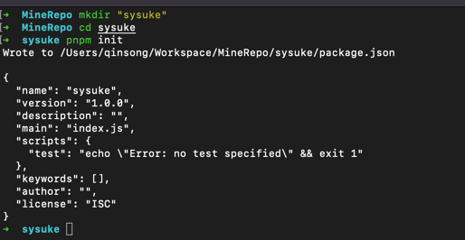
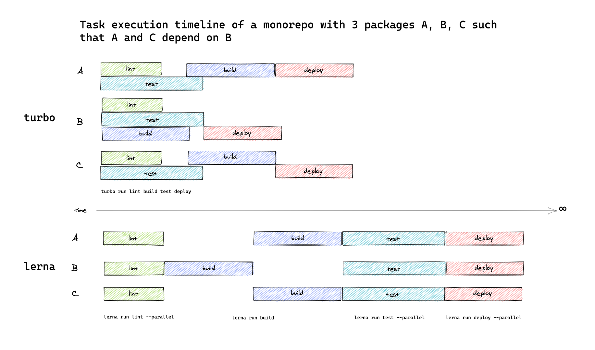

---
title: MonoRepo by pnpm workspace + TurboRepo
layout: BlogLayout
------------------

[[toc]]

## pnpm

`pnpm` 是新一代的包管理工具。按照官网说法，可以实现**节约磁盘空间并提升安装速度和创建非扁平化的 `node_modules` 文件夹**两大目标，具体原理可以参考[pnpm 官网](https://pnpm.io/zh/motivation)。

::: details 原理图

* 节约磁盘空间并提升安装速度


* 创建非扁平化的 node_modules 文件夹


:::

> v7版本的pnpm安装使用需要node版本至少大于v14，所以在安装之前首先需要检查下node版本。

* 初始化项目

```shell
# 全局安装pnpm
npm i pnpm -g
mkdir "sysuke"
cd sysuke
pnpm init
```



这里`package.json`新增个脚本和2个配置，非必须。

- 只允许`pnpm`

当在项目中使用 `pnpm` 时，如果不希望用户使用 `yarn `或者 `npm` 安装依赖，可以将下面的这个 `preinstall` 脚本添加到工程根目录下的 `package.json`中：

```shell
{
  "scripts": {
    "preinstall": "npx only-allow pnpm"
  }
}
```

`preinstall` 脚本会在 `install` 之前执行，现在，只要有人运行 `npm install` 或 `yarn install`，就会调用 `only-allow `去限制只允许使用 `pnpm` 安装依赖。

- [engines](https://docs.npmjs.com/cli/v8/configuring-npm/package-json#engines): 可以指定项目运行的 `node` 版本
- [packageManager](https://nodejs.org/api/packages.html#packagemanager): 项目期望用什么包管理工具

```json
{
  "engines": {
    "node": ">=14.0.0",
    "npm": "please use pnpm",
    "yarn": "please use pnpm"
  },
  "packageManager": "pnpm@7.6.0"
}
```

::: details package.json 个人不常用字段

- [type](https://nodejs.org/api/packages.html#type): `type` 字段定义了 `Node.js` 用于所有以 `package.json` 文件作为其最近父级的 .js 文件的模块格式。 当最近的父 `package.json` 文件包含值为`module`的顶级字段type时，以 `.js` 结尾的文件将作为 `ES 模块`加载。
- files: 指定发布到 `npm`中的文件，默认是所有文件`["*"]`，也可以通过`.npmignore`防止某些文件被包含在内，它不会覆盖`files`字段，但会覆盖其子目录。 如果不存在`.npmignore`将使用`.gitignore`替代。一般来说npm上我们只需要发布打包好的文件，对于git则恰好相反，我们只需要提交源代码。
- peerdependencies ：设置包的依赖项, `peerdependencies`设置的依赖包表达您的包与主机工具或库的兼容性， 如你开发了一个 `vue` 组件库，需要指定在vue 3.x版本中使用，可以这样设置

```json
{
  "peerdependencies": {
    "vue": "^3.0"
  }
}
```

如果用户安装了该组件库，并且安装`peerdependencies`设置的依赖包与用户安装的依赖包指定的版本不一致时，npm 会提示 vue 版本不兼容的信息

- module: 指定模块入口文件，不同于`main`字段，将指向一个具有 ES2015 模块语法的模块入口文件，你可以与main字段同时命名，当你用es6语法导入时，打包工具（rollup,webpack）会优先使用该字段对应的入口文件，

```json
{
  "name": "my-package",
  "version": "0.1.0",
  "main": "dist/my-package.umd.js",
  "module": "dist/my-package.esm.js"
}
```

- exports：字段允许定义包的入口点，当通过 node_modules 查找或对其自身名称的自引用加载的名称导入时。 Node.js 12+ 支持它作为“main”的替代方案，

```json
{
  "name": "a-package",
  "exports": {
    ".": "./main.mjs",
    "./foo": "./foo.js"
  }
}
```

并且exports还支持按条件导出

```json
{
  "type": "module",
  "main": "./index.cjs",
  "exports": {
    "import": "./wrapper.mjs",
    "require": "./index.cjs"
  }
}
```

:::

新建配置文件 `.npmrc`

```shell
registry=https://registry.npmjs.org/
shamefully-hoist=true
auto-install-peers=false
```

[shamefully-hoist](https://pnpm.io/zh/npmrc#shamefully-hoist): 如果某些工具仅在根目录的`node_modules`时才有效，可以将其设置为`true`来提升那些不在根目录的`node_modules`，就是将你安装的依赖包的依赖包的依赖包的...都放到同一级别（扁平化）。其实就是不设置为true有些包就有可能会出问题。

`auto-install-peers`为`true`时依赖树中存在缺失或无效的 peer 依赖关系时，命令将执行失败。

### monorepo的实现： [workspace](https://pnpm.io/zh/workspaces)

根目录创建`pnpm-workspace.yaml`

```yaml
packages:
  - "apps/**"
  - "packages/**"
  - "projects/**"
```

这里如果是 `'packages/*'`, 只会识别直接子目录下所有的包，而`'packages/**`, 2个`*`会识别到嵌套的子目录。 而`'!**/test/**'`会排除掉所有的`test`目录。

创建文件夹目录结构

```md
├── apps
│         ├── web
│         │         ├── package.json
│         │         └── pnpm-lock.yaml
│         ├── docs
│         │         ├── package.json
│         │         └── pnpm-lock.yaml
├── packages
│         ├── config
│         │         ├── eslint-config-custom
│         │         │         ├── package.json
│         │         │         └── pnpm-lock.yaml
│         │         ├── tsconfig
│         │         │         ├── package.json
│         │         │         └── pnpm-lock.yaml
│         ├── ui
│         │         ├── package.json
│         │         └── pnpm-lock.yaml
│         ├── util
│         │         ├── package.json
│         │         └── pnpm-lock.yaml
│         ├── webpack-react-base
│         │         ├── package.json
│         │         └── pnpm-lock.yaml
├── projects
│         ├── demo
│         │         ├── package.json
│         │         └── pnpm-lock.yaml
├── package.json
├── pnpm-lock.yaml
└── pnpm-workspace.yaml
```

这里是因为我后面要在一个仓库中放我所有的package、应用等，比如组件库，脚手架等。所以有的层级较深。

::: details workspace协议

#### [workspace协议](https://pnpm.io/zh/workspaces)

默认情况下，如果可用的 `packages` 与已声明的可用范围相匹配，`pnpm` 将从工作空间链接这些 `packages`。

例如，如果`bar`中有`"foo"："^1.0.0"`的这个依赖项，则`foo@1.0.0`链接到`bar`。 但是，如果`bar`的依赖项中有`"foo": "2.0.0"`，而`foo@2.0.0`在工作空间中并不存在，则将从 `npm registry` 安装`foo@2.0.0`，这种行为带来了一些不确定性。

`pnpm` 支持 workspace 协议（写法：`workspace:<版本号>`）。 当使用此协议时，`pnpm` 将拒绝解析除本地 `workspace` 包含的 `package` 之外的任何内容。 因此，如果设置为`"foo": "workspace:2.0.0"`时，安装将会失败，因为`"foo@2.0.0"`不存在于此 `workspace` 中。

#### 别名引用

假如工作区有一个名为`foo`的包，可以通过这样引用 `"foo": "workspace:"`，如果是其它别名，可以这么引用：`"bar": "workspace:foo@*"`。

#### 相对引用

假如`packages`下有同层级的foo、bar，其中`bar`依赖于`foo`，则可以写作`"bar": "workspace:../foo"`。

此外还有关于如何`发布 workspace 包`, 发布工作流等，可参考[官网](https://pnpm.io/zh/workspaces) 。

:::

### 依赖管理

常见的命令：[官网查看更多命令](https://pnpm.io/zh/cli/add)

这里主要列举monorepo管理package的命令

```shell
#  一键递归安装 https://pnpm.io/zh/cli/recursive
pnpm i -r
# 移除所有包中的 lodash-es
pnpm remove lodash-es -r
# 1. 全局的公共依赖包
pnpm install typescript -w
# 2. 给某个package单独安装指定依赖
pnpm add axios --filter @apps/web
# 3. 模块之间的相互依赖
pnpm install @sysuke/eslint-config-react @sysuke/tsconfig --filter @sysuke/webpack-react-base -D
# 安装到多个项目
 pnpm add mf-communication --filter="@mf.react-ts/*"
# 会执行所有 package 下的 build 命令
pnpm build --filter "./packages/**"
# 并行的跑apps所有的 dev 命令
pnpm -r --filter ./apps --parallel run dev
```

note:

- `-F`等价于`--filter`
- `--filter `参数跟着的是package下的 `package.json` 的 `name` 字段，**并不是目录名**。
- `package` 的version`*`代表默认同步最新版本, 还没找到怎么把包安装成`"@sysuke/eslint-config-base": "workspace:*",`格式，有说是在最后`@*`，但试了几次都报错。

::: details more detail

使用`pnpm`安装依赖包一般分以下几种情况：

- 全局的公共依赖包，比如打包涉及到的`rollup`、`typescript`等，代码样式美化的`prettier`等。

`pnpm` 提供了 [-w, --workspace-root](https://pnpm.io/zh/pnpm-cli#-w---workspace-root) 参数，可以将依赖包安装到工程的根目录下，作为所有 package 的公共依赖。

比如：

```shell
pnpm install typescript -w
```

如果是一个开发依赖的话，可以加上 -D 参数，表示这是一个开发依赖，会装到 pacakage.json 中的 devDependencies 中

- 给某个package单独安装指定依赖

  pnpm 提供了 [--filter](https://pnpm.io/zh/filtering) 参数，可以用来对特定的package进行某些操作。
  如果想给 pkg1 安装一个依赖包，比如 axios，可以进行如下操作：

```shell
pnpm add axios --filter @apps/web
```

`--filter `参数跟着的是package下的 package.json 的 `name` 字段，**并不是目录名**。

还可以根据`--filter `执行对应包下的所有操作，只是比单个项目多加的参数，比如`pnpm build --filter @apps/web`。也支持批量执行`$ pnpm build --filter "./packages/**"`

- 模块之间的相互依赖

  比如 pkg1 中将 pkg2 作为依赖进行安装。基于 pnpm 提供的 `workspace:协议`，可以方便的在 packages 内部进行互相引用。比如在 pkg1 中引用 pkg2：

```shell
pnpm install @sysuke/pkg1 --filter @sysuke/pkg2
```

在设置依赖版本的时候推荐用 `workspace:*`，这样就可以保持依赖的版本是工作空间里最新版本，不需要每次手动更新依赖版本。

当 `pnpm publish` 的时候，会自动将 package.json 中的 workspace 修正为对应的版本号。
:::

### what else ?

这样其实一个只是涉及依赖相互引用和包管理的基础`monorepo`工程就搞定了，比如一些历史工程的迁移，直接`copy`到`apps`，复用全局的配置，如`husky,commitlint`等，删除多余的配置和依赖，重新安装即可。但要想做好一个完整的`monorepo`工程，远不止如此。包括：

- 如何合理的抽取eslint、tsconfig配置
- 测试环境的全局配置
- 需要发布到npm上的包的发布工作流
- 全局的命令如何写才合适
- 依赖的包如何管理，构建发布
- 缓存如何复用等

#### eslint

Either start with `eslint-config-` or `@SCOPE/eslint-config.`

比如我的eslint package name为`@sysuke/eslint-config`, 就可以extend`sysuke`或者`eslint-config-sysuke`

#### husky + commitlint + lint-staged

这几个比较简单，就是把配置提到root。

```shell
pnpm add husky lint-staged @commitlint/cli @commitlint/config-conventional  -w -D
```

#### Release工作流

一般发一个包，只需要在待发布项目目录，`npm login` + `npm publish`，更新也是一样。
但每次包（Package）的发布，需要修改 `package.json` 的 `version` 字段，以及同步更新一下本次发布修改的 `CHANGELOG.md`。


而在 `workspace` 中对包版本管理是一个非常复杂的工作（会存在依赖链的问题），遗憾的是 `pnpm` 没有提供内置的解决方案，一部分开源项目在自己的项目中自己实现了一套包版本的管理机制，比如 [Vue3](https://github.com/vuejs/vue-next) 、[Vite](https://github.com/vitejs/vite/blob/main/scripts/release.ts) 等。
`pnpm` 推荐了两个开源的版本控制工具：

- [changesets](https://github.com/changesets/changesets)
- [rush](https://rushjs.io/)

这里采用了 `changesets` 来做依赖包的管理。选用 `changesets` 的主要原因还是文档更加清晰一些，个人感觉上手比较容易。而`rushjs` 不止于管理release（rush是为大型团队准备的，它可以给你提供一个仓库下维护多个项目的构建和发布方案。），

按照 `changesets` 文档介绍的，`changesets`主要是做了两件事：

> Changesets hold two key bits of information: a version type (following semver), and change information to be added to a changelog.

简而言之就是管理包的`version`和生成`changelog`。


* 安装

```shell
# 安装
pnpm add -Dw @changesets/cli
# 初始化
pnpm changeset init
```

执行完初始化命令后，会在工程的根目录下生成 `.changeset` 目录，其中的 `config.json` 作为默认的 `changeset` 的配置文件。

配置文件如下：
```json
{
  "$schema": "https://unpkg.com/@changesets/config@1.6.4/schema.json",
  "changelog": "@changesets/cli/changelog",
  "commit": false,
  "linked": [],
  "access": "restricted",
  "baseBranch": "master",
  "updateInternalDependencies": "patch",
  "ignore": []
}
```
说明如下：

- changelog: 设置 `CHANGELOG.md` 生成方式，可以设置 `false` 不生成，也可以设置为定义生成行为的文件地址或依赖名称。
- commit: 设置是否把执行 `changeset add `或 `changeset publish` 操作时对修改用 `Git` 提交
- linked: 设置共享版本的包，而不是独立版本的包，例如一个组件库中主题和单独的组件的关系，也就是修改 Version 的时候，共享的包需要同步一起更新版本
- access: 公私有安全设定，内网建议 restricted ，开源使用 public
- baseBranch: 设置默认的 Git 分支，例如现在 GitHub 的默认分支应该是 main
- updateInternalDependencies: 设置互相依赖的包版本更新机制，它是一个枚举（major|minor|patch），例如设置为 minor 时，只有当依赖的包新了 minor 版本或者才会对应地更新 package.json 的 dependencies 或 devDependencies 中对应依赖的版本
- ignore: 设置不需要发布的包，这些会被 Changesets 忽略
- ___experimentalUnsafeOptions_WILL_CHANGE_IN_PATCH: 在每次 `version` 变动时一定无理由 `patch` 抬升依赖他的那些包的版本，防止陷入 `major` 优先的未更新问题

在初始化 `.changeset` 文件夹后，就可以正常使用 `changeset` 相关的命令，主要是这 3 个命令：

- `chageset` 用于生成本次修改的要添加到 `CHANGELOG.md` 中的描述
- `changeset version` 用于生成本次修改后的包的版本
- `changeset publish` 用于发布包

此外，如果是在业务场景下，我们通常需要把包发到公司私有的 NPM Registry，而这有很多种配置方式。但是，需要注意的是 Changesets 只支持在每个包中声明 publicConfig.registry 或者配置 process.env.npm_config_registry，对应的代码会是这样：

```ts
// https://github.com/changesets/changesets/blob/main/packages/cli/src/commands/publish/npm-utils.ts
function getCorrectRegistry(packageJson?: PackageJSON): string {
  const registry =
    packageJson?.publishConfig?.registry ?? process.env.npm_config_registry;

  return !registry || registry === "https://registry.yarnpkg.com"
    ? "https://registry.npmjs.org"
    : registry;
}
```
可以看到，如果在前面说的这 2 种情况下获取不到 registry 的话，Changesets 都是按公共的 Registry 去查找或者发布包的。


```shell
# 执行 changeset，开始交互式填写变更集，这个命令会将你的包全部列出来，然后选择你要更改发布的包
changeset
# 执行 changeset version，修改发布包的版本
changeset version
```

这里需要注意的是，版本的选择一共有三种类型，分别是 patch、minor 和 major，严格遵循 [semver](https://semver.org/) 规范。

这里还有个细节，如果我不想直接发 release 版本，而是想先发一个带 tag 的 prerelease版本呢(比如beta或者rc版本)？

这里提供了两种方式：

- 手工调整

这种方法最简单粗暴，但是比较容易犯错。 首先需要修改包的版本号：

```json
{
  "name": "@sysuke/pkg1",
  "version": "1.0.2-beta.1"
}
```

然后运行： `pnpm changeset publish --tag beta`，注意发包的时候不要忘记加上`--tag` 参数。

- 通过 `changeset` 提供的 [`Prereleases` 模式](https://github.com/changesets/changesets/blob/main/docs/prereleases.md) ,可以通过 `pre enter <tag> `命令进入先进入 `pre `模式。

常见的tag如下所示：

| 名称    | 功能                                                     |
|-------|--------------------------------------------------------|
| alpha | 是内部测试版，一般不向外部发布，会有很多Bug，一般只有测试人员使用                     |
| beta  | 也是测试版，这个阶段的版本会一直加入新的功能。在Alpha版之后推出                     |
| rc    | Release　Candidate) 系统平台上就是发行候选版本。RC版不会再加入新的功能了，主要着重于除错 |

```shell
pnpm changeset pre enter beta
```
之后在此模式下的 changeset publish 均将默认走 beta 环境，下面在此模式下任意地进行你的开发，举一个例子如下：
```shell
# 1-1 进行了一些开发...
# 1-2 提交变更集
changeset
# 1-3 提升版本
changeset version
# 1-4 发包
changeset publish --registry="https://registry.npmjs.com/"

# 1-5 得到 1.0.0-beta.1

# 2-1 进行了一些开发...
# 2-2 提交变更集
pnpm changeset
# 2-3 提升版本
changeset version
# 2-4 发包
changeset publish --registry="https://registry.npmjs.com/"
# 2-5 得到 1.0.0-beta.2
```
完成版本发布之后，退出 `Prereleases` 模式：
```shell
pnpm changeset pre exit
```
构建产物后发版本
```shell
{
  "release": "pnpm build && pnpm release:only",
  "release:only": "changeset publish --registry=https://registry.npmjs.com/"
}
```

### npm 更新发布后的包

npm 更新和发布的命令一样，都是 npm publish，不同之处在于，更新时你需要修改包的版本号

npm 有一套自己的版本控制标准—— [Semantic versioning](https://semver.org/lang/zh-CN/) ，具体如下，

版本格式：主版本号.次版本号.修订号，版本号递增规则如下：

主版本号：当你做了不兼容的 API 修改
次版本号：当你做了向下兼容的功能性新增
修订号：当你做了向下兼容的问题修正
例如：version: 'x.y.z'

修复 bug，小改动，增加 z，
增加了新特性，但仍能向下兼容，增加 y
较大改动，向下不兼容，增加 x
通过 npm version <update_type> 自动改变版本
update_type:

patch 修订号
minor 次版本号
major 主版本号

`publishConfig`: access 如果是scoped包，一定需要设置为public（付费账号除外）


` npm unpublish  @sysuke/eslint-config-react --force` 撤销发布的包。（不加force有限制：只能删除72小时以内发布的包，删除的包，在24小时内不允许重复发布）

如果被其他发布上去的包依赖的话，就删除不了

## turboRepo

Turbrepo 则是 Vercel 旗下的一个开源项目。Turborepo 是用于为 JavaScript/TypeScript 的 Monorepo 提供一个极快的构建系统，简单地理解就是用 `Turborepo` 来执行 Monorepo 项目的中构建（或者其他）任务会非常快！

以理解成快是选择 Turborepo 负责 Monorepo 项目多包任务执行的原因。而在 Turborepo 中执行多包任务是通过 `turbo run <script>`。不过，turbo run 和 lerna run 直接使用有所不同，它需要配置 turbo.json 文件，注册每个需要执行的 script 命令。

在 Turborepo 中有个 Pipelines 的概念，它是由 turbo.json 文件中的 pipeline 字段的配置描述，它会在执行 turbo run 命令的时候，根据对应的配置进行有序的执行和缓存输出的文件。


trubo 可以智能的安排任务调度。首先在根项目 package.json 中定义任务的依赖关系。例如：

```json
{
  "turbo": {
    "pipeline": {
      "build": {
        "dependsOn": ["^build"]
      },
      "test": {
        "dependsOn": ["build"]
      },
      "deploy": {
        "dependsOn": ["build", "test", "lint"]
      },
      "lint": {},
      "dev": {
        "cache": false
      }
    }
  }
}
```

上面描述的大致意思是：

- dependsOn 表示当前命令所依赖的命令，`^`表示 `dependencies` 和 `devDependencies` 的所有依赖都执行完 `build`，才执行 `build`
- `outputs `表示命令执行输出的文件缓存目录，例如我们常见的 dist、coverage 等
- cache 表示是否缓存，通常我们执行 dev 命令的时候会结合 watch 模式，所以这种情况下关闭掉缓存比较切合实际需求

- build 命令执行依赖于其依赖项的 `build` 命令执行完成
- test 命令执行依赖于自身的 `build` 命令执行完成
- lint 命令可以任何时候执行
- deploy 命令执行依赖于自身的 `build test lint` 命令执行完成

使用一条命令执行所有任务`turbo run lint build test deploy`




`"type": "module",` 

- [Monorepos in JavaScript & TypeScript](https://www.robinwieruch.de/javascript-monorepos/)
- [monorepo工作流基础之changesets打开与进阶](https://blog.csdn.net/qq_21567385/article/details/122361591)
- [Changesets: 流行的 Monorepo 场景发包工具](https://mp.weixin.qq.com/s/QKqaO3U1gzwWb2sDiF4cLQ)