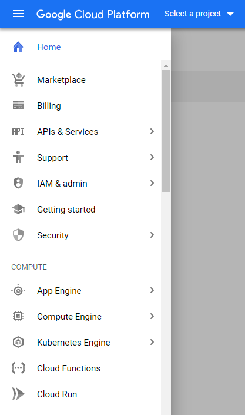

#  微前端

## 微前端及其使用场景

- [一篇英语介绍文章](https://micro-frontends.org/)
- [eluxjs](https://github.com/hiisea/elux) 基于“微模块”和“模型驱动”的跨平台、跨框架『同构方案』
- [微前端说明书](https://www.v2think.com/micro-front-end-specification)

微前端概念是从微服务概念扩展而来的，摒弃大型单体方式，将前端整体分解为小而简单的块，这些块可以独立开发、测试和部署，同时仍然聚合为一个产品出现在客户面前。可以理解微前端是一种将多个可独立交付的小型前端应用聚合为一个整体的架构风格。微前端其实不是一门具体的技术，而是一种整合的架构实现方案，也没有技术栈的约束，其使用场景就是用于大型或者多个项目的分分合合。
其使用场景主要分为：
- 大型项目的自由拆分组合
- 项目级的页面复用
大型项目不一定需要拆分成微前端架构，依靠良好的项目架构、规范等，也能开发的很好，但比如一些to b的系统，可按模块出售，提供源码等，可以考虑微前端场景。
  
> 微前端架构旨在解决单体应用在一个相对长的时间跨度下，由于参与的人员、团队的增多、变迁，从一个普通应用演变成一个巨石应用(Frontend Monolith)后，随之而来的应用不可维护的问题。这类问题在企业级 Web 应用中尤其常见。

**微**这个词并非仅仅是字面上“小”的意思，而是代表**独立和自治**

微前端不是跨世代的通用解决方案，它也不是用于代替先用的组件模式。它只是给了我们一个让不同技术栈不同团队开发同一个产品的机会。
微前端适用于不同技术栈不同团队需要对同一产品进行修改的开发模式，比如 Google Cloud:

从菜单栏我们可以看出谷歌云提供不同类型的服务，但是这些服务之间都相互独立，有的是通用性质的，有的是云计算相关的，即使是在云计算一栏下又划分了不同类型的计算服务。（我猜测）不同的服务来自不同的团队进行开发，虽然它们不相互干扰，但是又需要同一个产品予以体现。那么使用微前端是最好的方式。

注意这里“同一产品”的定义仅仅是从视觉形态和用户体验方面考虑。如果 A 网站只是要用到 B 网站的数据，那么通过接口提供就好了。

## 主要优势和缺点
- 技术兼容性好，各个子应用可以基于不同的技术架构
- 代码库更小、内聚性更强
- 便于独立编译、测试和部署，可靠性更高
- 耦合性更低，各个团队可以独立开发，互不干扰
- 可维护性和扩展性更好，便于局部升级和增量升级

关于**技术兼容性**，由于在被基座应用加载前， 所有子应用已经编译成原生代码输出，所以基座应用可以加载各类技术栈编写的应用；由于拆分后应用体积明显变小，并且每个应用只实现一个业务模块，因此其内聚性更强；另外子应用本身也是完整的应用，所以它可以**独立编译、测试和部署**；关于**耦合性**，由于各个子应用只负责各自的业务模块，所以耦合性很低，非常便于独立开发；关于**可维护性和扩展性**，由于拆分出的应用都是完整的应用，因此专门升级某个功能模块就成为了可能，并且当需要增加模块时，只需要创建一个新应用，并修改基座应用的路由规则即可。

不过这种微前端方案仍然存在缺点：

### 微前端方案的一些缺点
- 子应用间的资源共享能力较差，使得项目总体积变大
- 需要对现有代码进行改造（指的是未按照微前端形式编写的旧工程

首先，子应用之间保持较高的独立性，反而使一些**公共资源不便于共享**。虽然大型第三方库可以通过externals的方式上传到cdn，但像一些工具函数，通用业务组件等则不易共享，这就使得项目整体体积反而变大。由于改造成本不高，代码改造通常算不上很严重的问题，但仍存在一定的代价。

## 具体的方案及优缺点

一般来说，微前端需要解决的问题分为两大类：

- 应用的加载与切换
- 应用的隔离与通信

应用的加载与切换需要解决的问题包括：**路由问题**、**应用入口**、**应用加载**；应用的隔离与通信需要解决的问题包括：**js隔离**、**css样式隔离**、**应用间通信**。

### [Bit.dev](https://bit.dev/docs/quick-start)

Bit.dev是一种快速、动态化、协同式构建团队组件库的解决方案

### iframe
iframe嵌入算是微前端最早的实现方式，一般用于第三方的系统集成，iframe使用简单方便，提供天然的js/css隔离，也带来了数据传输的不便，一些数据无法共享（主要是本地存储、全局变量和公共插件），两个项目不同源（跨域）情况下数据传输需要依赖 postMessage 。且还有其他很多问题及坑需要考虑解决优化，如：
- 页面加载问题
- 布局问题
- 弹窗及遮罩层问题
- 路由即浏览器前进/后退问题
iframe虽然基本能做到微前端所要做的所有事情，但它的最大问题也在于他的隔离性无法被突破，导致应用间上下文无法被共享，随之带来开发体验、产品体验的问题。
  
### 组合式集成
即采用npm打包发布的方式，把组件单独打包和发布，然后在构建或运行时组合；

### Web Component
官方提出的组件化方案，它通过对组件进行更高程度的封装，来实现微前端，但是目前兼容性不够好，尚未普及。类似的ESM也是有相同的问题，但还需处理样式隔离。

### EMP

github: https://github.com/efoxTeam/emp

EMP是单页微前端解决方案，基于Webpack5 Module Federation，一种去中心化的微前端实现方案，它它在实现微前端的基础上，扩充了跨应用状态共享、跨框架组件调用、远程拉取ts声明文件、动态更新微应用等能力。同时，由于基于MF，EMP能做到第三方依赖的共享，使代码尽可能地重复利用，减少加载的内容。

### 基座模式
主要基于路由分发，即由一个基座应用来监听路由，并按照路由规则来加载不同的应用，以实现应用间解耦；目前社区开源的方案主要有single-spa和qiankun。
一般来说，微前端需要解决的问题分为两大类：
- 应用的加载与切换
- 应用的隔离与通信
应用的加载与切换需要解决的问题包括：路由问题、应用入口、应用加载；应用的隔离与通信需要解决的问题包括：js隔离、css样式隔离、应用间通信。
single-spa很好地解决了路由和应用入口两个问题，但并没有解决应用加载问题，而是将该问题暴露出来由使用者实现（一般可以用system.js或原生script标签来实现）。总的来说使用者还需要做挺多额外的接入工作，并不够高效及简明易用。但基于single-spa开发的qiankun，很好的解决了上面提到的问题。

qiankun文档地址：https://qiankun.umijs.org/zh

### 总结

各解决方案的总结:

|  解决方案   | 特点  | 缺点 |
|  ----  | ----  |----  |
| iframe  | 天生隔离样式与脚本 |不是单页应用，会导致浏览器刷新 iframe url 状态丢失、后退前进按钮无法使用;弹框类的功能无法应用到整个大应用中，只能在对应的窗口内展示;由于可能应用间不是在相同的域内，主应用的 cookie 要透传到根域名都不同的子应用中才能实现免登录效果;每次子应用进入都是一次浏览器上下文重建、资源重新加载的过程，占用大量资源的同时也在极大地消耗资源;iframe的特性导致搜索引擎无法获取到其中的内容，进而无法实现应用的seo  |
| 组合式集成  | 自由度高 |发布效率低下,多团队协作容易不规范  |
| Web Components  | 天生隔离样式与脚本 |无法兼容所有浏览器  |
| EMP  | 基本上满足了微前端技术的所有需求 |社区热度和实践不够，且健壮性有待考验，不支持所以框架  |
| qiankun  | html entry接入方便简单，提供的能力完备，开源且使用量上线够大，健壮性值得信赖。 |在资源和组件的复用需要考虑  |
