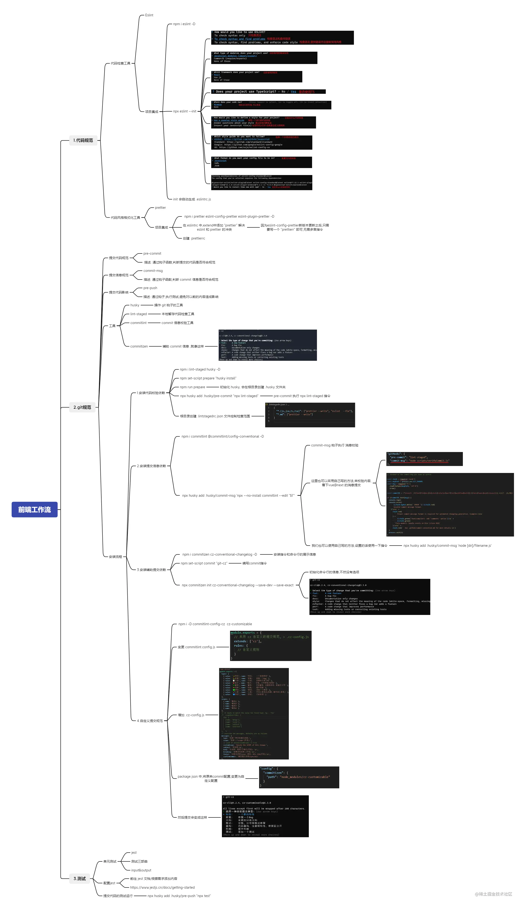

### 中后台系统

#### 中台
- [中台”到底是什么？](https://zhuanlan.zhihu.com/p/75223466)

目的：便于高速发展的复杂应用的敏捷开发

手段：解耦，提高复用

在一般的中后台系统中，我们可以把前端的架构划分为三大部分：这分别是**核心框架库**，**插件**，**公共机制**。

- 核心框架库： 系统的基础框架技术选型，比如像Vue,Vuex,Vue Router，或者说React,Redux,Router这样的，就属于核心框架库，这一部分选型是在前期完成的，需要慎重，因为它决定了整个系统以后的开发走向；
- 插件： 可以理解为工具库，比如UI框架库antd、element，图表工具库eCharts，3d库three.js等等
- 公共机制： 把一些公共的功能模块封装起来，以供其他开发人员使用，极大提升开发效率。核心在于封装。

在中后台系统中，这一般包括以下五个小部分：

1. UI组件库的二次封装。这针对一些极其常用的UI组件，主要是为了统一风格，以使用频率最高的table和form为代表；

2. 请求插件的封装。以axios为例，主要是做后台请求发生错误的统一拦截显示；

3. 后台API请求的URL地址文件封装。这主要是为了统一管理，使得URL不会零散地分布在各个业务组件中，统一修改，统一替换公共域名等；

4. 权限和菜单的封装。一般中后台系统是分人员角色的，那么不同的角色就对应不同的权限，拿到的菜单也不一样；

5. 格式化的封装。像中后台系统里面的很多格式是比较常见的，如身份证、电话号码、日期、金额、车牌号等，这些可用于一些前端校验和前端展示的场景，且在很多地方都会用到，所以非常有必要把一些常用的格式化操作放到全局。

- [前端架构探索与实践](https://blog.csdn.net/qq_29438877/article/details/108675426)

## 项目目录结构

```
├─src               //  项目目录
│  ├─api                //  数据请求
│  ├─assets             //  资源
│  │  ├─baseData            //  静态数据
│  │  └─images              //  较小图片资源
│  ├─components         //  组件
│  │    ├─base              //  基础组件
│  │    └─business          //  业务组件
│  ├─routes             //  路由
│  ├─mixins             //  混入
│  ├─store              //  状态管理
│  ├─style              //  样式
│  ├─views              //  页面
│  ├─utils              //  工具
│  └─main.js            //  入口文件
└─static            //  静态资源

```
1. api：主要负责提供数据请求的方法
2. assets：提供业务中所需要的数据资源以及较小的图片资源，vue-cli会把较小的图片编译成base64
3. components：承载了业务中所有需要用到的组件，使用base和business对基础组件进一步划分
4. routes：编写路由结构
5. mixins：公用代码的混入
6. store：页面中的状态管理
7. style：页面和组件样式
8. views：存放页面
9. utils：页面或组件中所需要用到的工具，以及对于其他第三方工具的二次封装
10. main.js：程序的入口文件
11. static：较大的静态资源文件

## 前端工作流

忘记哪里copy的了


