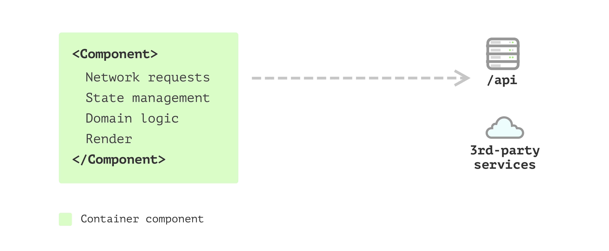
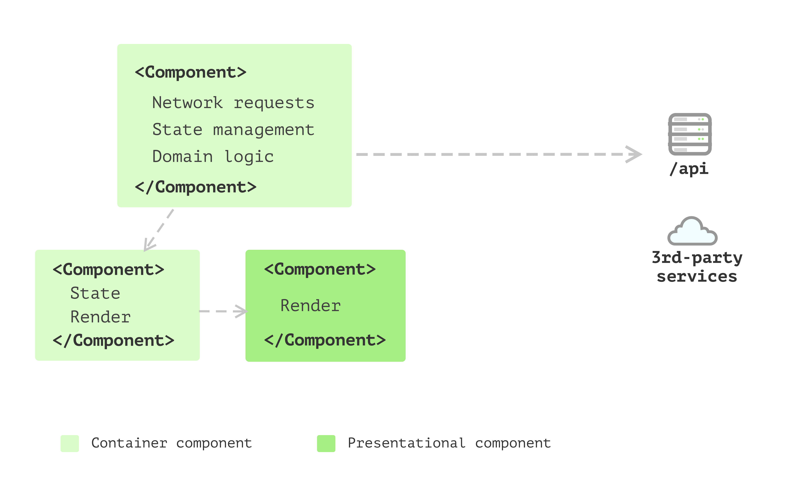
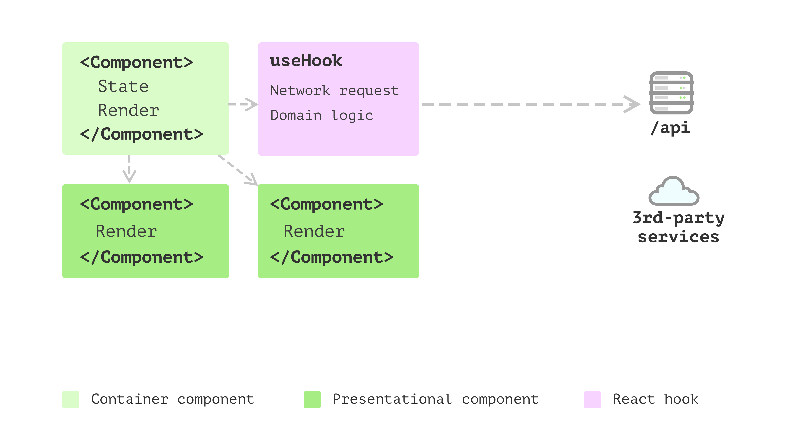
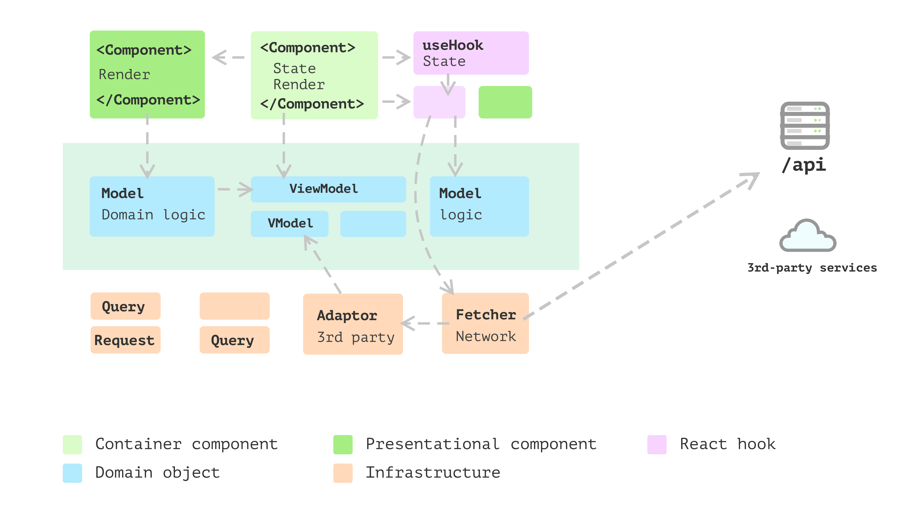

# React Around Collections

## Framework

- [nextjs](https://nextjs.org/docs)
- [remix](https://remix.run/)
- [Astro](https://astro.build/) Astro powers the world's fastest websites, client-side web apps, dynamic API endpoints, and everything in-between.

## 重构、项目架构

- [React 开发思想纲领](https://github.com/mithi/react-philosophies) - [翻译](https://juejin.cn/post/7076244324614144014)
- [bulletproof-react](https://github.com/alan2207/bulletproof-react) - A simple, scalable, and powerful architecture for building production ready React applications.

## State Manage

- [zustand](https://github.com/pmndrs/zustand)
  - [关于zustand的一些最佳实践](https://mp.weixin.qq.com/s/QRM5A_Q-kOlSumfeUm_Gvw)

实现：

::: details 点击查看代码

```ts
import { useSyncExternalStore } from 'react'

const createStore = (createState) => {
  let state
  const listeners = new Set()

  const setState = (partial, replace) => {
    const nextState = typeof partial === 'function' ? partial(state) : partial

    if (!Object.is(nextState, state)) {
      const previousState = state

      if (!replace) {
        state =
          typeof nextState !== 'object' || nextState === null
            ? nextState
            : Object.assign({}, state, nextState)
      } else {
        state = nextState
      }
      listeners.forEach((listener) => listener(state, previousState))
    }
  }

  const getState = () => state

  const subscribe = (listener) => {
    listeners.add(listener)
    return () => listeners.delete(listener)
  }

  const destroy = () => {
    listeners.clear()
  }

  const api = { setState, getState, subscribe, destroy }

  state = createState(setState, getState, api)

  return api
}

function useStore(api, selector) {
  function getState() {
    return selector(api.getState())
  }

  return useSyncExternalStore(api.subscribe, getState)
}

export const create = (createState) => {
  const api = createStore(createState)

  const useBoundStore = (selector) => useStore(api, selector)

  Object.assign(useBoundStore, api)

  return useBoundStore
}
```

:::

### server api state

- [React query](https://tanstack.com/query/v5/docs/react/overview)
  - [作者博客系列文章](https://tkdodo.eu/blog/placeholder-and-initial-data-in-react-query)

## CSS

- [styled-components](https://styled-components.com/) Css in Js
- [emotion](https://emotion.sh/docs/introduction) Css in Js
- [vanilla-extract](https://github.com/vanilla-extract-css/vanilla-extract)，Css in Js but Zero-runtime Stylesheets in TypeScript.

## UI library

- [nextui](https://nextui.org/)
- [shadcn/ui](https://ui.shadcn.com/) headless
- [Mantine](https://mantine.dev/)
- [chakra ui](https://v2.chakra-ui.com/)

### 动画

- [Framer Motion](https://www.framer.com/motion/)

### RN

- [react-native-ui-lib](https://github.com/wix/react-native-ui-lib)
- [Tamagui](https://tamagui.dev/docs/intro/introduction)
- [gluestack](https://gluestack.io/)
- [react-strict-dom：React官方跨平台方案](https://github.com/react-native-community/discussions-and-proposals/pull/496)

- [ignite](https://github.com/infinitered/ignite) the battle-tested React Native boilerplate

## project

- [Turbopack](https://github.com/vercel/turbo)
- [Bit.dev](https://bit.dev/docs/quick-start) Bit.dev是一种快速、动态化、协同式构建团队组件库的解决方案

## Articles

- [How to fetch data in React [2024]](https://www.robinwieruch.de/react-fetching-data/)， [self summary](./next_latest#data-fetch)

- [React系列（二）：单元测试最佳实践与前端TDD](https://ethan.thoughtworkers.me/#/post/2023-12-10-react-unit-testing-best-practices-v2)，实践证明，在前端以细粒度的UI组件为单元做测试不能很好地支撑重构和需求变化。本文将介绍一种能更好地支撑重构和开发、更能支撑前端TDD的单元测试方案。
- [Modularizing React Applications with Established UI Patterns](https://martinfowler.com/articles/modularizing-react-apps.html)

核心：React入官网所述，只是一个构建UI的库，但对一个复杂的React Application来说，如何构建，处理却没有很好的说明，当然不止是react，下面只是结合React展开，其实对于一个前端应用来说都可以复用这些思想。

如何组织代码，组装，存放计算/业务，数据交互/联动等逻辑，大概就是根据不同的关注点，划分到不同的文件/夹结构，`view-model-data`的分层设计，而不是在组件/hooks中搞定一切

**Single Component Application**


**Multiple Component Application**


问题： there are things like sending network requests, converting data into different shapes for the view to consume, and collecting data to send back to the server. And having this code inside components doesn’t feel right as they’re not really about user interfaces. Also, some components have too many internal states.

**State management with hooks**



使用自定义hooks抽取这些逻辑到单独的地方，The only problem is that in hooks, apart from the side effect and state management, some logic doesn’t seem to belong to the state management but pure calculations.

**Business models emerged**


**Layered frontend application**



- [PresentationDomainDataLayering](https://martinfowler.com/bliki/PresentationDomainDataLayering.html)

It’s good practice to split view and non-view code into separate places. The reason is, in general, views are changing more frequently than non-view logic. Also, as they deal with different aspects of the application, separating them allows you to focus on a particular self-contained module that is much more manageable when implementing new features.
