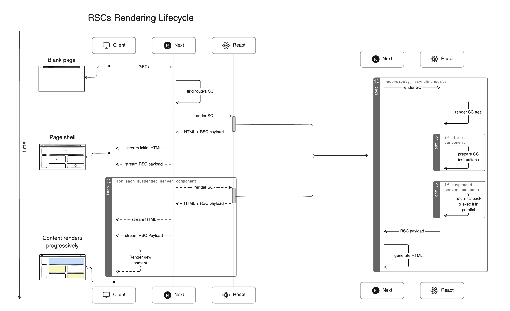
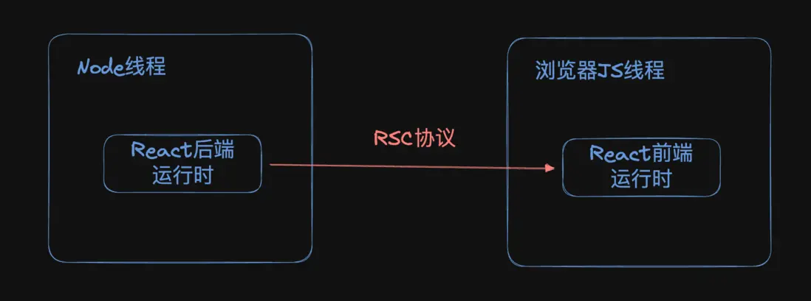
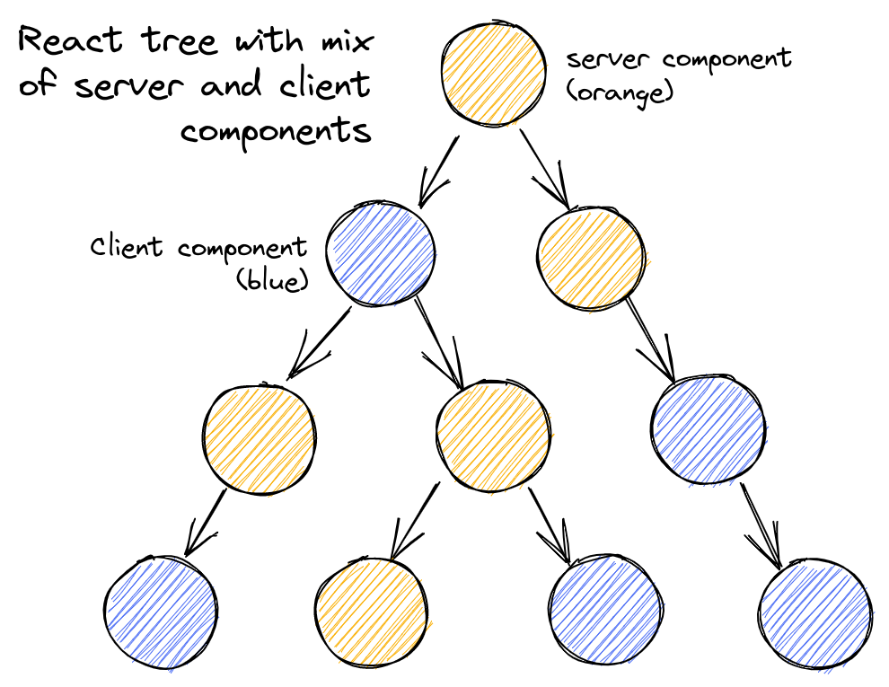

# React 18 & 19

## RSC
- [How React server components work: an in-depth guide](https://www.plasmic.app/blog/how-react-server-components-work)
- [React 期许的未来（RSC）可不能并不是国内前端想要的未来](https://mp.weixin.qq.com/s/yU6elfP0zSyKese_fu-knA) 列了工作期间遇到种种问题，比如：代码质量应该如何保证，之前工作的公司的同事水平都挺高，可为什么代码总是会变成屎山？是架构做的不好？管理不到位？时间年限太久了？还是什么原因？看起来RSC并不适合重客户端，轻服务端的后台管理系统。
- [React Server Components手把手教学](https://mp.weixin.qq.com/s/bSV19qdx96Bch_Ryg1pWXA)
- [Understanding React Server Components](https://vercel.com/blog/understanding-react-server-components)
- [The-Two-Reacts](https://overreacted.io/the-two-reacts/) => `UI = f(data, state)`

核心：使用http分块协议的传输，利用`RSC协议`将`rsc`转化为可以传输的可序列化数据，实现流式stream传输，再结合`Suspense`请求未完成前占位，server 端异步执行完后，client在利用react 18的并发模式更新UI。

### basic concept

#### Client side rendering

- [Fetch Waterfall in React](https://blog.sentry.io/fetch-waterfall-in-react/)




#### Serializable - 可序列化

可序列化（Serializable）是指一个对象或数据结构能够被转换成一种格式，这种格式可以在不同的系统或平台之间进行传输，并且能够在接收端被还原成原始的形式。在编程领域，序列化通常涉及到将对象状态转换为一个可存储或可传输的格式，如 JSON、XML 或二进制格式。

在 React Server Components (RSC) 的上下文中，可序列化意味着组件的属性（props）能够被转换为一个字符串形式，这样就可以通过网络发送到客户端，并且在客户端上被解析和使用。这通常要求属性值是基本数据类型，如字符串、数字、布尔值等，或者是可以被 JSON 序列化的复杂类型，如数组和对象。

例如，函数和类实例通常是不可序列化的，因为它们不能直接转换为 JSON 字符串。在 RSC 中，当服务器组件需要传递一个函数或类实例作为属性时，这是不可能的，因为这些值不能通过 JSON 进行序列化。相反，可以在客户端组件之间传递函数或其他可序列化的数据，然后在客户端上动态地处理这些值。

总的来说，可序列化是数据在不同系统间传输和存储的基础，它要求数据能够被转换为一种通用的、可读/写的形式，而不丢失任何信息。在 RSC 中，可序列化属性确保了服务器组件生成的数据可以安全地传递给客户端组件，而不会有任何信息丢失或错误。

#### Client Component

客户端组件是在客户端上运行的组件，通常在web浏览器中。该组件可以访问DOM、浏览器api、事件等，而服务器无法访问这些组件。他们负责处理用户交互和更新用户界面。使用在：与浏览器相关的内容，比如按钮、点击事件、窗口、浏览器api等。
使用生命周期事件、useState、useEffect等。

#### Server Components

服务器组件是在服务器上获取和渲染的组件。它们与传统的React组件类似，但在**服务器**而不是客户端上执行。这意味着它们可以访问服务器的全部功能，并且可以执行在客户机上无法执行的任务，例如数据库查询。 可以把 Server Components 看作是后端，没有任何交互性或生命周期钩子的组件。
作用:

- 使用 Client Component 时，浏览器必须安装所有依赖的包才能构建网站，这可能会导致加载时间过长，影响网站的效率，用户体验差。
- 使用 Server Components 时，浏览器只需要下载客户端组件所需的JavaScript，而不是整个网站的js。
- 服务端组件不会出现在客户端的bundle中，所以浏览器只会下载客户端所需要的js。
- 自动代码分割，加载必要的客户端代码。

### RSC Wire Format(数据传输格式)

#### RSC协议详解

将RSC看作一种`rpc`（Remote Procedure Call，远程过程调用）协议的实现。数据传输的两端分别是**React后端运行时**与**React前端运行时**。



一款rpc协议最基本地组成包括三部分：

- 数据的序列化与反序列化
- id映射
- 传输协议

eg:
```js
// OuterServerCpn.server.jsx
import ClientCpn from './ClientCpn.client'
import ServerCpn from './ServerCpn.server'
export default function OuterServerCpn() {
  return (
    <ClientCpn>
      <ServerCpn />
    </ClientCpn>
  )
}

// ClientCpn.client.jsx
export default function({children}) {
  return <div>{children}</div>;
}

// ServerCpn.server.jsx
export default function() {
  return <div>服务端组件</div>;
}
```
这段组件代码转化为RSC数据后如下
```
M1:{"id":"./src/ClientCpn.client.js","chunks":["client1"],"name":""}
J0:["$","div",null,{"className":"main","children":["$","@1",null,{"children":["$","div",null,{"children":"服务端组件"}]}]}]
```
M行以 M 开头，定义了客户端组件模块的引用。该行提供了查找客户端包中组件函数所需的信息。J行以 J 开头，定义了实际的 React 元素树。其中包括由 M 行定义的客户端组件引用（例如 @1）。这种格式非常适合流式传输——一旦客户端读取整个行，它就可以解析 JSON 片段并取得进展。如果服务器在渲染时遇到 suspense boundaries，则会看到多个 J 行对应于每个块的解决。


- more [React Server Component 从理念到原理](https://segmentfault.com/a/1190000043901627)


### Use guide



最好将服务器组件放在组件层次结构的「根部」，并将客户端组件推向组件树的「叶子」。

数据获取可以在服务器组件的顶部进行，并可以按照React允许的方式进行传递。用户交互（事件处理程序）和访问浏览器API可以在客户端组件中的叶子级别进行处理。

**客户端组件无法导入服务器组件**，但反过来是可以的。在服务器组件内部导入客户端组件或服务器组件都是可以的。而且，服务器组件可以将另一个服务器组件作为子组件传递给客户端组件，例如：

```tsx
// ClientComponent.client.jsx
export default function ClientComponent({ children }) {
  return (
    <div>
      <h1>Hello from client land</h1>
      {children}
    </div>
  )
}

// ServerComponent.server.jsx
export default function ServerComponent() {
  return <span>Hello from server land</span>
}

// OuterServerComponent.server.jsx
// OuterServerComponent can instantiate both client and server
// components, and we are passing in a <ServerComponent/> as
// the children prop to the ClientComponent.
import ClientComponent from './ClientComponent.client'
import ServerComponent from './ServerComponent.server'
export default function OuterServerComponent() {
  return (
    <ClientComponent>
      <ServerComponent />
    </ClientComponent>
  )
}

```

- 可以在服务器组件内部导入客户端组件。
- 不能在客户端组件内部导入服务器组件,要通过`children` props传递到rcc下。
- 可以将一个服务器组件作为子组件传递给服务器组件内的客户端组件。 


## Hooks

### 18
- useTransition: 用于过渡动画的 Hook。返回过渡状态和一个函数，用于启动过渡。
- useDeferredValue：接受一个值并返回一个新值的 hook，类似于使用防抖或节流来延迟更新。旧值将保留，直到紧急更新完成，然后渲染新值。
- useId：生成唯一 ID 的hook函数。
- useSyncExternalStore：用于订阅外部 store 的hook。
- useInsertionEffect：该 hook 用于在读取布局之前将样式插入到 DOM 中，会在所有 DOM 变化之前同步触发。也就是说，该 hook 会在 useLayoutEffect 之前被触发。`useInsertionEffect` 主要用于 `CSS-in-JS` 库，例如 `styled-components`。由于该钩子的作用范围有限，它无法访问 `refs`，也不能安排更新。

### 19
- use: 读取 Promise 或 Context 等资源的值
- useOptimistic: 乐观地更新 UI

react-dom:

- useFormStatus：提供上次表单提交的状态信息。
- useFormState：允许根据表单操作的结果更新状态

### use
可以在循环和条件判断如`if`中使用


### useDeferredValue

`const deferredValue = useDeferredValue(value)`

- value 要延迟的值，可以是任何类型
- deferredValue 在初始渲染期间，返回的延迟值将与提供的值相同。
- 在更新过程中，React 将首先尝试使用旧值重新渲染（因此它将返回旧值），
- 然后尝试使用新值在后台重新渲染（因此它将返回更新的值）。

#### 与debouncing（防抖动） 和 throttling（节流）的区别

默认情况下，由`useDeferredValue` 完成的延迟重新渲染是可中断的。这意味着，如果 React 正在重新渲染一个大列表，但用户再次击键，React 将放弃重新渲染，处理击键，然后再次开始在后台渲染。
相比之下，`debouncing` 和 `throttling` 仍然会产生卡顿的体验，因为它们会阻塞：它们只是推迟渲染阻塞击键的时刻。
如果要优化的工作在渲染期间没有发生，则去抖动和限制仍然有用。例如，它们可以让您发出更少的网络请求。您也可以同时使用这些技术。

### `useOptimistic(state, updateFn)`
```jsx
import { useOptimistic } from 'react';

function AppContainer() {
  const [optimisticState, addOptimistic] = useOptimistic(
    state,
    // updateFn
    (currentState, optimisticValue) => {
      // merge and return new state
      // with optimistic value
    }
  );
}
```
`useOptimistic` 可以在异步操作进行时显示不同的状态。它接受某个 `state` 作为参数，并返回该 `state` 的副本，该`state` 在异步操作（如网络请求）的持续时间内可能会有所变化。`useOptimistic` 的第二个参数为一个函数，该函数以 state 的当前状态和操作的输入，函数返回值为异步操作 pending 时会使用的乐观状态。
被称为乐观状态，是因为它通常用于**立即向用户显示执行操作的结果**，即使该操作实际上还未返回最终结果。

```tsx
import { useOptimistic, useRef, useState } from 'react'

import { Button } from '@/components/ui/button'
import { Input } from '@/components/ui/input'

type Message = {
  text: string
  sending: boolean
  key: number
}

export async function deliverMessage(message: string) {
  // const res = await fetch("https://api.chucknorris.io/jokes/random")
  // const data = await res.json();
  await new Promise((res) => setTimeout(res, 1000))
  return message
}

type ThreadProps = {
  messages: Message[]
  sendMessage: (formData: FormData) => Promise<void>
}

function Thread({ messages, sendMessage }: ThreadProps) {
  const formRef = useRef<HTMLFormElement>(null)

  const [optimisticMessages, addOptimisticMessage] = useOptimistic<
    Message[],
    string
  >(messages, (state, newMessage) => [
    ...state,
    {
      text: newMessage,
      sending: true,
      key: Date.now(), // Generate a unique key for each message
    },
  ])

  async function formAction(formData: FormData) {
    addOptimisticMessage(formData.get('message') as string)
    formRef.current?.reset()
    await sendMessage(formData)
  }

  return (
    <div className="w-72">
      <ul className="my-6 ml-6 list-disc [&>li]:mt-2">
        {optimisticMessages.map((message, index) => (
          <li key={index}>
            {message.text}
            {message.sending && <small> (Sending...)</small>}
          </li>
        ))}
      </ul>
      <form
        action={formAction}
        ref={formRef}
        className="flex space-x-4"
      >
        <Input
          type="text"
          name="message"
          placeholder="Hello!"
        />
        <Button type="submit">Send</Button>
      </form>
    </div>
  )
}
export const UseOptimisticHook = () => {
  const [messages, setMessages] = useState<Message[]>([
    { text: 'Hello there!', sending: false, key: 1 },
  ])

  async function sendMessage(formData: FormData) {
    const sentMessage = await deliverMessage(formData.get('message') as string)
    setMessages((messages) => [
      ...messages,
      { text: sentMessage, sending: false, key: Date.now() },
    ])
  }
  return (
    <Thread
      messages={messages}
      sendMessage={sendMessage}
    />
  )
}
```

## References

- [The Forensics Of React Server Components (RSCs)](https://www.smashingmagazine.com/2024/05/forensics-react-server-components/)
