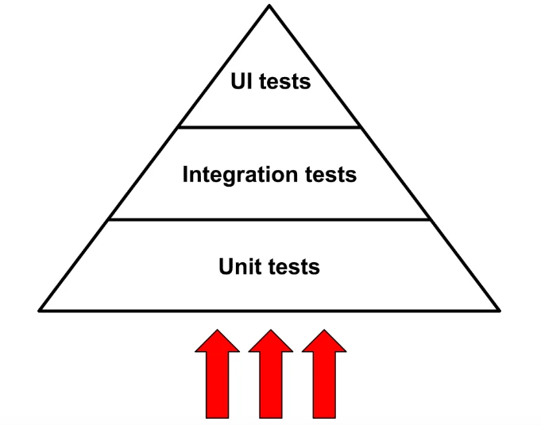
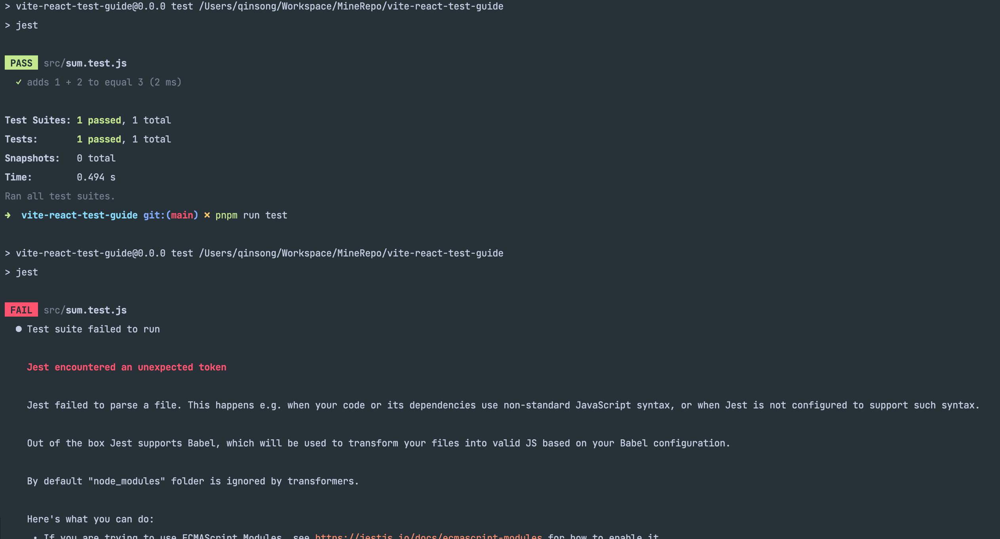

- 大致介绍前端测试是什么，在敏捷开发中的实践和作用，前端测试的实践
- 介绍Jest和React Testing Library，之间的关系
- 如何在vite-react中配置
- 如何测试一个组建，hooks，路由，页面

测试在敏捷开发中也是不可或缺的部分，在结对编程中，可以一人写测试，一人写实现代码。是重构环节的强力支持。


## 测试类型

前端测试主要分为 3 种：单元测试（Unit Test）、集成测试（Integration Test）、UI 测试（UI Test）

### 什么是单元测试


>在计算机编程中，单元测试（英语：Unit Testing）又称为模块测试，是针对程序模块（软件设计的最小单位）来进行正确性检验的测试工作。程序单元是应用的最小可测试部件。在过程化编程中，一个单元就是单个程序、函数、过程等；对于面向对象编程，最小单元就是方法，包括基类（超类）、抽象类、或者派生类（子类）中的方法。——维基百科

所谓单元测试（unit testing），是指对软件中的最小可测试单元进行检查和验证。通俗地讲，在前端，单元可以理解为一个独立的模块文件，单元测试就是对这样一个模块文件的测试。


通常情况下，在公共函数/组件中一定要有单元测试来保证代码能够正常工作。单元测试也应该是项目中数量最多、覆盖率最高的。

能进行单元测试的函数/组件，一定是低耦合的，这也从一定程度上保证了我们的代码质量。


### 集成测试

所谓集成测试（Integration Testing），是指对软件中的所有模块按照设计要求进行组装为完整系统后，进行检查和验证。通俗地讲，在前端，集成测试可以理解为对多个模块实现的一个交互完整的交互流程进行测试。

集成测试通常被应用在：耦合度较高的函数/组件、经过二次封装的函数/组件、多个函数/组件组合而成的函数/组件等。

集成测试是安全感较高的测试，能很大程度提升开发者的信心，集成测试用例设计合理且测试都通过能够很大程度保证产品符合预期。

### UI 测试（UI Test）


就前端而言，UI 测试（UI Test）更贴近于我们的开发流程。在前后端分离的开发模式中，前端开发通常会使用到 Mock 的服务器和数据。因而我们需要在开发基本完成后进行相应的 UI 测试（UI Test）。

### 端到端测试E2E Test


E2E（end to end）端到端测试是最直观可以理解的测试类型。在前端应用程序中，端到端测试可以从用户的视角通过浏览器自动检查应用程序是否正常工作。

一些流行的端到端测试框架：

- Cypress（推荐）
- Nightwatch
- WebdriverIO
- playwright
  优点：

真实的测试环境，更容易获得程序的信心

缺点：

首先，端到端测试运行不够快。启动浏览器需要占用几秒钟，网站响应速度又慢。通常一套端到端测试需要 30 分钟的运行时间。如果应用程序完全依赖于端到端测试，那么测试套件将需要数小时的运行时间。
端到端测试的另一个问题是调试起来比较困难。要调试端到端测试，需要打开浏览器并逐步完成用户操作以重现 bug。本地运行这个调试过程就已经够糟糕了，如果测试是在持续集成服务器上失败而不是本地计算机上失败，那么整个调试过程会变得更加糟糕。

测试金字塔
首先，简单对以上集中测试方法简单总结一下：

单元测试：从程序角度出发，对应用程序最小的部分（函数、组件）运行测试的过程，它是从程序员的角度编写的，保证一些方法执行特定的任务，给出特定输入，得到预期的结果。
集成测试：从用户角度出发，对应用中多个模块组织到一起的正确性进行测试。
快照测试：快照测试类似于“找不同”游戏，主要用于 UI 测试。
端到端测试：端到端测试是从用户的角度编写的，基于真实浏览器环境测试用户执行它所期望的工作。

那到底该写哪种测试？都写，根据情况灵活分配。比较典型的就是：

金字塔模式




奖杯模型中自下而上分为静态测试、单元测试、集成测试、e2e 测试, 它们的职责大致如下：

静态测试：在编写代码逻辑阶段时进行报错提示。(代表库: ESLint、Flow、TypeScript)
单元测试：在奖杯模型中, 单元测试的职责是对一些边界情况或者特定的算法进行测试。(代表库: Jest、Mocha)
集成测试：模拟用户的行为进行测试，对网络请求、获取数据库的数据等依赖第三方环境的行为进行 Mock。（代表库: Jest、react-testing-library、Vue Testing Library 等）
e2e 测试：模拟用户在真实环境上操作行为（包括网络请求、获取数据库数据等）的测试。（代表库: Cypress）

通过前面的介绍，相信大家对自动化测试有了一个初步的了解，那实际开发中怎么用呢？

下面是针对不同的应用场景为了一些个人建议:【重点结论】

如果你是开发纯函数库，建议写更多的单元测试 + 少量的集成测试
如果你是开发组件库，建议写更多的单元测试、为每个组件编写快照测试、写少量的集成测试 + 端到端测试
如果你是开发业务系统，建议写更多的集成测试、为工具类库、算法写单元测试、写少量的端到端测试


这里再次强调一下常见这几种测试的应用场景：

如果你是开发纯函数库，建议写更多的单元测试 + 少量的集成测试
如果你是开发组件库，建议写更多的单元测试、为每个组件编写快照测试、写少量的集成测试 + 端到端测试
如果你是开发业务系统，建议写更多的集成测试、为工具类库、算法写单元测试、写少量的端到端测试


#### 快照测试

快照测试类似于“找茬”游戏。快照测试会给运行中的应用程序拍一张图片，并将其与以前保存的图片进行比较。如果图像不同，则测试失败。这种测试方法对确保应用程序代码变更后是否仍然可以正确渲染很有帮助。
当然，在前端中，其实并不是比较图片，而是比较前后生成的html结构，本质上是一个字符串的比较。
哪些场景会用到快照测试呢？典型的就是组件库中，例如：ant design，vant等其实每个组件都会有对应的快照测试。

##### 快照测试的弱点
快照本身不能验证渲染逻辑的正确性，它们只是擅长防止意外更改，检查渲染结果是否所需的元素、值及样式等等。

快照测试失败时，很容易通过 Jest –updateSnapshot 选项更新，而没有采取适当的措施验证是否需要更改。因此，需要某些开发人员纪律。

创建快照时，即使在渲染的输出实际上是错误的情况下，也被认为是正确的。


> UI 测试（UI Test）只是对于前端的测试，是脱离真实后端环境的，仅仅只是将前端放在真实环境中运行，而后端和数据都应该使用 Mock 的。

> 端到端测试（E2E Test）则是将整个应用放到真实的环境中运行，包括数据在内也是需要使用真实的。

## 测试思想/？

### TDD

TDD，即Test-Driven Development（测试驱动开发），简单的来说就是先编写测试代码，然后以使得所有测试代码都通过为目的，编写逻辑代码，是一种以测试来驱动开发过程的开发模式。

### BDD 

BDD, 即Behavior Driven Development(行为驱动开发)，简单的来说就是先编写业务逻辑代码，然后以使得所有业务逻辑按照预期结果执行为目的，编写测试代码，是一种以用户行为来驱动开发过程的开发模式。

## 测试框架

单元测试（Unit Test）有 Mocha, Ava, Karma, Jest, Jasmine 等。
集成测试（Integration Test）和 UI 测试（UI Test）有 ReactTestUtils, Test Render, Enzyme, React-Testing-Library, Vue-Test-Utils 等。

著作权归作者所有。商业转载请联系作者获得授权，非商业转载请注明出处。

## React项目如何配置Jest和RTL

通过 `create-react-app`创建的项目以及默认配置好`Jest`和`RTL`，开箱即用，基本满足需求，CRA涉及的依赖包有

- `babel`，包括`babel-jest`, `@babel/core`, `@babel/preset-env`，使用babel肯定是为了转译，比如nodejs 采用的是 CommonJS 的模块化规范，使用 require 引入模块；而 import 是 ES6 的模块化规范关键字。为了能使用这些新特性，就需要使用 babel 把 ES6 转成 ES5 语法。
- jest,jest-resolve ??? ,jest-watch-typeahead(jest watch的时候使用这个根据文件名或者测试名称去筛选)
- @testing-library/jest-dom、@testing-library/react、@testing-library/user-event

可以通过`npm run eject`看到相关完整的配置和脚本等。

接下来将通过使用`pnpm create vite vite-react-test-guide -- --template react-ts`创建的base项目展示如何配置的，比较简单，大部分是配置jest的，可先参考官网的[getting started](https://jestjs.io/docs/getting-started),

### 安装依赖

首先需要安装所需要的依赖

```shell
pnpm install jest @types/jest -D

pnpm install babel-jest @babel/core @babel/preset-env @babel/preset-react @babel/preset-typescript -D

pnpm install @testing-library/jest-dom @testing-library/react @testing-library/user-event @types/testing-library__jest-dom -D
pnpm install identity-obj-proxy -D
pmpm install eslint-plugin-jest -D
```

##### babel?

我们都知道babel其实就是个编译器，`Jest` 目前支持的是 `cjs` 规范，本质上也是因为如上提到的node也是

比如在未做任何配置的情况下创建如下简单的测试

```js
// sum.js
// function sum(a, b) {
//   return a + b
// }
//
// module.exports = sum

export function sum(a, b) {
    return a + b
}
```
测试脚本
```js
// sum.test.js
// const sum = require('./sum')
//
// test('adds 1 + 2 to equal 3', () => {
//   expect(sum(1, 2)).toBe(3)
// })

import { sum } from './sum'

test('adds 1 + 2 to equal 3', () => {
    expect(sum(1, 2)).toBe(3)
})
```
如图所示，使用cjs不会报错，而使用esm就不支持。其实node在13.2.0 版本就正式支持esm了，所以如果想直接支持esm, 可参考[官方文档](https://jestjs.io/docs/ecmascript-modules) 。目前都是实验性质的开启，这里不再尝试和深究了。


当然除了以上，比如要支持`typescript`也是使用的`@babel/preset-typescript`去做的，需要注意的是，`@babel/preset-typescript` 只做语法转换，不做类型检查，因为类型检查的任务可以交给 `IDE` （或者用 `tsc`）去做，或者使用[ts-jest](https://jestjs.io/docs/next/getting-started#via-ts-jest) 去做。


Jest 运行时内部先执行babel-jest, 检测是否安装 babel-core，然后取 .babelrc(或者babel.config.js/package.json) 中的配置，运行测试之前结合 babel 先把测试用例代码转换一遍然后再进行测试。

可以预见到，为了jest会不依赖与babel\babel-jest，包括现在就在做实验性质的尝试，官网就提到过[`Once V8 coverage and native ESM support stabilizes in Jest, we will also be able remove babel-jest as a default but we will keep maintaining it.`](https://jestjs.io/blog/2020/05/05/jest-26)
总之就等node.js ESM特效稳定咯, [v28也不行](https://jestjs.io/blog/2022/04/25/jest-28#ecmascript-modules)


> 在vite下使用Jest, 应该可以考虑不要babel，比如用[`esbuild-jest`](https://www.npmjs.com/package/esbuild-jest) 去transform file，毕竟vite也是基于esbuild的，这个后面尝试下


##### 为什么CRA创建的ts模版项目package.json没有`@babel/preset-react @babel/preset-typescript`

被集成到`babel-preset-react-app`包的dependencies中了，这个包就是包含`Babel preset`的，只是一个合集，在cra项目的package.json中可以看到如下配置

```json
{
  "babel": {
    "presets": [
      "react-app"
    ]
  }
}
``` 

##### [identity-obj-proxy](https://www.npmjs.com/package/identity-obj-proxy) 是个什么鬼？

在后面jest配置中，会有如下的配置：

```js
module.exports = {
    // ...
    "moduleNameMapper": {
        "\\.(css|sass|scss)$": "identity-obj-proxy"
    },
    // in cra
    "moduleNameMapper": {
        "^react-native$": "react-native-web",
        "^.+\\.module\\.(css|sass|scss)$": "identity-obj-proxy"
    },
};
```

关于该配置字段的[描述文档](https://jestjs.io/docs/next/configuration#modulenamemapper-objectstring-string--arraystring) 如下所述：

> A map from regular expressions to module names that allow to stub out resources, like images or styles with a single module.

就是用来 [stub](https://stackoverflow.com/questions/4029313/what-is-a-stub-routine) 一些资源文件或 `module `使用的，可以把匹配到的内容映射为你指定的内容，哪怕是“指鹿为马”也是行得通的！在前端的单元测试中，时常有许多内容是不需要的，比如：静态资源、样式文件等。那么这个时候就可以将这些“鹿”指成“马”了。

而[`identity-obj-proxy`](https://github.com/keyz/identity-obj-proxy#readme) 就是用来干这个事情的

##### [eslint-plugin-jest](https://www.npmjs.com/package/eslint-plugin-jest)?

解决eslint关于jest的报错，比如`ESLint: 'test' is not defined.(no-undef)`之类的，因为Jest的Api是全局不需要import的


##### 

- `@testing-library/dom`: 一个轻量级的(DOM 查询、交互)测试解决方案,它使用了一种与 ”用户的在页面中查找元素" 类似的DOM查询方式，以保证准确性;
- `@testing-library/user-event`: 提供了更加高级的浏览器交互模拟 – 即事件;
- `@testing-library/react`: 在 `@testing-library/dom` 基础上，将 React 组件渲染为 DOM 便于后边测试;
- `@testing-library/jest-dom`：追加一系列辅助测试 DOM 的 `matchers` 匹配器，需要在每个 react test 文件的顶部引用，否则类似 `expect(dom).toBeInTheDocument()` 这样的断言则没法用，可以在setup中统一处

### 配置文件

首先需要添加测试脚本命令
```json
{
  "scripts": {
    "test": "jest"
  }
}
```

#### jest.config.js

可通过`jest --init`生成粗略的配置.

```js
/*
 * For a detailed explanation regarding each configuration property and type check, visit:
 * https://jestjs.io/docs/configuration
 */

export default {
    testEnvironment: 'jsdom',
    setupFilesAfterEnv: ['<rootDir>/src/setupTests.ts'],
    moduleNameMapper: {
        '\\.(css|sass|scss)$': 'identity-obj-proxy'
    },
    // 是否显示覆盖率报告
    collectCoverage: true
}
```

下面是cra中的配置，放在了package.json中

 ::: details 点击查看代码

```json
{
  "jest": {
    "roots": [
      "<rootDir>/src"
    ],
    "collectCoverageFrom": [
      "src/**/*.{js,jsx,ts,tsx}",
      "!src/**/*.d.ts"
    ],
    "setupFiles": [
      "react-app-polyfill/jsdom"
    ],
    "setupFilesAfterEnv": [
      "<rootDir>/src/setupTests.ts"
    ],
    "testMatch": [
      "<rootDir>/src/**/__tests__/**/*.{js,jsx,ts,tsx}",
      "<rootDir>/src/**/*.{spec,test}.{js,jsx,ts,tsx}"
    ],
    "testEnvironment": "jsdom",
    "transform": {
      "^.+\\.(js|jsx|mjs|cjs|ts|tsx)$": "<rootDir>/config/jest/babelTransform.js",
      "^.+\\.css$": "<rootDir>/config/jest/cssTransform.js",
      "^(?!.*\\.(js|jsx|mjs|cjs|ts|tsx|css|json)$)": "<rootDir>/config/jest/fileTransform.js"
    },
    "transformIgnorePatterns": [
      "[/\\\\]node_modules[/\\\\].+\\.(js|jsx|mjs|cjs|ts|tsx)$",
      "^.+\\.module\\.(css|sass|scss)$"
    ],
    "modulePaths": [],
    "moduleNameMapper": {
      "^react-native$": "react-native-web",
      "^.+\\.module\\.(css|sass|scss)$": "identity-obj-proxy"
    },
    "moduleFileExtensions": [
      "web.js",
      "js",
      "web.ts",
      "ts",
      "web.tsx",
      "tsx",
      "json",
      "web.jsx",
      "jsx",
      "node"
    ],
    "watchPlugins": [
      "jest-watch-typeahead/filename",
      "jest-watch-typeahead/testname"
    ],
    "resetMocks": true
  }
}
```
:::


#### setupTests.ts

在根目录src新建 `setupTests.ts`

```js
import "@testing-library/jest-dom"
```
一次引用，不要再次import

#### babel.config.js

````js
module.exports = {
  presets: [
    [
      '@babel/preset-env',
      {
        targets: {
          node: 'current'
        }
      }
    ],
    '@babel/preset-react',
    '@babel/preset-typescript'
  ]
}
````


#### 生成测试覆盖率报告

什么是单元测试覆盖率？

单元测试覆盖率是一种软件测试的度量指标，指在所有功能代码中，完成了单元测试的代码所占的比例。有很多自动化测试框架工具可以提供这一统计数据，其中最基础的计算方式为：

```text
单元测试覆盖率 = 被测代码行数 / 参测代码总行数 * 100%
```

如何生成？

加入 jest.config.js 文件


```js
module.exports = {
  // 是否显示覆盖率报告
  collectCoverage: true,
  // 告诉 Jest 哪些文件需要经过单元测试测试
  collectCoverageFrom: ['src'],
}
```


参数解读

| 参数名         | 含义     | 说明                |
|-------------|--------|-------------------|
| % stmts	    | 语句覆盖率	 | 是不是每个语句都执行了？      |  
| % Branch	   | 分支覆盖率	 | 是不是每个 if 代码块都执行了？ |    
| % Funcs	    | 函数覆盖率	 | 是不是每个函数都调用了？      |    
| % Lines	    | 行覆盖率	  | 是不是每一行都执行了？       |    

#### 报错

1. 

v28版本更新导致，见[文档](https://jestjs.io/blog/2022/04/25/jest-28#breaking-changes)

安装`pnpm i jest-environment-jsdom -D` 解决

2. svg资源导致  Jest encountered an unexpected token


jest配置添加如下，如[Code Transformation](https://jestjs.io/docs/next/code-transformation)
```js
export default {
    // ...
    transform: {
        '\\.[jt]sx?$': 'babel-jest',
        '\\.(jpg|jpeg|png|gif|eot|otf|webp|svg|ttf|woff|woff2|mp4|webm|wav|mp3|m4a|aac|oga)$': '<rootDir>/jest/fileTransformer.js'
    },
    // ...
}
```


demo以最新的vite例子


- [jest](https://jestjs.io/docs/getting-started)
- [前端单元测试](https://ths.js.org/2021/04/06/%E5%89%8D%E7%AB%AF%E5%8D%95%E5%85%83%E6%B5%8B%E8%AF%95/#TDD%E2%80%94%E6%B5%8B%E8%AF%95%E9%A9%B1%E5%8A%A8%E5%BC%80%E5%8F%91)