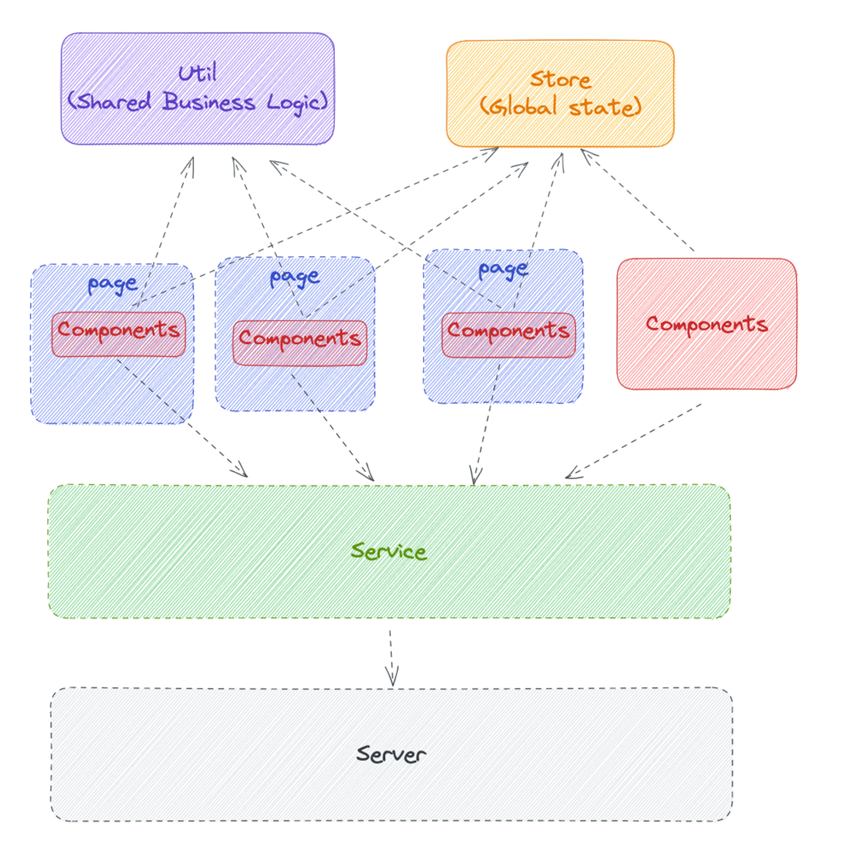
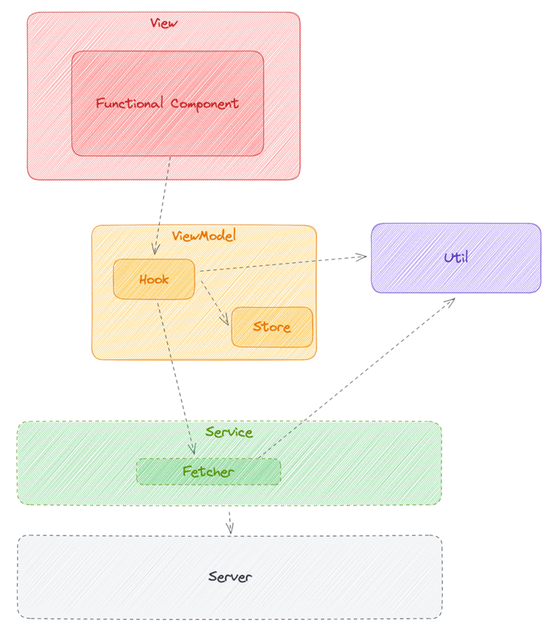

# Guide

## 黑盒测试和白盒测试
- [黑盒测试](https://zh.wikipedia.org/wiki/%E9%BB%91%E7%9B%92%E6%B5%8B%E8%AF%95)
- [白盒测试](https://zh.wikipedia.org/wiki/%E7%99%BD%E7%9B%92%E6%B5%8B%E8%AF%95)

### 将组件看成整体，不要测试代码细节

在看到一些前端测试代码时，会常见下面的[例子](https://kentcdodds.com/blog/why-i-never-use-shallow-rendering#what-even-is-shallow-rendering):

```jsx
import * as React from 'react'

class Message extends React.Component {
  static defaultProps = {initialShow: false}
  state = {show: this.props.initialShow}
  toggle = () => {
    this.setState(({show}) => ({show: !show}))
  }
  render() {
    return (
      <div>
        <button onClick={this.toggle}>Toggle</button>
        {this.state.show?<div>Hello world</div>:null}
      </div>
    )
  }
}

export default Message   
```

```jsx
import * as React from 'react'
import Enzyme, {shallow} from 'enzyme'
import Message from '../message'

test('toggle toggles the state of show', () => {
  const wrapper = shallow(<Message initialShow={true} />)
  expect(wrapper.state().show).toBe(true) // initialized properly
  wrapper.instance().toggle()
  wrapper.update()
  expect(wrapper.state().show).toBe(false) // toggled
})
```

看起来这个测试并没有什么问题，它充分覆盖了这个组件的状态分支。但是，它可能会导致两种错误：

- 在你正确重构代码的时候测试失败（ False negatives）
  例如说当我在重构代码时，采用了 [重命名函数](https://refactoring.com/catalog/changeFunctionDeclaration.html)的手法，将  `toggle` 方法名改成了  `setMessageShow` 那么这个时候我的测试会意外的失败。
- 在你破坏代码功能的时候测试依然通过（ False positives）
  假如说当我在写代码时，不小心把按钮的事件响应  `onClick` 的回调写成了空函数  `()=>{}`，测试依然会通过。
  造成这样的原因是，这个测试并没有 **对结果负责**，抽象来看，一个组件最终的结果应该是页面上的元素（实际上常见框架的组件的输出一般是个 JS 对象，简单起见，就略过渲染的过程，都在语法糖的基础上看待了）。

改写一下测试:

```jsx
import * as React from 'react'
import Message from '../message'
import {render, screen} from '@testing-library/react'
import '@testing-library/jest-dom/extend-expect'
import userEvent from '@testing-library/user-event'

test('toggle toggles the message of show', () => {
  render(<Message initialShow={true} />)
  expect(screen.queryByTest('Hello World')).toBeInTheDocument() //DOM is render
  userEvent.click(screen.getByText('Toggle'))
  expect(screen.queryByTest('Hello World')).not.toBeInTheDocument() //DOM is not render after click
})
```

这段测试代码里，我们真正的 对**结果**中的内容和交互负责，从而可以让我们放心地重构修改代码，并在外部表现出错时，快速地给我们反馈。

前端项目很多时候架构如下图所示：


继承了网页的隔离思想（html+js+css），很多时候前端的架构都是 **纵向分离**，而没有横向分层，所有的内容都集合在了一个名叫 Component 的组件里。更明确点，可能是这样的（Aka 业务 Component 与公用 Component）


Component 这个组件直接依赖了进程外服务器，当 mock server 之后，对一个组件的测试（经常还是一个渲染整个页面的 Component）自然就接近于 E2E 测试了…

后来随着业务的增长，你会发现每个 Component 里的重复代码太多，维护起来相当麻烦。同时不同的 Component 之间会需要共享状态和数据。那架构可能会变成这样：



看起来拆分了很多组件，但并没有为名为 Component 的组件分担职责，它融合和依赖了几乎所有的内容。随着代码量的增加，其 mock 依赖的难度越来越高，同时 Component 内部的逻辑、渲染依然存在，编写组件的测试代码约等于还是在写 E2E 测试，甚至 代价更大，最终就归结于“前端对组件写测试代码性价比不高”，更别提如何去 TDD 了。

同时，随着 BFF 的出现，Service 编排的任务并不多，逐渐沦为了一个发起单个请求的函数（甚至有反模式在 Component 里编排的）；全局状态的 Store 也不是每个项目都常用。到最后逐渐觉得测试没意义又麻烦

### 从 TDD 的角度来思考架构

当我们发现在前端项目中 TDD 太难以实现的时候，往往是我们的封装和模块化设计出了问题，也就是架构出了问题。

- 重新考虑对结果负责的测试：
- 前端要测的结果是内容、样式以及发生交互过后的内容与样式。
- 内容、样式取决于数据和状态。
- 状态也是一种数据。

对于数据的测试代码是好像是容易写的？那把 Component 里的数据请求，状态，逻辑都拿出去，我们的架构可能变成这样：


其实就是使用hooks way 咯

对于 React，我们的架构可以这样：



架构清晰了，我们的测试策略也就可以清晰：

1. View 层：
   1. Stub 所依赖 ViewModel 层 Hook 的返回值，测试 Component 的前端渲染。 
   2. SpyOn 所依赖 ViewModel 层 Hook 的方法，测试 Component 的事件响应调用对应方法。
2. ViewModel 层：Hook 和 Store 一起测试，Stub Fetcher 返回值，测试返回数据以及方法调用后的返回数据。
3. Service 层：Fake/Stub Server，测试请求返回。
4. utils 进行单元测试

Example：

- View 层：
```tsx
// src/components/__tests__/Hello.test.tsx

import { render } from '../../../tests/test-utils';
import HelloWrapper from '../Hello';
import { useHello } from '../../hooks/useHello';

// Mock the useHello hook
jest.mock('../../hooks/useHello');

const mockedUseHello = useHello as jest.Mock;

describe('HelloWrapper component', () => {
  it('renders fallback content and displays the content from Hello component', async () => {
    const mockHelloMsg = 'Hello, World!';

    mockedUseHello.mockImplementation(() => {
      return mockHelloMsg;
    });

    const { getByText } = render(<HelloWrapper />);

    expect(getByText(mockHelloMsg)).toBeInTheDocument();
  });
});  
```
```tsx
//src/components/Hello.tsx

import { Suspense } from 'react';
import { useHello } from '../hooks/useHello';

const Hello = () => {
  const helloMsg = useHello();
  return <h2>{helloMsg}</h2>;
};

export default () => {
  return (
    <Suspense fallback={<h2>加载中……</h2>}>
      <Hello />
    </Suspense>
  );
};
```

- ViewModel 层
```tsx
// src/hooks/__tests__/useHello.test.tsx

import { renderHook, waitFor } from '../../../tests/test-utils';
import { useHello } from '../useHello';
import { fetchHelloData } from '../../fetcher/hello';

// Mock fetchHelloData
jest.mock('../../fetcher/hello');
const mockedFetchHelloData = fetchHelloData as jest.Mock;

// Mock timer
beforeEach(() => {
  jest.useFakeTimers();
});

afterEach(() => {
  jest.useRealTimers();
});

describe('useHello hook', () => {
  it('returns the correct message with mocked timer and helloNameAtom', async () => {
    const mockTimestamp = 1677649423000;
    jest.setSystemTime(mockTimestamp);

    const mockName = 'John';
    const mockMsg = 'Hello, John!';

    // Mock the fetchHelloData response
    mockedFetchHelloData.mockResolvedValue({
      msg: mockMsg,
      timestamp: mockTimestamp,
      name: mockName,
    });

    const { result, rerender } = renderHook(() => {
      return useHello();
    });
    rerender();
    await waitFor(() =>
      expect(result.current).toEqual(
        `Now is ${new Date(
          mockTimestamp
        ).toISOString()}, ${mockMsg}, ${mockName}`
      )
    );
  });
});         
```
```tsx
//src/hooks/__tests__/useHello.tsx

import { selector, selectorFamily, useRecoilValue } from 'recoil';
import { fetchHelloData } from '../fetcher/hello';
import { helloNameAtom } from '../store/hello';

const helloMsgQuery = selectorFamily({
  key: 'helloMsgQuery',
  get: (name: string) => async () => {
    return await fetchHelloData(name);
  },
});

const currentHelloMsgQuery = selector({
  key: 'currentHelloMsgQuery',
  get: ({ get }) => {
    return get(helloMsgQuery(get(helloNameAtom)));
  },
});

export const useHello = () => {
  const { msg, name, timestamp } = useRecoilValue(currentHelloMsgQuery);
  return `Now is ${new Date(timestamp).toISOString()}, ${msg}, ${name}`;
};
```
- Service 层：

```tsx
// mocks/handlers

import { rest } from 'msw';

export const handlers = [
  rest.get('/portal/api/hello/:name', (req, res, ctx) => {
    return res(
      ctx.json({
        msg: 'Hello!',
        timestamp: Date.now().valueOf(),
        name: req.params.name,
      })
    );
  })] 
```
```ts
// src/fetcher/__tests__/hello.test.ts

import { fetchHelloData } from '../hello';

describe('fetchHelloData', () => {
  const mockTimestamp = Date.now();
  beforeEach(() => {
    jest.useFakeTimers();
    jest.setSystemTime(mockTimestamp);
  });

  afterEach(() => {
    jest.useRealTimers();
  });

  it('should return the correct HelloResponse object', async () => {
    const name = 'John';
    const response = await fetchHelloData(name);

    expect(response).toHaveProperty('msg', 'Hello!');
    expect(response).toHaveProperty('timestamp', mockTimestamp);
    expect(response).toHaveProperty('name', name);
  });

  it('should return the HelloResponse object with name as empty if not provided', async () => {
    const response = await fetchHelloData('');

    expect(response).toHaveProperty('msg', 'Hello!');
    expect(response).toHaveProperty('timestamp', mockTimestamp);
    expect(response).toHaveProperty('name', 'empty');
  });
});  
```
```ts
// src/fetcher/hello.ts

import FetchRequest from '../infra/fetchRequest';

interface HelloResponse {
  msg: string;
  timestamp: number;
  name: string;
}

export const fetchHelloData = async (name: string): Promise<HelloResponse> => {
  const fetchRequest = new FetchRequest();
  return await fetchRequest.get(`/hello/${name || 'empty'}`);
};                                                      
```

自动化测试： **快速反馈、稳定重复**

以下是真实项目中遇到的值得添加测试的两个场景，可以作为参考：

- 场景 A：业务需求有些元素前端显示是通过可配置的登陆角色所携带的资源点来控制。在这种情况下，QA 检验某处元素的显隐，需要先去手动配置，确保登录是否获取到对应资源点，再去判断元素显隐是否正常。
可以看到在这个场景下，对这个功能的验证反馈是比较慢的：配置资源 → 重新登录 → 确认资源点存在 → 访问对应页面 → 查看显隐状态。其中手动配置资源的这个操作更是容易出错。添加了自动化测试保证在资源点存在的情况下，一旦非配置的原因造成显隐，就能快速得到反馈。
- 场景 B：业务上是一个100左右字段的表格，且不同字段存在 10 多种联动关系。QA 需要每次按顺序去测试各种交互联动对应的展示，非常容易出错。对这个场景下表格的组件添加了关于联动交互的自动化测试，可以稳定反复测试联动关系。
