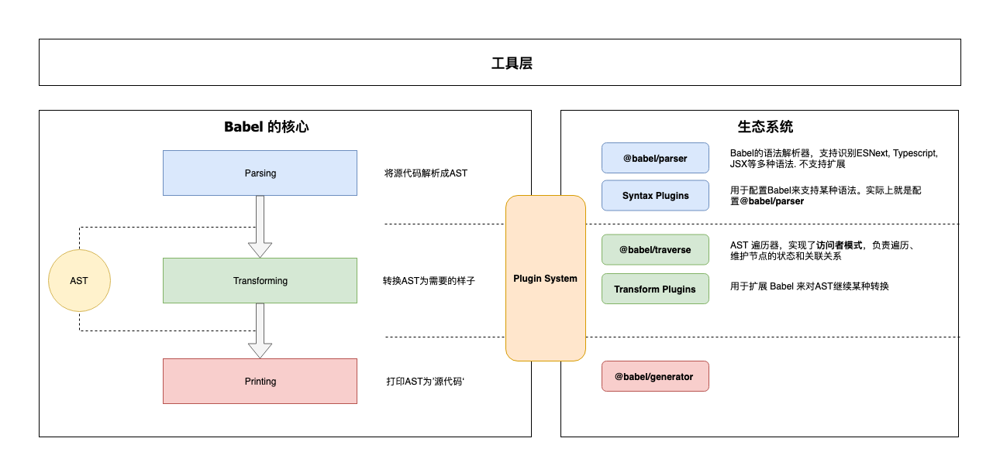
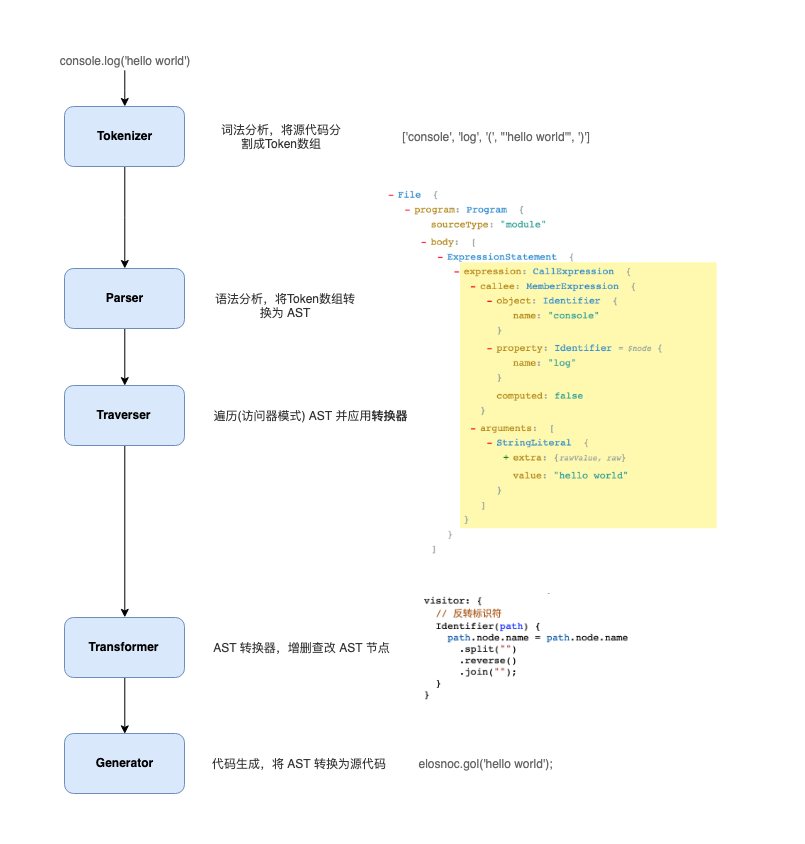

# Babel

**Babel is a JavaScript compiler.**

Babel就是一个JavaScript编译器，babel编译分为三个阶段，**解析（parse），转换（transform），生成（generate）**。
Babel本身不支持转换，转换是通过一个个 plugin实现。


## Babel的架构



---



#### 相关文章
- [Babel 可以这样学！](https://mp.weixin.qq.com/s/Ngehh9RoG6lrQATxddn-iQ)
- [Babel介绍](https://mp.weixin.qq.com/s/1OyBkl5NnFO1q86L7GjQwg)
- [Babel7](https://juejin.cn/post/6844904008679686152)
- [深入浅出 Babel](https://juejin.cn/post/6844903956905197576)

#### parse

分为**词法解析**(Lexical Analysis)和**语法解析**(Syntactic Analysis)

词法解析器(Tokenizer)在这个阶段将字符串形式的代码转换为Tokens(令牌). Tokens 可以视作是一些语法片段组成的数组， 每个 Token 中包含了语法片段、位置信息、以及一些类型信息. 这些信息有助于后续的语法分析。词法分析可以简单的理解为分词，利用存在的编程规则，进行匹配转换成token。

词法分析被抽象为了一个“有限状态自动机”，在某个状态下，满足一些条件后，会进行状态转移，转移到新的状态，从代码层面看，是一系列的 switch case 语句。经过词法分析后，代码被准确的切割，每个被切分的词叫做 `token`。

语法解析： 语法解析器(Parser)会把Tokens转换为抽象语法树(Abstract Syntax Tree，AST)，要做到语法分析，其实要做的就是对于语言要进行建模与抽象，就是一系列的规则的匹配与嵌套，优先级低的规则嵌套优先级高的规则（这样才能保证优先级高的先执行）

#### transform

AST 遍历和转换会使用**访问者模式**。访问者会以`深度优先`的顺序, 或者说`递归`地对 AST 进行遍历, `@babel/traverse`，实现了访问者模式，对 AST 进行遍历，**转换插件**会通过它获取感兴趣的AST节点，对节点继续操作


#### 插件集 preset-env

`preset-env` 也是 Babel 提供的预设插件集之一，它可以将 ES6 转换为 ES5。preset-env 对于插件的选择是基于某些开源项目的，比如 browserslist、compat-table 以及 electron-to-chromium。我们常用 `.browserslistrc` 来设置我们预想满足的目标运行环境，如：

```text
> 0.25%
not dead
```

要详细说的是 preset-env 的重要配置之一：`useBuiltIns`。

useBuiltIns 从其名字来说是“使用内置”，“内置”的什么呢？从官方看来是`polyfills`。它的取值可以是以下三种：

1. `false`：

不使用内置的`polyfills`，这意味着你需要自行解决必要的`polyfills`问题。

2. "entry"：

只在“入口模块”处导入`polyfills`，你需要“根模块”写上`import "core-js"` 和 `import "regenerator-runtime/runtime"`，babel 会自动展开全部必要模块导入`import "core-js/modules/X"`，X 是根据你配置的目标环境选择出来的 `polyfill`，如`es.string.pad-start、es.array.unscopables.flat`。
注意，如果你没有写`import "core-js"`，则不会展开任何导入（import）语句。

3. "usage"：

你不用写什么了，babel 会根据你配置的目标环境，在你使用到一些“ES6特性X”的时候，自动补充`import "core-js/modules/X"`。

另一个选项 `corejs`，指定的是使用的 `corejs` 的版本，`corejs` 需要自己安装：

`npm i -S core-js@2`或者 `npm i -S core-js@3`，
`corejs` 只在 `useBuiltIns`取值为 `entry` 或 `usage` 的时候有用，因为 `Babel` 所谓内置的 polyfills 工具就是 `corejs`。`corejs`可以配置为 2 或 3。

#### polyfill和runtime的区别

`polyfill`是会污染原来的全局环境的（因为新的原生对象、API这些都直接由polyfill引入到全局环境）。这样就很容易会发生冲突。对于库library来说，是供外部使用的，但外部的环境并不在library的可控范围。所以runtime就是解决这个问题的，避免全局污染。

[`babel-plugin-transform-runtime`](https://www.babeljs.cn/docs/babel-plugin-transform-runtime) 插件依赖[babel-runtime](https://www.babeljs.cn/docs/babel-runtime)，`babel-runtime`是真正提供`runtime`环境的包；也就是说`transform-runtime`插件是把js代码中使用到的新原生对象和静态方法转换成对runtime实现包的引用，举个例子如下：

```javascript
// 输入的ES6代码
var sym = Symbol();
// 通过transform-runtime转换后的ES5+runtime代码 
var _symbol = require("babel-runtime/core-js/symbol");
var sym = (0, _symbol.default)();
```

原本代码中使用的ES6新原生对象`Symbol`被`transform-runtime`插件转换成了`babel-runtime`的实现，既保持了`Symbol`的功能，同时又没有像`polyfill`那样污染全局环境（因为最终生成的代码中，并没有对Symbol的引用）。

#### transform-runtime插件的功能

1. 把代码中的使用到的ES6引入的新原生对象和静态方法用`babel-runtime/core-js`导出的对象和方法替代
2. 当使用`generators`或`async`函数时，用`babel-runtime/regenerator`导出的函数取代（类似polyfill分成regenerator和core-js两个部分）
3. 把Babel生成的辅助函数改为用`babel-runtime/helpers`导出的函数来替代（babel默认会在每个文件顶部放置所需要的辅助函数，如果文件多的话，这些辅助函数就在每个文件中都重复了，通过引用`babel-runtime/helpers`就可以统一起来，减少代码体积）

上述三点就是`transform-runtime`插件所做的事情，由此也可见，`babel-runtime`就是一个提供了`regenerator`、`core-js`和`helpers`的运行时库。

## core-js

### core-js介绍

其实core-js是我们能够使用新的API的最重要的包，然而一般情况它隐藏在webpack编译后的代码中，我们一般不会去查看，所以容易被遗忘，我们在webpack生成环境下，查看编译后的代码，可以看到例如`includes`就是从`core-js`导出到我们的代码去的。


#### core-js是什么

- **它是JavaScript标准库的polyfill**
- 它尽可能的进行模块化，让你能选择你需要的功能
- **它可以不污染全局空间**
- 它和babel高度集成，可以对core-js的引入进行最大程度的优化

### [core-js@3 特性概览](https://github.com/zloirock/core-js/blob/master/docs/2019-03-19-core-js-3-babel-and-a-look-into-the-future.md#babelpreset-env)

- 支持ECMAScript稳定功能，引入core-js@3冻结期间的新功能，比如flat
- 加入到ES2016-ES2019中的提案，现在已经被标记为稳定功能
- **更新了提案的实现，增加了proposals配置项，由于提案阶段不稳定，需要谨慎使用**
- **增加了对一些web标准的支持，比如URL 和 URLSearchParams**
- **现在支持原型方法，同时不污染原型**
- 删除了过时的特性

### core-js@3与babel

以前我们实现API的时候，会引入整个polyfill，其实polyfill只是包括了以下两个包

- `core-js`
- `regenerator-runtime`: Standalone runtime for Regenerator-compiled generator and async functions.即`generator`和`async`的polyfill包

`core-js@3`升级之后弃用了`@babel/polyfill`，以下是等价实现。polyfill是一个针对ES2015+环境的shim，实现上来说`babel-polyfill`包只是简单的把`core-js`和`regenerator runtime`包装了下。

```javascript
// babel.config.ts
presets: [
  ["@babel/preset-env", {
    useBuiltIns: "entry", // or "usage"
    corejs: 3,
  }]
]

import "core-js/stable";
import "regenerator-runtime/runtime"; //  Standalone runtime for Regenerator-compiled generator and async functions. 解决generate和async的兼用问题
```

## 总结


- [你所需要知道的最新的babel兼容性实现方案](https://juejin.cn/post/6976501655302832159)

目前，`babel`处理兼容性问题有两种方案：

1. `@babel/preset-env` + `corejs@3`实现**简单语法转换** + **复杂语法注入`api`替换** +  **在全局或者构造函数静态属性、实例属性上添加`api`** ，支持全量加载和按需加载，我们简称`polyfill`方案；
2. `@babel/preset-env` + `@babel/runtime-corejs3` + `@babel/plugin-transform-runtime`实现**简单语法转换** +  **引入替换复杂语法和`api`** ，只支持按需加载，简称`runtime`方案。

两种方案一个依赖核心包`core-js`，一个依赖核心包`core-js-pure`，两种方案各有优缺点：

1. `polyfill`方案很明显的缺点就是会造成全局污染，而且会注入冗余的工具代码；优点是可以根据浏览器对新特性的支持度来选择性的进行兼容性处理；
2. `runtime`方案虽然解决了`polyfill`方案的那些缺点，但是不能根据浏览器对新特性的支持度来选择性的进行兼容性处理，也就是说只要在代码中识别到的`api`，并且该`api`也存在`core-js-pure`包中，就会自动替换，这样一来就会造成一些不必要的转换，从而增加代码体积。

所以，`polyfill`方案比较适合单独运行的业务项目，如果你是想开发一些供别人使用的第三方工具库，则建议你使用`runtime`方案来处理兼容性方案，以免影响使用者的运行环境。

### vue/cli3下.browserslistrc文件含义

browserslist是用来配置项目的目标浏览器和nodejs版本范围，也就是通常说的兼容哪些浏览器的版本。

- " >1%" :代表着全球超过1%人使用的浏览器
- “last 2 versions” : 表示所有浏览器兼容到最后两个版本
- “not ie <=8” :表示IE浏览器版本大于8（实则用npx browserslist 跑出来不包含IE9 ）
- “safari >=7”:表示safari浏览器版本大于等于7

```.browserslistrc
> 1%
last 2 versions
not dead
```

### 实现一个简单的按需打包功能babel插件

例如 `ElementUI` 中把 `import { Button } from 'element-ui'` 转成 `import Button from 'element-ui/lib/button'`

可以先对比下 `AST` ：
::: details 点击查看代码

```js
// import { Button } from 'element-ui'
{
    "type": "Program",
    "body": [
        {
            "type": "ImportDeclaration",
            "specifiers": [
                {
                    "type": "ImportSpecifier",
                    "local": {
                        "type": "Identifier",
                        "name": "Button"
                    },
                    "imported": {
                        "type": "Identifier",
                        "name": "Button"
                    }
                }
            ],
            "source": {
                "type": "Literal",
                "value": "element-ui",
                "raw": "'element-ui'"
            }
        }
    ],
    "sourceType": "module"
}

// import Button from 'element-ui/lib/button'
{
    "type": "Program",
    "body": [
        {
            "type": "ImportDeclaration",
            "specifiers": [
                {
                    "type": "ImportDefaultSpecifier",
                    "local": {
                        "type": "Identifier",
                        "name": "Button"
                    }
                }
            ],
            "source": {
                "type": "Literal",
                "value": "element-ui/lib/button",
                "raw": "'element-ui/lib/button'"
            }
        }
    ],
    "sourceType": "module"
}
```

:::

可以发现， `specifiers` 的 `type` 和 `source` 的 `value`、`raw` 不同。

然后 `ElementUI` 官方文档中，`babel-plugin-component` 的配置如下：
::: details 点击查看代码

```
// 如果 plugins 名称的前缀为 'babel-plugin-'，你可以省略 'babel-plugin-' 部分
{
  "presets": [["es2015", { "modules": false }]],
  "plugins": [
    [
      "component",
      {
        "libraryName": "element-ui",
        "styleLibraryName": "theme-chalk"
      }
    ]
  ]
}
```

```javascript
import * as babel from '@babel/core'

const str = `import { Button } from 'element-ui'`
const { result } = babel.transform(str, {
    plugins: [
        function({types: t}) {
            return {
                visitor: {
                    ImportDeclaration(path, { opts }) {
                        const { node: { specifiers, source } } = path
                        // 比较 source 的 value 值 与配置文件中的库名称
                        if (source.value === opts.libraryName) {
                            const arr = specifiers.map(specifier => (
                                t.importDeclaration(
                              
                                    [t.ImportDefaultSpecifier(specifier.local)],
                                    // 拼接详细路径
                                    t.stringLiteral(`${source.value}/lib/${specifier.local.name}`)
                                )
                            ))
                            path.replaceWithMultiple(arr)
                        }
                    }
                }
            }
        }
    ]
})

console.log(result) // import Button from "element-ui/lib/Button";
```

:::
