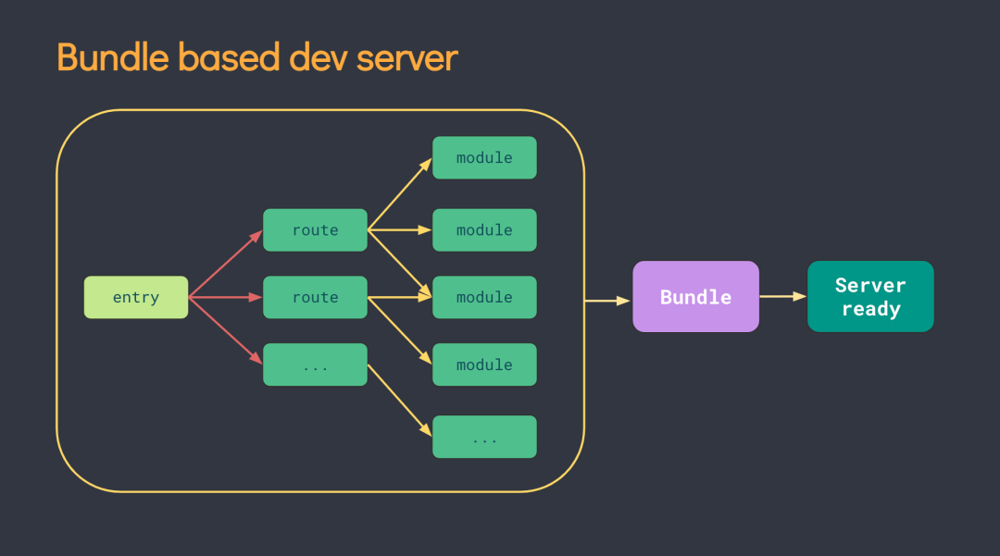
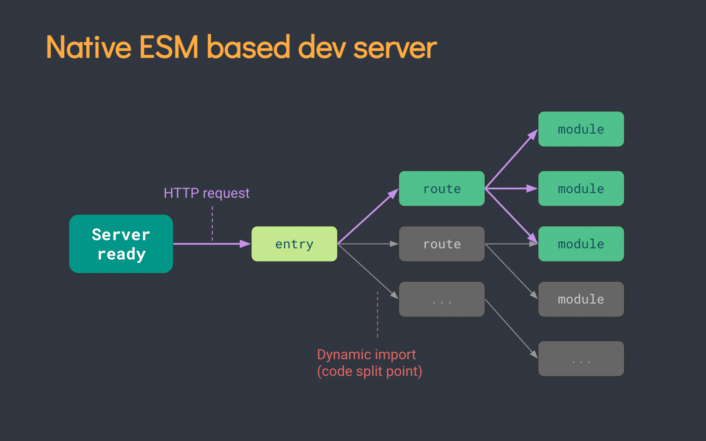

webpack慢：
1. 随着项目大小增长，项目冷启动时间指数增长：因为需要递归的处理识别模块生成依赖图，并且代码拆分异步应用，也需要一次生成所有路由下的编译后文件。
2. 热更新时间也会随着项目大小增大而增长： Webpack 的热更新会以当前修改的文件为入口重新 build 打包，所有涉及到的依赖也都会被重新加载一次。

### 为什么 Webpack 这么慢

本质上，webpack 是一个现代 JavaScript 应用程序的静态模块打包器（module bundler）。

运行启动命令的时候，webpack 总是需要从入口文件去索引整个项目的文件，编译成一个或多个单独的 js 文件，**即使采用了代码拆分，也需要一次生成所有路由下的编译后文件**（这也是为什么代码拆分对开发模式性能没有帮助）。这也导致了服务启动时间随着项目复杂度而指数增长


webpack打包过程
1. 识别入口文件
2. 通过逐层识别模块依赖。（Commonjs、amd或者es6的import，webpack都会对其进行分析。来获取代码的依赖）
3. webpack做的就是分析代码。转换代码，编译代码，输出代码
4. 最终形成打包后的代码

webpack打包原理

1. 先逐级递归识别依赖，构建依赖图谱
2. 将代码转化成AST抽象语法树
3. 在AST阶段中去处理代码
4. 把AST抽象语法树变成浏览器可以识别的代码， 然后输出

重点:需要**递归识别依赖，构建依赖图谱**。



**Webpack 的热更新会以当前修改的文件为入口重新 build 打包，所有涉及到的依赖也都会被重新加载一次。**

## vite
基于`esbuild`与`Rollup`，依靠浏览器自身ESM编译功能， 实现极致开发体验的新一代构建工具

### vite特点

1. 快速的冷启动
2. 即时的模块热更新
3. 真正的按需编译



### 原理

- [文章](https://juejin.cn/post/6931618997251080200)

当声明一个 script 标签类型为 module 时如：
```html
<script type="module" src="/src/main.js"></script>
```
浏览器就会像服务器发起一个GET请求`http://localhost:3000/src/main.js`请求main.js文件：
```javascript
// /src/main.js:
import { createApp } from 'vue'
import App from './App.vue'
createApp(App).mount('#app')
```
浏览器请求到了main.js文件，检测到内部含有import引入的包，又会对其内部的 import 引用发起 HTTP 请求获取模块的内容文件

如：GET http://localhost:3000/@modules/vue.js

如：GET http://localhost:3000/src/App.vue

Vite 的主要功能就是通过劫持浏览器的这些请求，并在后端进行相应的处理将项目中使用的文件通过简单的分解与整合，然后再返回给浏览器，vite整个过程中没有对文件进行打包编译，所以其运行速度比原始的webpack开发编译速度快出许多


#### 依赖预构建与缓存

原生 ES 引入不支持下面这样的裸模块导入：

上面的操作将在浏览器中抛出一个错误。Vite 将在服务的所有源文件中检测此类裸模块导入，并执行以下操作:

1. **预构建** 他们以提升页面重载速度，并将 CommonJS / UMD 转换为 ESM 格式。预构建这一步由 esbuild 执行，这使得 Vite 的冷启动时间比任何基于 javascript 的打包程序都要快得多。

在**开发阶段**中， Vite 的开发服务器将所有的代码都视为原生 ES 模块，所以需要在预构建阶段先将作为 CommonJS 或 UMD 发布的依赖项转换为 ESM。

Vite将带有许多内部模块的ESM依赖转换为单个模块，以提高后续页面加载性能（降低请求数量），比如 lodash-es 有超过 600 个内置模块，一次性发送 600 多个 http 请求，就算是采用了 HTTP2 也是不可接受的，大量的网络请求在浏览器端会造成网络拥塞，导致页面的加载速度相当慢，通过预构建 lodash-es 成为一个模块，就只需要一个 HTTP 请求了！

预构建完依赖项之后，再使用 `es-module-lexer + magic-string` 进行轻量级裸模块导入语句的重写。因为并没有进行完整的 AST 遍历，所以速度非常快，对于大多数文件来说这个时间都小于 1ms

2. **重写导入为合法的 URL**，例如 /node_modules/.vite/my-dep.js?v=f3sf2ebd 以便浏览器能够正确导入它们。

3.  Vite 会将预构建的依赖缓存到 node_modules/.vite 路径下，可以看到文件名后跟着一串随机字符串，使用http强缓存策略，`Cache-Control` 属性被写为了： `max-age=31536000,immutable`

#### esbuild转换文件
包括将 CommonJS / UMD 转换为 ESM 格式，转换ts, tsc文件等

1. 使用 Go 编写，并且编译成了机器码
2. 大量使用并行算法
3. esbuild 的所有内容都是从零编写的
4. 更有效利用内存

#### 模块热重载

Vite 提供了一套原生 ESM 的 `HMR API`。 具有 HMR 功能的框架可以利用该 API 提供即时、准确的更新，而无需重新加载页面或删除应用程序状态。Vite 提供了第一优先级的 HMR 集成给 `Vue 单文件组件（SFC）` 和 `React Fast Refresh`。

1. 在 Vite 中，HMR 是在原生 ESM 上执行的。当编辑一个文件时，Vite 只需要精确地使已编辑的模块与其最近的 HMR 边界之间的链失效（大多数时候只需要模块本身），使 HMR 更新始终快速，无论应用的大小。

2. Vite 同时利用 HTTP 头来加速整个页面的重新加载（再次让浏览器为我们做更多事情）：源码模块的请求会根据 304 Not Modified 进行协商缓存，而依赖模块请求则会通过 Cache-Control: max-age=31536000,immutable 进行强缓存，因此一旦被缓存它们将不需要再次请求。


- [Vite（原理源码解析）](https://mp.weixin.qq.com/s/oroQSMSPxtSEfnjuxu2pew)
