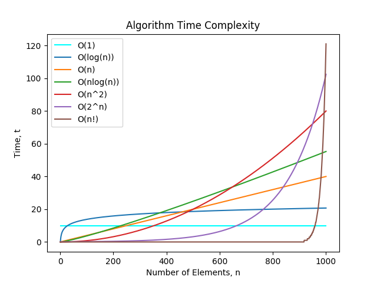

[学习目录](https://juejin.cn/post/6844903919722692621)

[学习目录](https://github.com/sisterAn/JavaScript-Algorithms)

[算法小抄](https://labuladong.gitbook.io/algo/)


### 时间复杂度

一个算法的时间复杂度反映了程序运行从开始到结束所需要的时间。把算法中基本操作重复执行的次数（频度）作为算法的时间复杂度。

没有循环语句，记作`O(1)`，也称为常数阶。只有一重循环，则算法的基本操作的执行频度与问题规模n呈线性增大关系，记作`O（n）`，也叫线性阶。

常见的时间复杂度有：

 - O(1): Constant Complexity: Constant 常数复杂度
 - O(log n): Logarithmic Complexity: 对数复杂度
 - O(n): Linear Complexity: 线性时间复杂度
 - O(n^2): N square Complexity 平⽅方
 - O(n^3): N square Complexity ⽴立⽅方
 - O(2^n): Exponential Growth 指数
 - O(n!): Factorial 阶乘
 
  
  
#### 对数阶O(logN)
```javascript
let i = 1;
while(i<n)
{
    i = i * 2;
}
```
从上面代码可以看到，在while循环里面，每次都将 i 乘以 2，乘完之后，i 距离 n 就越来越近了。我们试着求解一下，假设循环x次之后，i 就大于 n 了，此时这个循环就退出了，也就是说 2 的 x 次方等于 n，那么 x = log2^n
也就是说当循环 log2^n 次以后，这个代码就结束了。因此这个代码的时间复杂度为：`O(logn)`  
### 空间复杂度
一个程序的空间复杂度是指运行完一个程序所需内存的大小。利用程序的空间复杂度，可以对程序的运行所需要的内存多少有个预先估计。

一个程序执行时除了需要存储空间和存储本身所使用的指令、常数、变量和输入数据外，还需要一些对数据进行操作的工作单元和存储一些为现实计算所需信息的辅助空间。

> 学习javascript数据结构和算法[github代码地址](https://github.com/loiane/javascript-datastructures-algorithms)
### 栈
- 栈是一种遵从后进先出（LIFO）原则的有序集合。新添加或待删除的元素都保存在栈的同
   一端，称作栈顶，另一端就叫栈底。在栈里，新元素都靠近栈顶，旧元素都接近栈底。犹如在桌子上堆叠书。
```javascript
class Stack {
	constructor() {
		this.items = []
	}
	
	push(element) {
		this.items.push(element)
	}
	
	pop() {
		return this.items.pop()
	}
	
	peek() { // 返回栈顶的元素，不对栈做任何修改（该方法不会移除栈顶的元素， 仅仅返回它）。
		return this.items[this.items.length - 1]
	}
	
	isEmpty() {
		return this.items.length === 0
	}
	
	clear() {
		this.items = []
	}
	
	size() {
		return this.items.length
	}
}

function baseConverter(decNumber, base) {
	const remStack = new Stack()
	const digits = '0123456789ABCDEFGHIJKLMNOPQRSTUVWXYZ'
	let number = decNumber
	let rem
	let baseString = ''
	if (!(base >= 2 && base <= 36)) {
		return ''
	}
	while (number > 0) {
		rem = Math.floor(number % base)
		remStack.push(rem)
		number = Math.floor(number / base)
	}
	while (!remStack.isEmpty()) {
		console.log(remStack.items)
		baseString += digits[remStack.pop()]
	}
	return baseString
}
```

### 队列
- 队列是遵循先进先出（FIFO，也称为先来先服务）原则的一组有序的项。队列在尾部添加新
  元素，并从顶部移除元素。最新添加的元素必须排在队列的末尾。
  
```javascript
class Queue {
	constructor() {
		this.count = 0
		this.lowestCount = 0
		this.items = {}
	}
	
	enqueue(element) {
		this.items[this.count] = element
		this.count++
	}
	
	dequeue() {
		if (this.isEmpty()) {
			return undefined
		}
		const result = this.items[this.lowestCount]
		delete this.items[this.lowestCount]
		this.lowestCount++
		return result
	}
	
	peek() {
		if (this.isEmpty()) {
			return undefined
		}
		return this.items[this.lowestCount]
	}
	
	isEmpty() {
		return this.count - this.lowestCount === 0
	}
	
	size() {
		return this.count - this.lowestCount
	}
	
	clear() {
		this.items = []
		this.count = this.lowestCount = 0
	}
	
	toString() {
		if (this.isEmpty()) {
			return ''
		}
		let objString = `${this.items[this.lowestCount]}`
		for (let i = this.lowestCount + 1; i < this.count; i++) {
			objString = `${objString},${this.items[i]}`
		}
		return objString
	}
}

// 可以用来模拟击鼓传花游戏，
function hotPotato(elementsList, num) {
	const queue = new Queue()
	const elimitatedList = []
	for (let i = 0; i < elementsList.length; i++) {
		queue.enqueue(elementsList[i])
	}
	while (queue.size() > 1) {
		for (let i = 0; i < num; i++) {
			queue.enqueue(queue.dequeue())
		}
		elimitatedList.push(queue.dequeue())
	}
	return {
		eliminated: elimitatedList,
		winner: queue.dequeue() // {5}
	}
}

const names = ['John', 'Jack', 'Camila', 'Ingrid', 'Carl']
const result = hotPotato(names, 7)
result.eliminated.forEach(name => {
	console.log(`${name}在击鼓传花游戏中被淘汰。 `)
})
console.log(`胜利者： ${result.winner}`)
```
- 双端队列（deque，或称 double-ended queue）是一种允许我们同时从前端和后端添加和移除
  元素的特殊队列。
  使用双端队列来检查一个短语是否为回文。
  - addFront(element)：该方法在双端队列前端添加新的元素。
  - addBack(element)：该方法在双端队列后端添加新的元素（实现方法和 Queue 类中的
  enqueue 方法相同）。
  - removeFront()：该方法会从双端队列前端移除第一个元素（实现方法和 Queue 类中的
  dequeue 方法相同）。
  - removeBack()：该方法会从双端队列后端移除第一个元素（实现方法和 Stack 类中的
  pop 方法一样）。
  - peekFront()：该方法返回双端队列前端的第一个元素（实现方法和 Queue 类中的 peek
  方法一样）。
  - peekBack()：该方法返回双端队列后端的第一个元素（实现方法和 Stack 类中的 peek
  方法一样）。
```javascript
class Deque {
	constructor() {
		this.count = 0
		this.lowestCount = 0
		this.items = {}
	}
	
	addFront(element) {
		if (this.isEmpty()) {
			this.addBack(element)
		} else if (this.lowestCount > 0) {
			this.lowestCount--
			this.items[this.lowestCount] = element
		} else {
			for (let i = this.count; i > 0; i--) {
				this.items[i] = this.items[i - 1]
			}
			this.count++
			this.lowestCount = 0
			this.items[0] = element // {4}
		}
	}
	
	addBack(element) {
		this.items[this.count] = element
		this.count++
	}
	
	removeFront() {
		if (this.isEmpty()) {
			return undefined
		}
		const result = this.items[this.lowestCount]
		delete this.items[this.lowestCount]
		this.lowestCount++
		return result
	}
	
	removeBack() {
		if (this.isEmpty()) {
			return undefined
		}
		this.count--
		const result = this.items[this.count]
		delete this.items[this.count]
		return result
	}
	
	peekFront() {
		if (this.isEmpty()) {
			return undefined
		}
		return this.items[this.lowestCount]
	}
	
	peekBack() {
		if (this.isEmpty()) {
			return undefined
		}
		return this.items[this.count - 1]
	}
	
	isEmpty() {
		return this.count - this.lowestCount === 0
	}
	
	size() {
		return this.count - this.lowestCount
	}
	
	clear() {
		this.items = []
		this.count = this.lowestCount = 0
	}
	
	toString() {
		if (this.isEmpty()) {
			return ''
		}
		let objString = `${this.items[this.lowestCount]}`
		for (let i = this.lowestCount + 1; i < this.count; i++) {
			objString = `${objString},${this.items[i]}`
		}
		return objString
	}
}
```
### 链表 [代码](https://github.com/loiane/javascript-datastructures-algorithms/blob/master/src/js/data-structures/linked-list.js)
```javascript
function defaultEquals(a, b) {
  return a === b;
}
class Node {
  constructor(element, next) {
    this.element = element;
    this.next = next;
  }
}

export default class LinkedList {
  constructor(equalsFn = defaultEquals) {
    this.equalsFn = equalsFn;
    this.count = 0;
    this.head = undefined;
  }

  push(element) {
    const node = new Node(element);
    let current;
    if (this.head == null) {
      // catches null && undefined
      this.head = node;
    } else {
      current = this.head;
      while (current.next != null) {
        current = current.next;
      }
      current.next = node;
    }
    this.count++;
  }

  getElementAt(index) {
    if (index >= 0 && index <= this.count) {
      let node = this.head;
      for (let i = 0; i < index && node != null; i++) {
        node = node.next;
      }
      return node;
    }
    return undefined;
  }

  insert(element, index) {
    if (index >= 0 && index <= this.count) {
      const node = new Node(element);
      if (index === 0) {
        
        node.next = this.head;
        this.head = node;
      } else {
        const previous = this.getElementAt(index - 1);
        node.next = previous.next;
        previous.next = node;
      }
      this.count++;
      return true;
    }
    return false;
  }

  removeAt(index) {
    if (index >= 0 && index < this.count) {
      let current = this.head;
      if (index === 0) {
        this.head = current.next;
      } else {
        const previous = this.getElementAt(index - 1);
        current = previous.next;
        previous.next = current.next;
      }
      this.count--;
      return current.element;
    }
    return undefined;
  }

  remove(element) {
    const index = this.indexOf(element);
    return this.removeAt(index);
  }

  indexOf(element) {
    let current = this.head;
    for (let i = 0; i < this.size() && current != null; i++) {
      if (this.equalsFn(element, current.element)) {
        return i;
      }
      current = current.next;
    }
    return -1;
  }

  isEmpty() {
    return this.size() === 0;
  }

  size() {
    return this.count;
  }

  getHead() {
    return this.head;
  }

  clear() {
    this.head = undefined;
    this.count = 0;
  }

  toString() {
    if (this.head == null) {
      return '';
    }
    let objString = `${this.head.element}`;
    let current = this.head.next;
    for (let i = 1; i < this.size() && current != null; i++) {
      objString = `${objString},${current.element}`;
      current = current.next;
    }
    return objString;
  }
}
```
