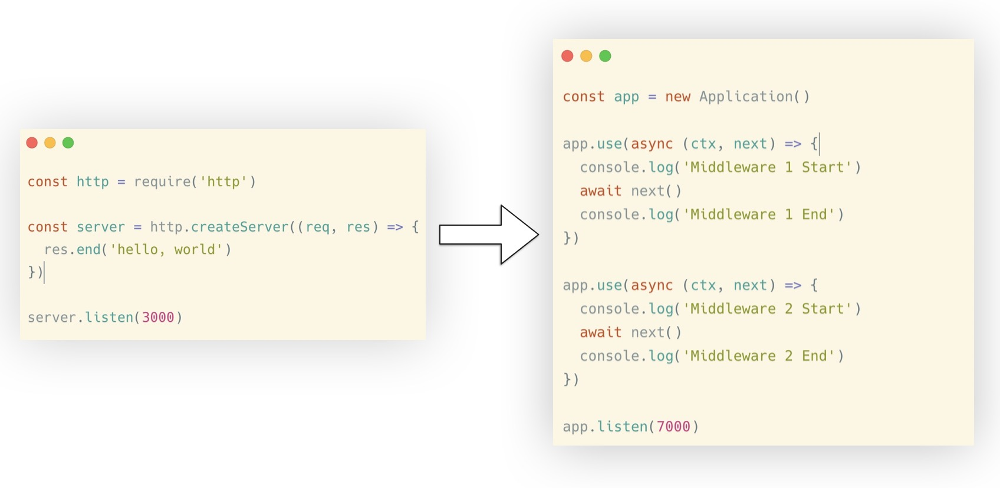
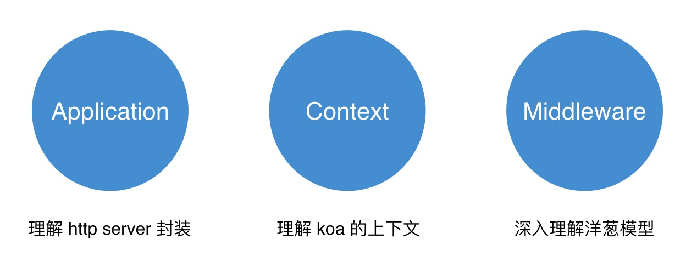
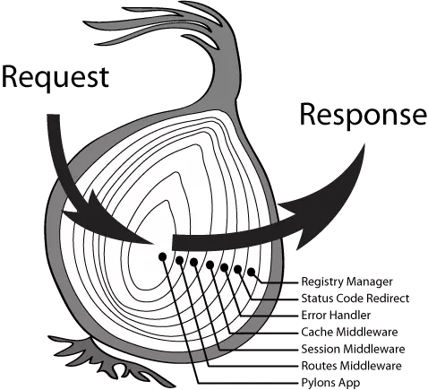

[官方源码地址](https://github.com/koajs/koa/blob/master/lib/application.js)

[如何更好地理解中间件和洋葱模型](https://juejin.cn/post/6890259747866411022)

[再也不怕面试官问你express和koa的区别了](https://zhuanlan.zhihu.com/p/87079561)
### Koa 和 Express 有什么区别
- 异步：callback 和 promise
- 中间件：线性模型和洋葱模型

- Handler的处理
>Express普通回调函数，在同一线程上完成当前进程的所有Http请求；
 Koa利用Generator Function作为响应器，co作为底层运行框架，利用Generator特性，实现“协程响应”；
- 路由
> Express的路由是自身集成的； 
  Koa的需要引入中间件Koa-router；
- 启动方式
> koa采用new Koa()
  express采用传统的函数形式function； 
- 回调： Koa没有回调express有回调；
- 生命周期
Express的生命周期不确定：express内部执行异步函数，不能确定什么时候执行完； 
Koa确定：koa是基于await/async，在执行下一步操作的时候，必须等待前端await执行完； 
- 异步流程
> Express采用callback来处理异步(ES5)；
   Koa1采用generator(ES6)；
   Koa2采用async/await(ES7)；
- 错误处理
Express使用callback捕获异常，深层次的异常捕获不了；
 Koa使用try catch，很好的解决异常捕获；
- 中间件
 koa2的中间件：
 
1、通过async await实现的，中间件执行的顺序是“洋葱圈”模型。
 		
2、中间件之间通过next函数联系，当一个中间件调用next()后，会将控制权交给下一个中间件，直到下一个中间件不再执行next()后，会沿路返回，将控制权交给前一个中间件。
 		
 Express中间件：
 
1、一个接一个顺序执行，response响应写在最后一个中间件中。

2、特点：
-  a.app.use用来注册中间件；
-  b.遇到http请求，根据path和method判断触发哪些中间件；
-  c.实现next机制，即上一个中间件会通过next触发下一个中间件；

## 四十行代码实现一个koa



这是一个拥有 koa 几乎所有核心功能最简化的示例：

```js
const Koa = require('koa')
const app = new Koa()

app.use(async (ctx, next) => {
  console.log('Middleware 1 Start')
  await next()
  console.log('Middleware 1 End')
})

app.use(async (ctx, next) => {
  console.log('Middleware 2 Start')
  await next()
  console.log('Middleware 2 End')

  ctx.body = 'hello, world'
})

app.listen(3000)

// output
// Middleware 1 Start
// Middleware 2 Start
// Middleware 2 End
// Middleware 1 End
```

在这个最简化的示例中，可以看到有三个清晰的模块，分别如下：

+ Application: 基本服务器框架
+ Context: 服务器框架基本数据结构的封装，用以 http 请求解析及响应
+ Middleware: 中间件，也是洋葱模型的核心机制



我们开始逐步实现这三个模块：

## 抛开框架，来写一个简单的 server

我们先基于 node 最基本的 `http API` 来启动一个 http 服务，并通过它来实现最简版的 koa：

```javascript
const http = require('http')

const server = http.createServer((req, res) => {
  res.end('hello, world')
})

server.listen(3000)
```

而要实现最简版的 `koa` 示例如下，我把最简版的这个 koa 命名为 `koa-mini`

```javascript
const Koa = require('koa-mini')
const app = new Koa()

app.use(async (ctx, next) => {
  console.log('Middleware 1 Start')
  await next()
  console.log('Middleware 1 End')
})

app.use(async (ctx, next) => {
  console.log('Middleware 2 Start')
  await next()
  console.log('Middleware 2 End')

  ctx.body = 'hello, world'
})

app.listen(3000)
```

## 构建 Application

首先完成 `Appliacation` 的大体框架：

+ `app.listen`: 处理请求及响应，并且监听端口
+ `app.use`: 中间件函数，处理请求并完成响应

只有简单的十几行代码，示例如下：

```javascript
const http = require('http')

class Application {
  constructor () {
    this.middleware = null 
  }

  listen (...args) {
    const server = http.createServer(this.middleware)
    server.listen(...args)
  }

  // 这里依旧调用的是原生 http.createServer 的回调函数
  use (middleware) {
    this.middleware = middleware
  }
}
```

此时调用 `Application` 启动服务的代码如下:

```javascript
const app = new Appliacation()

app.use((req, res) => {
  res.end('hello, world')
})

app.listen(3000)
```

由于 `app.use` 的回调函数依然是原生的 `http.crateServer` 回调函数，而在 `koa` 中回调参数是一个 `Context` 对象。

下一步要做的将是构建 `Context` 对象。

## 构建 Context

在 koa 中，`app.use` 的回调参数为一个 `ctx` 对象，而非原生的 `req/res`。因此在这一步要构建一个 `Context` 对象，并使用 `ctx.body` 构建响应：

+ `app.use(ctx => ctx.body = 'hello, world')`: 通过在 `http.createServer` 回调函数中进一步封装 `Context` 实现
+ `Context(req, res)`: 以 `request/response` 数据结构为主体构造 Context 对象

核心代码如下，注意注释部分：

```javascript
const http = require('http')

class Application {
  constructor () {}
  use () {}

  listen (...args) {
    const server = http.createServer((req, res) => {
      // 构造 Context 对象
      const ctx = new Context(req, res)

      // 此时处理为与 koa 兼容 Context 的 app.use 函数
      this.middleware(ctx)

      // ctx.body 为响应内容
      ctx.res.end(ctx.body)
    })
    server.listen(...args)
  }
}

// 构造一个 Context 的类
class Context {
  constructor (req, res) {
    this.req = req
    this.res = res
  }
}
```

此时 `koa` 被改造如下，`app.use` 可以正常工作：

```javascript
const app = new Application()

app.use(ctx => {
  ctx.body = 'hello, world'
})

app.listen(7000)
```

实现以上的代码都很简单，现在就剩下一个最重要也是最核心的功能：洋葱模型

## 洋葱模型及中间件改造

上述工作只有简单的一个中间件，然而在现实中中间件会有很多个，如错误处理，权限校验，路由，日志，限流等等。因此我们要改造下 `app.middlewares`

+ `app.middlewares`: 收集中间件回调函数数组，并并使用 `compose` 串联起来

对所有中间件函数通过 `compose` 函数来达到抽象效果，它将对 `Context` 对象作为参数，来接收请求及处理响应：

```javascript
// this.middlewares 代表所有中间件
// 通过 compose 抽象
const fn = compose(this.middlewares)
await fn(ctx)

// 当然，也可以写成这种形式，只要带上 ctx 参数
await compose(this.middlewares, ctx)
```

此时完整代码如下：

```javascript
const http = require('http')

class Application {
  constructor () {
    this.middlewares = []
  }

  listen (...args) {
    const server = http.createServer(async (req, res) => {
      const ctx = new Context(req, res)

      // 对中间件回调函数串联，形成洋葱模型
      const fn = compose(this.middlewares)
      await fn(ctx)

      ctx.res.end(ctx.body)
    })
    server.listen(...args)
  }

  use (middleware) {
    // 中间件回调函数变为了数组
    this.middlewares.push(middleware)
  }
}
```

接下来，着重完成 `compose` 函数

### 完成 compose 函数的封装



koa 的洋葱模型指出每一个中间件都像是洋葱的每一层，当从洋葱中心穿过时，每层都会一进一出穿过两次，且最先穿入的一层最后穿出。

+ `middleware`: 第一个中间件将会执行
+ `next`: 每个中间件将会通过 next 来执行下一个中间件

我们如何实现所有的中间件的洋葱模型呢?

我们看一看每一个 middleware 的 API 如下

```javascript
middleware(ctx, next)
```

而每个中间件中的 `next` 是指执行下一个中间件，我们来把 `next` 函数提取出来，而 `next` 函数中又有 `next`，这应该怎么处理呢？

```javascript
const next = () => nextMiddleware(ctx, next)
middleware(ctx, next(0))
```

是了，使用一个递归完成中间件的改造，并把中间件给连接起来，如下所示:

```javascript
// dispatch(i) 代表执行第 i 个中间件

const dispatch = (i) => {
  return middlewares[i](ctx, () => dispatch(i+1))
}
dispatch(0)
```

`dispatch(i)` 代表执行第 i 个中间件，而 `next()` 函数将会执行下一个中间件 `dispatch(i+1)`，于是我们使用递归轻松地完成了洋葱模型

此时，再把递归的终止条件补充上: 当最后一个中间件函数执行 `next()` 时，直接返回

```javascript
const dispatch = (i) => {
  const middleware = middlewares[i]
  if (i === middlewares.length) {
    return
  }
  return middleware(ctx, () => dispatch(i+1))
}
return dispatch(0)
```

最终的 `compose` 函数代码如下:

```javascript
function compose (middlewares) {
  return ctx => {
    const dispatch = (i) => {
      const middleware = middlewares[i]
      if (i === middlewares.length) {
        return
      }
      return middleware(ctx, () => dispatch(i+1))
    }
    return dispatch(0)
  }
}
```

至此，koa 的核心功能洋葱模型已经完成，写个示例来体验一下吧:

```javascript
const app = new Application()

app.use(async (ctx, next) => {
  ctx.body = 'hello, one'
  await next()
})

app.use(async (ctx, next) => {
  ctx.body = 'hello, two'
  await next()
})

app.listen(7000)
```

此时还有一个小小的但不影响全局的不足：异常处理，下一步将会完成异常捕获的代码

## 异常处理

如果在你的后端服务中因为某一处报错，而把整个服务给挂掉了怎么办？

我们只需要对中间件执行函数进行一次异常处理即可：

```javascript
try {
  const fn = compose(this.middlewares)
  await fn(ctx)
} catch (e) {
  console.error(e)
  ctx.res.statusCode = 500
  ctx.res.write('Internel Server Error')
}
```

然而在日常项目中使用时，我们**必须**在框架层的异常捕捉之前就需要捕捉到它，来做一些异常结构化及异常上报的任务，此时会使用一个异常处理的中间件：

```javascript
// 错误处理中间件
app.use(async (ctx, next) => {
  try {
    await next();
  }
  catch (err) {
    // 1. 异常结构化
    // 2. 异常分类
    // 3. 异常级别
    // 4. 异常上报
  }
})
```

```javascript
const http = require('http')

function compose (middlewares) {
  return ctx => {
    const dispatch = (i) => {
      const middleware = middlewares[i]
      if (i === middlewares.length) {
        return
      }
      return middleware(ctx, () => dispatch(i+1))
    }
    return dispatch(0)
  }
}

class Context {
  constructor (req, res) {
    this.req = req
    this.res = res
  }
}

class Application {
  constructor () {
    this.middlewares = []
  }

  listen (...args) {
    const server = http.createServer(this.callback())
    server.listen(...args)
  }

  callback () {
    return async (req, res) => {
      const ctx = new Context(req, res)
      const fn = compose(this.middlewares)
      try {
        await fn(ctx)
      } catch (e) {
        console.error(e)
        ctx.res.statusCode = 500
        ctx.res.end('Internel Server Error')
      }
      ctx.res.end(ctx.body)
    }
  }

  use (middleware) {
    this.middlewares.push(middleware)
  }
}

module.exports = Application
```
## [手写Koa.js源码](https://juejin.cn/post/6892952604163342344)

[手写@koa/router源码](https://juejin.cn/post/6895594434843869197)
```javascript
const Koa = require("koa");
const app = new Koa();

app.use(async (ctx, next) => {
  const start = Date.now();
  await next();
  const ms = Date.now() - start;
  console.log(`${ctx.method} ${ctx.url} - ${ms}ms`);
});

app.use((ctx) => {
  ctx.body = "Hello World";
});

const port = 3001;
app.listen(port, () => {
  console.log(`Server is running on http://127.0.0.1:${port}/`);
});

```
```javascript
// https://juejin.cn/post/6892952604163342344

const Emitter = require('events')
const http = require('http')

module.exports = class Application extends Emitter {
	constructor(){
		super()
		this.context = {}
		this.middleware = []
	}

	use(fn){
		if (typeof fn !== 'function') {
			throw new TypeError('middleware must bu a function!')
		}
		this.middleware.push(fn)
		return this
	}

	listen(...args){
		const server = http.createServer(this.callback())
		return server.listen(...args)
	}

	createContext(req, res){
		const context = Object.create(this.context)
		context.app = this
		context.req = req
		context.res = res
		return context
	}

	/**
	 * Return a request handler callback
	 * for node's native http server.
	 *
	 * @return {Function}
	 * @api public
	 */

	callback(){
		const fn = compose(this.middleware)

		return (req, res) => {
			const ctx = this.createContext(req, res)
			return this.handleRequest(ctx, fn)
		}
	}

	// 处理具体请求
	handleRequest(ctx, fnMiddleware){
		const handleResponse = () => respond(ctx)

		// 调用中间件处理
		// 所有处理完后就调用handleResponse返回请求
		return fnMiddleware(ctx)
			.then(handleResponse)
			.catch((err) => {
				console.log('Something is wrong: ', err)
			})
	}
}

function respond(ctx){
	const res = ctx.res // 取出res对象
	const body = ctx.body // 取出body

	return res.end(body) // 用res返回body
}


function compose(middleware){
	// 参数检查，middleware必须是一个数组
	if (!Array.isArray(middleware))
		throw new TypeError('Middleware stack must be an array!')
	// 数组里面的每一项都必须是一个方法
	for (const fn of middleware) {
		if (typeof fn !== 'function')
			throw new TypeError('Middleware must be composed of functions!')
	}

	// 返回一个方法，这个方法就是compose的结果
	// 外部可以通过调用这个方法来开起中间件数组的遍历
	// 参数形式和普通中间件一样，都是context和next
	return function(context, next){
		return dispatch(0) // 开始中间件执行，从数组第一个开始

		// 执行中间件的方法
		function dispatch(i){
			let fn = middleware[i] // 取出需要执行的中间件

			// 如果i等于数组长度，说明数组已经执行完了
			if (i === middleware.length) {
				fn = next // 这里让fn等于外部传进来的next，其实是进行收尾工作，比如返回404
			}

			// 如果外部没有传收尾的next，直接就resolve
			if (!fn) {
				return Promise.resolve()
			}

			// 执行中间件，注意传给中间件接收的参数应该是context和next
			// 传给中间件的next是dispatch.bind(null, i + 1)
			// 所以中间件里面调用next的时候其实调用的是dispatch(i + 1)，也就是执行下一个中间件
			try {
				return Promise.resolve(fn(context, dispatch.bind(null, i + 1)))
			} catch (err) {
				return Promise.reject(err)
			}
		}
	}
}

```
