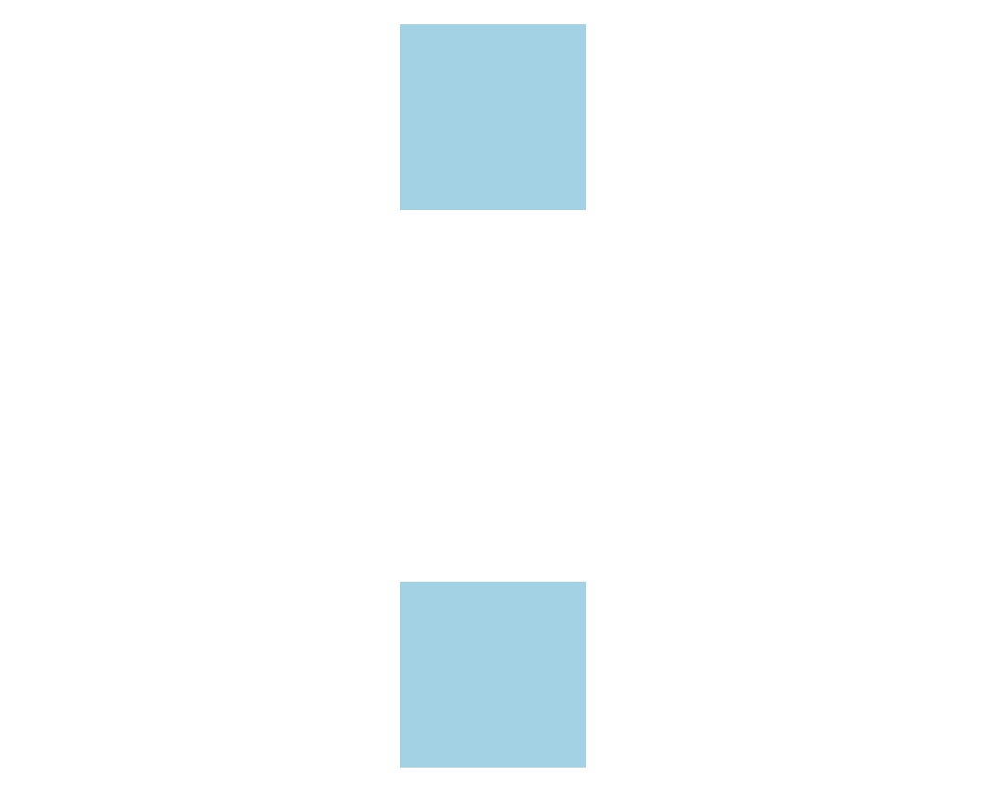
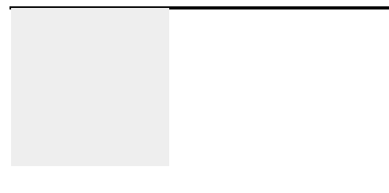
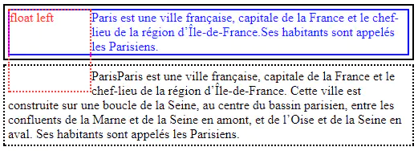
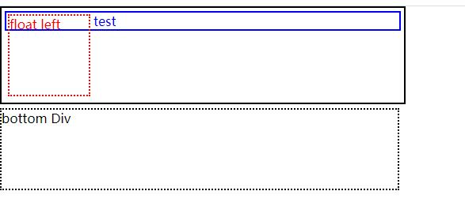

## 一、css定位机制
常见的定位机制，定位机制是控制元素的布局，有三种常见方案:
### 普通流 (normal flow)
> 在普通流中，元素按照其在 HTML 中的先后位置至上而下布局，在这个过程中，行内元素水平排列，直到当行被占满然后换行，块级元素则会被渲染为完整的一个新行，除非另外指定，否则所有元素默认都是普通流定位，也可以说，普通流中元素的位置由该元素在 HTML 文档中的位置决定。

**行元素（行内元素）**：在水平方向上修改水平尺寸(padding，margin，border)，能产生相应的效果，垂直方向上对行元素的高度是毫无影响的。

因此，行内元素直接定义`width`和`height`是没有意义的，行元素的宽高是靠内容撑起来的。

但是，可以通过设置`line-height`，来规定行元素的高度，有一些特殊的行内元素如input，img等他们是替换元素：``、`<input>`、`<textarea>`、`<select>`、`<object>`，他们可以设置宽高。

同样，可以通过对行元素设置`display`属性，转化为块级元素（`display：block`）或行内块级元素（`display：inline-block`），margin,padding,border，height,width垂直方向会起作用。

行内元素包括： 
- `b, big, i, small, tt`
- `abbr, acronym, cite, code, dfn, em, kbd, strong, samp, var`
- `a, bdo, br, img, map, object, q, script, span, sub, sup`
- `button, input, label, select, textarea`

### 浮动 (float)
> 在浮动布局中，元素首先按照普通流的位置出现，然后根据浮动的方向尽可能的向左边或右边偏移，其效果与印刷排版中的文本环绕相似。

浮动的元素脱离文档流，失去文档流的元素空间。若进行左浮动，脱离文档流的元素会向左移动，直到遇到包含元素的左边缘。
若多个元素一起浮动，则除第一个元素之外，其它元素都会定位在前一个浮动元素之后（即它的右边）。
若包含元素不够宽，则无法水平排列的元素会向下移动，直到有足够的空间。若浮动元素的高度不一致，还会发生元素卡在较高的元素的现象。
因为浮动元素脱离了文档流，所以浮动元素并不会占据包含元素的空间，包含元素高度不会自动撑开，造成塌陷，需要做点清除浮动的处理。
### 绝对定位元素
static默认的：定位无特殊说明就是默认的，在普通流中显示，没有脱离普通流

绝对定位元素（元素的 `position` 为 `absolute` 或 `fixed`）

#### relative相对定位
被看作普通流定位模型的一部分，定位元素的位置相对于它在普通流中的位置进行移动。使用相对定位的元素不管它是否进行移动，元素仍要占据它原来的位置。移动元素会导致它覆盖其他的框。

#### absolute绝对定位
绝对定位的元素位置是相对于距离它最近的那个已定位的祖先(相对/绝对)元素决定的。 如果元素没有已定位的祖先元素， 那么它的位置相对于初始包含块。绝对定位的元素可以在它的包含块向上、下、左、右移动。

与相对定位相反， 绝对定位使元素与文档流无关， 因此不占据空间。普通文档流中其他的元素的布局不受绝对定位元素的影响。由于绝对定位的元素脱离普通流，所以它可以覆盖页面上的其他元素，可以通过设置`z-index`属性来控制这些框的堆放次序。


#### fixed固定定位
 相对于浏览器窗口，其余的特点类似于绝对定位。
## 二、[BFC概念](https://developer.mozilla.org/zh-CN/docs/Web/Guide/CSS/Block_formatting_context)
是 Web 页面的可视化 CSS 渲染的一部分，是块盒子的布局过程发生的区域，也是浮动元素与其他元素交互的区域。[MDN阐述]
> Block formatting context = block-level box + Formatting Context

box即盒子模型；block-level box即块级元素;display属性为block, list-item, table的元素，会生成block-level box；并且**参与** block formatting context，并不就是BFC

inline-level box即行内元素: display 属性为 inline, inline-block, inline-table的元素，会生成inline-level box。并且参与 inline formatting context；

Formatting context(格式化上下文) 是 W3C CSS2.1 规范中的一个概念。它是页面中的一块渲染区域，并且有一套渲染规则，它决定了其子元素将如何定位，以及和其他元素的关系和相互作用。

最常见的 Formatting context 有 Block formatting context (简称BFC)和 Inline formatting context(简称IFC)。CSS2.1中只有BFC和IFC, 
CSS3中还增加了GFC网格布局格式化上下文（display: grid）和FFC自适应格式化上下文（display: flex）。
 
####定义
BFC(Block formatting context)直译为"块级格式化上下文"。它是一个独立的渲染区域，只有block-level box参与， 它规定了内部的Block-level Box如何布局，并且与这个区域外部毫不相干。
 **具有 BFC 特性的元素可以看作是隔离了的独立容器，容器里面的元素不会在布局上影响到外面的元素，并且 BFC 具有普通容器所没有的一些特性。**
 
 通俗一点来讲，可以把 BFC 理解为一个封闭的大箱子，箱子内部的元素无论如何翻江倒海，都不会影响到外部。
 
## 三、触发 BFC
 只要元素满足下面任一条件即可触发 BFC 特性： 
 - 根元素（`<html>`）
 - 浮动元素：`float` 除 `none` 以外的值
 - 绝对定位元素：元素的 `position` 为 `absolute` 或 `fixed`
 - display 为 inline-block、table-cells、table-caption、flex、inline-flex，flow-root（实际上是在创建一个行为类似于根元素 （浏览器中的`<html>`元素））
 - block boxes with  'overflow'  除了 visible 以外的值 (hidden、auto、scroll), inline不行

## 四、BFC 特性及应用
### 1. 合并外边距与BFC
同一个 BFC 下外边距会发生折叠，产生折叠的必备条件：margin必须是邻接的；
```html
<head>
<style>
div{
    width: 100px;
    height: 100px;
    background: lightblue;
    margin: 100px;
}
</style>

</head>
<body>
    <div></div>
    <div></div>
</body>
```

从效果上看，因为两个 div 元素都处于同一个 BFC 容器下 (这里指 body 元素) 所以第一个 div 的下边距和第二个 div 的上边距发生了重叠，所以两个盒子之间距离只有 100px，而不是 200px。

首先这不是 CSS 的 bug，我们可以理解为一种规范，**如果想要避免外边距的重叠，可以将其放在不同的 BFC 容器中。**

块级元素的上外边距和下外边距有时会合并（或折叠）为一个外边距，**其大小取其中的最大者**，这种行为称为外边距折叠（margin collapsing）。注意浮动元素和绝对定位元素的外边距不会折叠。


```html
<div class="container">
    <p></p>
</div>
<div class="container">
    <p></p>
</div>
<style>
.container {
    overflow: hidden;
}
p {
    width: 100px;
    height: 100px;
    background: lightblue;
    margin: 100px;
}
</style>
```

这时候，两个盒子边距就变成了 200px;

margin元素要分别放在放在不同的2个BFC中才能避免margin重叠;以下这种写法margin还是会重叠。
```html
<div style="height: 50px;margin: 40px;background-color: #2c3e50;overflow: auto">div1</div>
<div style="height: 50px;margin: 40px;background-color: #42b983;overflow: auto">div2</div>
```
 

#### 2. 清除浮动，防止内容坍塌
在包含浮动元素的父元素触发BFC
```html
<div style="border: 1px solid #000;">
    <div style="width: 100px;height: 100px;background: #eee;float: left;"></div>
</div>
```
  
由于容器内元素浮动，脱离了文档流，所以容器只剩下 2px 的边距高度。如果使触发容器的 BFC，那么容器将会包裹着浮动元素。

```html
<div style="border: 1px solid #000;overflow: hidden">
    <div style="width: 100px;height: 100px;background: #eee;float: left;"></div>
</div>
```
效果如图：

 

#### 3. BFC 可以阻止元素被浮动元素覆盖 

先来看一个文字环绕效果：
```html
<div style="height: 100px;width: 100px;float: left;background: lightblue">我是一个左浮动的元素</div>
<div style="width: 200px; height: 200px;background: #eee">我是一个没有设置浮动, 
也没有触发 BFC 元素, width: 200px; height:200px; background: #eee;</div>
```
 

这时候其实第二个元素有部分被浮动元素所覆盖，(但是文本信息不会被浮动元素所覆盖) 如果想避免元素被覆盖，可触第二个元素的 BFC 特性，在第二个元素中加入 overflow: hidden，就会变成：
 

这个方法可以用来实现两列自适应布局，效果不错，这时候左边的宽度固定，右边的内容自适应宽度(去掉上面右边内容的宽度)。

#### 4. 两列自适应布局
```html
<!DOCTYPE html>
<html lang="en">
<head>
  <meta charset="UTF-8">
  <title>两列布局</title>
  <style>
    body {
      margin: 0;
    }
    html, body {
      height: 100%;
    }
    .left, .right {
      min-height: 100%;
    }
    .left {
      width: 200px;
      margin-right: 20px;
      float: left;
      background: #42b983;
    }
    .right {
      background: #2c3e50;
      overflow: auto;
    }
  </style>
</head>
<body>
  <div class="left">
    <p>this is a left</p>
  </div>
  <div class="right">
    <p style="padding: 10px;margin: 20px">this is right auto</p>
  </div>
</body>
</html>
```

## 清除浮动

### 为什么要清除浮动
例子
```html
<style>
.topDiv {
    width: 500px;
    border: 2px solid black;
}
.floatDiv {
    width: 100px;
    height: 100px;
    border: 2px dotted red;
    color: red;
    margin: 4px;
    float: left;
}
.bottomDiv {
    width: 500px;
    height: 100px;
    margin: 5px 0;
    border: 2px dotted black;
}
.textDiv {
    color: blue;
    border: 2px solid blue;
}
</style>
<div class="topDiv">
    <div class="floatDiv">float left</div>
    <div class="textDiv">...</div>
</div>
<div class="bottomDiv">...</div>
```

在chrome中渲染的效果如下图所示：



存在以下问题
 - 文字围绕浮动元素排版，但我们可能希望文字（`.textDiv`）排列在浮动元素下方，或者，我们并不希望`.textDiv`两边有浮动元素存在。
 - 浮动元素排版超出了其父级元素（`.topDiv`），父元素的高度出现了塌缩，若没有文字高度的支撑，不考虑边框，父级元素高度会塌缩成零。
 - 浮动元素甚至影响到了其父元素的兄弟元素（`.bottomDiv`）排版。因为浮动元素脱离了文档流，`.bottomDiv`在计算元素位置的时候会忽略其影响，紧接着上一个元素的位置继续排列。
 
解决第一个问题，需要清除`.textDiv`周围的浮动，而解决第二个问题，因为父元素的兄弟元素位置只受父元素位置的影响，就需要一种方法将父级元素的高度撑起来，将浮动元素包裹在其中，避免浮动元素影响父元素外部的元素排列。

### 清除浮动的方法
`float` CSS属性指定一个元素应沿其容器的左侧或右侧放置，允许文本和内联元素环绕它。该元素从网页的正常流动(文档流)中移除，尽管仍然保持部分的流动性（与绝对定位相反）。
当一个元素浮动之后，它会被移出正常的文档流，然后向左或者向右平移，一直平移直到碰到了所处的容器的边框，或者碰到另外一个浮动的元素。

浮动元素是 float 的计算值非 none 的元素。

由于float意味着使用块布局，它在某些情况下修改display 值的计算值：如从inline、inline-block、inline-table等到block

float: left | right | none | inline-start | inline-end

left表明元素必须浮动在其所在的块容器左侧的关键字。

right表明元素必须浮动在其所在的块容器右侧的关键字。

none表明元素不进行浮动的关键字。

inline-start关键字，表明元素必须浮动在其所在块容器的开始一侧，在ltr脚本中是左侧，在rtl脚本中是右侧。

inline-end关键字，表明元素必须浮动在其所在块容器的结束一侧，在ltr脚本中是右侧，在rtl脚本中是左侧。

#### 1. 利用clear样式
- 在靠近float的元素设置clear属性
```css
.textDiv {
    color: blue;
    border: 2px solid blue;
    clear: left;
}
```


#### 2. 添加空元素
可以在浮动元素的后面添加一个空元素，为该空元素添加一个 clear属性。空元素必须是一个块级元素。
```html
<div class="topDiv">
    <div class="textDiv">...</div>
    <div class="floatDiv">float left</div>
    <div class="blankDiv"></div>
</div>
<div class="bottomDiv">...</div>
<style>
.topDiv {
    width: 500px;
    border: 2px solid black;
}
.floatDiv {
    width: 100px;
    height: 100px;
    border: 2px dotted red;
    color: red;
    margin: 4px;
    float: left;
}
.bottomDiv {
    width: 500px;
    height: 100px;
    margin: 5px 0;
    border: 2px dotted black;
}
.textDiv {
    color: blue;
    border: 2px solid blue;
}
/*区别在这里*/
.blankDiv {
    clear: both; /*or left */
}
</style>
```
#### 3. 利用伪元素（clearfix）
HTML结构如下，在.topDiv的div上再添加一个`clearfix`类：
```html
<div class="topDiv clearfix">
    <div class="textDiv">...</div>
    <div class="floatDiv">float left</div>
</div>
<div class="bottomDiv">...</div>
<style>
.clearfix:after {
    content: '.';
    height: 0;
    display: block; /*也可以是table(table也是一个块级元素)*/
    clear: both;
}
</style>
```
前面三种方法本质上一样的。利于`clear`属性

#### 4. 利于BFC添加`overflow`属性

1.父元素触发BFC解决高度坍塌，但testDiv还是被遮盖。
```html
<div class="topDiv">
    <div class="floatDiv">float left</div>
    <div class="textDiv">
      test
    </div>
  </div>
  <div class="bottomDiv">bottom Div</div>
<style>
    .topDiv {
      display: inline-block;
      /*overflow也可以*/
      /*overflow: auto;*/
      /*overflow: hidden;*/
      width: 500px;
      padding: 4px;
      border: 2px solid black;
    }
    .floatDiv {
      width: 100px;
      height: 100px;
      border: 2px dotted red;
      color: red;
      margin: 4px;
      float: left;
    }
    .bottomDiv {
      width: 500px;
      height: 100px;
      margin: 5px 0;
      border: 2px dotted black;
      clear: both;
    }
    .textDiv {
      color: blue;
      border: 2px solid blue;
    }
</style>
```


2. 靠近float的触发BFC，不被遮盖，但内容不够时高度坍塌


