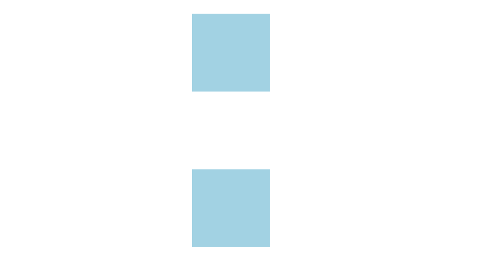

## 一、css定位机制
常见的定位机制，定位机制是控制元素的布局，有三种常见方案:
### 普通流 (normal flow)
> 在普通流中，元素按照其在 HTML 中的先后位置至上而下布局，在这个过程中，行内元素水平排列，直到当行被占满然后换行，块级元素则会被渲染为完整的一个新行，除非另外指定，否则所有元素默认都是普通流定位，也可以说，普通流中元素的位置由该元素在 HTML 文档中的位置决定。

**行元素（行内元素）**:在水平方向上修改水平尺寸(padding，margin，border)，能产生相应的效果，垂直方向上对行元素的高度是毫无影响的。

因此，行内元素直接定义`width`和`height`是没有意义的，行元素的宽高是靠内容撑起来的。

但是，可以通过设置`line-height`，来规定行元素的高度；

同样，可以通过对行元素设置`display`属性，转化为块元素，如`display：block`；

行内元素包括： 
- `b, big, i, small, tt`
- `abbr, acronym, cite, code, dfn, em, kbd, strong, samp, var`
- `a, bdo, br, img, map, object, q, script, span, sub, sup`
- `button, input, label, select, textarea`

### 浮动 (float)
> 在浮动布局中，元素首先按照普通流的位置出现，然后根据浮动的方向尽可能的向左边或右边偏移，其效果与印刷排版中的文本环绕相似。

浮动的元素脱离文档流，失去文档流的元素空间。若进行左浮动，脱离文档流的元素会向左移动，直到遇到包含元素的左边缘。
若多个元素一起浮动，则除第一个元素之外，其它元素都会定位在前一个浮动元素之后（即它的右边）。
若包含元素不够宽，则无法水平排列的元素会向下移动，直到有足够的空间。若浮动元素的高度不一致，还会发生元素卡在较高的元素的现象。
因为浮动元素脱离了文档流，所以浮动元素并不会占据包含元素的空间，包含元素高度不会自动撑开，造成塌陷，需要做点清除浮动的处理。
### 其他定位
static默认的：定位无特殊说明就是默认的，在普通流中显示，没有脱离普通流

#### relative相对定位
被看作普通流定位模型的一部分，定位元素的位置相对于它在普通流中的位置进行移动。使用相对定位的元素不管它是否进行移动，元素仍要占据它原来的位置。移动元素会导致它覆盖其他的框。

#### absolute绝对定位
绝对定位的元素位置是相对于距离它最近的那个已定位的祖先(相对/绝对)元素决定的。 如果元素没有已定位的祖先元素， 那么它的位置相对于初始包含块。绝对定位的元素可以在它的包含块向上、下、左、右移动。

与相对定位相反， 绝对定位使元素与文档流无关， 因此不占据空间。普通文档流中其他的元素的布局不受绝对定位元素的影响。由于绝对定位的元素脱离普通流，所以它可以覆盖页面上的其他元素，可以通过设置`z-index`属性来控制这些框的堆放次序。


#### fixed固定定位
 相对于浏览器窗口，其余的特点类似于绝对定位。
## 二、BFC 概念
> Block formatting context = block-level box + Formatting Context

box即盒子模型；block-level box即块级元素;display属性为block, list-item, table的元素，会生成block-level box；并且参与 block formatting context

inline-level box即行内元素: display 属性为 inline, inline-block, inline-table的元素，会生成inline-level box。并且参与 inline formatting context；

Formatting context(格式化上下文) 是 W3C CSS2.1 规范中的一个概念。它是页面中的一块渲染区域，并且有一套渲染规则，它决定了其子元素将如何定位，以及和其他元素的关系和相互作用。

最常见的 Formatting context 有 Block formatting context (简称BFC)和 Inline formatting context(简称IFC)。CSS2.1中只有BFC和IFC, CSS3中还增加了G（grid）FC和F(flex)FC。
 
####定义
BFC(Block formatting context)直译为"块级格式化上下文"。它是一个独立的渲染区域，只有block-level box参与， 它规定了内部的Block-level Box如何布局，并且与这个区域外部毫不相干。
 **具有 BFC 特性的元素可以看作是隔离了的独立容器，容器里面的元素不会在布局上影响到外面的元素，并且 BFC 具有普通容器所没有的一些特性。**
 
 通俗一点来讲，可以把 BFC 理解为一个封闭的大箱子，箱子内部的元素无论如何翻江倒海，都不会影响到外部。
 
## 三、触发 BFC
 只要元素满足下面任一条件即可触发 BFC 特性： 
 - body 根元素
 - 浮动元素：float 除 none 以外的值
 - 绝对定位元素：position (absolute、fixed)
 - display 为 inline-block、table-cells、flex
 - overflow 除了 visible 以外的值 (hidden、auto、scroll)

## 四、BFC 特性及应用
1. 同一个 BFC 下外边距会发生折叠 
```html
<head>
<style>
div{
    width: 100px;
    height: 100px;
    background: lightblue;
    margin: 100px;
}
</style>

</head>
<body>
    <div></div>
    <div></div>
</body>
```

从效果上看，因为两个 div 元素都处于同一个 BFC 容器下 (这里指 body 元素) 所以第一个 div 的下边距和第二个 div 的上边距发生了重叠，所以两个盒子之间距离只有 100px，而不是 200px。

首先这不是 CSS 的 bug，我们可以理解为一种规范，**如果想要避免外边距的重叠，可以将其放在不同的 BFC 容器中。**

```html
<div class="container">
    <p></p>
</div>
<div class="container">
    <p></p>
</div>
<style>
.container {
    overflow: hidden;
}
p {
    width: 100px;
    height: 100px;
    background: lightblue;
    margin: 100px;
}
</style>
```

这时候，两个盒子边距就变成了 200px;
 

2. BFC 可以包含浮动的元素（清除浮动）
我们都知道，浮动的元素会脱离普通文档流，来看下下面一个例子
```html
<div style="border: 1px solid #000;">
    <div style="width: 100px;height: 100px;background: #eee;float: left;"></div>
</div>
```
  
由于容器内元素浮动，脱离了文档流，所以容器只剩下 2px 的边距高度。如果使触发容器的 BFC，那么容器将会包裹着浮动元素。

```html
<div style="border: 1px solid #000;overflow: hidden">
    <div style="width: 100px;height: 100px;background: #eee;float: left;"></div>
</div>
```
效果如图：

 

3. BFC 可以阻止元素被浮动元素覆盖 
先来看一个文字环绕效果：
```html
<div style="height: 100px;width: 100px;float: left;background: lightblue">我是一个左浮动的元素</div>
<div style="width: 200px; height: 200px;background: #eee">我是一个没有设置浮动, 
也没有触发 BFC 元素, width: 200px; height:200px; background: #eee;</div>
```
 

这时候其实第二个元素有部分被浮动元素所覆盖，(但是文本信息不会被浮动元素所覆盖) 如果想避免元素被覆盖，可触第二个元素的 BFC 特性，在第二个元素中加入 overflow: hidden，就会变成：
 

这个方法可以用来实现两列自适应布局，效果不错，这时候左边的宽度固定，右边的内容自适应宽度(去掉上面右边内容的宽度)。
