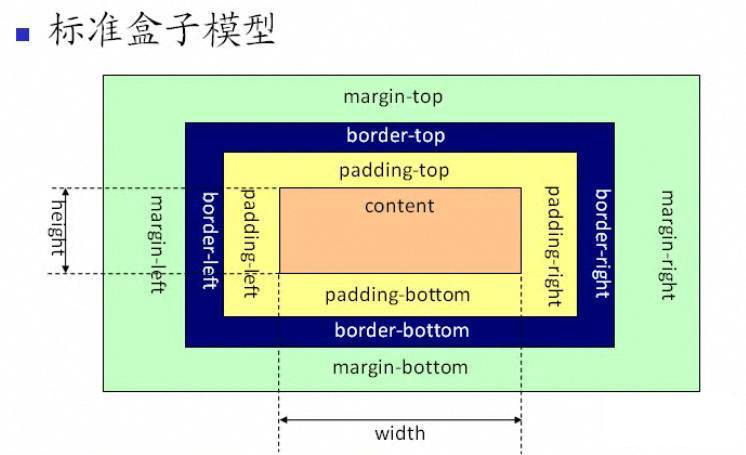
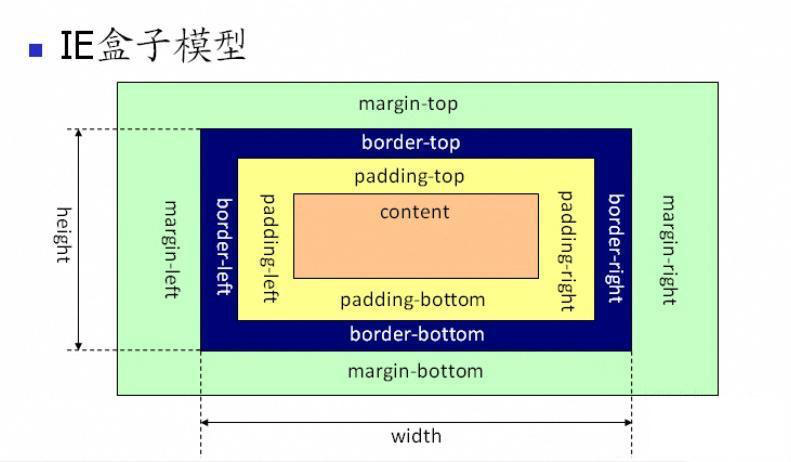
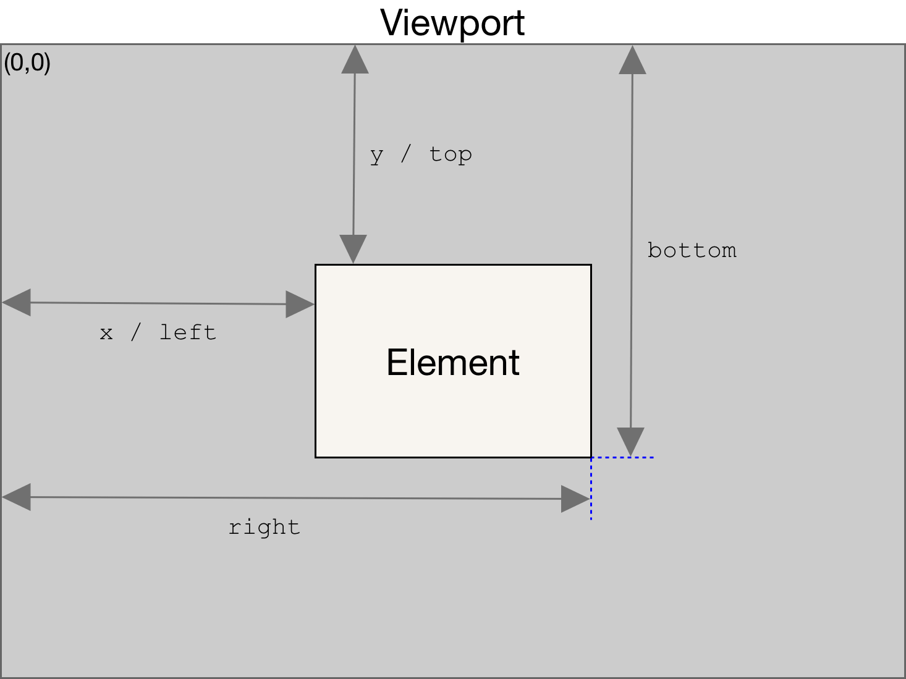
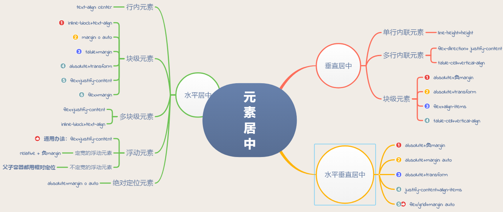

### [104个 CSS 面试题](https://mp.weixin.qq.com/s/FXN__hiDx3S6aKPGeHXsJg)

### [css晦涩难懂的点](https://juejin.cn/post/6888102016007176200)

### [Web开发者应该掌握的CSS tricks](https://lhammer.cn/You-need-to-know-css/#/zh-cn/)

### [各种页面常见布局知名网站实例分析相关阅读推荐](https://www.sweet-kk.top/css-layout)

### 网页布局
> [总结](https://www.zhihu.com/question/21775016/answer/1358336033)

### [前端DEMO以及基础的效果，CSS3简单的动画特效](http://codehtml.cn/front-end-demo/#/)

### [你未必知道的49个CSS知识点](https://juejin.im/post/6844903902123393032)

#### [从网易与淘宝的font-size思考前端设计稿与工作流](https://www.cnblogs.com/lyzg/p/4877277.html)

### 自适应布局和响应式布局

响应式布局实现一个网站能够兼容多个终端，网页的布局针对屏幕大小的尺寸而进行响应，流式布局+弹性布局，再搭配媒体查询技术使用。

自适应布局大致是指网页能够在不同大小的终端设备上自行适应显示。就是让一个网站在不同大小的设备上呈现显示同一样的页面，让同一个页面适应不同大小屏幕，根据屏幕的大小，自动缩放。多用rem+js实现，在移动端适配多种屏幕。


### em&&[rem](https://yanhaijing.com/css/2017/09/29/principle-of-rem-layout/)

px像素（Pixel）。相对长度单位。像素px是相对于显示器屏幕分辨率而言的。

#### em

**em**，`em`值的大小是动态的。当定义或继承`font-size`属性时，`1em`等于该元素的字体大小。如果你在网页中任何地方都没有设置文字大小的话，那它将等于浏览器默认文字大小，通常是`16px`。所以通常1em = 16px。2em = 32px。 如果你设置了body元素的字体大小为20px，那1em = 20px、2em = 40px。那个2就是当前em大小的倍数。

`em`单位受父元素的影响，是因为font-size本身是继承属性。如果没有定义，就要基于父元素，直到html,html未设置则是浏览器的默认文字大小`16px`

所有未经调整的浏览器都符合: 1em=16px。那么12px=0.75em,10px=0.625em。为了简化font-size的换算，需要在css中的body选择器中声明Font-size=62.5%，这就使em值变为 16px*62.5%=10px, 这样12px=1.2em, 10px=1em, 也就是说只需要将你的原来的px数值除以10，然后换上em作为单位就行了。

#### rem

`rem`即 root em，顾名思义，就是根元素 `em` 大小。 `em` 相对于当前元素， `rem` 相对于根元素，本质差别在于当前元素是多变的，根元素是固定的，也就是说，如果使用 rem，我们的计算值不会受当前元素 `font-size` 大小的影响。css3新增。

- [伪类和伪元素](#伪类和伪元素)
- [img是什么元素](#img-是什么元素)
- [line-height:1.5和line-height:150%的区别](#line-height-1-5和line-height-150-的区别)
- [元素居中](#元素居中)

### 盒模型

组成：盒模型由内容区域、内边距、边框、外边距四部分组成。

实际大小：盒模型实际大小由内容区域、内边距、边框三部分组成，css设置`width`和`height`是对盒子内容区域设置的。

`box-sizing`属性：
- W3C标准盒模型（content-box）: 一个块的总宽度= width + margin(左右) + padding(左右) + border(左右);
- IE（怪异）盒模型（border-box：border、padding 的设置不会影响元素的宽高，那么css给盒子设置的`width`和`height`属性就等于盒模型的实际大小（包括内容区域、内边距、边框）;



`border-color` 默认颜色就是
color 色值”。具体来讲，就是当没有指定` border-color `颜色值的时候，会使用当前元素的
color 计算值作为边框色。具有类似特性的 CSS 属性还有 outline、box-shadow 和 text-shadow 等。

当`margin`和`padding`的值设置为百分比时，是指相对于最近的块级父元素width（非总宽度）的相应百分比的值，即使是margin-top、margin-bottom、padding-top、padding-bottom，设置为百分比时也是以最近块级父元素的width（非总宽度）为基准，而非height。


请写出 inner 的实际高度。
```html
<style>
  .outer {
    width: 200px;
    height: 100px;
  }
  .inner {
    width: 60px;
    height: 60px;
    padding-top: 20%;
  }
</style>
<div class="outer"><div class="inner"></div></div>
```
inner 的实际高度为60px，未设置box-sizing为border-box，padding-top百分比取父元素宽的20%为40px,内容高度为60px。box-sizing为border-box时内容高度是20px。


### 优先级

定义CSS样式时，经常出现两个或更多选择器应用在同一元素上，此时，

- 选择器相同，则执行层叠性（后者覆盖前者)
- 选择器不同，就会出现优先级的问题。

#### 权重计算公式
- `!important;`最大
- 内联样式权重：1000
- id 选择器权重：0100
- 类选择器，属性选择器（如`[type="number"]`），伪类选择器（如:hove）权重：0010
- 元素选择器，伪元素选择器权重：0001
- 通配选择器 *，子选择器 >，相邻选择器 +。权重：0000

例子

- `h1 + p::first-line`: 0,0,0,3
- `li > a[href*="beige.world"] > .inline-warning`: 0,0,2,2

### 定位position

- `static`
HTML 元素的默认值，即没有定位，遵循正常的文档流对象。静态定位的元素不会受到 top, bottom, left, right影响。

- `relative`
相对定位元素的定位是相对其正常位置。移动相对定位元素，但它原本所占的空间不会改变。相对定位元素经常被用来作为绝对定位元素的容器块。

- `absolute`
绝对定位的元素的位置相对于最近的已定位父元素（除了static的父元素），如果元素没有已定位的父元素，那么它的位置相对于`<html>`--**错误，经过测试是相对于浏览器窗口**:
top, bottom, left, right百分比写法是**相对于父元素box的大小**;
absolute 定位使元素的位置与文档流无关，因此不占据空间。absolute 定位的元素和其他元素重叠。

- `fixed`
元素的位置相对于浏览器窗口是固定位置。即使窗口是滚动的它也不会移动：fixed定位使元素的位置与文档流无关，因此不占据空间。
 `fixed`定位的元素和其他元素重叠。
 
- `sticky`
粘性定位：position: sticky; 在目标区域以内，它的行为就像 `position:relative;`在滑动过程中，某个元素距离其父元素的距离达到`sticky`粘性定位的要求时(比如`top：100px`)；`position:sticky`这时的效果相当于`fixe`d定位，固定到适当位置；

元素定位表现为在跨越特定阈值（相对偏移）前为相对定位，之后为固定定位。

元素固定的相对偏移是相对于离它最近的具有滚动框的祖先元素，如果祖先元素都不可以滚动，那么是相对于viewport来计算元素的偏移量。 

这个特定阈值（相对偏移）指的是 top, right, bottom 或 left 之一，换言之，指定 top, right, bottom 或 left 四个阈值其中之一，才可使粘性定位生效。否则其行为与相对定位相同。

使用条件：

1、父元素不能`overflow:hidden`或者`overflow:auto`属性；

2、必须指定`top、bottom、left、right`4个值之一，否则只会处于相对定位；

3.父元素的高度不能低于`sticky`元素的高度；

4、sticky元素仅在其父元素内生效。

- inherit
规定应该从父元素继承 position 属性的值。

### CSS 的层叠上下文

层叠上下文是 HTML 中的一个三维的概念，每个层叠上下文中都有一套元素的层叠排列顺序。页面根元素天生具有层叠上下文，所以整个页面处于一个“层叠结界”中。

层叠上下文的创建：

- 页面根元素：html
- z-index 值为数值的定位元素
- 其他 css 属性
  - opacity 不是 1
  - transform 不是 none
  - flex，z-index 不是 auto
  
层叠上下文中的排列规则，从下到上：


- background/border
- 负 z-index
- - block 块状水平盒子
- float 浮动盒子
- inline 水平盒子
- z-index:auto, 或看成 z-index:0
- 正 z-index
由此引申出：定位元素的`z-index：0`和`z-index：auto`的区别是，前者会创建层叠上下文，影响布局。

#### [伪类](https://developer.mozilla.org/zh-CN/docs/Web/CSS/Pseudo-classes)和伪元素

伪类和伪元素的根本区别在于：它们是否创造了新的元素

伪类，指可以通过元素选择器，就可以实现的效果，如`first-child`，`active`, `:checked`，`:disabled`， `:nth-child()`等。 而伪元素，是指需要通过创元素，才可以实现的效果，如`first-letter`,`before`，`after`等。
具体元素跟写法，可参考：<https://blog.csdn.net/qq_27674439/article/details/90608220>

#### ``是什么元素

> `` 标签没有独占一行，所以是行内元素;既然是行内元素为什么能够设置宽高呢？`` 标签属于替换元素，具有内置的宽高属性，所以可以设置，具体解释看下面。

从元素本身的特点来讲，可以分为不可替换元素和替换元素,元素相关的[MDN解释](https://developer.mozilla.org/zh-CN/docs/Web/CSS/Replaced_element)

##### 不可替换元素
- (X)HTML 的大多数元素是不可替换元素，即其内容直接表现给用户端(例如浏览器),如：`<h1>我是标题</h1>`。

##### 可替换元素

- 浏览器根据元素的标签和属性，来决定元素的具体显示内容,例如浏览器会根据 ``标签的src属性的值来读取图片信息并显示出来，而如果查看(X)HTML代码，则看不到图片的实际内容；又例如根据 `<input>` 标签的type属性来决定是显示输入框，还是单选按钮等
- (X)HTML中的` 、<input>、<textarea>、<select>、<object> `都是替换元素。这些元素往往没有实际的内容，即是一个空元素
如：``、`<input type="submit" name="Submit" value="提交"/>`
- **可替换元素的性质同设置了display:inline-block的元素一致**


总结
- 属于可替换元素
- 同时具有行内元素，行内块，和块级元素的特性
- 替换元素一般有内在尺寸，所以具有 width 和 height，可以设定，例如你不指定  的 width 和 height 时，就按其内在尺寸显示，也就是图片被保存的时候的宽度和高度


- 对于表单元素，浏览器也有默认的样式，包括宽度和高度
- `、<input>`属于行内替换元素。height/width/padding/margin均可用。效果等于块元素。

### line-height:1.5和line-height:150%的区别

区别体现在子元素继承时，如下：

- 父元素设置line-height:1.5会直接继承给子元素，子元素根据自己的font-size再去计算子元素自己的line-height。
- 父元素设置line-height:150%是计算好了line-height值，然后把这个计算值给子元素继承，子元素继承拿到的就是最终的值了。此时子元素设置font-size就对其line-height无影响了。

比如父元素设置属性：font- size:14px;line-height:1.5,child设置font-size:26px;

那么父元素：line-height = 14px * 1.5 = 21px，子元素：line-height = 26px * 1.5 = 39px。

父元素设置属性：font-size:14px;line-height:150%,child设置font-size:26px;

那么父元素：line-height = 14px * 150% = 21px，子元素：line-height = 父元素的line-height = 21px。


### clientHeight、offsetHeight、scrollHeight、offsetTo、scrollTop,`Element.getBoundingClientRect()`

每个HTML元素都具有clientHeight offsetHeight scrollHeight offsetTop scrollTop 这5个和元素高度、滚动、位置相关的属性，总结出规律如下：

clientHeight和offsetHeight属性和元素的滚动、位置没有关系它代表元素的高度，其中：

#### [clientHeight](https://developer.mozilla.org/zh-CN/docs/Web/API/Element/clientHeight)
包括`padding`但不包括border、水平滚动条、margin的元素的高度。对于`display:inline`的元素这个属性一直是0，单位px，只读元素。box-sizing属性设置不会影响。

`clientHeight` 可以通过 CSS `height` + CSS `padding` - 水平滚动条高度 (如果存在)来计算.

`element.style.height`获取的是内联属性（即： 标签内设置的style）,也就是说如果是在css中设置的，获取不到。通常只用来设置样式。

`window.getComputedStyle(ele, [伪类])`（返回的是元素所有的样式属性）能获取css height

上面2个返回的都是如`200px`的字符串css值

#### [Element.getBoundingClientRect()](https://developer.mozilla.org/en-US/docs/Web/API/Element/getBoundingClientRect)
方法返回元素的大小及其相对于视口的位置。

返回值是一个 `DOMRect` 对象，这个对象是由该元素的 `getClientRects()` 方法返回的一组矩形的集合，就是该元素的 CSS 边框大小。返回的结果是包含完整元素的最小矩形，并且拥有left, top, right, bottom, x, y, width, 和 height这几个以像素为单位的只读属性用于描述整个边框。除了width 和 height 以外的属性是相对于视图窗口的左上角来计算的。-mdn

用于获得页面中某个元素的左，上，右和下分别相对浏览器视窗的位置。

top、left和css中的理解很相似，right是指元素右边界距窗口最左边的距离，bottom是指元素下边界距窗口最上面的距离。width、height是元素自身的宽高。



获取到的结果都是Number，不带单位

- clientWidth	获取元素可视部分的宽度，即 CSS 的 width 和 padding 属性值之和，元素边框和滚动条不包括在内，也不包含任何可能的滚动区域
- clientHeight	获取元素可视部分的高度，即 CSS 的 height 和 padding 属性值之和，元素边框和滚动条不包括在内，也不包含任何可能的滚动区域
- offsetWidth	元素在页面中占据的宽度总和，包括 width、padding、border 以及滚动条的宽度
- offsetHeight	元素在页面中占据的高度总和，包括 height、padding、border 以及滚动条的宽度
- scrollWidth	当元素设置了 overflow:scroll 样式属性时，元素的总宽度，也称滚动宽度。在默认状态下，如果该属性值大于 clientWidth 属性值，则元素会显示滚动条，以便能够翻阅被隐藏的区域
- scrollHeight	当元素设置了 overflow:scroll 样式属性时，元素的总高度，也称滚动高度。在默认状态下，如果该属性值大于 clientWidth 属性值，则元素会显示滚动条，以便能够翻阅被隐藏的区域
- scrollTop: 代表在有滚动条时，滚动条向下滚动的距离也就是元素顶部被遮住部分的高度。在没有滚动条时scrollTop==0恒成立。单位px，可读可设置。
- offsetTop: 当前元素顶部距离最近父元素顶部的距离,和有没有滚动条没有关系。单位px，只读元素。
[文章](https://juejin.cn/post/6844904133921619982)


### 元素居中



### 移动端如何处理点击穿透

点击穿透的原因：

在 pc 端的事件触发顺序：mousedown -> click -> mouseup

在移动端的事件触发顺序：touchstart -> touchmove -> touchend

移动端的事件优先级高，并且会模拟 mouse 事件，所以综合来看，移动端的执行顺序：

touchstart -> touchmove -> touchend -> mousedown -> click -> mouseup

由于很多时候，我们点击关闭弹窗时，弹窗立马就关闭了，但在移动端还存在一个点击延迟效果，即执行 tap 事件之后 300ms 之后才会触发 click 事件，这个时候弹窗已经没有了，于是 click 事件就作用在了弹窗下的元素上，就形成了点击穿透现象。

解决方案：

1、使用 fastclick 禁止 300ms 点击延迟。

2、使用 pointer-events 控制是否可点击。

- 不允许点击，即让点击穿透 ：pointer-events: none;
- 允许点击，即禁止穿透（默认值）：pointer-events: auto;
