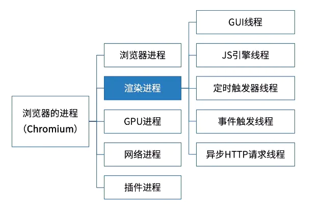

# 事件循环

- [JavaScript 执行机制](https://juejin.im/post/6844903512845860872)
- [文章1](https://jakearchibald.com/2015/tasks-microtasks-queues-and-schedules/)
- [文章1](https://juejin.im/post/6844903971228745735)
- [文章2](https://juejin.im/post/6844903711106400264)
- [文章3](https://juejin.cn/post/6844904100195205133)
- [文章4](https://zhuanlan.zhihu.com/p/33058983)


[浏览器与Node的事件循环(Event Loop)有何区别](https://juejin.im/post/6844903761949753352)
[深入解析 EventLoop 和浏览器渲染、帧动画、空闲回调的关系](https://mp.weixin.qq.com/s?__biz=MzI2MjcxNTQ0Nw==&mid=2247488677&idx=1&sn=19f1facc24f2621ccf56b5ee049de359&chksm=ea47b5fddd303ceb93dba07c031454efa632cfe66042e9def8a187a53cb6e46f36480657705d&mpshare=1&scene=23&srcid=1212JYxP5sNTkmyUIDw4A2lL&sharer_sharetime=1607767237746&sharer_shareid=1958dfa2b35b63c7a7463d11712f39df#rd)

# 浏览器环境下js引擎的事件循环机制

## 1.执行栈与事件队列

当javascript代码执行的时候会将不同的变量存于内存中的不同位置：堆（heap）和栈（stack）中来加以区分。其中，堆里存放着一些对象。而栈中则存放着一些基础类型变量以及对象的指针。 但是我们这里说的执行栈和上面这个栈的意义却有些不同。

我们知道，当我们调用一个方法的时候，js会生成一个与这个方法对应的执行环境（context），又叫执行上下文。这个执行环境中存在着这个方法的私有作用域，上层作用域的指向，方法的参数，这个作用域中定义的变量以及这个作用域的this对象。 而当一系列方法被依次调用的时候，因为js是单线程的，同一时间只能执行一个方法，于是这些方法被排队在一个单独的地方。这个地方被称为执行栈。

当一个脚本第一次执行的时候，js引擎会解析这段代码，并将其中的同步代码按照执行顺序加入执行栈中，然后从头开始执行。如果当前执行的是一个方法，那么js会向执行栈中添加这个方法的执行环境，然后进入这个执行环境继续执行其中的代码。当这个执行环境中的代码 执行完毕并返回结果后，js会退出这个执行环境并把这个执行环境销毁，回到上一个方法的执行环境。。这个过程反复进行，直到执行栈中的代码全部执行完毕。

下面这个图片非常直观的展示了这个过程，其中的global就是初次运行脚本时向执行栈中加入的代码：


从图片可知，一个方法执行会向执行栈中加入这个方法的执行环境，在这个执行环境中还可以调用其他方法，甚至是自己，其结果不过是在执行栈中再添加一个执行环境。这个过程可以是无限进行下去的，除非发生了栈溢出，即超过了所能使用内存的最大值。

以上的过程说的都是同步代码的执行。那么当一个异步代码（如发送ajax请求数据）执行后会如何呢？前文提过，js的另一大特点是非阻塞，实现这一点的关键在于下面要说的这项机制——事件队列（Task Queue）。

js引擎遇到一个异步事件后并不会一直等待其返回结果，而是会将这个事件挂起，继续执行执行栈中的其他任务。当一个异步事件返回结果后，js会将这个事件加入与当前执行栈不同的另一个队列，我们称之为事件队列。被放入事件队列不会立刻执行其回调，而是等待当前执行栈中的所有任务都执行完毕， 主线程处于闲置状态时，主线程会去查找事件队列是否有任务。如果有，那么主线程会从中取出排在第一位的事件，并把这个事件对应的回调放入执行栈中，然后执行其中的同步代码...，如此反复，这样就形成了一个无限的循环。这就是这个过程被称为“事件循环（Event Loop）”的原因。

这里还有一张图来展示这个过程：


图中的stack表示我们所说的执行栈，web apis则是代表一些异步事件，而callback queue即事件队列。


### 浏览器的进程



上图只是一个概括分类，意思是Chrome有这几类的进程和线程，并不是每种只有一个，比如渲染进程就有多个，每个选项卡都有自己的渲染进程。有时候我们使用Chrome会遇到某个选项卡崩溃或者没有响应的情况，这个选项卡对应的渲染进程可能就崩溃了，但是其他选项卡并没有用这个渲染进程，他们有自己的渲染进程，所以其他选项卡并不会受影响。这也是Chrome单个页面崩溃并不会导致浏览器崩溃的原因，而不是像老IE那样，一个页面卡了导致整个浏览器都卡。

#### GUI线程
GUI线程就是渲染页面的，他解析HTML和CSS，然后将他们构建成DOM树和渲染树就是这个线程负责的。
#### JS引擎线程
这个线程就是负责执行JS的主线程，前面说的"JS是单线程的"就是指的这个线程。大名鼎鼎的Chrome V8引擎就是在这个线程运行的。需要注意的是，这个线程跟GUI线程是互斥的。互斥的原因是JS也可以操作DOM，如果JS线程和GUI线程同时操作DOM，结果就混乱了，不知道到底渲染哪个结果。这带来的后果就是如果JS长时间运行，GUI线程就不能执行，整个页面就感觉卡死了。所以我们最开始例子的while(true)这样长时间的同步代码在真正开发时是绝对不允许的。
#### 定时器线程
前面异步例子的setTimeout其实就运行在这里，他跟JS主线程根本不在同一个地方，所以“单线程的JS”能够实现异步。JS的定时器方法还有setInterval，也是在这个线程。
#### 事件触发线程
定时器线程其实只是一个计时的作用，他并不会真正执行时间到了的回调，真正执行这个回调的还是JS主线程。所以当时间到了定时器线程会将这个回调事件给到事件触发线程，然后事件触发线程将它加到事件队列里面去。最终JS主线程从事件队列取出这个回调执行。事件触发线程不仅会将定时器事件放入任务队列，其他满足条件的事件也是他负责放进任务队列。
#### 异步HTTP请求线程
这个线程负责处理异步的ajax请求，当请求完成后，他也会通知事件触发线程，然后事件触发线程将这个事件放入事件队列给主线程执行。

所以JS异步的实现靠的就是浏览器的多线程，当它遇到异步API时，就将这个任务交给对应的线程，当这个异步API满足回调条件时，对应的线程又通过事件触发线程将这个事件放入任务队列，然后主线程从任务队列取出事件继续执行，这其实就是Event Loop，


 - JavaScript 是单线程、异步、非阻塞、解释型脚本语言。JS引擎会将JS脚本进行编译和执行
 - JavaScript 的设计就是为了处理浏览器网页的交互（DOM操作的处理、UI动画等），决定了它是一门单线程语言。如果有多个线程，它们同时在操作 DOM，那网页将会一团糟。
 - 执行栈（先进后出，执行栈中存放正在执行的代码）和堆（堆中存放变量的值）
 - JS执行栈和渲染线程是相互阻塞的
 - 事件循环实现异步
 
### 事件循环的流程大致如下


----
- 执行一个宏任务（执行栈中没有就从事件队列中获取）


- 执行过程中如果遇到微任务，就将它添加到微任务的任务队列中（主线程每次执行时，先看看要执行的是同步任务，还是异步的API，同步任务就继续执行，一直执行完。遇到异步API就将它交给对应的异步线程，自己继续执行同步任务。异步线程执行异步API，执行完后，将异步回调事件放入事件队列上）


- 宏任务执行完毕后，立即执行当前微任务队列中的所有微任务（依次执行）


- 当前宏任务执行完毕，开始检查渲染，然后GUI线程接管渲染


- 渲染完毕后，JS引擎线程继续，开始下一个宏任务（从宏任务队列中获取）

注意点
1. 一个Event Loop可以有一个或多个事件队列，但是只有一个微任务队列。
2. 微任务队列全部执行完会重新渲染一次
3. 每个宏任务执行完都会重新渲染一次
4. requestAnimationFrame处于渲染阶段，不在微任务队列，也不在宏任务队列，requestAnimationFrame在重新渲染屏幕之前执行，非常适合用来做动画。
5.microtask必然是在某个宏任务执行的时候创建的，而在下一个宏任务开始之前，浏览器会对页面重新渲染(task >> 渲染 >> 下一个task(从任务队列中取一个))。同时，在上一个宏任务执行完成后，渲染页面之前，会执行当前微任务队列中的所有微任务。
6. requestIdleCallback在渲染屏幕之后执行，并且是否有空执行要看浏览器的调度，如果你一定要它在某个时间内执行，请使用 timeout参数。
7. resize和scroll事件其实自带节流，它只在 Event Loop 的渲染阶段去执行事件。
### 宏任务包括：
- script(整体代码)
- setTimeout, setInterval, setImmediate,
- I/O
- UI rendering
    　　
### 微任务包括：
    
- process.nextTick
- Promise
- MutationObserver(html5新特性)

>在node环境下，process.nextTick的优先级高于Promise，也就是说：在宏任务结束后会先执行微任务队列中的nextTickQueue，然后才会执行微任务中的Promise。

### [setInterval](http://caibaojian.com/setinterval.html),[requestAnimationFrame](https://github.com/sisterAn/blog/issues/30)代替绘制动画

```javascript
async function asyncA(){
	console.log('1')
	await asyncB()
	console.log('2')
}

async function asyncB(){
	console.log('3')
}

console.log('4')
setTimeout(() => {
	console.log('5')
	Promise.resolve().then(function(){
		console.log('6')
	})
}, 0)
setTimeout(() => {
	console.log('7')
	Promise.resolve().then(function(){
		console.log('8')
	})
}, 0)
asyncA()
new Promise(function(resolve){
	resolve()
	console.log('9')
	new Promise((resolve) => {
		console.log('12')
		resolve(1)
	}).then(res => {
		console.log('13')
	})
}).then(function(){
	console.log('10')
    new Promise((resolve) => {
		console.log('14')
		resolve(1)
	}).then(res => {
		console.log('15')
	})
})
console.log('11')
// 结果 4  1  3  9 12 11  2  13  10  14 15 5 6 7 8
// await 语句相当于在new Promise中，后面的语句在then中，所以1后输出3， 输出2在微任务中
// 检查微任务队列，执行并清空微任务队列，如果在微任务的执行中又加入了新的微任务，也会在这一步一起执行。 所以10后输出 14 15
```
