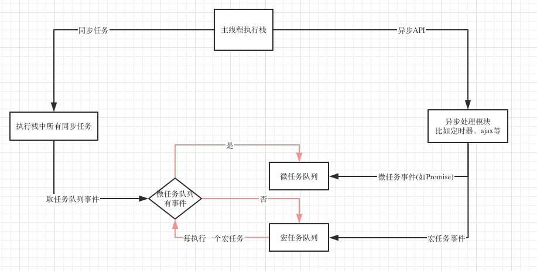
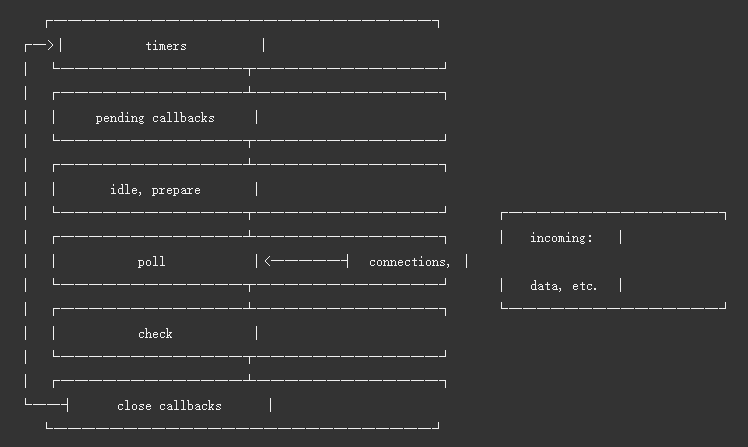

# 事件循环

## [前置概念](https://mp.weixin.qq.com/s?__biz=MzI2MjcxNTQ0Nw==&mid=2247489016&idx=1&sn=0dc37ade69a6ddf73f84ed7c9f9526fb&chksm=ea47b4a0dd303db6a8c8f119e43e3b7419d6db1f9ea8883722f174f122f7761b6170b52c7886&mpshare=1&scene=23&srcid=0102CkGsGfwl4YXRXBMFrb5t&sharer_sharetime=1609566740377&sharer_shareid=1958dfa2b35b63c7a7463d11712f39df#rd)

### 线程和进程

- 进程：CPU 进行资源分配的基本单位
- 线程：CPU 调度的最小单位
- 协程（Coroutine）：协程看成是跑在线程上的任务，一个线程上可以存在多个协程，但是在线程上同时只能执行一个协程。（`Generator`)

通俗一点讲：进程可以描述为一个应用程序的执行程序，线程则是进程内部用来执行某个部分的程序。

做个简单的比喻：进程=火车，线程=车厢

- 线程在进程下行进（单纯的车厢无法运行）
- 一个进程可以包含多个线程（一辆火车可以有多个车厢）
- 不同进程间数据很难共享（一辆火车上的乘客很难换到另外一辆火车，比如站点换乘）
- 同一进程下不同线程间数据很容易共享（A车厢换到B车厢很容易）
- 进程要比线程消耗更多的计算机资源（采用多列火车相比多个车厢更耗资源）
- 进程间不会相互影响，一个线程挂掉将导致整个进程挂掉（一列火车不会影响到另外一列火车，但是如果一列火车上中间的一节车厢着火了，将影响到所有车厢）
- 进程可以拓展到多机，进程最多适合多核（不同火车可以开在多个轨道上，同一火车的车厢不能在行进的不同的轨道上）
- 进程使用的内存地址可以上锁，即一个线程使用某些共享内存时，其他线程必须等它结束，才能使用这一块内存。（比如火车上的洗手间）－"互斥锁"
- 进程使用的内存地址可以限定使用量（比如火车上的餐厅，最多只允许多少人进入，如果满了需要在门口等，等有人出来了才能进去）－“信号量”

异步任务，例如ajax请求，各种请求资源，延时操作等等，其实都是在辅助线程上进行监听，如果完成，则进入任务队列，简化一下其实可以直接理解为主线程的栈，然后顺序执行。
辅助线程其实就只是一个监听返回的功能。

ES6中的`Generator`的实现，类似于开了多进程，但是依然同时只能进行一个进程，与辅助线程不同。

js公路只是单行道（主线程），但是有很多车道（辅助线程）都可以汇入车流（异步任务完成后回调进入主线程的任务队列）；

generator把js公路变成了多车道（协程实现），但是同一时间只有一个车道上的车能开（依然单线程），不过可以自由变道（移交控制权）


### 应用程序如何调度进程和线程

当一个应用程序启动时，一个进程就被创建了。应用程序可能会创建一些线程帮助它完成某些工作，但这不是必须的。操作系统会划分出一部分内存给这个进程，当前应用程序的所有状态都将保存在这个私有的内存空间中。

当你关闭应用时，进程也就自动蒸发掉了，操作系统会将先前被占用的内存空间释放掉。

一个程序并不一定只有一个进程，进程可以让操作系统再另起一个进程去处理不同的任务。当这种情况发生时，新的进程又将占据一块内存空间。当两个进程需要通信时，它们进行进程间通讯。

许多应用程序都被设计成以这种方式进行工作，所以当其中一个进程挂掉时，它可以在其他进程仍然运行的时候直接重启。

### 多进程和多线程

- 多进程：多进程指的是在同一个时间里，同一个计算机系统中如果允许两个或两个以上的进程处于运行状态。多进程带来的好处是明显的，比如你可以听歌的同时，打开编辑器敲代码，编辑器和听歌软件的进程之间丝毫不会相互干扰。
- 多线程是指程序中包含多个执行流，即在一个程序中可以同时运行多个不同的线程来执行不同的任务，也就是说允许单个程序创建多个并行执行的线程来完成各自的任务。

### Chrome 的多进程架构

- 浏览器进程

浏览器最核心的进程，负责管理各个标签页的创建和销毁、页面显示和功能（前进，后退，收藏等）、网络资源的管理，下载等。

- 插件进程

负责每个第三方插件的使用，每个第三方插件使用时候都会创建一个对应的进程、这可以避免第三方插件crash影响整个浏览器、也方便使用沙盒模型隔离插件进程，提高浏览器稳定性。

- GPU进程

负责3D绘制和硬件加速

- 渲染进程

浏览器会为每个窗口分配一个渲染进程、也就是我们常说的浏览器内核，这可以避免单个 `page crash`影响整个浏览器。

### 浏览器内核的多线程

浏览器内核就是浏览器渲染进程，从接收下载文件后再到呈现整个页面的过程，由浏览器渲染进程负责。浏览器内核是多线程的，在内核控制下各线程相互配合以保持同步，一个浏览器通常由以下常驻线程组成：

- `GUI` 渲染线程
- 定时触发器线程
- 事件触发线程
- 异步`http`请求线程
- `JavaScript` 引擎线程

### JavaScript 为何设计成单线程

作为浏览器脚本语言， JavaScript 的主要用途是与用户互动，以及操作DOM。这决定了它只能是单线程，否则会带来很复杂的同步问题。比如，假定 JavaScript 同时有两个线程，一个线程在某个 DOM 节点上添加内容，另一个线程删除了这个节点，这时浏览器应该以哪个线程为准？

所以，为了避免复杂性，从一诞生， JavaScript 就是单线程，这已经成了这门语言的核心特征，将来也不会改变。

## 概述

JavaScript 是单线程、异步、非阻塞、解释型脚本语言。JS引擎会将JS脚本进行编译和执行；

JavaScript 的设计就是为了处理浏览器网页的交互（DOM操作的处理、UI动画等），决定了它是一门单线程语言。如果有多个线程，它们同时在操作 DOM，那网页将会一团糟；

这里的单线程是指主线程只有一个（JS引擎线程，如v8引擎），并不是整个运行环境（浏览器环境和Node）都是单线程，JS的异步是靠底层的多线程实现的，比如ajax的异步HTTP请求线程，不同的异步API对应不同的实现线程。

JS引擎负责编译和执行JS脚本，有两个非常核心的构成，`执行栈`和`堆`。执行栈中存放正在执行的代码，堆中存放变量的值，通常是不规则的。

JS执行栈和渲染线程是相互阻塞的，保证了浏览器构建UI不混乱。

使用`事件循环`（其实就是用来做调度任务的）实现异步，其实就是异步线程执行完时会添加到`Event Queue`或者叫消息队列(事件队列)中，当主线程执行栈为空时，会去取事件队列中的任务执行。js引擎存在`monitoring process`进程，会持续不断的检查主线程执行栈是否为空，一旦为空，就会去Event Queue那里检查是否有等待被调用的函数。
事件循环的每一轮称为一个tick。


## 1.执行栈与事件队列

当javascript代码执行的时候会将不同的变量存于内存中的不同位置：堆（heap）和栈（stack）中来加以区分。其中，堆里存放着一些对象。而栈中则存放着一些基础类型变量以及对象的指针。 

当调用一个方法的时候，js会生成一个与这个方法对应的执行环境（context），又叫`执行上下文`。这个执行环境中存在着这个方法的私有作用域，上层作用域的指向，方法的参数，这个作用域中定义的变量以及这个作用域的this对象。 而当一系列方法被依次调用的时候，因为js是单线程的，同一时间只能执行一个方法，于是这些方法被push到一个栈中。这栈被称为执行栈。

当一个脚本第一次执行的时候，js引擎会解析这段代码，并将其中的同步代码按照执行顺序加入执行栈中，然后从头开始执行。如果当前执行的是一个方法，那么js会向执行栈中添加这个方法的执行环境，然后进入这个执行环境继续执行其中的代码。当这个执行环境中的代码 执行完毕并返回结果后，js会退出这个执行环境并把这个执行环境销毁，回到上一个方法的执行环境。这个过程反复进行，直到执行栈中的代码全部执行完毕。

下面这个图片非常直观的展示了这个过程，其中的global就是初次运行脚本时向执行栈中加入的代码：


从图片可知，一个方法执行会向执行栈中加入这个方法的执行环境，在这个执行环境中还可以调用其他方法，甚至是自己，其结果不过是在执行栈中再添加一个执行环境。这个过程可以是无限进行下去的，除非发生了栈溢出，即超过了所能使用内存的最大值。

以上的过程说的都是同步代码的执行。那么当一个异步代码（如发送ajax请求数据）执行后会如何呢？js的另一大特点是非阻塞，实现这一点的关键在于`事件循环`。

js引擎遇到一个异步事件后并不会一直等待其返回结果，而是会将这个事件挂起，继续执行执行栈中的其他任务。当一个异步事件返回结果后，js会将这个事件加入与当前执行栈不同的另一个队列，我们称之为事件队列。被放入事件队列不会立刻执行其回调，而是等待当前执行栈中的所有任务都执行完毕， 主线程处于闲置状态时，主线程会去查找事件队列是否有任务。如果有，那么主线程会从中取出排在第一位的事件，并把这个事件对应的回调放入执行栈中，然后执行其中的同步代码...，如此反复，这样就形成了一个无限的循环。这就是这个过程被称为“事件循环（Event Loop）”的原因。

这里还有一张图来展示这个过程：


图中的`stack`表示我们所说的`执行栈`，web apis则是代表一些异步事件，而callback queue即事件队列。


### 浏览器的进程


上图只是一个概括分类，意思是Chrome有这几类的进程和线程，并不是每种只有一个，比如渲染进程就有多个，每个选项卡都有自己的渲染进程。有时候我们使用Chrome会遇到某个选项卡崩溃或者没有响应的情况，这个选项卡对应的渲染进程可能就崩溃了，但是其他选项卡并没有用这个渲染进程，他们有自己的渲染进程，所以其他选项卡并不会受影响。这也是Chrome单个页面崩溃并不会导致浏览器崩溃的原因，而不是像老IE那样，一个页面卡了导致整个浏览器都卡。

#### GUI线程
GUI线程就是渲染页面的，他解析HTML和CSS，然后将他们构建成DOM树和渲染树就是这个线程负责的。
#### JS引擎线程
这个线程就是负责执行JS的主线程，前面说的"JS是单线程的"就是指的这个线程。Chrome V8引擎就是在这个线程运行的。需要注意的是，这个线程跟GUI线程是互斥的。互斥的原因是JS也可以操作DOM，如果JS线程和GUI线程同时操作DOM，结果就混乱了，不知道到底渲染哪个结果。这带来的后果就是如果JS长时间运行，GUI线程就不能执行，整个页面就感觉卡死了。
#### 定时器线程
`setTimeout`和`setInterval`的运行线程，它们和JS主线程根本不在同一个地方，所以“单线程的JS”能够实现异步。
#### 事件触发线程
定时器线程其实只是一个计时的作用，他并不会真正执行时间到了的回调，真正执行这个回调的还是JS主线程。所以当时间到了定时器线程会将这个回调事件给到事件触发线程，然后事件触发线程将它加到事件队列里面去。最终JS主线程从事件队列取出这个回调执行。事件触发线程不仅会将定时器事件放入任务队列，其他满足条件的事件也是他负责放进任务队列。
#### 异步HTTP请求线程
这个线程负责处理异步的ajax请求，当请求完成后，他也会通知事件触发线程，然后事件触发线程将这个事件放入事件队列给主线程执行。

所以JS异步的实现靠的就是浏览器的多线程，当它遇到异步API时，就将这个任务交给对应的线程，当这个异步API满足回调条件时，对应的线程又通过事件触发线程将这个事件放入任务队列，然后主线程从任务队列取出事件继续执行，这其实就是Event Loop，


### 事件循环的流程大致如下



----
- 执行一个宏任务（执行栈中没有就从事件队列中获取）


- 执行过程中如果遇到微任务，就将它添加到微任务的任务队列中（主线程每次执行时，先看看要执行的是同步任务，还是异步的API，同步任务就继续执行，一直执行完。遇到异步API就将它交给对应的异步线程，自己继续执行同步任务。异步线程执行异步API，执行完后，将异步回调事件放入事件队列上）


- 宏任务执行完毕后，立即执行当前微任务队列中的所有微任务（依次执行），如果在微任务的执行中又加入了新的微任务，也会在这一步一起执行。


- 当前宏任务执行完毕，开始检查渲染，然后GUI线程接管渲染

- 渲染判断阶段有一下过程，见下面说明

- 渲染完毕后，检查是否有Web worker任务，有则执行，JS引擎线程继续，开始下一个宏任务（从宏任务队列中获取）

注意点
1. 一个Event Loop可以有一个或多个任务队列，但是只有一个微任务队列。 `task queue` 是一个 **`set`** 而非 `queue`。（多个task: 浏览器可以为不同的 `queque` 分配不同的优先级，从而优先处理某种类型任务。为什么 task queue 不是队列，而是集合？因为浏览器总是会挑选可执行的任务去执行，而不是根据进入队列的时间。）
2. 微任务队列全部执行完会重新渲染一次。
3. 每个宏任务执行完都会重新渲染一次,如果微任务队列为空的话。
4. requestAnimationFrame处于渲染阶段，不在微任务队列，也不在宏任务队列，requestAnimationFrame在重新渲染屏幕之前执行，非常适合用来做动画。
5. microtask必然是在某个宏任务执行的时候创建的，而在下一个宏任务开始之前，浏览器会对页面重新渲染(task >> 渲染 >> 下一个task(从任务队列中取一个))。同时，在上一个宏任务执行完成后，渲染页面之前，会执行当前微任务队列中的所有微任务。
6. requestIdleCallback在渲染屏幕之后执行，并且是否有空执行要看浏览器的调度，如果你一定要它在某个时间内执行，请使用 timeout参数。
7. resize和scroll事件其实自带节流，它只在 Event Loop 的渲染阶段去执行事件。
### 宏任务包括：
- script(整体代码)
- setTimeout, setInterval, setImmediate,
- I/O
- UI rendering
    　　
### 微任务包括：
    
- process.nextTick
- Promise.then中的代码，及async函数中await后面的部分，await那一行是同步的
- MutationObserver(html5新特性)


### 清空完微任务，进入更新渲染阶段的过程

- 1. 进入更新渲染阶段，判断是否需要渲染，这里有一个 `rendering opportunity` 的概念，也就是说不一定每一轮 `event loop` 都会对应一次浏览器渲染，要根据屏幕刷新率、页面性能、页面是否在后台运行来共同决定，通常来说这个渲染间隔是固定的。（所以多个 task 很可能在一次渲染之间执行）

    - 浏览器会尽可能的保持帧率稳定，例如页面性能无法维持 60fps（每 16.66ms 渲染一次）的话，那么浏览器就会选择 30fps 的更新速率，而不是偶尔丢帧。
    - 如果浏览器上下文不可见，那么页面会降低到 4fps 左右甚至更低。
    - 如果满足以下条件，也会跳过渲染：
         - a. 浏览器判断更新渲染不会带来视觉上的改变。
         - b. `map of animation frame callbacks` 为空，也就是帧动画回调为空，可以通过 `requestAnimationFrame` 来请求帧动画。
- 2. 如果上述的判断决定本轮不需要渲染，那么下面的几步也不会继续运行：

    - 对于需要渲染的文档，如果窗口的大小发生了变化，执行监听的 `resize` 方法。
    
    - 对于需要渲染的文档，如果页面发生了滚动，执行 `scroll` 方法。
    
    - 对于需要渲染的文档，执行帧动画回调，也就是 `requestAnimationFrame` 的回调。
    
    - 对于需要渲染的文档， 执行 `IntersectionObserver` 的回调。
    
    - 对于需要渲染的文档，重新渲染绘制用户界面。
    
    - 判断 task队列和`microTask`队列是否都为空，如果是的话，则进行 Idle 空闲周期的算法，判断是否要执行 `requestIdleCallback` 的回调函数。
    

对于`resize` 和 `scroll`来说，并不是到了这一步才去执行滚动和缩放，那岂不是要延迟很多？浏览器当然会立刻帮你滚动视图，根据[CSSOM](https://drafts.csswg.org/cssom-view/#scrolling-events) 规范所讲，浏览器会保存一个 `pending scroll event targets`，等到事件循环中的 scroll这一步，去派发一个事件到对应的目标上，驱动它去执行监听的回调函数而已。resize也是同理。


## [node的事件循环](https://sanyuan0704.top/my_blog/blogs/javascript/js-v8/006.html)

[官网介绍](https://nodejs.org/zh-cn/docs/guides/event-loop-timers-and-nexttick/)



#### 阶段概述

- 定时器：本阶段执行已经被 `setTimeout()` 和 `setInterval()` 的调度回调函数。
- 待定回调：执行延迟到下一个循环迭代的 I/O 回调。
- idle, prepare：仅系统内部使用。
- 轮询：检索新的 I/O 事件;执行与 I/O 相关的回调（几乎所有情况下，除了关闭的回调函数，那些由计时器和 setImmediate() 调度的之外），其余情况 node 将在适当的时候在此阻塞。
- 检测：`setImmediate()` 回调函数在这里执行。
- 关闭的回调函数：一些关闭的回调函数，如：`socket.on('close', ...)`。
- 在每次运行的事件循环之间，Node.js 检查它是否在等待任何异步 I/O 或计时器，如果没有的话，则完全关闭。
#### 三大关键阶段
首先，梳理一下 nodejs 三个非常重要的执行阶段:

1. 执行 `定时器回调` 的阶段。检查定时器，如果到了时间，就执行回调。这些定时器就是`setTimeout`、`setInterval`。这个阶段暂且叫它`timer`。

2. 轮询(英文叫`poll`)阶段。因为在node代码中难免会有异步操作，比如文件I/O，网络I/O等等，那么当这些异步操作做完了，就会来通知JS主线程，怎么通知呢？就是通过`data`、 `connect`等事件使得事件循环到达 `poll` 阶段。到达了这个阶段后:
    
如果当前已经存在定时器，而且有定时器到时间了，拿出来执行，eventLoop 将回到`timer`阶段。

如果没有定时器, 会去看回调函数队列。

- 如果队列不为空，拿出队列中的方法依次执行
- 如果队列为空，检查是否有 `setImmediate` 的回调
  - 有则前往`check`阶段(下面会说)
  - 没有则继续等待，相当于阻塞了一段时间(阻塞时间是有上限的), 等待 `callback` 函数加入队列，加入后会立刻执行。一段时间后自动进入 `check` 阶段。
  
3. `check` 阶段。这是一个比较简单的阶段，直接执行 `setImmediate` 的回调。

这三个阶段为一个循环过程。


#### 完整流程

首先，当第 1 阶段结束后，可能并不会立即等待到异步事件的响应，这时候 nodejs 会进入到 `I/O异常的回调阶段`。比如说 TCP 连接遇到ECONNREFUSED，就会在这个时候执行回调。

并且在 `check` 阶段结束后还会进入到 `关闭事件的回调阶段`。如果一个 socket 或句柄（handle）被突然关闭，例如 socket.destroy()， 'close' 事件的回调就会在这个阶段执行。

梳理一下，nodejs 的 eventLoop 分为下面的几个阶段:

宏任务的执行顺序
1. timers定时器： 执行已经安排的`setTimeout`和`setInterval`的回调函数
2. pending callback待定回调：执行延迟到下一个轮询迭代的I/O回调
3. idle,prepare: 仅系统内部使用
4. poll：检索新的I/O事件, 执行与I/O相关的回调
5. check： 执行setImmediate回调
6. close callback(关闭事件的回调阶段)： socket.on('close', () => {})


#### 实例演示

```javascript
setTimeout(()=>{
    console.log('timer1')
    Promise.resolve().then(function() {
        console.log('promise1')
    })
}, 0)
setTimeout(()=>{
    console.log('timer2')
    Promise.resolve().then(function() {
        console.log('promise2')
    })
}, 0)
```
node 版本 >= 11的，它会和浏览器表现一致，一个定时器运行完立即运行相应的微任务。

```
timer1
promise1
time2
promise2
```
而 node 版本小于 11 的情况下，对于定时器的处理是:
>若第一个定时器任务出队并执行完，发现队首的任务仍然是一个定时器，那么就将微任务暂时保存，**直接去执行**新的定时器任务，当新的定时器任务执行完后，**再一一执行**中途产生的微任务。

1. 执行完一个阶段的所有任务（及上面的1-6）
2. 执行nextTrick队列里面的内容
3. 执行完微任务队列的任务 

因此会打印出这样的结果:
```
timer1
timer2
promise1
promise2
```

#### nodejs 和 浏览器关于eventLoop的主要区别
两者最主要的区别在于浏览器中的微任务是**在每个相应的宏任务**中执行的，而nodejs中的微任务是在**不同阶段之间**执行的。

#### process.nextTick
>在node环境下，process.nextTick的优先级高于Promise，也就是说：在宏任务结束后会先执行微任务队列中的nextTickQueue，然后才会执行微任务中的Promise。

`process.nextTick` 是一个独立于 eventLoop 的任务队列。

在每一个 eventLoop 阶段完成后会去检查这个队列，如果里面有任务，会让这部分任务**优先于微任务**执行。

### [setInterval](http://caibaojian.com/setinterval.html),[requestAnimationFrame](https://github.com/sisterAn/blog/issues/30)代替绘制动画

```javascript
async function asyncA(){
	console.log('1')
	await asyncB()
	console.log('2')
}

async function asyncB(){
	console.log('3')
}

console.log('4')
setTimeout(() => {
	console.log('5')
	Promise.resolve().then(function(){
		console.log('6')
	})
}, 0)
setTimeout(() => {
	console.log('7')
	Promise.resolve().then(function(){
		console.log('8')
	})
}, 0)
asyncA()
new Promise(function(resolve){
	resolve()
	console.log('9')
	new Promise((resolve) => {
		console.log('12')
		resolve(1)
	}).then(res => { //这里的微任务其实是比下面的先添加的
		console.log('13')
	})
}).then(function(){
	console.log('10')
    new Promise((resolve) => {
		console.log('14')
		resolve(1)
	}).then(res => {
		console.log('15')
	})
})
console.log('11')
// 结果 4  1  3  9  12  11  2  13  10  14  15  5  6  7  8
// await 语句相当于在new Promise中，后面的语句在then中，所以1后输出3， 输出2在微任务中
// 检查微任务队列，执行并清空微任务队列，如果在微任务的执行中又加入了新的微任务，也会在这一步一起执行。 所以10后输出 14 15
```
```javascript
console.log(1)
setTimeout(() => {
    console.log(9)
}, 0)
new Promise((resolve => {
    console.log(2)
    resolve(1)
})).then(res => {
    console.log(5)
})

new Promise((resolve => {
    resolve(1)
    console.log(3)
})).then(res => {
    console.log(6)
    new Promise((resolve => {
        resolve(1)
        console.log(7)
    })).then(res => {
        console.log(8)

    })
})
console.log(4)
```
从1依次输出到9， 在微任务队列中新建了微任务，也会添加进微任务队列，按顺序清空完微任务队列。

```javascript
setTimeout(() => {
	console.log('setTimeout 1')
})

new Promise((resolve, reject) => {
	console.log('promise 1')
	resolve(1)
}).then(res => {
	console.log('promise 1 resolved')
	setTimeout(() => {
		console.log('setTimeout 2')
	}, 0)
	setTimeout(() => {
		console.log('setTimeout 3')
	}, 0)
	new Promise((resolve, reject) => {
		resolve(1)
		console.log('Promise 2')
	}).then(() => {
		console.log('Promise 2 resolved')
		new Promise((resolve => {
			console.log('new Promise 3')
			resolve(121212)
		}))
			.then(res => {
				console.log('new Promise 3 resolve')
			})
	}).catch()
		.catch()
		.catch()
		.catch(e => {
			console.log(e)
		})
})
// promise 1
// promise 1 resolved
// Promise 2
// Promise 2 resolved
// new Promise 3
// new Promise 3 resolve
// setTimeout 1
// setTimeout 2
// setTimeout 3
```
其实整个script 是个宏任务，运行这个时，肯定会一口气执行完，而上面的`promise 1`中的`then`微任务回调，也是一口气执行完，响应的加入微任务、宏任务队列。微任务总是先清空，
所以都是先打印`Promise`


```html
<!DOCTYPE html>
<html lang="en">
<head>
  <meta charset="UTF-8">
  <title>Title</title>
</head>
<body>
<div class="outer">
  <div class="inner">inner</div>
</div>
<script>
	// Let's get hold of those elements
	var outer = document.querySelector('.outer');
	var inner = document.querySelector('.inner');

	// Let's listen for attribute changes on the
	// outer element
	new MutationObserver(function () {
		console.log('mutate');
	}).observe(outer, {
		attributes: true,
	});

	// Here's a click listener…
	function onClick(e) {
		console.log(e.target.textContent)
		console.log('click');

		setTimeout(function () {
			console.log('timeout');
		}, 0);

		Promise.resolve().then(function () {
			console.log('promise');
		});

		outer.setAttribute('data-random', Math.random());
	}

	// …which we'll attach to both elements
	inner.addEventListener('click', onClick);
	outer.addEventListener('click', onClick);
	/**
	inner
	click
	promise
	mutate
	inner
	click
	promise
	mutate
	timeout
	timeout
  **/
</script>
</body>
</html>
```

- [Tasks, microtasks, queues and schedules](https://jakearchibald.com/2015/tasks-microtasks-queues-and-schedules/)
- [JavaScript 执行机制](https://juejin.im/post/6844903512845860872)
- [文章1](https://juejin.im/post/6844903971228745735)
- [文章2](https://juejin.im/post/6844903711106400264)
- [文章3](https://juejin.cn/post/6844904100195205133)
- [文章4](https://zhuanlan.zhihu.com/p/33058983)


[requestIdleCallback](https://developer.mozilla.org/zh-CN/docs/Web/API/Window/requestIdleCallback)

[Background_Tasks_API](https://developer.mozilla.org/zh-CN/docs/Web/API/Background_Tasks_API)

[浏览器与Node的事件循环(Event Loop)有何区别](https://juejin.im/post/6844903761949753352)

[深入解析 EventLoop 和浏览器渲染、帧动画、空闲回调的关系](https://mp.weixin.qq.com/s?__biz=MzI2MjcxNTQ0Nw==&mid=2247488677&idx=1&sn=19f1facc24f2621ccf56b5ee049de359&chksm=ea47b5fddd303ceb93dba07c031454efa632cfe66042e9def8a187a53cb6e46f36480657705d&mpshare=1&scene=23&srcid=1212JYxP5sNTkmyUIDw4A2lL&sharer_sharetime=1607767237746&sharer_shareid=1958dfa2b35b63c7a7463d11712f39df#rd)

[https://my.oschina.net/u/4412764/blog/3205999](https://my.oschina.net/u/4412764/blog/3205999)

[当事件循环遇到更新渲染](https://zhuanlan.zhihu.com/p/267273074)
