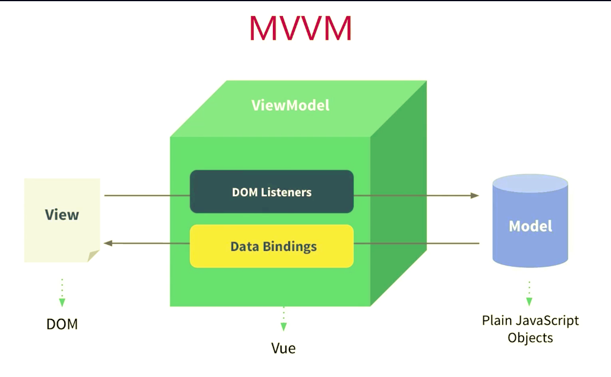

## MVC和MVVM
MVC = Model + View + Controller

- Model: 数据，是应用程序中用于处理应用程序数据逻辑的部分。通常模型对象负责在数据库中存取数据。
- View: 视图，是应用程序中处理数据显示的部分。通常视图是依据模型数据创建的。
- Controller: 控制器，逻辑处理，是应用程序中处理用户交互的部分。通常控制器负责从视图读取数据，控制用户输入，并向模型发送数据。


MVVM(Model-View-ViewModel): 本质上就是MVC 的改进版。MVVM 就是将其中的`View` 的状态和行为抽象化，让我们将视图 `UI` 和业务逻辑分开。

减轻MVC中Controller的负担：Model层依然是服务端返回的数据模型。而ViewModel充当了一个UI适配器的角色，也就是说View中每个UI元素都应该在ViewModel找到与之对应的属性。除此之外，从Controller抽离出来的与UI有关的逻辑都放在了ViewModel中，这样就减轻了Controller的负担。



MVVM框架的三大要素
1. 响应式：vue如何间听到data的每个属性变化？
2. 模版引擎：vue的模版如何被解析，指令如何处理？
3. 渲染：vue的模版如何被渲染成html？以及渲染过程

优点

1. 低耦合。视图（View）可以独立于Model变化和修改，一个ViewModel可以绑定到不同的"View"上，当View变化的时候Model可以不变，当Model变化的时候View也可以不变。
2. 可重用性。你可以把一些视图逻辑放在一个ViewModel里面，让很多view重用这段视图逻辑。
3. 独立开发。开发人员可以专注于业务逻辑和数据的开发（ViewModel），设计人员可以专注于页面设计。
4. 可测试。界面素来是比较难于测试的，测试可以针对ViewModel来写。

### [SPA 路由](https://juejin.im/post/6895882310458343431)

### [Better Scroll](https://juejin.im/post/6876943860988772360)

### git
#### [git-rebase](https://www.jianshu.com/p/6960811ac89c)
- [git rebase vs git merge详解](https://www.cnblogs.com/kidsitcn/p/5339382.html)
- [操作](https://juejin.cn/post/6933956481423245326)
- [操作](https://juejin.cn/post/6844904132415848456)
git merge 操作合并分支会让两个分支的每一次提交都按照提交时间（并不是push时间）排序，并且会将两个分支的最新一次commit点进行合并成一个新的commit，最终的分支树呈现非整条线性直线的形式

git rebase操作实际上是将当前执行rebase分支的所有基于原分支提交点之后的commit打散成一个一个的patch，并重新生成一个新的commit hash值，再次基于原分支目前最新的commit点上进行提交，并不根据两个分支上实际的每次提交的时间点排序，rebase完成后，切到基分支进行合并另一个分支时也不会生成一个新的commit点，可以保持整个分支树的完美线性

rebase的最大好处并不是消除merge，而是避免merge的交织。

简要来说，就是在merge进被合分支（如master）之前，最好将自己的分支给rebase到最新的被合分支（如master）上，然后用pull request创建merge请求。

我们要怎么选择用 merge 还是 rebase ？

- 下游分支更新上游分支内容的时候使用 rebase
- 上游分支合并下游分支内容的时候使用 merge
- 更新当前分支的内容时一定要使用 --rebase 参数
- 使用`>git rebase -i HEAD~3`合并3次commit内容
例如：上游分支 master，基于 master 分支拉出来一个开发分支 dev，在 dev 上开发了一段时间后要把 master 分支提交的新内容更新到 dev 分支，此时切换到 dev 分支，使用 git rebase master。

等 dev 分支开发完成了之后，要合并到上游分支 master 上的时候，切换到 master 分支，使用 git merge dev。

直接的分支合并主分支最新代码使用git rebase
```
git pull origin dev --rebase // 拉取最新代码，可以避免git pull(默认是merge)多一天拉去自己代码的日志
git rebase master

```

#### [Git Reset 三种模式](https://www.jianshu.com/p/c2ec5f06cf1a)
Git有三个区域：

- Working Tree 当前的工作区域
- Index/Stage 暂存区域，和git stash命令暂存的地方不一样。使用git add xx，就可以将xx添加近Stage里面
- Repository 提交的历史，即使用git commit提交后的结果

1. `get reset --hard`: Stage区和工作目录里的内容会被完全重置为和HEAD的新位置相同的内容。换句话说，就是没有`commit`的修改会被全部擦掉。
2. `git reset --soft`: 保留工作目录，并把重置 `HEAD` 所带来的新的差异放进暂存区
3. `reset 不加参数(mixed)`：保留工作目录，并清空暂存区

1. git revert 后会多出一条commit，这里可进行回撤操作
2. git reset 直接把之前 commit 删掉，非 git reset --hard 的操作是不会删掉修改代码，如果远程已经有之前代码，需要强推 git push -f

### [ESLint 和 Prettier](https://zhuanlan.zhihu.com/p/80574300)
ESLint 主要解决了两类问题, 

1. 代码质量问题：使用方式有可能有问题(problematic patterns)
2. 代码风格问题：风格不符合一定规则 (doesn’t adhere to certain style guidelines)

但其实 ESLint 主要解决的是代码质量问题。另外一类代码风格问题其实 `Airbnb JavaScript Style Guide` 并没有完完全全做完。
`Prettier` 接管了两个问题其中的代码格式的问题，而使用 `Prettier + ESLint` 就完完全全解决了两个问题。

3. husky: 一个让配置 `git hooks`(为了防止一些不规范的代码`commit` 并`push`到远端，可以在git命令执行前用一些钩子来检测并阻止。)变得更简单的工具；
原理：husky会根据 package.json里的配置，在.git/hooks目录生成所有的 hook 脚本（如果你已经自定义了一个hook脚本，husky不会覆盖它）

`.huskyrc`

````config
{
  "hooks": {
    "pre-commit": "lint-staged"
  }
}
````

4. lint-staged: lint-staged 针对暂存的 git 文件运行 linters，不要让不符合规则的代码溜进代码库。lint-staged总是将 所有暂存文件的列表传递给任务，忽略任何文件都应该在任务本身中配置，
比如：`.prettierignore` / `.eslintignore` 。lint-stage 总是配合 husky一起使用。

`.lintstagedrc`
```cofgig
{
  "src/**/*.js": [
    "eslint --fix",
    "prettier --write",
    "git add"
  ]
}
```

### [彻底理解服务端渲染 - SSR原理](https://github.com/yacan8/blog/issues/30)

### Axios
- [值得借鉴的地方](https://juejin.im/post/6885471967714115597)
- [封装 axios 取消重复请求](https://mp.weixin.qq.com/s/b5W7Xq4UzTkAB1B8w80NXA)
- [封装 axios 拦截器实现用户无感刷新](https://juejin.cn/post/6844903993274007565)

#### 取消请求有两种方式
1. 统一批量取消， 通过`axios.CancelToken.source`生成取消令牌`token`和取消方法`cancel`
```javascript
const CancelToken = axios.CancelToken;
const source = CancelToken.source();

axios.get('/user/12345', {
  cancelToken: source.token
}).catch(function(thrown) {
  if (axios.isCancel(thrown)) {
    console.log('Request canceled', thrown.message);
  } else {
    // 处理错误
  }
});

axios.post('/user/12345', {
    name: 'new name'
  }, {
  cancelToken: source.token
})

// 取消请求 (消息参数是可选的)
source.cancel('Operation canceled by the user.');
```
2. 单个取消，通过传递一个 `executor` 函数到 `CancelToken` 的构造函数来创建 `cancel token`

```javascript
const CancelToken = axios.CancelToken;
let cancel;
axios.get('/user/12345', {

  cancelToken: new CancelToken(function executor(c) {
    // executor 函数接收一个 cancel 函数作为参数
    cancel = c;
  })
});
// 取消请求
cancel();
```
实现
 ::: details 点击查看代码
```javascript
import axios from 'axios'
import { Message } from '@com/onet-ui'
import { API_BASE_URL } from '_com/constant'

// 存储每个请求的标识和取消的函数
const pendingAjax = new Map()
// 生成重复标识的方式
const duplicatedKeyFn = (config) => `${config.method}-${config.url}`
/**
 * 将请求添加到pendingAjax
 * @param {Object} config
 */
const addPendingAjax = (config) => {
  // 是否需要取消重复的请求
  if (!config.cancelDuplicated) return

  const duplicatedKey = duplicatedKeyFn(config)
  if (pendingAjax.has(duplicatedKey)) return
  config.cancelToken = config.cancelToken || new axios.CancelToken((cancel) => {
    // 如果pendingAjax中不存在当前请求，添加进去
    pendingAjax.set(duplicatedKey, cancel)
  })
}

/**
 * 从pendingAjax中删除请求
 * @param {Object} config
 */
const removePendingAjax = (config) => {
  // 是否需要取消重复的请求
  if (!config.cancelDuplicated) return

  const duplicatedKey = duplicatedKeyFn(config)
  // 如果pendingAjax中存在当前请求, 取消当前请求并将其删除
  if (duplicatedKey && pendingAjax.has(duplicatedKey)) {
    const cancel = pendingAjax.get(duplicatedKey)
    cancel(duplicatedKey)
    pendingAjax.delete(duplicatedKey)
  }
}

const removePending = (config) => {
  const duplicatedKey = duplicatedKeyFn(config)
  if (pendingAjax.has(duplicatedKey)) pendingAjax.delete(duplicatedKey)
}

const instance = axios.create({
  timeout: 1000 * 10,
  baseURL: API_BASE_URL,
  validateStatus: () => {
    return true
  }
})

instance.interceptors.request.use(config => {
  config.headers.testUid = (instance.$appStore && instance.$appStore.state.userInfo.userId) || (process.env.NODE_ENV === 'development' ? localStorage.getItem('testUid') : null)
  removePendingAjax(config)
  addPendingAjax(config)
  return config
}, error => {
  console.log(error)
  return Promise.reject(error)
})

instance.interceptors.response.use(
  res => {
    removePending(res.config)
    if (res.status === 401) return instance.$appStore.dispatch('toLogin') // 未登录
    if (res.status === 204) return res
    const { code, message } = res.data
    if (code !== '0' && code !== 0 && code !== 404) {
      if (res.config.dontShowMessage) return Promise.reject(res.data) // 请求配置不弹出错误消息
      Message.destroy()
      Message.error({
        content: message || res.statusText
      })
      return Promise.reject(message)
    } else return res.data
  },
  error => {
    if (axios.isCancel(error)) {
      console.log('Request canceled', error.message)
    }
    return Promise.reject(error)
  }
)

export default instance
```
 ::: 
使用
```javascript
export const getWorkList = (params) => {
  return axios.request({
    url: '/jobs',
    params,
    cancelDuplicated: true
  })
}
```
