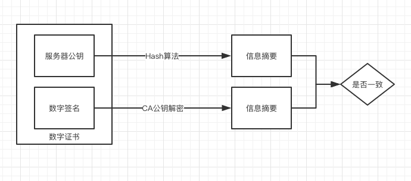
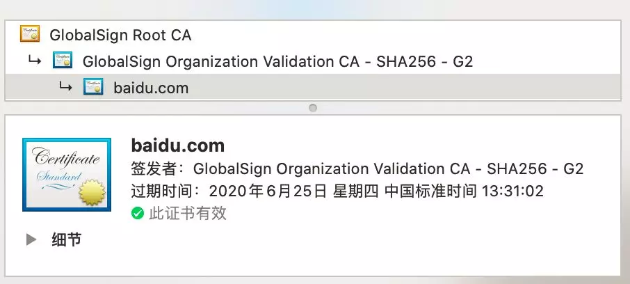
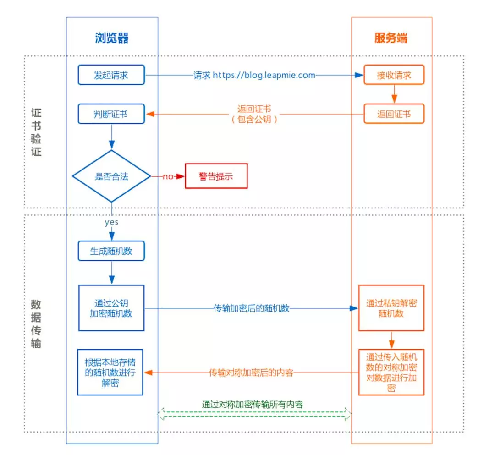
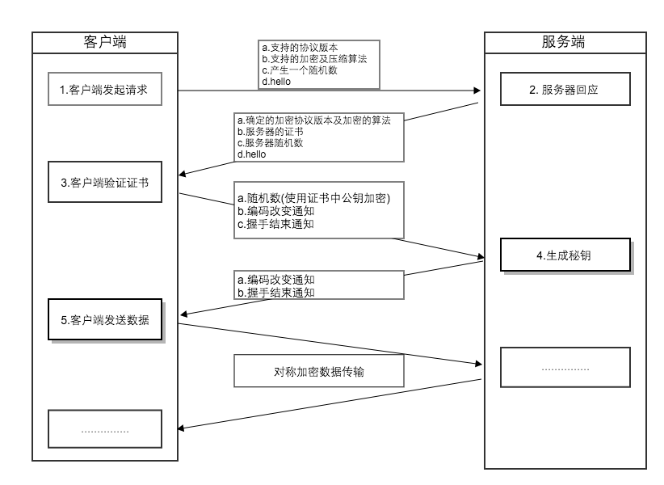
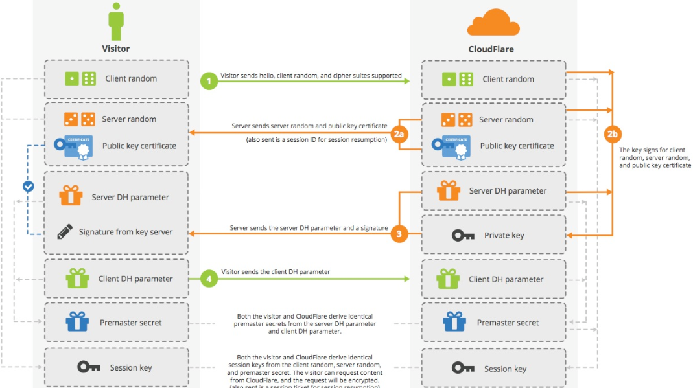
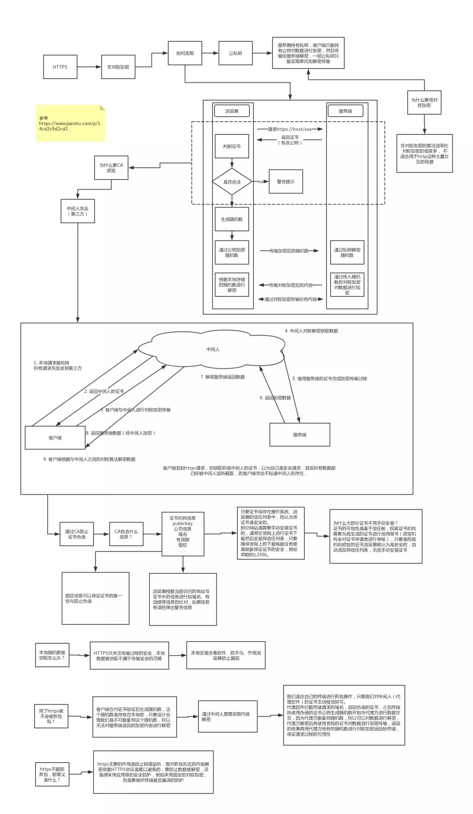

# HTTPS 协议总结

### HTTP图解笔记
HTTPS = HTTP + 加密 + 认证 + 完整性保护

HTTPS并非是应用层的一种新协议。只是HTTP通信接口部分用SSL和TLS协议代替而已。通常，HTTP直接和TCP通信。当使用SSL时，则演变成和SSL通信，再由SSL和TCP通信了。

1. 数字证书机构的公开密钥已实现植入到浏览器里。
2. 服务器把直接的公开密钥（非对称加密那个）申请提交给数字认证机构。
3. 数字证书认证机构用自己的私密密钥向服务器的公开密钥部署数字签名并颁发公钥证书给服务器。
4. 客户端发送请求，服务器返回证书，拿到后使用数字证书认证机构的公开密钥，向数字证书认证机构验证公钥上的数字签名，以确认服务器的公开密钥的真实性。
5. 使用服务器的公开密钥对报文加密后发送。

HTTPS 是以安全为目标的 HTTP 通道，简单讲是 HTTP 的安全版。

- HTTPS 协议定义
- HTTPS 流程分析
- TLS 握手优化

## HTTPS 协议定义

HTTPS 全称为超文本传输安全协议（HyperText Transfer Protocol Secure；常称为 HTTP over TLS、HTTP over SSL 或 HTTP Secure）是一种通过计算机网络进行安全通信的传输协议。HTTPS 经由 HTTP 进行通信，但利用 SSL/TLS 来加密数据包。HTTPS 开发的主要目的，是提供对网站服务器的身份认证，保护交换数据的隐私与完整性。这个协议由网景公司（Netscape）在 1994 年首次提出，随后扩展到互联网上。

可以看出，HTTPS 只是在 HTTP 的基础上，增加了 SSL/TSL 安全层，主要为了实现以下目的：

- 所有信息都是加密传播，第三方无法窃听。
- 具有校验机制，一旦被篡改，通信双方会立刻发现。
- 配备身份证书，防止身份被冒充。

### 如何保证客户端和服务器端的数据安全

#### 对称加密

对称加密很简单，就是客户端和服务器端在传输数据之前，先将数据通过一个 key 进行加密，然后双方在获取到数据的时候，同样使用这个 key 进行解密即可。

:::tip 对称加密的问题

如何让客户端和服务器端端都知道这个 key ？

:::

#### 非对称加密

非对称加密也很简单，就是在客户端和服务器端各自生成一个公钥私钥，在传递数据的时候，使用对方的公钥进行加密即可。

例如：客户端向服务器端发送数据。

- 客户端发送：数据 + 服务端端公钥加密 = 密文
- 服务器端接收数据：密文 - 服务器端私钥解密 = 数据

同理，服务器端向客户端发送数据时也是如此。

:::tip 非对称加密的缺点

与对称加密相比，非对称加密的解密速度更慢。

:::

#### 非对称加密 + 对称加密

为了解决非对称加密很慢的问题，我们可以先使用非对称加密去获取 key，然后将这个 key 作为对称加密的 key 进行加密传输。

:::tip 非对称加密 + 对称加密没有解决的问题

没有校验服务器的真实性，如果在非对称加密阶段，我们和一个中间人服务器进行了秘钥协商获取了 key，那么之后的所有加密数据都可以被中间人很轻松的破解。

:::

#### 非对称加密 + 对称加密 + CA 证书

为了保证客户端发送的数据一定是发送给真实的服务器，我们可以将我们的服务器在权威结构进行认证，认证成功之后，认证机构就会给我们发送 CA 证书，然后在服务器的每一次响应都带上该证书，让客户端能够识别服务器是否合法。

CA 证书都是权威机构认证的，现在浏览器或操作系统都内置了直接识别证书的有效性的功能，客户端在接收服务器端的数据时，会先验证证书的合法性，如果验证通过，就代表请求到的服务器是真实可靠的。

:::tip CA 证书可能存在的问题

- 如果 CA 证书在传递时被中间人替换成一个中间人证书，是否能够通过验证？
- 如果 CA 证书在传递时，被修改了一部分内容，是否能够通过验证？

答案都是不能的，我们继续往下看。

:::

#### 证书合法性验证

服务器端发送公钥的时候，如果中间人截取了的公钥，并把自己的公钥发给了客户端，客户端发的消息就用中间人的公钥加了密，中间人不就可以解密看到消息了吗？

是的，这个时候就需要发挥证书的用处了，想要部署 HTTPS 服务，必须在 CA 认证机构中进行认证获得认证证书。客户端可以根据证书判断出具体请求到的服务器是否是中间人。

问题又来了，如果中间人并不直接替换证书，而是修改了其中的一部分内容，应该怎么应对呢？

我们可以使用 Hash(**摘要算法**) 算法，对证书进行签名，在客户端采用同样的 Hash 算法进行验证，一旦发现不一致，就取消该请求。具体操作如下：

CA认证机构生成数字证书：

- 将服务器公钥进行 Hash 加密，生成信息摘要。
- 将信息摘要通过 CA 私钥加密，生成数字签名。
- 将服务器公钥，数字签名组合成数字证书。
- 将数字证书发给客户端。

客户端验证数字证书：

- 客户端首先从数字证书中获取到服务器公钥，数字签名。
- 将服务器公钥进行 Hash 加密，生成信息摘要。
- 将数字签名，通过 CA 公钥进行解密，生成信息摘要。
- 比对两次生成的信息摘要是否一致，若一致，则证书验证成功。

通过证书签名，我们可以保证客户端获取到的服务器端公钥是真实可靠的，客户端在给服务端传递数据时，有且仅有真实的服务器端才能解密数据，如果有中间人对证书进行修改，最后生成的信息摘要就一定不一致，客户端就知道请求被攻击了。

## 浏览器是如何确保 CA 证书的合法性？

### 证书包含什么信息？

- 颁发机构信息
- 公钥
- 公司信息
- 域名
- 有效期
- 指纹
- ...

### 证书的合法性依据是什么？
首先，权威机构是要有认证的，不是随便一个机构都有资格颁发证书，不然也不叫做权威机构。

另外，证书的可信性基于信任制，权威机构需要对其颁发的证书进行信用背书，只要是权威机构生成的证书，我们就认为是合法的。

所以权威机构会对申请者的信息进行审核，不同等级的权威机构对审核的要求也不一样，于是证书也分为免费的、便宜的和贵的。

### 浏览器如何验证证书的合法性？

浏览器发起 HTTPS 请求时，服务器会返回网站的 SSL 证书。

浏览器需要对证书做以下验证：

- **验证域名、有效期等信息是否正确**。证书上都有包含这些信息，比较容易完成验证。

- **判断证书来源是否合法**。每份签发证书都可以根据验证链查找到对应的根证书，操作系统、浏览器会在本地存储权威机构的根证书，利用本地根证书可以对对应机构签发证书完成来源验证。

- 判断证书是否被篡改。需要与 CA 服务器进行校验。

- 判断证书是否已吊销。通过 CRL（Certificate Revocation List 证书注销列表）和 OCSP（Online Certificate Status Protocol 在线证书状态协议）实现。
其中 OCSP 可用于第 3 步中以减少与 CA 服务器的交互，提高验证效率。

以上任意一步都满足的情况下浏览器才认为证书是合法的。

## HTTPS 流程分析

下图是一次 HTTPS 请求的流程图

- 1、客户端发起请求，同时将客户端支持的**TLS 协议版本号**、**加密规则**、**一个随机数（Client random）**，发送给服务器。
- 2、服务器上有安装好的认证证书（将服务器的公钥，通过权威机构 CA 认证后，生成的证书）。
- 3、服务端确认双方使用的加密方法，使用 hash 算法签名证书后，将数字证书、一个服务器端生成的**随机数（Server random）**，发送给客户端。
- 4、客户端验证证书。
  - 使用 hash 检查证书是否被篡改。
  - 验证失败，拒绝请求。
  - 验证成功，生成**新随机数（Premaster secret）**。
- 5、使用证书公钥将随机值加密后传给服务端。
- 6、服务端用私钥解密消息内容，获得**随机数（Premaster secret）**。
- 7、服务端根据约定的加密方法，使用前面的三个随机数（`Client random`，`Server random`，`Premaster secret`）生成**对话密钥（session key）**，并使用对话密钥（session key加密传输内容，发送给客户端。
- 8、客户端使用同样的算法生成**对话密钥（session key）**，并使用对话密钥（session key）对获取到的内容进行解密。
- 9、秘钥协商结束，客户端和服务器端通过**对话密钥（session key）** 作为对称加密 `key`，相互传输数据。

可以看到，HTTPS 在请求时，主要分为两个部分：

- 秘钥协商，使用非对称加密，生成秘钥。
- 对称加密，使用秘钥对每次请求进行加密。

:::tip 为什么需要 3 个随机数，而不是只用 `Premaster secret` 生成会话密钥？

因为每个主机并不是都能产生完全的随机数的。有很多产生的只是弱随机数而已，比如范围小，可能被猜测。如果该随机数被破解，那么之前一系列握手都是没什么用的。因此用三个随机数一起生成密钥能使得伪随机数更接近随机。
:::

## TLS 握手优化

- 精简证书大小
- 会话复用

### False Start

False Start 有抢跑的意思，意味着不按规则行事。TLS False Start 是指客户端在发送 Change Cipher Spec Finished 同时发送应用数据（如 HTTP 请求），服务端在 TLS 握手完成时直接返回应用数据（如 HTTP 响应）。这样，应用数据的发送实际上并未等到握手全部完成，故谓之抢跑。

可以看到，启用 False Start 之后，TLS 阶段只需要一次 RTT 就可以开始传输应用数据。False Start 相当于客户端提前发送加密后的应用数据，不需要修改 TLS 协议，目前大部分浏览器默认都会启用。

### 精简证书大小

如果需要进一步减小证书大小，可以选择 ECC（Elliptic Curve Cryptography，椭圆曲线密码学）证书。256 位的 ECC Key 等同于 3072 位的 RSA Key，在确保安全性的同时，体积大幅减小。下面是一个对比：

| 对称加密 Key 长度 | RSA Key 长度 | ECC Key 长度 |
| ----------------- | ------------ | ------------ |
| 80                | 1024         | 160          |
| 112               | 2048         | 224          |
| 128               | 3072         | 256          |
| 192               | 7680         | 384          |
| 256               | 15360        | 521          |

### 会话复用

如果建立 TSL 连接之后，如果出于某种原因，对话中断，就需要重新建立连接。这时有两种方法可以快速恢复原来的 session：一种叫做 session ID，另一种叫做 session ticket。

#### Session Identifier

Session Identifier（会话标识符），是 TLS 握手中生成的 Session ID。服务端可以将 Session ID 协商后的信息存起来，浏览器也可以保存 Session ID，并在后续的 ClientHello 握手中带上它，如果服务端能找到与之匹配的信息，就可以完成一次快速握手。

#### Session Ticket

Session Identifier 机制有一些弊端，例如：

- 负载均衡中，多机之间往往没有同步 Session 信息，如果客户端两次请求没有落在同一台机器上就无法找到匹配的信息。
- 服务端存储 Session ID 对应的信息不好控制失效时间，太短起不到作用，太长又占用服务端大量资源。

而 Session Ticket（会话记录单）可以解决这些问题，Session Ticket 是用只有服务端知道的安全密钥加密过的会话信息，最终保存在浏览器端。浏览器如果在 ClientHello 时带上了 Session Ticket，只要服务器能成功解密就可以完成快速握手。

[优化 HTTPS 的手段](https://mp.weixin.qq.com/s?__biz=MzUxODAzNDg4NQ==&mid=2247488081&idx=1&sn=a285752b4b1516830ba1f549323d3580&chksm=f98e56fbcef9dfedcfe006a920722a52bd865f0c1211ba8449cc55b32a7de2df1ddd88a25fb7&scene=132#wechat_redirect)
## 相关链接

- [一个故事讲完 HTTPS](https://mp.weixin.qq.com/s/StqqafHePlBkWAPQZg3NrA)
- [TLS 握手优化详解](https://imququ.com/post/optimize-tls-handshake.html)

