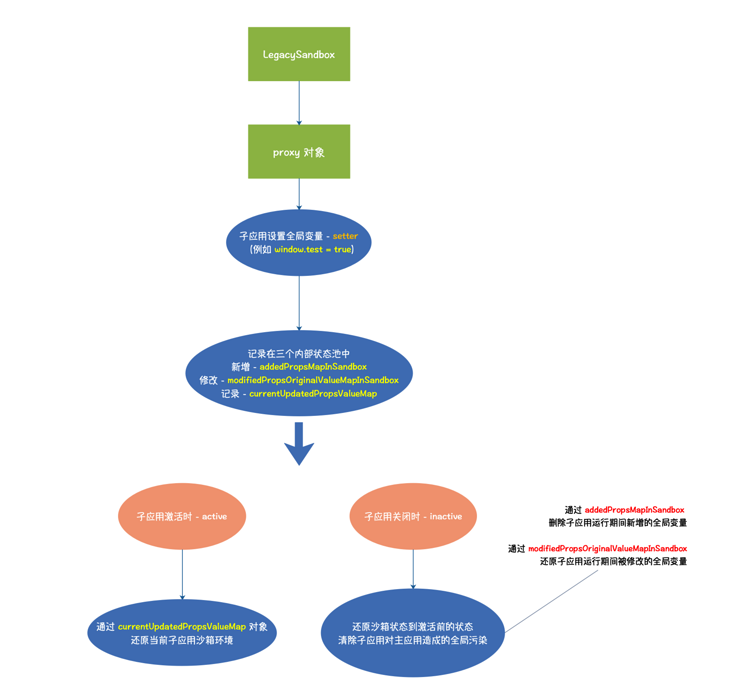
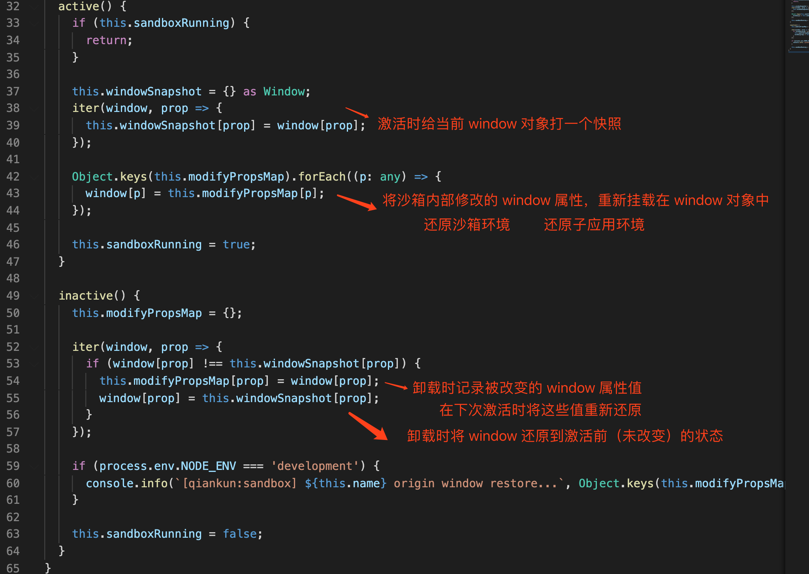
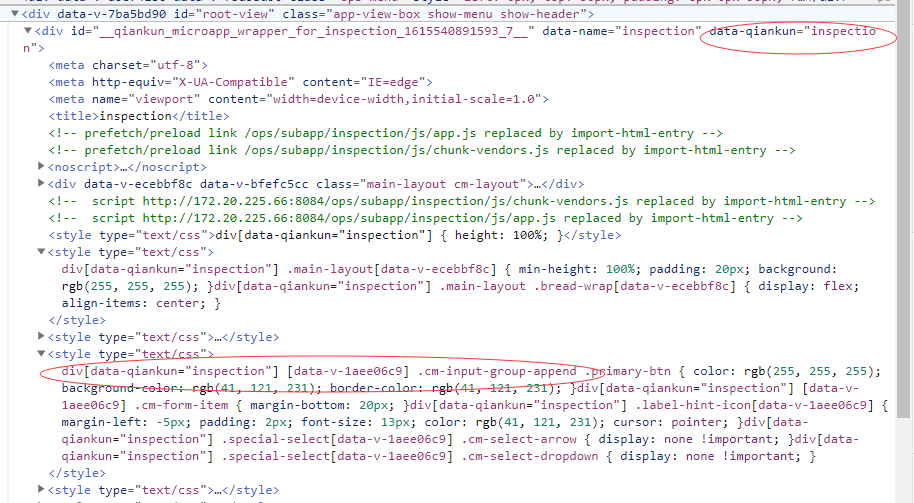

#### [微前端框架qiankun之原理与实战](http://okgoes.cn/blog/detail?blog_id=26419)
#### [微前端框架 之 single-spa 从入门到精通](https://juejin.cn/post/6862661545592111111)
#### [微前端框架 之 qiankun 从入门到源码分析](https://juejin.cn/post/6885211340999229454)

#### [微前端从入门到熟悉](https://juejin.im/post/6872132988780412935)
#### [qiankun微前端方案实践及总结](https://juejin.im/post/6844904185910018062)
#### [qiankun微前端实践总结（二）](https://juejin.im/post/6856569463950639117)
#### [详细解析微前端、微前端框架qiankun以及源码](https://segmentfault.com/a/1190000022275991)

#### [一篇英语介绍文章](https://micro-frontends.org/)

#### [中台”到底是什么？](https://zhuanlan.zhihu.com/p/75223466)

目前主流的微前端方案包括以下几个：

- iframe：是传统的微前端解决方案，基于iframe标签实现，技术难度低，隔离性和兼容性很好，但是性能和使用体验比较差，多用于集成第三方系统；
- 基座模式：主要基于路由分发，即由一个基座应用来监听路由，并按照路由规则来加载不同的应用，以实现应用间解耦；`qiankun`和`single-spa`就是基于这种模式
- 组合式集成：把组件单独打包和发布，然后在构建或运行时组合；即单独构建组件，按需加载，类似npm包的形式
- EMP：基于Webpack5 Module Federation，一种去中心化的微前端实现方案，它不仅能很好地隔离应用，还可以轻松实现应用间的资源共享和通信；
- Web Components：是官方提出的组件化方案，它通过对组件进行更高程度的封装，来实现微前端，但是目前兼容性不够好，尚未普及。

总的来说，iframe主要用于简单并且性能要求不高的第三方系统；组合式集成目前主要用于前端组件化，而不是微前端；基座模式、EMP和Web Components是目前主流的微前端方案。
### 沙箱实现原理

qiankun 的JS沙箱隔离主要分为三种：

- legacySandBox
- proxySandBox
- snapshotSandBox。

其中 legacySandBox、proxySandBox 是基于 `Proxy API` 来实现的，在不支持 `Proxy API` 的低版本浏览器中，会降级为 snapshotSandBox。在现版本中，legacySandBox 仅用于 singular 单实例模式，而多实例模式会使用 proxySandBox。

#### legacySandBox

legacySandBox 的本质上还是操作 window 对象，但是他会存在三个状态池，分别用于子应用卸载时还原主应用的状态和子应用加载时还原子应用的状态：

- addedPropsMapInSandbox： 存储在子应用运行时期间新增的全局变量，用于卸载子应用时还原主应用全局变量；
- modifiedPropsOriginalValueMapInSandbox：存储在子应用运行期间更新的全局变量，用于卸载子应用时还原主应用全局变量；
- currentUpdatedPropsValueMap：存储子应用全局变量的更新，用于运行时切换后还原子应用的状态；

总结起来，legacySandBox 还是**会操作 `window` 对象**，但是他通过激活沙箱时还原子应用的状态，卸载时还原主应用的状态来实现沙箱隔离的。



```typescript
const rawWindow = window;
const fakeWindow = Object.create(null) as Window;
// 创建对fakeWindow的劫持，fakeWindow就是我们传递给自执行函数的window对象
const proxy = new Proxy(fakeWindow, {
  set(_: Window, p: PropertyKey, value: any): boolean {
    // 运行时的判断
    if (sandboxRunning) {
      // 如果window对象上没有这个属性，那么就在状态池中记录状态的新增；
      if (!rawWindow.hasOwnProperty(p)) {
        addedPropsMapInSandbox.set(p, value);
 
        // 如果当前 window 对象存在该属性，并且状态池中没有该对象，那么证明改属性是运行时期间更新的值，记录在状态池中用于最后window对象的还原
      } else if (!modifiedPropsOriginalValueMapInSandbox.has(p)) {
        const originalValue = (rawWindow as any)[p];
        modifiedPropsOriginalValueMapInSandbox.set(p, originalValue);
      }
 
      // 记录全局对象修改值，用于后面子应用激活时还原子应用
      currentUpdatedPropsValueMap.set(p, value);
      (rawWindow as any)[p] = value;
 
      return true;
    }
 
    return true;
  },
 
  get(_: Window, p: PropertyKey): any {
    // iframe的window上下文
    if (p === "top" || p === "window" || p === "self") {
      return proxy;
    }
 
    const value = (rawWindow as any)[p];
    return getTargetValue(rawWindow, value);
  },
});
```
子应用沙箱的激活 / 卸载：

```typescript
 // 子应用沙箱激活
  active() {
    // 通过状态池，还原子应用上一次写在前的状态
    if (!this.sandboxRunning) {
      this.currentUpdatedPropsValueMap.forEach((v, p) => setWindowProp(p, v));
    }
 
    this.sandboxRunning = true;
  }
 
  // 子应用沙箱卸载
  inactive() {
    // 还原运行时期间修改的全局变量
    this.modifiedPropsOriginalValueMapInSandbox.forEach((v, p) => setWindowProp(p, v));
    // 删除运行时期间新增的全局变量
    this.addedPropsMapInSandbox.forEach((_, p) => setWindowProp(p, undefined, true));
 
    this.sandboxRunning = false;
  }
```

```typescript
// 子应用脚本文件的执行过程：
eval(
  // 这里将 proxy 作为 window 参数传入
  // 子应用的全局对象就是该子应用沙箱的 proxy 对象
  (function(window) {
    /* 子应用脚本文件内容 */
  })(proxy)
);
```

#### proxySandBox

proxySandBox 用于多实例场景。和 legacySandBox 最直接的不同点就是，为了支持多实例的场景，**proxySandBox 不会直接操作 `window` 对象**。并且为了避免子应用操作或者修改主应用上诸如 window、document、location 这些重要的属性，会遍历这些属性到子应用 window 副本（`fakeWindow`）上。

创建子应用 `window` 的副本：

```typescript

function createFakeWindow(global: Window) {
  // 在has和check的场景下，map有着更好的性能
  const propertiesWithGetter = new Map<PropertyKey, boolean>();
  const fakeWindow = {} as FakeWindow;
 
  // 从window对象拷贝不可配置的属性
  // 举个例子：window、document、location这些都是挂在Window上的属性，他们都是不可配置的
  // 拷贝出来到fakeWindow上，就间接避免了子应用直接操作全局对象上的这些属性方法
  Object.getOwnPropertyNames(global)
    .filter((p) => {
      const descriptor = Object.getOwnPropertyDescriptor(global, p);
      // 如果属性不存在或者属性描述符的configurable的话
      return !descriptor?.configurable;
    })
    .forEach((p) => {
      const descriptor = Object.getOwnPropertyDescriptor(global, p);
      if (descriptor) {
        // 判断当前的属性是否有getter
        const hasGetter = Object.prototype.hasOwnProperty.call(
          descriptor,
          "get"
        );
 
        // 为有getter的属性设置查询索引
        if (hasGetter) propertiesWithGetter.set(p, true);
 
        // freeze the descriptor to avoid being modified by zone.js
        // zone.js will overwrite Object.defineProperty
        // const rawObjectDefineProperty = Object.defineProperty;
        // 拷贝属性到fakeWindow对象上
        rawObjectDefineProperty(fakeWindow, p, Object.freeze(descriptor));
      }
    });
 
  return {
    fakeWindow,
    propertiesWithGetter,
  };
}
```

proxySandBox 的 getter/setter：

```typescript
const rawWindow = window;
// window副本和上面说的有getter的属性的索引
const { fakeWindow, propertiesWithGetter } = createFakeWindow(rawWindow);

const descriptorTargetMap = new Map<PropertyKey, SymbolTarget>();
const hasOwnProperty = (key: PropertyKey) =>
  fakeWindow.hasOwnProperty(key) || rawWindow.hasOwnProperty(key);

const proxy = new Proxy(fakeWindow, {
  set(target: FakeWindow, p: PropertyKey, value: any): boolean {
    if (sandboxRunning) {
      // 在fakeWindow上设置属性值
      target[p] = value;
      // 记录属性值的变更
      updatedValueSet.add(p);

      // SystemJS属性拦截器
      interceptSystemJsProps(p, value);

      return true;
    }

    // 在 strict-mode 下，Proxy 的 handler.set 返回 false 会抛出 TypeError，在沙箱卸载的情况下应该忽略错误
    return true;
  },

  get(target: FakeWindow, p: PropertyKey): any {
    if (p === Symbol.unscopables) return unscopables;

    // 避免window.window 或 window.self 或window.top 穿透sandbox
    if (p === "top" || p === "window" || p === "self") {
      return proxy;
    }

    if (p === "hasOwnProperty") {
      return hasOwnProperty;
    }

    // 批处理场景下会有场景使用，这里就不多赘述了
    const proxyPropertyGetter = getProxyPropertyGetter(proxy, p);
    if (proxyPropertyGetter) {
      return getProxyPropertyValue(proxyPropertyGetter);
    }

    // 取值
    const value = propertiesWithGetter.has(p)
      ? (rawWindow as any)[p]
      : (target as any)[p] || (rawWindow as any)[p];
    return getTargetValue(rawWindow, value);
  },

});
```
因为 proxySandBox 不直接操作 window，所以在激活和卸载的时候也不需要操作状态池更新 / 还原主子应用的状态了。相比较看来，proxySandBox 是现阶段 qiankun 中最完备的沙箱模式，完全隔离了主子应用的状态，不会像 legacySandBox 模式下在运行时期间仍然会污染 window。


#### snapshotSandBox

在不支持 Proxy 的场景下会降级为 snapshotSandBox，snapshotSandBox 的原理就是在子应用激活 / 卸载时分别去通过快照的形式记录/还原状态来实现沙箱的。




#### 如何在一个子应用中复用另一个子应用的页面

如果是使用umi脚手架，`plugin-qiankun` 提供了一个组件 `MicroAppWithMemoHistory` ，该组件可以在运行时，修改子应用为 `memory` 路由。

借助`loadMicroApp`单独加载一个子应用的页面，在主应用将这个函数传给子应用，子应用在乾坤的声明周期函数中接受并挂载到`vue.prototype`
子应用的比如弹窗中调用这个api，加载另一个的子应用页面，另一个子应用要如果是vue, 要`vue-router` 使用不依赖浏览器的 url 的`abstract` 模式(VueRouter内部使用数组进行模拟了路由管理)，并`push`相应的路由path，
另外还要做其他处理，如mixin中的激活菜单处理等。`react-router` 使用 `memory history` 模式
```javascript
export default {
    // ...
    mounted () {
      this.microApp = this.loadMicroApp(
        {
          name: 'asset',
          entry: 'http://172.20.225.66:8083/ops/asset',
          container: '#asset-container',
          props: {
            // store: this.$appStore,
            ifAbstract: true,
            path: '/asset'
          }
        }, {
          singular: false // 重要
        })
      console.log(this.microApp)
    },
    beforeDestroy () {
      this.microApp && this.microApp.unmount()
    },
    // ...
}
```

#### 样式隔离

qiankun 的样式隔离有两种方式，一种是严格样式隔离，通过 `shadow dom` 来实现，另一种是实验性的样式隔离，就是 `scoped css`，两种方式不可共存


##### 严格样式隔离


在 qiankun 中的严格样式隔离，就是在 `createElement` 方法中做的，通过 `shadow dom` 来实现， `shadow dom` 是浏览器原生提供的一种能力，
在过去的很长一段时间里，浏览器用它来封装一些元素的内部结构。以一个有着默认播放控制按钮的 `<video>` 元素为例，实际上，在它的 `Shadow DOM` 中，包含来一系列的按钮和其他控制器。
`Shadow DOM` 标准允许你为你自己的元素（`custom element`）维护一组 `Shadow DOM`。


```typescript
/**
 * 做了两件事
 *  1、将 appContent 由字符串模版转换成 html dom 元素
 *  2、如果需要开启严格样式隔离，则将 appContent 的子元素即微应用的入口模版用 shadow dom 包裹起来，达到样式严格隔离的目的
 * @param appContent = `<div id="__qiankun_microapp_wrapper_for_${appInstanceId}__" data-name="${appName}">${template}</div>`
 * @param strictStyleIsolation 是否开启严格样式隔离
 */
function createElement(appContent: string, strictStyleIsolation: boolean): HTMLElement {
  // 创建一个 div 元素
  const containerElement = document.createElement('div');
  // 将字符串模版 appContent 设置为 div 的innerHTML
  containerElement.innerHTML = appContent;
  // appContent always wrapped with a singular div，appContent 由模版字符串变成了 DOM 元素
  const appElement = containerElement.firstChild as HTMLElement;
  // 如果开启了严格的样式隔离，则将 appContent 的子元素（微应用的入口模版）用 shadow dom 包裹，以达到微应用之间样式严格隔离的目的
  if (strictStyleIsolation) {
    if (!supportShadowDOM) {
      console.warn(
        '[qiankun]: As current browser not support shadow dom, your strictStyleIsolation configuration will be ignored!',
      );
    } else {
      const { innerHTML } = appElement;
      appElement.innerHTML = '';
      let shadow: ShadowRoot;

      if (appElement.attachShadow) {
        shadow = appElement.attachShadow({ mode: 'open' });
      } else {
        // createShadowRoot was proposed in initial spec, which has then been deprecated
        shadow = (appElement as any).createShadowRoot();
      }
      shadow.innerHTML = innerHTML;
    }
  }

  return appElement;
}

```
##### 实验性样式隔离
设置`experimentalStyleIsolation: true`
实验性样式的隔离方式其实就是 `scoped css`，qiankun 会通过动态改写一个特殊的选择器约束来限制 `css` 的生效范围，应用的样式会按照如下模式改写：



```css
/** 假设应用名是 react16 **/
.app-main {
  font-size: 14px;
}
div[data-qiankun-react16] .app-main {
  font-size: 14px;
}
```
process
````typescript
/**
 * 做了两件事：
 *  实例化 processor = new ScopedCss()，真正处理样式选择器的地方
 *  生成样式前缀 `div[data-qiankun]=${appName}`
 * @param appWrapper = <div id="__qiankun_microapp_wrapper_for_${appInstanceId}__" data-name="${appName}">${template}</div>
 * @param stylesheetElement = <style>xx</style>
 * @param appName 微应用名称
 */
export const process = (
  appWrapper: HTMLElement,
  stylesheetElement: HTMLStyleElement | HTMLLinkElement,
  appName: string,
) => {
  // lazy singleton pattern，单例模式
  if (!processor) {
    processor = new ScopedCSS();
  }

  // 目前支持 style 标签
  if (stylesheetElement.tagName === 'LINK') {
    console.warn('Feature: sandbox.experimentalStyleIsolation is not support for link element yet.');
  }

  // 微应用模版
  const mountDOM = appWrapper;
  if (!mountDOM) {
    return;
  }

  // div
  const tag = (mountDOM.tagName || '').toLowerCase();

  if (tag && stylesheetElement.tagName === 'STYLE') {
    // 生成前缀 `div[data-qiankun]=${appName}`
    const prefix = `${tag}[${QiankunCSSRewriteAttr}="${appName}"]`;
     /**
     * 实际处理样式的地方
     * 拿到样式节点中的所有样式规则，然后重写样式选择器
     *  含有根元素选择器的情况：用前缀替换掉选择器中的根元素选择器部分，
     *  普通选择器：将前缀插到第一个选择器的后面
     */
    processor.process(stylesheetElement, prefix);
  }
}


````
采用一定的编程约束：

- 尽量不要使用可能冲突全局的 class 或者直接为标签定义样式；
- 定义唯一的 class 前缀，现在的项目都是用诸如 antd 这样的组件库，这类组件库都支持自定义组件 class 前缀；
- 主应用一定要有自定义的 class 前缀；

在主应用中为每一个子应用，分配一个唯一标识的div， 子应用渲染到对应的div下， 子应用在编译时，通过postcss,统一添加 div 的 id 前辍

#### `__INJECTED_PUBLIC_PATH_BY_QIANKUN__`
`__INJECTED_PUBLIC_PATH_BY_QIANKUN__`这个变量是子应用配置的entry的域名路径，如`entry`的路径是`www.test.com/subapp/device`，他的值是`www.test.com/subapp/`，而
是`www.test.com/subapp/device/`的话，值就是`entry`，即`www.test.com/subapp/device/`。

末尾带不带`/`的影响。

- `http://wwww.baidu.com`: 这种 URI 并没有直接指定要访问哪个文件，像这种没有路径的情况，就代表访问根目录下预先设置的默认文件，一般就是 `/index.html`，`/default.html` 一类的文件，在 Java 中，我们也可以在 web.xml 中来配置这个默认文件。
- `http://www.baidu.com/folder/`: 这个 URI 以一个 `/` 结尾，表示 folder 是一个目录，我们要访问的是这个目录下的文件，但是又没有说明是这个目录下的哪个文件，此时依然是采用该目录下 index.html 或者 default.html 一类的文件。 
- `http://www.baidu.com/folder`: 即 `folder` 后面没有 `/`，此时会先将 `folder` 当作一个资源去访问(比如一个名为 folder 的 Servlet )，如果没有名为 folder 的资源，那么浏览器会自动在 `folder` 后面加上一个 / ，此时地址变为 `http://www.baidu.com/folder/` ，folder 是一个目录，然后就会去尝试访问 folder 目录下的 `index.html` 或者 default.html。  
注意这种自动调整只在浏览器中存在，如果你的项目是一个手机 App 或者你是一个 Ajax 请求，则不会有这种调整，即没写 `/` 就当做具体资源来对待，如果该资源不存在，就会报 404 ，写了`/ `就当目录来对待。
- `http://www.baidu.com/`: 第一种情况很类似，只是后面多了一个 / ，这个 / 表示我们要访问的是根目录，但是没有指定根目录下的文件，默认就是根目录下的 index.html 或者 default.html 。


这个属性可以在运行时修改webpack的publicPath，打包时这个配置是已经注入到js或者css的url中了。
但用import异步引用的时候，比如Vue的路由懒加载，是靠`__webpack_require__`实现，创建`script`标签，`document.head.appendChild(script)`到head中

```javascript
//public-path.js
if (window.__POWERED_BY_QIANKUN__) {
  // eslint-disable-next-line no-undef
  __webpack_public_path__ = window.__INJECTED_PUBLIC_PATH_BY_QIANKUN__
}
```

`__webpack_require__`

`__webpack_require__.p = the bundle public path`

```javascript

  // The require `function`
 function __webpack_require__(moduleId) {
 
 	// 检测是否存在缓存
 	if(installedModules[moduleId]) {
 		return installedModules[moduleId].exports;
 	}
 	// 不存在则生成新的模块
 	var module = installedModules[moduleId] = {
 		i: moduleId,
 		l: false,    // 是否加载
 		exports: {}
 	};
 
 	// call的方式加载模块 this转交，参数转交，对应其打包构建好的每个模块的参数结构。
 	modules[moduleId].call(module.exports, module, module.exports, __webpack_require__);
 
 	// 表示已加载
 	module.l = true;
 
 	// 返回模块的exports 
 	return module.exports;

```

以下是__webpack_require__各属性以及对应能力，会经常出现在加载模块的语法中

```

// 入口模块的ID
__webpack_require__.s = the module id of the entry point
 
//模块缓存对象 {} id:{ exports /id/loaded}
__webpack_require__.c = the module cache
 
// 所有构建生成的模块 []
__webpack_require__.m = the module functions
 
// 公共路径，为所有资源指定一个基础路径
__webpack_require__.p = the bundle public path
// 
__webpack_require__.i = the identity function used for harmony imports
 
// 异步模块加载函数，如果没有再缓存模块中 则用jsonscriptsrc 加载  
__webpack_require__.e = the chunk ensure function
 
// 设定getter 辅助函数而已
__webpack_require__.d = the exported property define getter function
 
// 辅助函数而已 Object.prototype.hasOwnProperty.call
__webpack_require__.o = Object.prototype.hasOwnProperty.call
 
// 给exports设定attr __esModule
__webpack_require__.r = define compatibility on export
 
// 用于取值，伪造namespace
__webpack_require__.t = create a fake namespace object
 
// 用于兼容性取值（esmodule 取default， 非esmodule 直接返回module)
__webpack_require__.n = compatibility get default export
 
// hash
__webpack_require__.h = the webpack hash
 
// 
__webpack_require__.w = an object containing all installed WebAssembly.Instance export objects keyed by module id
 
// 异步加载失败处理函数 辅助函数而已
__webpack_require__.oe = the uncaught error handler for the webpack runtime
 
// 表明脚本需要安全加载 CSP策略
__webpack_require__.nc = the script nonce

```

### 部署遇到的问题

1、部署在k8s中，测试环境使用Ingress配置域名路径，可直接配置PathWrite，因为在
容器中访问的地址是是不带PUBLIC_PATH的，比如http://www.onetv3.com/ops/css/styles.169c8319.css这个路径转过去是http://11.12.6.24:32149/ops/css/styles.169c8319.css。
                         应该是http://11.12.6.24:32149/css/styles.169c8319.css才对。
也可配置nginx 重新路径 比如使用alias

[k8s ingress原理及ingress-nginx部署测试](https://segmentfault.com/a/1190000019908991)

[Nginx 配置中nginx和alias的区别分析](https://blog.csdn.net/tuoni123/article/details/79712246)
```nginx
server {
    listen       80;
    server_name  localhost;

    location / {
        add_header Access-Control-Allow-Origin *;
        add_header Access-Control-Allow-Methods 'GET, POST, OPTIONS';
        add_header Cache-Control no-cache;
        root  /data/www;
        index  index.html index.htm;
        try_files $uri $uri/ /index.html;
    }

    location /subapp/ram/ {
        alias /data/www/;
    }

    #error_page  404              /404.html;

    # redirect server error pages to the static page /50x.html
    #
    error_page   500 502 503 504  /50x.html;
    location = /50x.html {
        root   /usr/share/nginx/html;
    }
}

```

#### nginx配置`proxy_pass`时url末尾带“/”与不带“/”的区别
-[nginx location中斜线的位置](https://blog.csdn.net/u010509052/article/details/105455813)

在proxy_pass中
1. proxy_pass包含路径如 `http://127.0.0.1:8080/abc` 和`http://127.0.0.1:8080`规则都有区别。

2. proxy_pass结尾加斜杠/和不加斜杠的有区别

当`location`为正则表达式匹配模式时，`proxy_pass`中的url末尾是不允许有"/"的，因此正则表达式匹配模式不在讨论范围内。
**proxy_pass配置中url末尾带/时，nginx转发时，会将原uri去除location匹配表达式后的内容拼接在proxy_pass中url之后。**
测试地址：`http://192.168.10.1/proxy/test.html`访问

- 场景一：第一种(末尾加斜杠，proxy_pass中不包含路径）：
```
location  /proxy/ {
   proxy_pass http://127.0.0.1:81/;
}
```
代理后实际访问地址：`http://127.0.0.1:81/test.html`( (proxy_pass+请求url匹配的location路径后的内容）)

- 场景二：末尾不加斜杠,proxy_pass不包含路径
```
location  /proxy/ {
   proxy_pass http://127.0.0.1:81;
}
```
代理后实际访问地址：`http://127.0.0.1:81/proxy/test.html` (proxy_pass替换请求url的ip和端口）

- 场景三：末尾加斜杠,proxy_pass包含路径
```
location  /proxy/ {
   proxy_pass http://127.0.0.1:81/abc/;
}
```
代理后实际访问地址：`http://127.0.0.1:81/abc/test.html` (proxy_pass+请求url匹配的location路径后的内容）

- 场景四：末尾不加斜杠,url包含路径
```
location  /proxy/ {
   proxy_pass http://127.0.0.1:81/abc;
}
```
代理后实际访问地址：`http://127.0.0.1:81/abctest.html` (proxy_pass+请求url匹配的location路径后的内容）

1. 如果`proxy_pass`后面有斜杠。转发url为`proxy_pass+原url匹配的location路径之后的内容`。
2. proxy_pass后面没有斜杠

  a. 只有当proxy_pass只有IP加端口，无路径时。匹配规则为proxy_pass替换原请求url的ip和端口，
  
  同时保留了location路径。例子为上述的第二种情况。
   
  b. 当proxy_pass端口后包含路径时，匹配规则同1.


### 打包成UMD, UMD
> 一个整合了commonJS和AMD规范的方法。希望能解决跨平台模块的解决方案。

运行的原理：

UMD会先判断是否支持Node.js的模块（export)是不是存在。存在则使用node.js的模块方式。

再判断是不是支持AMD(define是不是存在。存在则使用AMD方式加载模块。

```javascript
(function(root, factory){
    if (typeof exports === 'object' && typeof module === 'object') {
        module.exports = factory()
    } else if (typeof define === 'function' && define.amd) {
        define([], factory)
    } else if (typeof exports === 'object') {
        exports['subapp-ram'] = factory()
    } else root['subapp-ram'] = factory()
})(this,function () {
    //    do something
})
```
#### 总结

 - 1、使用html-webpack-externals-plugin抽取公共库及UI库资源；
    由于是要私有化部署，没有CDN，选择了再主应用中安装UI库包（主应用没有使用UI框架），使用copy-webpack-plugin插件，复制js,css文件到static文件夹,
    如下配置，但css中字体文件路径有问题，需要处理，选择在构建完后添加glup处理，如下
    `"build:one": "vue-cli-service build --mode one && gulp --gulpfile cdn-adaptor.js",`

三种思路解决
1. 通过gulp
2. 通过`copy-webpack-plugin`(5.1.2)，配置属性transform转换文件
3. 通过webpack 插件    

##### cdn-adaptor.js
 ::: details 点击查看代码
```javascript
const gulp = require('gulp');
const through2 = require('through2');

function fontPathChanger() {
  return through2.obj(function(file, enc, cb) {
    if (file.isNull()) {
      return cb(null, file);
    }
    // eslint-disable-next-line
      let str = file.contents
      .toString()
      .replace(/fonts\/ionicons/g, `/ops/static/one-ui/styles/fonts/ionicons`);
    file.contents = Buffer.from(str);

    cb(null, file);
  });
}

// 处理css font 路径
gulp.task('css', function(cb) {
  gulp
    .src('dist/static/one-ui/styles/one-ui.css')
    .pipe(fontPathChanger())
    .pipe(gulp.dest(`dist/static/one-ui/styles`));
  cb();
});

gulp.task('default', gulp.parallel('css'));
```
 ::: 
    
2. copy-webpack-plugin配置
 ::: details 点击查看代码
```js
new Copy([
        {
          from: path.resolve(__dirname, 'node_modules/@cmi/one-ui/dist'),
          to: 'static/one-ui',
          ignore: ['.*'],
          cache: true,
          transform(content, path) {
            if (path.indexOf('styles/one-ui.css') > -1) {
              let str = content
                .toString()
                .replace(/fonts\/ionicons/g, `/ops/static/one-ui/styles/fonts/ionicons`);
              return Buffer.from(str);
            }
            return content
          }
        }])
```
3. webpack 插件
```js
class CdnAdaptorPlugin {
	// 将 `apply` 定义为其原型方法，此方法以 compiler 作为参数
	apply(compiler) {
		// 指定要附加到的事件钩子函数
		compiler.hooks.emit.tapAsync('FileListPlugin', (compilation, callback) => {
			const key = 'static/one-ui/styles/one-ui.css'
			const src = compilation.assets[key]
			const str = src.source()
				.toString()
				.replace(/fonts\/ionicons/g, `/ops/static/one-ui/styles/fonts/ionicons`);
			const content = Buffer.from(str);
			console.log(content)
			compilation.assets[key] = Object.assign(compilation.assets[key],{
				source: function() {
					return content;
				},
				size: function() {
					return content.length;
				}
			})
			callback()
		});
	}
}

module.exports = CdnAdaptorPlugin
```
 ::: 

#### 主应用vue.config.js
 ::: details 点击查看代码
```javascript
const path = require('path');
const Copy = require('copy-webpack-plugin');
const HtmlWebpackExternalsPlugin = require('html-webpack-externals-plugin');

const resolve = dir => {
  return path.join(__dirname, dir);
};

console.log('env:',
  'NODE_ENV', process.env.NODE_ENV,
  'VUE_APP_API_BASE_URL', process.env.VUE_APP_API_BASE_URL,
  'CDN_DOMIAN', process.env.CDN_DOMIAN
)
module.exports = {
  publicPath: '/ops',
  lintOnSave: true,
  productionSourceMap: false,
  chainWebpack: config => {
    config.resolve.alias
      .set('@', resolve('src')) // key,value自行定义，比如.set('@@', resolve('src/components'))
      .set('_c', resolve('src/components'));
    config
      .plugin('html')
      .tap(args => {
      args[0].CDN_DOMIAN = process.env.CDN_DOMIAN; // 添加cdn index.html引入
      return args;
    });
    config.optimization.splitChunks({
      cacheGroups: {
        // 将动态引入的css合并成一个css文件
        async: {
          name: 'styles',
          test: m => m.constructor.name === 'CssModule',
          chunks: 'all',
          minChunks: 1,
          reuseExistingChunk: true,
          enforce: true
        },
        vendors: {
          name: 'chunk-vendors',
          // eslint-disable-next-line no-useless-escape
          test: /[\\\/]node_modules[\\\/]/,
          priority: -10,
          chunks: 'initial'
        },
        common: {
          name: 'chunk-common',
          minChunks: 2,
          priority: -20,
          chunks: 'initial',
          reuseExistingChunk: true
        }
      }
    });
    // 外部链接优化
    config
      .plugin('htmlExternals')
      .after('html')
      .use(HtmlWebpackExternalsPlugin, [
        {
          externals: [
            {
              module: 'vue',
              entry: {
                path: `${process.env.CDN_DOMIAN}/vue/vue.min.js`,
                type: 'js'
              },
              global: 'Vue'
            },
            {
              module: 'vue-router',
              entry: {
                path: `${process.env.CDN_DOMIAN}/vue/vue-router.min.js`,
                type: 'js'
              },
              global: 'VueRouter'
            },
            {
              module: 'vuex',
              entry: {
                path: `${process.env.CDN_DOMIAN}/vue/vuex.min.js`,
                type: 'js'
              },
              global: 'Vuex'
            }
          ],
          enabled: process.env.NODE_ENV === 'production'
        }
      ]);
  },
  configureWebpack: {
    plugins: [
      new Copy([
        {
          from: path.resolve(__dirname, 'node_modules/@cmi/one-ui/dist'),
          to: 'static/one-ui',
          ignore: ['.*']
        },
        {
          from: path.resolve(__dirname, 'node_modules/vue/dist/vue.min.js'),
          to: 'static/vue',
          ignore: ['.*']
        },
        {
          from: path.resolve(__dirname, 'node_modules/vuex/dist/vuex.min.js'),
          to: 'static/vue',
          ignore: ['.*']
        },
        {
          from: path.resolve(__dirname, 'node_modules/vue-router/dist/vue-router.min.js'),
          to: 'static/vue',
          ignore: ['.*']
        }
      ])
    ]
  },
  devServer: {
    port: 8080,
    host: '0.0.0.0',
    proxy: {
      [process.env.VUE_APP_API_BASE_URL]: {
        target: 'http://ops.test.com',
        changeOrigin: true
      },
      '/api/v1': {
        target: 'http://ops.test.com',
        changeOrigin: true
      }
    }
  }
};

```
 ::: 
 
##### 子应用vue.config.js

```
VUE_APP_ROUTER_BASE_URL=/ops/stateManage
VUE_APP_API_BASE_URL=/ops/api/ram/api/v1
FONT_BASE_URL=/ops/subapp/stateManage
PUBLIC_PATH=/ops/subapp/stateManage
CDN_DOMIAN=http://www.one.com/ops/static
```
 ::: details 点击查看代码
```javascript
const path = require('path')
const packages = require('./package.json')
const HtmlWebpackExternalsPlugin = require('html-webpack-externals-plugin')
const CompressionPlugin = require('compression-webpack-plugin')

function resolve (dir) {
  return path.join(__dirname, dir)
}
console.log('env:',
  'VUE_APP_ROUTER_BASE_URL', process.env.VUE_APP_ROUTER_BASE_URL, // 路由要和父应用激活路由对应
  'VUE_APP_API_BASE_URL', process.env.VUE_APP_API_BASE_URL,
  'FONT_BASE_URL', process.env.FONT_BASE_URL, // 本地写死路径不然本地主应用显示会有问题
  'PUBLIC_PATH', process.env.PUBLIC_PATH, // 与子应用访问路径相同
  'CDN_DOMIAN', process.env.CDN_DOMIAN
)

module.exports = {
  productionSourceMap: false,
  publicPath: process.env.PUBLIC_PATH,
  devServer: {
    contentBase: 'static',
    proxy: {
      '/api/v1': {
        target: 'http://ops.test.com',
        changeOrigin: true
      }
    },
    headers: {
      'Access-Control-Allow-Origin': '*'
    },
    host: '0.0.0.0',
    port: 8082,
    open: true
  },
  css: {
    loaderOptions: {
      scss: {
        prependData: '@import "~@/assets/css/var.scss";'
      }
    }
  },
  configureWebpack: {
    output: {
      // 把子应用打包成 umd 库格式
      library: `${packages.name}-[name]`,
      libraryTarget: 'umd',
      jsonpFunction: `webpackJsonp_${packages.name}`
    },
    plugins: [
    ]
  },
  chainWebpack: config => {
    config.resolve.alias
      .set('@', resolve('src'))
      .set('_c', resolve('src/components'))
      .set('_v', resolve('src/views'))
      .set('_com', resolve('src/common'))
      .set('static', resolve('static'))
    config.optimization.minimizer('terser').tap((args) => {
      args[0].terserOptions.compress.drop_console = true
      return args
    })
    config.module.rule('fonts')
      .use('url-loader')
      .loader('url-loader')
      .tap(options => {
        // 字体文件在嵌入乾坤时，可能需要生成完整的路径，通过环境变量PUBLIC_PATH注入
        return {
          limit: 4096,
          fallback: {
            loader: 'file-loader',
            options: {
              name: 'fonts/[name].[hash:4].[ext]',
              publicPath: process.env.FONT_BASE_URL
            }
          }
        }
      })
    // 图片内联大小限制2kb
    config.module.rule('images')
      .use('url-loader')
      .loader('url-loader')
      .tap(options => {
        options.limit = 2048
        options.fallback.options.publicPath = process.env.FONT_BASE_URL
        return options
      })
    config.optimization.splitChunks({
      cacheGroups: {
        // 将动态引入的css合并成一个css文件
        async: {
          name: 'styles',
          test: (m) => m.constructor.name === 'CssModule',
          chunks: 'all',
          minChunks: 1,
          reuseExistingChunk: true,
          enforce: true
        },
        vendors: {
          name: 'chunk-vendors',
          // eslint-disable-next-line no-useless-escape
          test: /[\\\/]node_modules[\\\/]/,
          priority: -10,
          chunks: 'initial'
        },
        common: {
          name: 'chunk-common',
          minChunks: 2,
          priority: -20,
          chunks: 'initial',
          reuseExistingChunk: true
        }
      }
    })
    // 外部链接优化
    config.plugin('htmlExternals').after('html').use(HtmlWebpackExternalsPlugin, [
      {
        externals: [
          {
            module: 'vue',
            entry: {
              path: `${process.env.CDN_DOMIAN}/vue/vue.min.js`,
              type: 'js'
            },
            global: 'Vue'
          },
          {
            module: 'vue-router',
            entry: {
              path: `${process.env.CDN_DOMIAN}/vue/vue-router.min.js`,
              type: 'js'
            },
            global: 'VueRouter'
          },
          {
            module: 'vuex',
            entry: {
              path: `${process.env.CDN_DOMIAN}/vue/vuex.min.js`,
              type: 'js'
            },
            global: 'Vuex'
          },
          {
            module: '@cmi/one-ui',
            entry: `${process.env.CDN_DOMIAN}/one-ui/one-ui.min.js`,
            global: 'one-ui'
          },
          {
            module: '@cmi/one-ui/dist/styles/one-ui.css',
            entry: {
              path: `${process.env.CDN_DOMIAN}/one-ui/styles/one-ui.css`,
              type: 'css'
            }
          }
        ],
        enabled: !!process.env.CDN_DOMIAN
      }
    ])
    // 配置gzip压缩
    if (process.env.NODE_ENV === 'production') {
      config.plugin('compression').use(CompressionPlugin, [
        {
          test: /\.js$|\.css$/, // 匹配文件名
          threshold: 10240, // 对超过10K的数据进行压缩
          deleteOriginalAssets: false // 是否删除源文件（建议false，万一ng没把gizp_static 开起就JJ了）
        }
      ])
    }
  }
}

```
 ::: 
