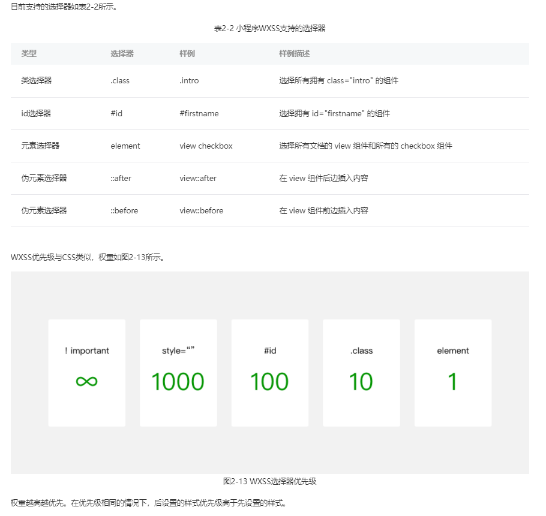
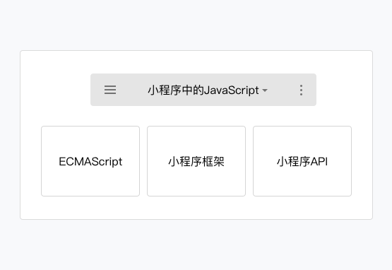
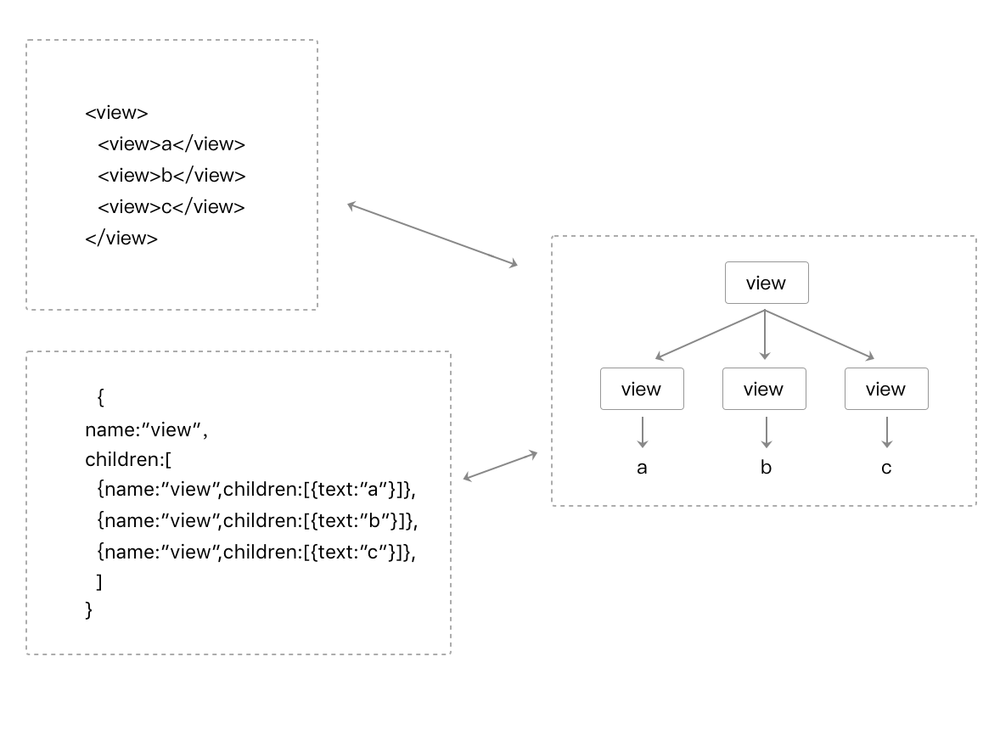
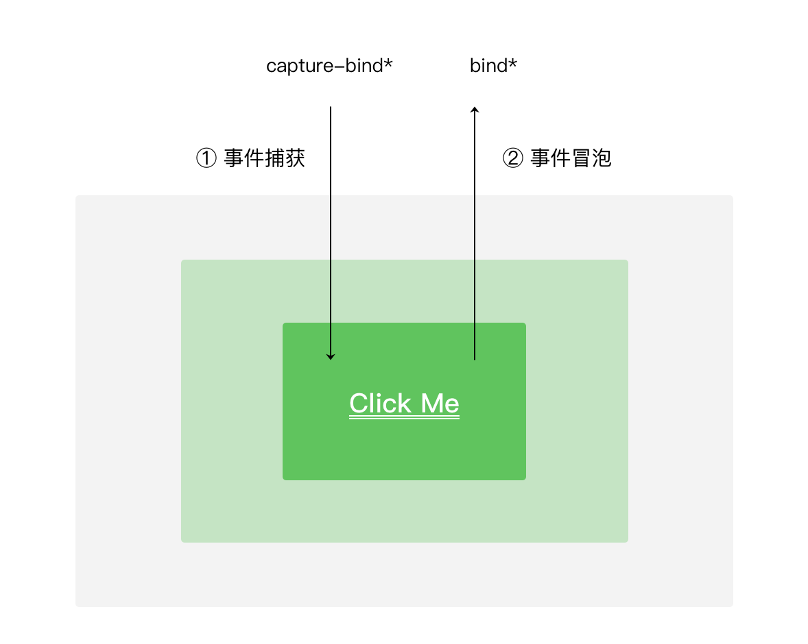

- [深入浅出主流的几款小程序跨端框架原理](https://juejin.cn/post/6881597846307635214)
- [文档](https://developers.weixin.qq.com/ebook?action=get_post_info&docid=0008aeea9a8978ab0086a685851c0a)
## 微信小程序

网页开发渲染线程和脚本线程是互斥的，这也是为什么长时间的脚本运行可能会导致页面失去响应，而在小程序中，二者是分开的，分别运行在不同的线程中。网页开发者可以使用到各种浏览器暴露出来的 DOM API，进行 DOM 选中和操作。

而**小程序的逻辑层和渲染层是分开的**，逻辑层运行在 `JSCore` 中，并没有一个完整浏览器对象，因而缺少相关的`DOM API`和`BOM API`。
这一区别导致了前端开发非常熟悉的一些库，例如 jQuery、 Zepto 等，在小程序中是无法运行的。同时 JSCore 的环境同 NodeJS 环境也是不尽相同，所以一些 NPM 的包在小程序中也是无法运行的。


小程序的运行环境


#### 渲染层和逻辑层

整个小程序框架系统分为两部分：**逻辑层（App Service）和 视图层（View）**。小程序提供了自己的视图层描述语言 WXML 和 WXSS，以及基于 JavaScript 的逻辑层框架，并在视图层与逻辑层间提供了数据传输和事件系统，让开发者能够专注于数据与逻辑。

小程序的**运行环境分成渲染层和逻辑层，其中 `WXML` 模板和 `WXSS` 样式工作在渲染层，`JS` 脚本工作在逻辑层**。

小程序的渲染层和逻辑层分别由**2个线程管理**：**渲染层的界面使用了`WebView` 进行渲染**；**逻辑层采用JsCore线程运行JS脚本**。一个小程序存在多个界面，所以渲染层存在**多个WebView线程**，
这两个线程的通信会经由微信客户端（下文中也会采用Native来代指微信客户端）做中转，逻辑层发送网络请求也经由Native转发，小程序的通信模型下图所示。


当前，视图层和逻辑层的数据传输，实际上通过两边提供的 `evaluateJavascript` 所实现。即用户传输的数据，**需要将其转换为字符串形式传递**，同时把转换后的数据内容拼接成一份 JS 脚本，再通过执行 JS 脚本的形式传递到两边独立环境。

而 `evaluateJavascript` 的执行会受很多方面的影响，数据到达视图层并不是实时的。所以我们的`setData`函数将数据从逻辑层发送到视图层，是**异步的**。

#### wxss

小程序编译后，`rpx`会做一次px换算。换算是以375个物理像素为基准，也就是在一个宽度为375物理像素的屏幕下，`1rpx = 1px`。

举个例子：iPhone6屏幕宽度为375px，共`750个物理像素`，那么`1rpx = 375 / 750 px = 0.5px`。


选择器和优先级



#### JavaScript 

小程序中 JavaScript 构成如图



小程序中的 JavaScript 是由**ECMAScript 以及小程序框架和小程序 API 来实现的**。同浏览器中的JavaScript 相比没有 BOM 以及 DOM 对象，所以类似 JQuery、Zepto这种浏览器类库是无法在小程序中运行起来的，同样的缺少 Native 模块和NPM包管理的机制，小程序中无法加载原生库，也无法直接使用大部分的 NPM 包。

不同的平台的小程序的脚本执行环境也是有所区别的。

小程序目前可以运行在三大平台：

1. iOS平台，包括iOS9、iOS10、iOS11，iOS12
2. Android平台
3. 小程序IDE

模块化: 同浏览器不同，小程序中可以将任何一个JavaScript 文件作为一个模块，通过`module.exports` 或者 `exports` 对外暴露接口。使用 `require(path)` 将公共代码引入。
类似于node.js的CMD

**脚本的执行顺序**
浏览器中，脚本严格按照加载的顺序执行，而在小程序中的脚本执行顺序**有所不同**。小程序的执行的入口文件是 app.js 。并且会根据其中 `require` 的模块顺序决定文件的运行顺序。

当 app.js 执行结束后，小程序会按照开发者**在 app.json 中定义的 pages 的顺序，逐一执行**。

**作用域**

同浏览器中运行的脚本文件有所不同，小程序的脚本的作用域同 NodeJS 更为相似。

**在文件中声明的变量和函数只在该文件中有效，不同的文件中可以声明相同名字的变量和函数，不会互相影响**

### 数据驱动

WXML结构实际上等价于一棵Dom树，通过一个JS对象也可以来表达Dom树的结构，如图

WXML结构和JS对象均可以表示一棵Dom树



WXML可以先转成JS对象，然后再渲染出真正的Dom树,转换的过程如图


**WXML结构转JS对象，再转Dom树**

通过setData把msg数据从“Hello World”变成“Goodbye”，产生的JS对象对应的节点就会发生变化，此时可以对比前后两个JS对象得到变化的部分，然后把这个差异应用到原来的Dom树上，从而达到更新UI的目的，这就是“数据驱动”的原理，如图


小程序的逻辑层和渲染层是分开的两个线程。在渲染层，宿主环境会把WXML转化成对应的JS对象，在逻辑层发生数据变更的时候，我们需要通过宿主环境提供的setData方法把数据从逻辑层传递到渲染层，再经过对比前后差异，把差异应用在原来的Dom树上，渲染出正确的UI界面, 如图


### 程序的生命周期和打开场景

初次进入小程序的时候，微信客户端初始化好宿主环境，同时从网络下载或者从本地缓存中拿到小程序的代码包，把它注入到宿主环境，初始化完毕后，微信客户端就会给App实例派发onLaunch事件，App构造器参数所定义的onLaunch方法会被调用。
进入小程序之后，用户可以点击右上角的关闭，或者按手机设备的Home键离开小程序，此时小程序并没有被直接销毁，我们把这种情况称为“小程序进入后台状态”，App构造器参数所定义的onHide方法会被调用。
当再次回到微信或者再次打开小程序时，微信客户端会把“后台”的小程序唤醒，我们把这种情况称为“小程序进入前台状态”，App构造器参数所定义的onShow方法会被调用。
我们可以看到，App的生命周期是由微信客户端根据用户操作主动触发的。为了避免程序上的混乱，我们不应该从其他代码里主动调用App实例的生命周期函数。
在微信客户端中打开小程序有很多途径：从群聊会话里打开，从小程序列表中打开，通过微信扫一扫二维码打开，从另外一个小程序打开当前小程序等，针对不同途径的打开方式，小程序有时需要做不同的业务处理，所以微信客户端会把打开方式带给onLaunch和onShow的调用参数options

小程序的JS脚本是运行在JsCore的线程里，小程序的每个页面各自有一个WebView线程进行渲染，所以小程序切换页面时，小程序逻辑层的JS脚本运行上下文依旧在同一个JsCore线程中。
在上文中说道App实例是单例的，因此**不同页面直接可以通过App实例下的属性来共享数据**。**App构造器可以传递其他参数作为全局属性以达到全局共享数据的目的**。

### 事件

target和currentTarget的区别，currentTarget为当前事件所绑定的组件，而target则是触发该事件的源头组件。

```vue
<!-- page.wxml -->
<view id="outer" catchtap="handleTap">
  <view id="inner">点击我</view>
</view>
```
```javascript
// page.js
Page({
  handleTap: function(evt) {
       // 当点击inner节点时
       // evt.target 是inner view组件
       // evt.currentTarget 是绑定了handleTap的outer view组件
       // evt.type == “tap”
       // evt.timeStamp == 1542
       // evt.detail == {x: 270, y: 63}
       // evt.touches == [{identifier: 0, pageX: 270, pageY: 63, clientX: 270, clientY: 63}]
       // evt.changedTouches == [{identifier: 0, pageX: 270, pageY: 63, clientX: 270, clientY: 63}]
  }
})
```
bind和capture-bind的含义分别代表事件的冒泡阶段和捕获阶段




每个小程序的缓存空间上限为10MB，如果当前缓存已经达到10MB，再通过wx.setStorage写入缓存会触发fail回调。


引入### 原生组件

小程序是 Hybrid 应用，除了 Web 组件的渲染体系（上面讲到），还有由客户端原生参与组件（原生组件）的渲染。

引入原生组件主要有 3 个好处：

1. 绕过 setData、数据通信和重渲染流程，使渲染性能更好。

2. 扩展 Web 的能力。比如像输入框组件（input, textarea）有更好地控制键盘的能力。

3. 体验更好，同时也减轻 WebView 的渲染工作。比如像地图组件（map）这类较复杂的组件，其渲染工作不占用 WebView 线程，而交给更高效的客户端原生处理。

而原生组件的渲染过程：

1. 组件被创建，包括组件属性会依次赋值。

2. 组件被插入到 DOM 树里，浏览器内核会立即计算布局，此时我们可以读取出组件相对页面的位置（x, y坐标）、宽高。

3. 组件通知客户端，客户端在相同的位置上，根据宽高插入一块原生区域，5.之后客户端就在这块区域渲染界面。

4. 当位置或宽高发生变化时，组件会通知客户端做相应的调整。

简单来说，就是 原生组件在 WebView 这一层只需要渲染一个占位元素，之后客户端在这块占位元素之上叠了一层原生界面。

有利必有弊，原生组件也是有限制的：最主要的限制是一些 CSS 样式无法应用于原生组件，由于客户端渲染，原生组件的层级会比所有在 WebView 层渲染的普通组件要高。

### 通讯

视图图与逻辑层分别是如何与底层通讯的。

#### 视图层与底层是如何通信的？

这层通信机制在 iOS 和安卓系统的实现方式并不一样，iOS 是利用了`WKWebView `的提供` messageHandlers` 特性，而在安卓则是往 `WebView` 的 `window` 对象注入一个原生方法。

最终会封装成 `WeiXinJSBridge` 这样一个兼容中间层，这个中间层主要提供了调用（`invoke`）和监听（`on`）这两种方法。

#### 逻辑层与底层是如何通讯的？

逻辑层与客户端原生通信机制与视图层类似。

不同在于，iOS平台可以往`JavaScripCore`框架注入一个全局的原生方法，而安卓方面则是跟渲染层一致的。也往 `WebView`的 `window` 对象注入一个原生方法。

相同的是，最终会封装成 WeiXinJSBridge 这样一个兼容中间层，这个中间层主要提供了调用（invoke）和监听（on）这两种方法。

运行机制、清除机制: 

1，小程序没有重启的概念，当小程序进入后台，客户端会维持一段时间的运行状态，超过一定时间后，目前是5分钟，会被微信主动销毁。在此之间被重复打开，被视为热启动，是不检查版本更新的。只有能启动才会从服务器上检查版本。

2，当短时间内（5s）连续收到两次以上系统内存告警，会进行小程序的销毁。

### 性能优化

主要的优化策略可以归纳为三点：

1. 精简代码，降低`WXML`结构和JS代码的复杂性；
2. 合理使用`setData`调用，减少`setData`次数和数据量；
3. 必要时使用分包优化。

1、setData 工作原理
小程序的视图层目前使用 WebView 作为渲染载体，而逻辑层是由独立的 JavascriptCore 作为运行环境。在架构上，WebView 和 JavascriptCore 都是独立的模块，并不具备数据直接共享的通道。当前，视图层和逻辑层的数据传输，实际上通过两边提供的 evaluateJavascript 所实现。即用户传输的数据，需要将其转换为字符串形式传递，同时把转换后的数据内容拼接成一份 JS 脚本，再通过执行 JS 脚本的形式传递到两边独立环境。

而 evaluateJavascript 的执行会受很多方面的影响，数据到达视图层并不是实时的。

2、常见的 setData 操作错误

1. 频繁的去 setData在我们分析过的一些案例里，部分小程序会非常频繁（毫秒级）的去setData，其导致了两个后果：Android下用户在滑动时会感觉到卡顿，操作反馈延迟严重，因为 JS 线程一直在编译执行渲染，未能及时将用户操作事件传递到逻辑层，逻辑层亦无法及时将操作处理结果及时传递到视图层；渲染有出现延时，由于 WebView 的 JS 线程一直处于忙碌状态，逻辑层到页面层的通信耗时上升，视图层收到的数据消息时距离发出时间已经过去了几百毫秒，渲染的结果并不实时；
2. 每次 setData 都传递大量新数据由setData的底层实现可知，我们的数据传输实际是一次 evaluateJavascript
3. 脚本过程，当数据量过大时会增加脚本的编译执行时间，占用 WebView JS 线程，  后台态页面进行
   setData当页面进入后台态（用户不可见），不应该继续去进行setData，后台态页面的渲染用户是无法感受的，另外后台态页面去setData也会抢占前台页面的执行。
