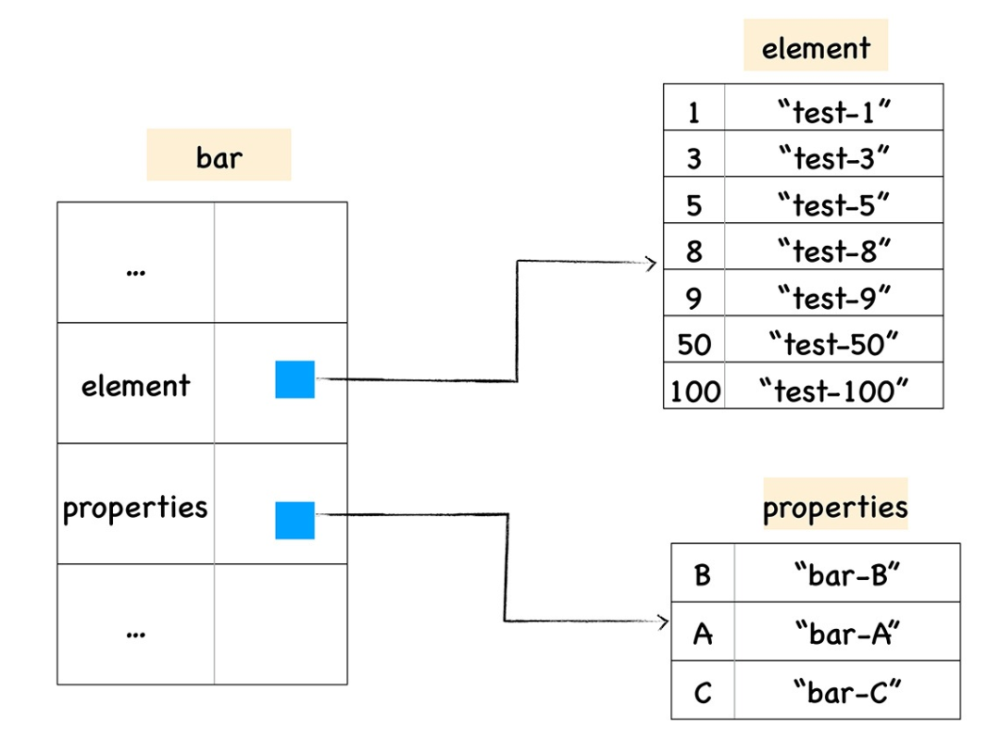
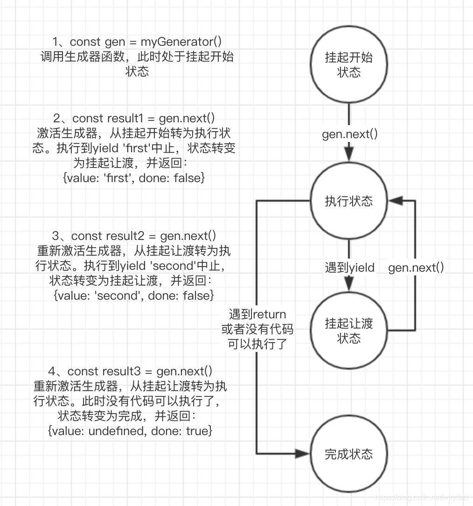
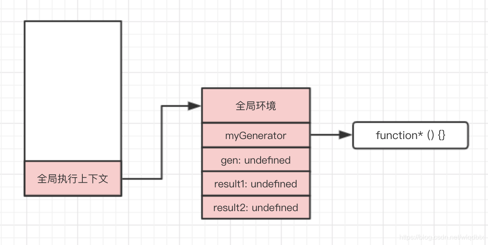
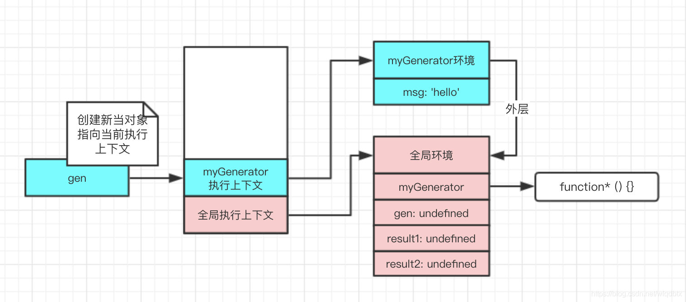
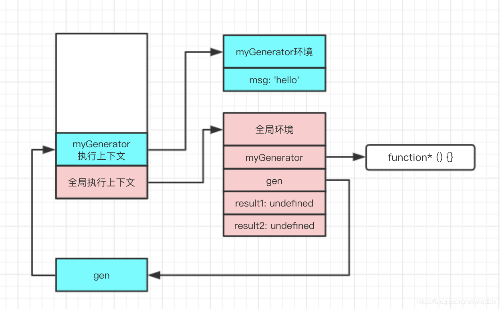

### 语言中所有的底层存储方式是是什么。

- 数组(Array)
数组是一种聚合数据类型，它是将具有相同类型的若干变量有序地组织在一起的集合。数组可以说是最基本的数据结构，在各种编程语言中都有对应。一个数组可以分解为多个数组元素，按照数据元素的类型，数组可以分为整型数组、字符型数组、浮点型数组、指针数组和结构数组等。数组还可以有一维、二维以及多维等表现形式。

- 栈( Stack)
栈是一种特殊的线性表，它只能在一个表的一个固定端进行数据结点的插入和删除操作。栈按照后进先出的原则来存储数据，也就是说，先插入的数据将被压入栈底，最后插入的数据在栈顶，读出数据时，从栈顶开始逐个读出。栈在汇编语言程序中，经常用于重要数据的现场保护。栈中没有数据时，称为空栈。

- 队列(Queue)
队列和栈类似，也是一种特殊的线性表。和栈不同的是，队列只允许在表的一端进行插入操作，而在另一端进行删除操作。一般来说，进行插入操作的一端称为队尾，进行删除操作的一端称为队头。队列中没有元素时，称为空队列

- 链表( Linked List)
链表是一种数据元素按照链式存储结构进行存储的数据结构，这种存储结构具有在物理上存在非连续的特点。链表由一系列数据结点构成，每个数据结点包括数据域和指针域两部分。其中，指针域保存了数据结构中下一个元素存放的地址。链表结构中数据元素的逻辑顺序是通过链表中的指针链接次序来实现的。

- 树( Tree)
树是典型的非线性结构，它是包括，2个结点的有穷集合K。在树结构中，有且仅有一个根结点，该结点没有前驱结点。在树结构中的其他结点都有且仅有一个前驱结点，而且可以有两个后继结点，m≥0

- 图(Graph)
图是另一种非线性数据结构。在图结构中，数据结点一般称为顶点，而边是顶点的有序偶对。如果两个顶点之间存在一条边，那么就表示这两个顶点具有相邻关系

- 堆(Heap)
堆是一种特殊的树形数据结构，一般讨论的堆都是二叉堆。堆的特点是根结点的值是所有结点中最小的或者最大的，并且根结点的两个子树也是一个堆结构

- 散列表(Hash)
散列表源自于散列函数(Hash function)，其思想是如果在结构中存在关键字和T相等的记录，那么必定在F(T)的存储位置可以找到该记录，这样就可以不用进行比较操作而直接取得所查记录

#### JavaScript使用的是 堆(Heap) 和 栈( Stack)
JavaScript基本类型数据都是直接按值存储在栈中的(`Undefined`、`Null`、不是`new`出来的布尔、数字和字符串)，每种类型的数据占用的内存空间的大小是确定的，并由系统自动分配和自动释放。这样带来的好处就是，内存可以及时得到回收，相对于堆来说 ，更加容易管理内存空间。

JavaScript引用类型数据被存储于堆中 (如对象、数组、函数等，它们是通过拷贝和new出来的）。其实，说存储于堆中，也不太准确，因为，引用类型的数据的地址指针是存储于栈中的，当我们想要访问引用类型的值的时候，需要先从栈中获得对象的地址指针，然后，在通过地址指针找到堆中的所需要的数据。


### 内置类型
JavaScript目前有八种内置类型（包含ES6的symbol）：
- null
- undefined
- string
- number
- boolean
- object
- symbol(es6)
- BigInt(es10)

[细说 JavaScript 七种数据类型](https://www.cnblogs.com/onepixel/p/5140944.html)

#### [详解 undefined 与 null 的区别](https://www.cnblogs.com/onepixel/p/7337248.html)
`Number(null)`结果为0，`Number(undefined)`为`NaN`

`undefined`: 未定义的值 。这个值的语义是，希望表示一个变量最原始的状态，而非人为操作的结果 。
- 声明了一个变量，但没有赋值
- 访问对象上不存在的属性
- 函数定义了形参，但没有传递实参
- 使用 void 对表达式求值
`null` 的字面意思是：空值。这个值的语义是，希望表示 一个对象被人为的重置为空对象，而非一个变量最原始的状态 。 在内存里的表示就是，栈中的变量没有指向堆中的内存对象。

当一个对象被赋值了null 以后，原来的对象在内存中就处于游离状态，GC 会择机回收该对象并释放内存。因此，如果需要释放某个对象，就将变量设置为 null，即表示该对象已经被清空，目前无效状态。


##### `typeof null` 为 `object`的bug
> `null` 有属于自己的类型 `Null`，而不属于`Object`类型，`typeof` 之所以会判定为 Object 类型，是因为JavaScript中的数据在底层是以二进制存储，比如null所有存储值都是0，但是底层的判断机制，只要前三位为0，就会判定为object，所以才会有typeof null === 'object'这个bug。

- 000 - 对象，数据是对象的应用
- 1 - 整型，数据是31位带符号整数
- 010 - 双精度类型，数据是双精度数字
- 100 - 字符串，数据是字符串
- 110 - 布尔类型，数据是布尔值

```javascript
Object.prototype.toString.call(undefined) ; // [object Undefined]
Object.prototype.toString.call(null) ; // [object Null]
```

#### for循环中的let

```javascript
var funcs = []
for (let i = 0; i < 3; i++) {
    funcs[i] = function () {
        console.log(i)
    };
}
funcs[0]() // 0
funcs[1]() // 1
funcs[2]() // 2

// 伪代码
/**
(let i = 0) {
    funcs[0] = function() {
        console.log(i)
    };
}

(let i = 1) {
    funcs[1] = function() {
        console.log(i)
    };
}

(let i = 2) {
    funcs[2] = function() {
        console.log(i)
    };
};
**/
```
疑问： 每一轮循环的变量i都是重新声明的，那它怎么知道上一轮循环的值，从而计算出本轮循环的值？

这是因为 JavaScript 引擎内部会记住上一轮循环的值，初始化本轮的变量i时，就在上一轮循环的基础上进行计算。**每次迭代循环时都创建一个新变量，并以之前迭代中同名变量的值将其初始化。**

另外，for循环还有一个特别之处，就是设置循环变量的那部分是一个父作用域，而循环体内部是一个单独的子作用域。

```javascript
for (let i = 0; i < 3; i++) {
  let i = 'abc';
  console.log(i);
}
// abc
// abc
// abc
```

#### `var`,`const` `let` 区别
- 1. var声明的变量会挂载在`window`上，而let和const声明的变量不会：
- 2. var声明变量存在变量提升，let和const不存在变量提升
- 3. let和const声明形成块作用域
- 4. 同一作用域下let和const不能声明同名变量，而var可以
- 5. 暂存死区
```javascript
var a = 100;

if(1){
    a = 10;
    //在当前块作用域中存在a使用let/const声明的情况下，给a赋值10时，只会在当前作用域找变量a，
    // 而这时，还未到声明时候，所以控制台Uncaught ReferenceError: Cannot access 'a' before initialization
    let a = 1;
}
```
- const
    - 1、一旦声明必须赋值,不能使用null占位。
    - 2、声明后不能再修改
    - 3、如果声明的是复合类型数据，可以修改其属性
    
变量提升和函数声明覆盖

函数声明的执行优先级会比变量声明的优先级更高一点， 而且同名的函数会覆盖函数与变量，但是同名的变量并不会覆盖函数。但是在上下文的执行阶段，同名的函数会被变量重新赋值。
```javascript
var a = 20
function fn() {
  console.log('fn')
}
function fn() {
  console.log('cover fn')
}
function a() {
  console.log('cover a')
}
console.log(a)
fn()

var fn = 'I want cover function name fn.'
console.log(fn)
// 20
// cover fn
// I want cover function name fn.
```
上面例子的执行顺序其实为 ：
```javascript
// 创建阶段
function fn() {console.log('fn')}
function fn() {console.log('cover fn')}
function a() {console.log('cover a')}
var a = undefined;
var fn = undefined;
// 执行阶段
a = 20;
console.log(a);
fn();
fn = 'I want cover function name fn.'
console . log(fn);
```
函数声明后面的会覆盖之前的同名声明。而当声明变量也是`fn`时，不会覆盖函数
```javascript
fn(); // 报错
var fn = function() {
    console.log('function');
}
```

#### instanceof 运算符用于检测构造函数的 prototype 属性是否出现在某个实例对象的原型链上
语法
> object instanceof constructor

#### 使用Object.prototype.hasOwnProperty.call(obj, key) 比用obj.hasOwnProperty安全，因为非对象不会报错。

#### JS中“假”值列表，即if不执行(if 等流控制语句会自动执行其他类型值到布尔值的转换即Boolean(null))
- “”（空字符串）
- 0、-0、+0、NaN(无效数字)
- null、undefined
- false
- 注意Infinity为真
   
### `Object.is()`方法
>相等运算符（`==`）和严格相等运算符（`===`）。它们都有缺点，前者会自动转换数据类型，后者的`NaN`不等于自身，以及`+0`等于`-0`。`Object.is`用来比较两个值是否严格相等，与严格比较运算符（`===`）的行为基本一致，不同之处只有两个：一是`+0`不等于`-0`，二是`NaN`等于自身。
```javascript
+0 === -0 //true
NaN === NaN // false

Object.is(+0, -0) // false
Object.is(NaN, NaN) // true
```
Polyfill
 ````javascript
Object.defineProperty(Object, 'is', {
  value: function(x, y) {
    if (x === y) {
      // 针对+0 不等于 -0的情况
      return x !== 0 || 1 / x === 1 / y;
    }
    // 针对NaN的情况
    return x !== x && y !== y;
  },
  configurable: true,
  enumerable: false,
  writable: true
});
````


#### [set, map, weakMap, weakSet](https://juejin.im/post/6844904169417998349)

#### `Object.defineProperty(obj, prop, descriptor)`

- `obj`: 要定义属性的对象。
- `prop`: 要定义或修改的属性的名称或 `Symbol` 。
- `descriptor`: 要定义或修改的属性描述符。
```javascript
let obj = {}
Object.defineProperty(obj, 'key', {
  configurable: true, // 默认为 false，当且仅当该属性的 configurable 键值为 true 时，该属性的描述符才能够被改变，同时该属性也能从对应的对象上被删除。
  enumerable: true, // 默认为 false。当且仅当该属性的 enumerable 键值为 true 时，该属性才会出现在对象的枚举属性中。（for...in 或 Object.keys 方法）
  value: 'value', // 默认为 undefined。该属性对应的值。可以是任何有效的 JavaScript 值（数值，对象，函数等）。
  writable: true, // 当且仅当该属性的 writable 键值为 true 时，属性的值，也就是上面的 value，才能被赋值运算符改变。默认为 false。
  get() {},
  set(v) {}
})
```

#### `Object.freeze()`和`Object.seal`

`Object.freeze()`方法可以冻结一个对象。一个被冻结的对象再也不能被修改；冻结了一个对象则不能向这个对象添加新的属性，不能删除已有属性，不能修改该对象已有属性的可枚举性、可配置性、可写性，以及不能修改已有属性的值。此外，冻结一个对象后该对象的原型也不能被修改。freeze() 返回和传入的参数相同的对象。

- 设置Object.preventExtension()，禁止添加新属性(绝对存在)
- 设置writable为false，禁止修改(绝对存在)
- 设置configurable为false，禁止配置(绝对存在)
- 禁止更改访问器属性(getter和setter)
从上可知，Object.freeze()禁止了所有可设置的内容。

另外，可以使用`Object.isFrozen()`判断一个对象是否是冻结对象。

Object.freeze()只是浅冻结，犹如浅拷贝。

`Object.seal()`方法封闭一个对象，阻止添加新属性并将所有现有属性标记为不可配置。当前属性的值只要可写就可以改变。

- 设置Object.preventExtension()，禁止添加新属性(绝对存在)
- 设置configurable为false，禁止配置(绝对存在)
- 禁止更改访问器属性(getter和setter)

使用`Object.isSealed()`判断一个对象是否是封闭对象。

> 使用`Object.freeze()`冻结的对象中的现有属性是不可变的。用`Object.seal()`密封的对象可以改变其现有属性。

freeze对象后，对象移动sealed
```javascript
var obj = {k: '1'}
Object.freeze(obj)
Object.isSealed(obj) // true
```

`Object.preventExtensions()`方法让一个对象变的不可扩展，也就是永远不能再添加新的属性。

```javascript
//空对象是特殊情况，设置Object.preventExtensions()后，以下情况都将被禁止：
var empty = {};
Object.preventExtensions(empty);
Object.isFrozen(empty) === true
Object.isSealed(empty) === true
Object.isExtensible(empty) === false
```

**总结**

- `Object.preventExtensions(obj)` ：用于锁住对象属性，使其不能够拓展，也就是不能增加新的属性，但是属性的值仍然可以更改，也可以把属性删除。
- `Object.seal(obj)` ：把对象密封，也就是让对象既不可以拓展也不可以删除属性（把每个属性的 `configurable` 设为 false），单数属性值仍然可以修改。
- `Object.freeze(obj)` ：完全冻结对象，在 seal 的基础上，属性值也不可以修改（每个属性的 `writable` 也被设为 false）。


#### Object.create()方法创建一个新对象，使用现有的对象来提供新创建的对象的[`__proto__`](https://developer.mozilla.org/zh-CN/docs/Web/JavaScript/Reference/Global_Objects/Object/create)
```javascript
// 创建一个原型为null的空对象
var pureObj  = Object.create(null)
// 或者
var atom = Object.setPrototypeOf(new Object, null)
```

pureObj其实是个原子（原子是JavaScript中的对象的最小单元，它是对象但不继承自Object()；以原子为原型的对象也会被称为原子对象。）在同一个运行环境中，可以并存多个原子，以及由原型指向原子的、原型继承的对象系统。所有这些原子以及衍生的对象系统都是互不相等、没有交集的。

### [九种常用的设计模式](https://juejin.cn/post/6881384600758091784)

### [设计模式](https://juejin.im/post/6846687601785585677)

### [前端模块化](https://juejin.im/post/6844903744518389768)

[文章1](https://juejin.im/post/6844903576309858318)

[文章2](https://blog.csdn.net/leelxp/article/details/108101442)

 #### [ES6 模块与 CommonJS 模块的差异](https://es6.ruanyifeng.com/#docs/module-loader#ES6-%E6%A8%A1%E5%9D%97%E4%B8%8E-CommonJS-%E6%A8%A1%E5%9D%97%E7%9A%84%E5%B7%AE%E5%BC%82)
 - CommonJS 模块输出的是一个值的拷贝(浅拷贝)，ES6 模块输出的是值的引用。
 - CommonJS 模块是运行时加载，ES6 模块是编译时输出接口。
 - CommonJS 模块的require()是同步加载模块，ES6 模块的import命令是异步加载，有一个独立的模块依赖的解析阶段。
 - CommonJS 模块处理循环加载的方法是返回的是当前已经执行的部分的值，而不是代码全部执行后的值，两者可能会有差异。因为CommonJS 输入的是被输出值的拷贝，不是引用,只会在第一次加载时运行一次，以后再加载，就返回第一次运行的结果，除非手动清除系统缓存。
 - ES6 处理“循环加载”与 CommonJS 有本质的不同。ES6 模块是动态引用，如果使用import从一个模块加载变量（即`import foo from 'foo'`），那些变量不会被缓存，而是成为一个指向被加载模块的引用，需要开发者自己保证，真正取值的时候能够取到值。
 >AMD(require.js) 推崇依赖前置、提前执行，CMD(sea.js)推崇依赖就近、延迟执行。

   [深入 CommonJs 与  ES6 Module](https://segmentfault.com/a/1190000017878394)
### JavaScript Number类型
 文章[JavaScript 深入之浮点数精度](https://github.com/mqyqingfeng/Blog/issues/155)

在 JavaScript 里面，数字均为双精度浮点类型（double-precision 64-bit binary format IEEE 754），即一个介于±2−1023和±2+1024之间的数字，或约为±10−308到±10+308，数字精度为53位。整数数值仅在±(253 - 1)的范围内可以表示准确。

除了能够表示浮点数，数字类型也还能表示三种符号值: +Infinity（正无穷）、-Infinity（负无穷）和 NaN (not-a-number，非数字)

#### 浮点数的组成
IEEE 754 规定了包括：单精度（32位）、双精度（64位）、延伸单精度（43比特以上，很少使用）与延伸双精度（79比特以上，通常以80位实现）。而 JavaScript 使用的是双精度。

一个浮点数(value)可以这样表示：

也就是浮点数的实际值，等于符号位（sign bit）乘以指数偏移值(exponent bias)再乘以分数值(fraction)。

 64 位双精度浮点型具体的字节分配：

从上图中可以看到，从高到低，64位被分成3段，分别是:
 1. 符号位（sign），只占 1 位，0 表示+，1 表示-。
 2. 指数位（exponent），占 11 位(取值范围 `[0, 2048)`)，记为 e。
 3. 分数位（fraction），有效数字位，占 52 位。
 
 指数位有 11 位，取值范围是 0 到 2047。当指数位 e=0 或者 e=2017 时，根据有效数字位 f 是否为 0 ，具有不同的特殊含义，具体见下表：
 
 

对于常用的 normal number, 为了方便表示指数为负数的情况，所以，指数位数值大小做了一个 -1023 的偏移量。对于一个非 0 数字而言，,它的二进制的科学计数法里的第一位有效数字固定是 1。这样，一个双精度浮点型数字的值就是

 
 
对于 subnormal number,它可以用来表示更加接近于 0 的数，它特殊的地方是有效数字位的前面补充的是 0 而不是 1，且指数为偏移量是 -1022，所以值是：

 
 
  

双精度浮点数(double)转化为十进制的公式：


其中，b 为二进制小数的第 52 - i 位的值。e 需减去取值范围的中位数 1023。特别的，当 e 等于 0 且小数位均为 0 时，表示 0，当 e 全为 1 且小数位均为 0 时，表示无穷，如果 e 全为 1 且小数位不均为 0 ，那么这不是一个数（NaN）。

对于 0.1 来说，转成二进制小数为：

```javascript
0.1.toString(2)
// "0.0001100110011001100110011001100110011001100110011001101"
```
用科学计数法表示：`1.100110011001100110011001100110011001100110011001101 x 2^-4`，指数为 -4，因此 e 等于 1019，
转成 11 位二进制数 `01111111011`；尾数为 `1001100110011001100110011001100110011001100110011010`，末尾补齐 0 至 52 位数；正负号标志 s 显然是 0。最终 0.1 在内存中长这样 `0011111110111001100110011001100110011001100110011001100110011010`，图形化显示为：


小数位其实是 1001 无限循环，根据 IEEE754 的舍入标准 进行了舍入，导致结果会比 0.1 大那么一点点，之所以使用的时候没感觉出来，是因为打印结果的时候舍入了小数点后第 18 位的值。Number 对象里有 toPrecision 方法来指定精度

```javascript
0.1.toPrecistion(20);
// "0.10000000000000000555"
0.2.toPrecistion(20);
// "0.20000000000000001110"
0.3.toPrecistion(20);
// "0.29999999999999998890"
// https://blog.csdn.net/a76326791212/article/details/109125123
// https://juejin.im/post/6844903747345235982
// https://juejin.im/post/6844903859962249229
```


#### 解决方法
- 只需要展示的话，可以 toFixed 或者 toPrecision 选择自己需要的精度，然后再 parseFloat 转成浮点数。需要注意的是，这两个方法均不是四舍五入法，而是上面提过的 IEEE754舍入标准，舍入至最接近的值，如果有 2 个值一样接近，则取偶数值。
- 如需对数据进行运算，那么一种常用的方法就是，把小数转成整数再进行运算，只要运算过程涉及到的数字不大于 MAX_SAFE_INTEGER ，得到的结果就是“精确”的。
- 使用`Number.EPSILON `
##### toFixed
toFixed有四舍五入，部分场景会出bug
```javascript
1.54.toFixed(1) // '1.5'
1.55.toFixed(1) // '1.6'
1.64.toFixed(1) // '1.6'
1.65.toFixed(1) // '1.6'
1.66.toFixed(1) // '1.7'
```

toFixed因为舍入的规则是银行家舍入法：四舍六入五考虑，五后非零就进一，五后为零看奇偶，五前为偶应舍去，五前为奇要进一

主要是小数实际储存的值和显示的值不同，比如1.65的实际值是1.64999999999999991118e+0, 所以toFixed(1)的结果是1.6

```javascript
function toFixed(num, s){
    const times = Math.pow(10, s)
    let des = num * times + 0.5
    des = parseInt(des, 10) / times
    return des + ''
}
```
实际上比如2.55存的是2.5499999999999998，给他加上一个很小的数。

由于限制，有效数字第53位及以后的数字是不能存储的，它遵循，如果是1就向前一位进1，如果是0就舍弃的原则。
```javascript
if (!Number.prototype._toFixed) {
    Number.prototype._toFixed = Number.prototype.toFixed;
}
Number.prototype.toFixed = function(n) {
    return (this + 1e-14)._toFixed(n);
};
```

##### `Number.EPSILON `

`Number.EPSILON` 属性表示 1 与Number可表示的大于 1 的最小的浮点数之间的差值。`EPSILON` 属性的值接近于 `2.2204460492503130808472633361816E-16`，或者 2<sup>-52</sup>。

```javascript
x = 0.2;
y = 0.3;
z = 0.1;
equal = (Math.abs(x - y + z) < Number.EPSILON);
```

Polyfill
```javascript
if (Number.EPSILON === undefined) {
    Number.EPSILON = Math.pow(2, -52);
}
```

### 尾递归优化

ECMAScript 6 规范新增了一项内存管理优化机制，让 JavaScript 引擎在满足条件时可以重用栈帧。

其实就是在严格模式下，一个函数最后返回另一个函数的返回结果，少一次栈的叠加

```javascript
function outerFunction(){
	return innerFunction() // 尾调用
}

function fib(n){
	if (n < 2) {
		return n
	}
	return fib(n - 1) + fib(n - 2)
}

// 斐波纳契数列尾递归优化
// 基础框架
function fib(n){
	return fibImpl(0, 1, n)
}

// 执行递归
function fibImpl(a, b, n){
	if (n === 0) {
		return a
	}
	return fibImpl(b, a + b, n - 1)
}
```

尾调用优化的条件就是确定外部栈帧真的没有必要存在了。涉及的条件如下：
 - 代码在严格模式下执行；
 - 外部函数的返回值是对尾调用函数的调用；
 - 尾调用函数返回后不需要执行额外的逻辑；
 - 尾调用函数不是引用外部函数作用域中自由变量的闭包。

### 闭包
> 闭包指的是那些引用了另一个函数作用域中变量的函数，通常是在嵌套函数中实现的。

>《你不知道的JavaScript》这样描述：当函数可以记住并访问所在的词法作用域时，就产生了闭包，即使函数是在当前词法作用域之外执行。

[变量作用域，闭包](https://zh.javascript.info/closure)

从词法作用域讲解闭包：
 - [深入理解闭包之前置知识→作用域与词法作用域](https://juejin.cn/post/6844903606311714824)
 - [闭包详解](https://juejin.cn/post/6844903612879994887)


- [[译]发现 JavaScript 中闭包的强大威力](https://juejin.cn/post/6844903769646317576)
- [破解前端面试（80% 应聘者不及格系列）：从闭包说起](https://juejin.cn/post/6844903474212143117)

闭包的定义很简单：函数 A 返回了一个函数 B，并且函数 B 中使用了函数 A 的变量，函数 B 就被称为闭包。

```javascript
function A() {
  let a = 1
  function B() {
      console.log(a)
  }
  return B
}
```

你是否会疑惑，为什么函数 A 已经弹出调用栈了，为什么函数 B 还能引用到函数 A 中的变量。因为函数 A 中的变量这时候是存储在堆上的。现在的 JS 引擎可以通过逃逸分析辨别出哪些变量需要存储在堆上，哪些需要存储在栈上。

经典面试题，循环中使用闭包解决 `var` 定义函数的问题

```javascript
for ( var i=1; i<=5; i++) {
	setTimeout( function timer() {
		console.log( i );
	}, i*1000 );
}
```

首先因为 `setTimeout` 是个异步函数，所有会先把循环全部执行完毕，这时候 `i` 就是 6 了，所以会输出一堆 6。

解决办法两种，第一种使用闭包

```javascript
for (var i = 1; i <= 5; i++) {
  (function(j) {
    setTimeout(function timer() {
      console.log(j);
    }, j * 1000);
  })(i);
}
```

第二种就是使用 `setTimeout `  的第三个参数

```javascript
for ( var i=1; i<=5; i++) {
	setTimeout( function timer(j) {
		console.log( j );
	}, i*1000, i);
}
```

第三种就是使用 `let` 定义  `i` 了

```javascript
for ( let i=1; i<=5; i++) {
	setTimeout( function timer() {
		console.log( i );
	}, i*1000 );
}
```

因为对于 `let` 来说，他会创建一个块级作用域，相当于

```js
{ // 形成块级作用域
  let i = 0
  {
    let ii = i
    setTimeout( function timer() {
        console.log( ii );
    }, i*1000 );
  }
  i++
  {
    let ii = i
  }
  i++
  {
    let ii = i
  }
}
```

```js
function createIncrement(i) {
    let value = 0
    function increment() {
        value += i
        console.log(value)
        const message = `Current value is ${value}`
        return function logValue() { // setState相当于logValue函数
            console.log(message)
        }
    }
    return increment
}
const inc = createIncrement(10)
const log = inc() // 10，将当前的value值固定
inc() // 20
inc() // 30

log() // "Current value is 10" 未能正确打印30

```

### 数组

::: tip
注意： 除了抛出异常以外，没有办法中止或跳出 forEach() 循环。如果你需要中止或跳出循环，forEach() 方法不是应当使用的工具。

若需要提前终止循环，可以使用：

- 一个简单的 for 循环
- for...of / for...in 循环
- Array.prototype.every()
- Array.prototype.some()
- Array.prototype.find()
- Array.prototype.findIndex()
   
:::

如果数组在forEach迭代时被修改了，则其他元素会被跳过。

```javascript
var words = ['one', 'two', 'three', 'four'];
words.forEach(function(word) {
  console.log(word);
  if (word === 'two') {
    words.shift();
  }
});
// one
// two
// four
```

#### forEach 与async
 问题描述
 ```javascript
var getNumbers = () => {
  return Promise.resolve([1, 2, 3])
}
var multi = num => {
  return new Promise((resolve, reject) => {
    setTimeout(() => {
      if (num) {
        resolve(num * num)
      } else {
        reject(new Error('num not specified'))
      }
    }, 1000)
  })
}
async function test () {
  var nums = await getNumbers()
  nums.forEach(async x => {
    var res = await multi(x)
    console.log(res)
  })
}
test()
```

代码执行的结果是：1 秒后，一次性输出1，4，9。

问题原因： 因为`forEach`方法的参数是一个普通函数，并没有`async`函数，类似的还有`Generator`，`forEach`中不能写`yield`

解决问题

方式一

可以改造一下 forEach，确保每一个异步的回调执行完成后，才执行下一个

```javascript
async function asyncForEach(array, callback) {
  for (let index = 0; index < array.length; index++) {
    await callback(array[index], index, array)
  }
}
async function test () {
  var nums = await getNumbers()
  asyncForEach(nums, async x => {
    var res = await multi(x)
    console.log(res)
  })
}
```
方式二

使用 `for-of` 替代 `for-each`。

`for-of` 可以遍历各种集合对象的属性值，要求被遍历的对象需要实现迭代器 (iterator) 方法，例如` myObject[Symbol.iterator]()` 用于告知 JS 引擎如何遍历该对象。一个拥有 `[Symbol.iterator]() `方法的对象被认为是可遍历的。
```javascript
var zeroesForeverIterator = {
  [Symbol.iterator]: function () {
    return this;
  },
  next: function () {
    return {done: false, value: 0};
  }
};
```
如上就是一个最简单的迭代器对象；for-of 遍历对象时，先调用遍历对象的迭代器方法 `[Symbol.iterator]()`，该方法返回一个迭代器对象(迭代器对象中包含一个 next 方法)；然后调用该迭代器对象上的 next 方法。

每次调用 next 方法都返回一个对象，其中 done 和 value 属性用来表示遍历是否结束和当前遍历的属性值，当 done 的值为 true 时，遍历就停止了。

```javascript
async function test () {
  var nums = await getNumbers()
  for(let x of nums) {
    var res = await multi(x)
    console.log(res)
  }
}
```
文章[当 async/await 遇上 forEach](https://objcer.com/2017/10/12/async-await-with-forEach/)

#### for in 和for of

##### for in

- for ... in 循环返回的值都是返回的是所有能够通过对象访问的、可枚举的属性，其中既包括存在于实例中的属性，也包括存在于**原型中的属性**。
```javascript
var a = ['a', 'b']
Array.prototype.addTest = 'test'
for (var k in a) {
  console.log(k)
}
// '0'
// '1'
// 'addTest'
```
- for...in循环是以字符串作为键名“0”、“1”、“2”等等
- 特别情况下, for ... in 循环会以任意的顺序遍历键名

对象中的属性可分为`常规属性`和 `排序属性`

例子
```javascript
function Foo() {
  this[100] = 'test-100'
  this[1] = 'test-1'
  this["B"] = 'bar-B'
  this[50] = 'test-50'
  this[9] = 'test-9'
  this[8] = 'test-8'
  this[3] = 'test-3'
  this[5] = 'test-5'
  this["A"] = 'bar-A'
  this["C"] = 'bar-C'
}
var bar = new Foo()
for(key in bar){
  console.log(`index:${key} value:${bar[key]}`)
}
// 输出是
/**
index:1 value:test-1
index:3 value:test-3
index:5 value:test-5
index:8 value:test-8
index:9 value:test-9
index:50 value:test-50
index:100 value:test-100
index:B value:bar-B
index:A value:bar-A
index:C value:bar-C
**/
```
在ECMAScript规范中定义了 「数字属性应该按照索引值⼤⼩升序排列，字符 串属性根据创建时的顺序升序排列。」在这⾥我们把对象中的数字属性称为 「排序属性」，在V8中被称为 elements，字符串属性就被称为 「常规属性」， 在V8中被称为 properties。在V8内部，为了有效地提升存储和访问这两种属性的性能，分别使⽤了两个 线性数据结构来分别保存排序 属性和常规属性，具体结构如下图所⽰：


在elements对象中，会按照顺序存放排序属性，properties属性则指向了properties对 象，在properties对象中，会按照创建时的顺序保存了常规属性。

**总结一句: for in 循环特别适合遍历对象。**
##### for of 特点
- for of 不同与 `forEach`, 它可以与 `break`、`continue`和`return `配合使用,也就是说 for of 循环可以随时退出循环。
- 提供了遍历所有数据结构的统一接口
- 遍历数组无法获取index，但可以使用数组实例的 `entries()`，`keys()` 和 `values()`，示例如下

```javascript

for (let index of ['a', 'b'].keys()) {
  console.log(index);
}
// 0
// 1

for (let elem of ['a', 'b'].values()) {
  console.log(elem);
}
// 'a'
// 'b'

for (let [index, elem] of ['a', 'b'].entries()) {
  console.log(index, elem);
}
// 0 "a"
// 1 "b"

const arr = [1,2,3]

for (const [key, value] of new Map(arr.map((item, i) => [i, item]))) {
	console.log(key)
	console.log(value)
}
```

哪些数据结构部署了 `Symbol.iterator` 属性呢?只要有 `iterator `接口的数据结构,都可以使用 for of循环。

- 数组 Array
- Map
- Set
- String
- arguments对象
- NodeList对象, 就是获取的dom列表集合

以上这些都可以直接使用 for of 循环。 凡是部署了 iterator 接口的数据结构也都可以使用数组的 扩展运算符(...)、和解构赋值等操作。


为对象添加`Iterator`遍历器
```javascript
let obj = {
  data: [ 'hello', 'world' ],
  [Symbol.iterator]() {
    const self = this;
    let index = 0;
    return {
      next() {
        if (index < self.data.length) {
          return {
            value: self.data[index++],
            done: false
          };
        } else {
          return { value: undefined, done: true };
        }
      }
    };
  }
};

class RangeIterator {
	constructor(start, stop) {
		this.value = start
		this.stop = stop
	}
	
	[Symbol.iterator] () {
		return this
	}
	
	next() {
		const { value, stop } = this
		if (value < stop) {
			this.value ++
			return {
				done: false,
				value
			}
		}
		return {
			done: true,
			value: undefined
		}
	}
}

function range(start, stop) {
	return new RangeIterator(start, stop);
}

for (let value of range(0, 3)) {
	console.log(value); // 0, 1, 2
}
```
#### `Iterator` 接口与 `Generator` 函数
任意一个对象的`Symbol.iterator`方法，等于该对象的遍历器生成函数，调用该函数会返回该对象的一个遍历器对象。

由于 `Generator` 函数就是遍历器生成函数，因此可以把 `Generator` 赋值给对象的`Symbol.iterator`属性，从而使得该对象具有 `Iterator` 接口。
```javascript
let myIterable = {
  [Symbol.iterator]: function* () {
    yield 1;
    yield 2;
    yield 3;
  }
};
[...myIterable] // [1, 2, 3]

// 或者采用下面的简洁写法

let obj = {
  * [Symbol.iterator]() {
    yield 'hello';
    yield 'world';
  }
};

for (let x of obj) {
  console.log(x);
}
```
### promise

```javascript
const p1 = new Promise(function (resolve, reject) {
  setTimeout(() => reject(new Error('fail')), 3000)
})

const p2 = new Promise(function (resolve, reject) {
  setTimeout(() => resolve(p1), 1000)
})

p2
  .then(result => console.log(result))
  .catch(error => console.log(error))
// Error: fail  3秒后输出！！！ 即 p1是3秒后改变状态，p2是1秒后， p2 1秒后，状态失效，依照p1的状态，此时p1已经计时1秒，所以2秒后打印fail
```
p1是一个 Promise，3 秒之后变为rejected。p2的状态在 1 秒之后改变，resolve方法返回的是p1。由于p2返回的是另一个 Promise，导致p2自己的状态无效了，由p1的状态决定p2的状态。
所以，后面的then语句都变成针对后者（p1）。又过了 2 秒，p1变为rejected，导致触发catch方法指定的回调函数。
- `Promise.prototype.then()`: then方法的第一个参数是resolved状态的回调函数，第二个参数是rejected状态的回调函数，它们都是可选的。
    
    promise 的优势在于可以链式调用，使用 Promise 的时候，当 then 函数中 return 了一个值，不管是什么值，我们都能在下一个 then 中获取到，这就是所谓的**then 的链式调用**。
    
```javascript
new Promise((resolve, reject) => {
	setTimeout(() => {
		resolve(123)
	}, 2000)
})
	.then((res) => {
		console.log(res) // 123
		return 1
	})
	.then()
	.then()
	.then(res => {
		console.log(res) // 1
	})
```

而且，当不在 then 中放入参数，例：`promise.then().then()`，那么其后面的 then 依旧可以得到之前 then 返回的值，这就是所谓的**值的穿透**。
```javascript
new Promise((resolve, reject) => {
	setTimeout(() => {
		resolve(123)
	}, 2000)
})
	.then()
	.then()
	.then()
	.then(res => {
		console.log(res) // 123
	})
```
    
- `Promise.prototype.catch()`方法是`.then(null, rejection)`或`.then(undefined, rejection)`的别名，用于指定发生错误时的回调函数。
- `Promise.all() `: 所有的状态都变成`fulfilled`才会变成`fulfilled`,只要p1、p2、p3之中有一个被`rejected`，p的状态就变成`rejected`，此时第一个被reject的实例的返回值，会传递给p的回调函数。
- `Promise.race() `: 只要p1、p2、p3之中有一个实例率先改变状态，p的状态就跟着改变。那个率先改变的 Promise 实例的返回值，就传递给p的回调函数。
- `Promise.allSettled()`: 方法接受一组 Promise 实例作为参数，包装成一个新的 Promise 实例。只有等到所有这些参数实例都返回结果，不管是fulfilled还是rejected，包装实例才会结束。该方法返回的新的 Promise 实例，一旦结束，状态总是fulfilled，不会变成rejected。状态变成fulfilled后，Promise 的监听函数接收到的参数是一个数组，每个成员对应一个传入Promise.allSettled()的 Promise 实例。

### generator

#### generator函数的执行上下文环境

```javascript
function* myGenerator() {
    yield 'first';
    yield 'second';
}
 
const gen = myGenerator();
const result1 = gen.next();
const result2 = gen.next();
const result3 = gen.next();
```
下面这种图简单说明了执行过程：


```javascript
function* myGenerator(msg) {
    yield "first " + msg;
    return "second " + msg;
}
 
const gen = myGenerator("hello");
const result1 = gen.next();
const result2 = gen.next();
```
在调用生成器函数myGenerator之前，执行上下文如下：



当执行`const gen = myGenerator("hello")`时，生成器进入挂起开始状态，执行上下文如下：


和普通的函数不同，当函数执行完成后，它当执行上下文从执行栈中弹出后，不会立即被销毁。因为此时gen还保留着对它的引用，可以看成类似闭包的现象。闭包中为了保证闭包创建时的变量都可以使用，需要对创建它对环境保存一个引用。而生成器除了保持环境引用外，还需要保证可以恢复执行，所以需要保存当时函数的执行上下文。

当执行完`const gen = myGenerator("hello")`后，执行上下文如下：


当执行`const result1 = gen.next()`时，这时会激活myGenerator的执行上下文，并推入执行栈中，执行上下文如下：



当`const result1 = gen.next()`执行完成后，从栈中推出执行上下文，如下：


最后，当执行`const result2 = gen.next()` 时，又会进入上下文的入栈出栈流程。此时遇到`return`后，生成器进入完成状态。


**Generator 函数就是遍历器生成函数**
`Generator` 函数执行后，返回一个遍历器对象。该对象本身也具有`Symbol.iterator`属性，执行后返回自身。
```javascript
function* gen(){
  // some code
}

var g = gen();

g[Symbol.iterator]() === g
// true
```
##### next 方法的参数
yield表达式本身没有返回值，或者说总是返回undefined。next方法可以带一个参数，该参数就会被当作上一个yield表达式的返回值。

```javascript
function* f() {
  for(var i = 0; true; i++) {
    var reset = yield i;
    if(reset) { i = -1; }
  }
}

var g = f();

g.next() // { value: 0, done: false }
g.next() // { value: 1, done: false }
g.next(true) // { value: 0, done: false }
```
Generator 函数也不能跟new命令一起用，会报错。

#### 结合promise，实现async函数

```javascript
function getJSON(data) {
	return new Promise((resolve, reject) => {
		setTimeout(() => {
			resolve(data)
		}, 3000)
	})
}

asyncRT(function* () {
	try {
		console.log('start')
		console.time()
		const result1 = yield getJSON('data/first.json')
		const result2 = yield getJSON(result1)
		const result3 = yield getJSON(result2)
		console.log(result3)
		console.timeEnd()
	} catch (e) {
		console.log(e)
	}
})

function asyncRT(generator) {
	// 创建一个迭代器
	const gen = generator()
	
	// generator执行顺序控制器
	function next(arg) {
		const result = gen.next(arg)
		// 如果已经结束，则直接return
		if (result.done) return
		const value = result.value
		// 如果是Promise则在then里执行next
		if (value instanceof Promise) {
			value.then(res => next(res))
				.catch(err => gen.throw(err))
		} else next(value)
	}
	
	try {
		next()
	} catch (e) {
		gen.throw(e)
	}
}

```

### async的实现

async 函数的实现原理，就是将 `Generator` 函数和自动执行器，包装在一个函数里。

```javascript
async function fn(args) {
  // ...
}

// 等同于

function fn(args) {
  return spawn(function* () {
    // ...
  });
}
```
所有的`async`函数都可以写成上面的第二种形式，其中的`spawn`函数就是自动执行器。

```javascript
function spawn(genF) {
  return new Promise(function(resolve, reject) {
    const gen = genF();
    function step(nextF) {
      let next;
      try {
        next = nextF();
      } catch(e) {
        return reject(e);
      }
      if(next.done) {
        return resolve(next.value);
      }
      Promise.resolve(next.value).then(function(v) {
        step(function() { return gen.next(v); });
      }, function(e) {
        step(function() { return gen.throw(e); });
      });
    }
    step(function() { return gen.next(undefined); });
  });
}

function timeout(ms) {
	return new Promise((resolve => {
		setTimeout(resolve,ms)
	}))
}
async function asyncPrint(value, ms) {
	await timeout(ms);
	console.log(value);
}

function fn(value, ms) {
	return spawn(function* () {
		yield timeout(ms)
		console.log(value);
	});
}

// asyncPrint('hello world', 2000);
fn('hello world', 2000);
```

version2
```javascript
function myCo(gen) {
	return new Promise(((resolve, reject) => {
		function next(data) {
			try {
				var { value, done } = gen.next(data)
			} catch (e) {
				return reject(e)
			}
			if (!done) {
				//done为true,表示迭代完成
				//value 不一定是 Promise，可能是一个普通值。使用 Promise.resolve 进行包装。
				Promise.resolve(value).then(val => {
					next(val)
				}, reject)
			} else {
				resolve(value)
			}
		}
		
		next() //第一次调用next函数时，传递的参数无效
	}))
}

function* test() {
	yield new Promise((resolve, reject) => {
		setTimeout(resolve, 100)
	})
	yield new Promise((resolve, reject) => {
		// throw Error(1);
		resolve(10)
	})
	yield 10
	return 1000
}

myCo(test()).then(data => {
	console.log(data) //输出1000
}).catch((err) => {
	console.log('err: ', err)
})

```

#### reduce
`reduce` `reduceRight`
```javascript
[0, 1, 2, 3, 4].reduce(function(accumulator, currentValue, currentIndex, array){
  return accumulator + currentValue;
}, 0);
```
#### `JSON.stringify`、`JSON.parse`深拷贝的缺点

- 1. 如果obj里有函数，undefined，则序列化的结果会把函数或 `undefined`丢失；`JSON.parse`传入`undefined`会报错, `JSON.stringify`不会报错。有NaN、Infinity和-Infinity，则序列化的结果会变成null。如果obj里有RegExp(正则表达式的缩写)、Error对象，则序列化的结果将只得到空对象null；
```javascript
var funObj = {
	name: 'a',
	fun: function(){
		console.log(this.a)
	},
	un: undefined,
	na: NaN,
	in: Infinity,
	una: -Infinity,
}
console.log(JSON.parse(JSON.stringify(funObj))) // { name: 'a', na: null, in: null, una: null }

var obj = {
	name: 'a',
	reg: new RegExp('\\w+'),
	error: new Error('error')
}

console.log(JSON.parse(JSON.stringify(obj))) // { name: 'a', reg: {}, error: {} }
```

- 2. JSON.stringify()只能序列化对象的可枚举的自有属性，例如 如果obj中的对象是由构造函数生成的， 则使用JSON.parse(JSON.stringify(obj))深拷贝后，会丢弃对象的constructor；
- 3. 如果对象中存在循环引用的情况也无法正确实现深拷贝；
- 4. 如果obj里面有时间对象，则JSON.stringify后再JSON.parse的结果，时间将只是字符串的形式，而不是对象的形式
```javascript
var test = {
	name: 'a',
	date: [new Date(1536627600000), new Date(1540047600000)],
};

let b = JSON.parse(JSON.stringify(test))
console.log(b);
// {
// 	name: 'a',
// 		date: [ '2018-09-11T01:00:00.000Z', '2018-10-20T15:00:00.000Z' ]
// }
```

## [垃圾回收](https://zh.javascript.info/garbage-collection)
