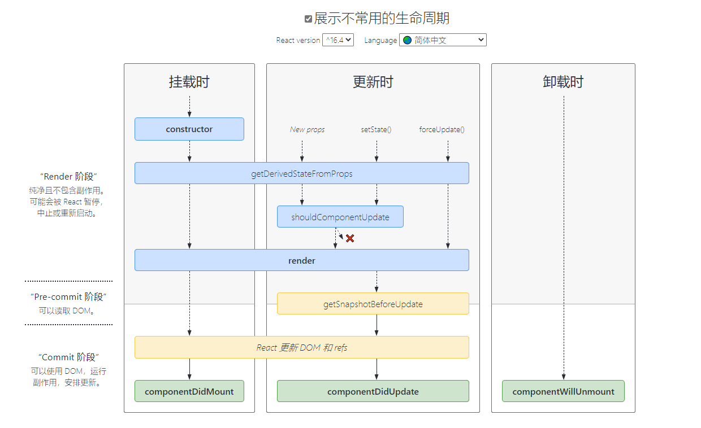

[react](https://zh-hans.reactjs.org/)

[React技术揭秘](https://react.iamkasong.com/)

[图解React](http://www.7km.top/)

[react+typescript](https://github.com/typescript-cheatsheets/react)

[2021年React学习路线图](https://mp.weixin.qq.com/s?__biz=MzUxMzcxMzE5Ng==&mid=2247505750&idx=2&sn=a31164ddf69f49e3761d2a6d660cf316&chksm=f9526215ce25eb031cbb1f8e0137b3fb3e30f6305fb183f028ab12419699695173b51c44b49d&scene=132#wechat_redirect)

## 概述

React用于构建用户界面的 JavaScript 库

单项数据流：
把组件相当于一个函数，props 相当于函数的传参。如果组件内部可以改变 props 就相当于，在函数内部改变参数。那么这个函数就产生了副作用，那么这个函数就不是一个 `pure function`。这会使函数变的不可测试，不可测试也就不能预测执行结果，从而降低代码可维护性。

## [生命周期](https://zh-hans.reactjs.org/docs/react-component.html)

## React16.3.0之前生命周期:

[文章](https://juejin.cn/post/6844904021233238024)


### 创建期:

- constructor(props, context)
- componentWillMount()
- render()
- componentDidMount()

### 运行时:

#### props发生变化时

- componentWillReceiveProps(nextProps, nextContext)
- shouldComponentUpdate(nextProps, nextState, nextContext)
- componentWillUpdate(nextProps, nextState, nextContext)
- render
- componentDidUpdate(prevProps, prevState, snapshot)

#### state发生变化时

- shouldComponentUpdate(nextProps, nextState, nextContext)
- componentWillUpdate(nextProps, nextState, nextContext)
- render
- componentDidUpdate(prevProps, prevState, snapshot)

### 卸载时

- componentWillUnmount()

## React16.3.0之后的生命周期

### 创建期:

- constructor(props, context)
- static getDerivedStateFromProps(props, status)
- render()
- componentDidMount()

或者如下生命周期:

- constructor(props, context)
- componentWillMount() / UNSAFE_componentWillMount()
- render()
- componentDidMount()
注意: `getDerivedStateFromProps`/`getSnapshotBeforeUpdate` 和 `componentWillMount`/`componentWillReceiveProps`/`componentWillUpdate` 如果同时存在，React会在控制台给出警告信息，且仅执行 getDerivedStateFromProps/getSnapshotBeforeUpdate 【React@16.7.0】

### 运行时:

#### props发生变化时

- static getDerivedStateFromProps(props, status)
- shouldComponentUpdate(nextProps, nextState, nextContext)
- render
- getSnapshotBeforeUpdate(prevProps, prevState)
- componentDidUpdate(prevProps, prevState, snapshot)

或者如下生命周期:

- componentWillReceiveProps(nextProps, nextContext)/UNSAFE_componentWillReceiveProps
- shouldComponentUpdate(nextProps, nextState, nextContext)
- componentWillUpdate(nextProps, nextState, nextContext)
- render
- componentDidUpdate(prevProps, prevState, snapshot)

#### state发生变化时

- static getDerivedStateFromProps(props, status)
- shouldComponentUpdate(nextProps, nextState, nextContext)
- render
- getSnapshotBeforeUpdate(prevProps, prevState)
- componentDidUpdate(prevProps, prevState, snapshot)
或者如下生命周期:

- shouldComponentUpdate(nextProps, nextState, nextContext)
- componentWillUpdate(nextProps, nextState, nextContext)/UNSAFE_componentWillUpdate
- render
- componentDidUpdate(prevProps, prevState, snapshot)
#### 销毁时

- componentWillUnmount()

[示意图](https://projects.wojtekmaj.pl/react-lifecycle-methods-diagram/)

新的生命周期图示:




### [setState](https://zhuanlan.zhihu.com/p/39512941)

- setState 只在合成事件和钩子函数中是“异步”的，在原生事件和setTimeout 中都是同步的。
- setState 的“异步”并不是说内部由异步代码实现，其实本身执行的过程和代码都是同步的，只是合成事件和钩子函数的调用顺序在更新之前，导致在合成事件和钩子函数中没法立马拿到更新后的值，形成了所谓的“异步”，当然可以通过第二个参数 setState(partialState, callback) 中的callback拿到更新后的结果。
- setState 的批量更新优化也是建立在“异步”（合成事件、钩子函数）之上的，在原生事件和setTimeout 中不会批量更新，在“异步”中如果对同一个值进行多次setState，setState的批量更新策略会对其进行覆盖，取最后一次的执行，如果是同时setState多个不同的值，在更新时会对其进行合并批量更新。

### React.PureComponent与React.memo()

React.PureComponent 中以浅层对比 prop 和 state 的方式来实现`shouldComponentUpdate(nextProps, nextState)`。仅作对象的浅层比较。如果对象中包含复杂的数据结构，则有可能因为无法检查深层的差别，产生错误的比对结果。

其实就是默认实现了`shouldComponentUpdate`，可以判断是否重新渲染。而memo是对函数式组件的高阶运用。

`React.memo` 仅检查 `props` 变更。如果函数组件被` React.memo `包裹，且其实现中拥有 `useState `或 `useContext` 的 Hook，当 context 发生变化时，它仍会重新渲染。
默认情况下其只会对复杂对象做浅层对比，如果你想要控制对比过程，那么请将自定义的比较函数通过第二个参数传入来实现。
```jsx harmony
function MyComponent(props) {
  /* 使用 props 渲染 */
}
function areEqual(prevProps, nextProps) {
  /*
  如果把 nextProps 传入 render 方法的返回结果与
  将 prevProps 传入 render 方法的返回结果一致则返回 true，
  否则返回 false
  */
}
export default React.memo(MyComponent, areEqual);
```
```jsx harmony
class Child extends React.PureComponent {
	// shouldComponentUpdate(nextProps, nextState, nextContext) {
	// 	return nextProps.seconds !== this.props.seconds
	// }
	
	render(){
		console.log('I am rendering');
		return (
			<div>I am update every {this.props.seconds} seconds</div>
		)
	}
}
```
