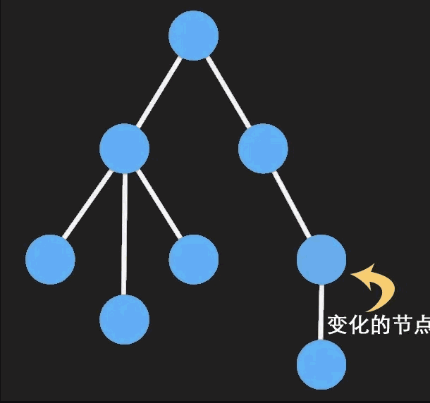

### redux

- [8k字 | Redux/react-redux/redux中间件设计实现剖析](https://juejin.cn/post/6844904036013965325)
- [一文吃透react-redux源码](https://juejin.cn/post/6937491452838559781)
- [Dva 源码解析](https://dvajs.com/guide/source-code-explore.html#dva-%E6%BA%90%E7%A0%81%E8%A7%A3%E6%9E%90)
 ::: details 实现
```typescript jsx
 // reducer.js 纯函数，计算出新的store
 const initialState = {
     count: 0
 }
 
 export function reducer(state = initialState, action) {
     switch (action.type) {
         case 'add':
             return {
                 ...state,
                 count: state.count + 1
             }
         case 'subtract':
             return {
                 ...state,
                 count: state.count - 1
             }
         default:
             return initialState
     }
 }

type Actions = {
    type: string,
    payload?: any
}

export const createStore = (reducer: (state: any, action: Actions) => any, heightener?: (any) => any) => {
    // heightener是一个高阶函数,用于增强createStore
    //如果存在heightener,则执行增强后的createStore
    if(heightener) {
        return heightener(createStore)(reducer)
    }
    let currentState = {} // 公共状态
    const observers = []
    function getState() { // getter
        return currentState
    }
    
    function dispatch(action: Actions) { // setter
        currentState = reducer(currentState, action)
        observers.forEach(fn => fn())
    }
    
    function subscribe(fn) { // 发布订阅
        observers.push(fn)
    }
    dispatch({ type: '@@REDUX_INIT' })  //初始化store数据
    return {
        getState,
        dispatch,
        subscribe
    }
}

const logger = store => next => action => {
    console.log('logger1')
    let result = next(action)
    return result
}
const thunk = store => next => action => {
    console.log('thunk')
    const { dispatch, getState } = store
    return typeof action === 'function' ? action(store.dispatch) : next(action)
}

const logger2 = store => next => action => {
    console.log('log2')
    let result = next(action)
    return result
}
// 组合函数
function compose(...fns) {
    if(fns.length === 0) return arg => arg
    if(fns.length === 1) return fns[0]
    return fns.reduce((res, cur) => (...args) => res((cur(...args))))
}
const applyMiddleware = (...middlewares) => createStore => reducer => {
    const store = createStore(reducer)
    let { getState, dispatch } = store
    const params = {
        getState,
        dispatch: action => dispatch(action)
    }
    const middlewareArr = middlewares.map(middleware => middleware(params))
    dispatch = compose(...middlewareArr)(dispatch)
    return {
        ...store,
        dispatch
    }
}
const store = createStore(reducer, applyMiddleware(logger, thunk, logger2))

export default function () {
    return (
        <Provider store={store}>
            <TestApp title='this is title props'/>
        </Provider>
    )
}
// Provider.tsx
import React from 'react'
export const ReduxContext = React.createContext(null)
export function Provider(props) {
    return (
        <ReduxContext.Provider value={props.store}>
            { props.children }
        </ReduxContext.Provider>
    )
}

// connect.tsx
import React, { useContext, useEffect, useRef, useState } from 'react'
import { ReduxContext } from '@src/store/redux/Provider'

export function connect(mapStateToProps, mapDispatchToProps) {
    return function (Component) {
        return function Connect(props) {
            const store = useContext(ReduxContext)
            console.log(store)
            const [state, setState ] = useState(store.getState())
            useEffect(()=> {
                console.log('useEffect running')
                store.subscribe(() => {
                    // 根据mapStateToProps把state挂到this.props上
                    setState(mapStateToProps(store.getState()))
                })
            }, [])
            return (
                <Component
                    { ...props }
                    { ...state }
                    //{ ...mapStateToProps(store.getState()) }
                    // 根据mapDispatchToProps把dispatch(action)挂到this.props上
                    { ...mapDispatchToProps(store.dispatch) }
                />
            )
        }
    }
    
}

// 容器组件示例
const addCountAction = {
    type: 'add'
}

const mapStateToProps = state => {
    return {
        count: state.count
    }
}

function addCountActionAsync(dispatch) {
    setTimeout(() => {
        dispatch({ type: 'add' })
    }, 1000)
}

const mapDispatchToProps = dispatch => {
    return {
        addCount: () => {
            dispatch(addCountAction)
        },
        addCountAsync: () => {
            setTimeout(() => {
                dispatch(addCountActionAsync)
            }, 1000)
        }
    }
}

function App(props) {
    return (
        <div>
            <p>{ props.title }</p>
            <p>count: { props.count }</p>
            <Divider/>
            <button onClick={() => props.addCount()}>add</button>
            <Divider/>
            <button onClick={() => props.addCountAsync()}>addCountAsync</button>
        </div>
    )
}

export default connect(mapStateToProps, mapDispatchToProps)(App)
```
react-redux可以将react组件分为，`展示组件`和`容器组件`，容器组件的数据来源可以来自`redux`，修改视图可以使用dispatch向redux派发action，
使用`connect`高阶组件完成`connect(mapStateToProps, mapDispatchToProps)(App)`，通过`mapStateToProps`函数，可以对全局状态进行过滤，而展示型组件不直接从`global state`获取数据，其数据来源于父组件。

本质上是利于了React的`Context Api`，可以跨组件通信，而`connect`就是获取`context`的值，通过props传给组件。而react-redux实现了`发布订阅模式`，在dispatch的时候，可以触发回调函数
的执行，所以只需要将更新react视图的方法添加到`observers`即可。
 ::: 

### immutable.js

**持久化数据结构**和**结构共享**

`Immutable Data`是一种利用结构共享形成的持久化数据结构，一旦有部分被修改，那么将会返回一个全新的对象，并且原来相同的节点会直接共享。

每次修改一个 immutable 对象时都会创建一个新的不可变的对象，在新对象上操作并 不会影响到原对象的数据。

具体点来说，「immutable」 对象数据内部采用是多叉树的结构，凡是有节点被改变，那么它和与它相关的所有**上级节点都更新**。



- Javascript引用类型复用，不正确的操作导致复用前的数据也改变
- 使用深拷贝，有各种问题，比如性能，循环引用的处理，`key` 里面 `getter`，`setter` 以及原型链上的内容如何处理，React使用时导致的不必要的重复渲染
- immutable: 创建一个被 deepClone 过的数据，新的数据进行有副作用 (side effect) 的操作都不会影响到之前的数据。其实就是创建全选的父引用，复用之前的引用类型，当对应的引用类型
的数据改变是，才创建新的复制。

即2个特点：
1. 将所有的原生数据类型（Object， Array等）都会转化成 `immutable-js` 的内部对象（`Map`，`List` 等），并且任何操作最终都会返回一个**新的** `immutable` 的值。
2. 在 `immutable-js` 的数据结构中，深层次的对象 在没有修改的情况下仍然能够保证严格相等，即**深层嵌套对象的结构共享**

- [源码解析](https://zhuanlan.zhihu.com/p/44571842)

### React Css 方案

1. css modules

类似Vue的`scoped`，可以解决CSS变量名冲突

2. css in js

[styled-components](https://github.com/styled-components/styled-components)

3. [styled-jsx](https://github.com/vercel/styled-jsx)

### react如何实现keep-alive
- [react缓存页面](https://juejin.cn/post/6922340460136513549)
- [React 中的状态自动保存](https://juejin.cn/post/6844903942522929160)

#### 什么是状态保存？

假设有下述场景：

移动端中，用户访问了一个列表页，上拉浏览列表页的过程中，随着滚动高度逐渐增加，数据也将采用触底分页加载的形式逐步增加，列表页浏览到某个位置，用户看到了感兴趣的项目，点击查看其详情，进入详情页，从详情页退回列表页时，需要停留在离开列表页时的浏览位置上

类似的数据或场景还有已填写但未提交的表单、管理系统中可切换和可关闭的功能标签等，这类数据随着用户交互逐渐变化或增长，这里理解为状态，在交互过程中，因为某些原因需要临时离开交互场景，则需要对状态进行保存

在 React 中，通常会使用路由去管理不同的页面，而在切换页面时，路由将会卸载掉未匹配的页面组件，所以上述列表页例子中，当用户从详情页退回列表页时，会回到列表页顶部，因为列表页组件被路由卸载后重建了，状态被丢失

#### 解决方式

##### 手动保存状态

手动保存状态，是比较常见的解决方式，可以配合 React 组件的 `componentWillUnmount` 生命周期通过 `redux` 之类的状态管理层对数据进行保存，通过 `componentDidMount` 周期进行数据恢复

在需要保存的状态较少时，这种方式可以比较快地实现所需功能，但在数据量大或者情况多变时，手动保存状态就会变成一件麻烦事。

##### 通过路由实现自动状态保存（通常使用 `react-router`）

1. 重写 `<Route>` 组件，可参考[react-live-route](https://github.com/fi3ework/react-live-route)
    
重写可以实现想要的功能，但成本也比较高，需要注意对原始 `<Route>` 功能的保存，以及多个 `react-router` 版本的兼容
    
2. 重写路由库，可参考[react-keeper](https://github.com/vifird/react-keeper)
    
重写路由库成本是一般开发者无法承受的，且完全替换掉路由方案是一个风险较大的事情，需要较为慎重地考虑

3. 基于 `<Route>` 组件现有行为做拓展，可参考[react-router-cache-route](https://github.com/CJY0208/react-router-cache-route/blob/master/README_CN.md)

4. [react-activation](https://github.com/CJY0208/react-activation)

由于 React 会卸载掉处于固有组件层级内的组件，所以需要将 `<KeepAlive>` 中的组件，也就是其 children 属性抽取出来，渲染到一个不会被卸载的组件` <Keeper> `内，再使用 DOM 操作将 `<Keeper> `内的真实内容移入对应 `<KeepAlive>`


- [简单实现](https://blog.csdn.net/yehuozhili/article/details/107435885)

 ::: details 点击查看代码
 ```typescript jsx
import React, {
	createContext,
	useState,
	useEffect,
	useRef,
	useContext,
	useMemo
} from 'react'

const Context = createContext(null)

interface KeepState {
	id: {
		id: string,
		children: React.ReactChildren
	}
}

export function AliveScope(props) {
	const [state, setState] = useState< KeepState | {}>({})
	const ref = useMemo(() => {
		return {}
	}, [])
	const keep = useMemo(() => {
		return (id, children) =>
			new Promise((resolve) => {
				setState({
					[id]: {id, children}
				})
				setTimeout(() => {
					//需要等待setState渲染完拿到实例返回给子组件。
					resolve(ref[id])
				})
			})
	}, [ref])
	return (
		<Context.Provider value={keep}>
			{props.children}
			{Object.values(state).map(({id, children}) => (
				<div
					key={id}
					ref={(node) => {
						ref[id] = node
					}}
				>
					{children}
				</div>
			))}
		</Context.Provider>
	)
}

function KeepAlive(props) {
	const keep = useContext(Context)
	useEffect(() => {
		const init = async ({id, children}) => {
			const realContent = await keep(id, children)
			if (ref.current) {
				ref.current.appendChild(realContent)
			}
		}
		init(props)
	}, [props, keep])
	const ref = useRef(null)
	return <div ref={ref}/>
}

export default KeepAlive
```
 :::
 
 使用
  ::: details 点击查看代码
  ```typescript jsx
import React, {useState} from 'react'
import KeepAlive, { AliveScope } from './Keep-Alive'

function Counter() {
	const [count, setCount] = useState(0)
	return (
		<div>
			count: {count}
			<button onClick={() => setCount((count) => count + 1)}>add</button>
		</div>
	)
}

function App() {
	const [show, setShow] = useState(true)
	return (
		<AliveScope>
			<div>
				<button onClick={() => setShow((show) => !show)}>Toggle</button>
				<p>无 KeepAlive</p>
				{show && <Counter/>}
				<p>有 KeepAlive</p>
				{show && (
					<KeepAlive id='Test'>
						<Counter/>
					</KeepAlive>
				)}
				<hr/>
				{show && (
					<KeepAlive id='Test2'>
						<Counter/>
					</KeepAlive>
				)}
			</div>
		</AliveScope>
	)
}

export default App

```
  :::
