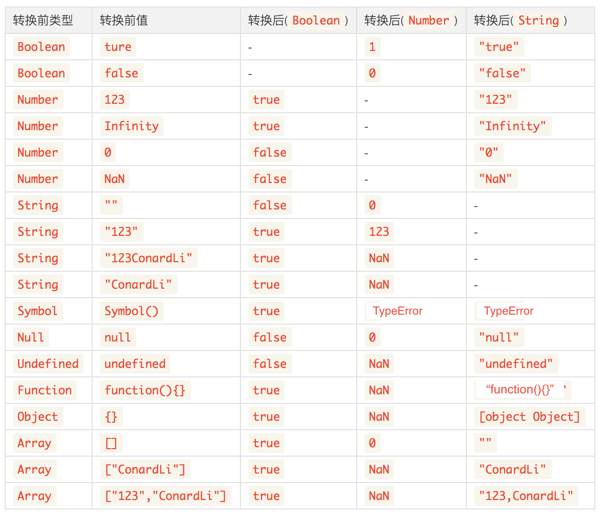
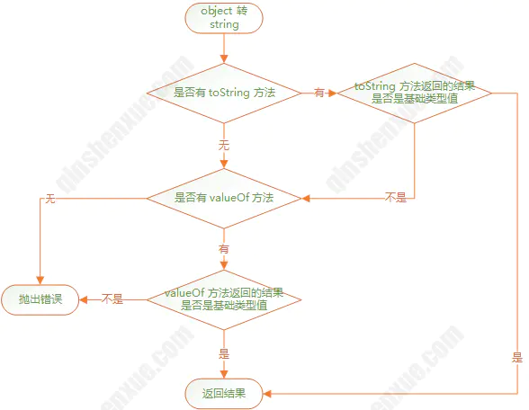

`[] == ![]`    ??? the answer is true

=== 不需要进行类型转换，只有类型相同并且值相等时，才返回 true.

== 如果两者类型不同，首先需要进行类型转换。具体流程如下:

- 1. 首先判断两者类型是否相同，如果相等，判断值是否相等.
- 2. 如果类型不同，进行类型转换
- 3. 判断比较两者是否是 null 或者是 undefined, 如果是, 返回 true .
- 4. 判断两者类型是否为 string 和 number, 如果是, 将字符串转换成 number
- 5. 判断其中一方是否为 boolean, 如果是, 将 boolean 转为 number 再进行判断
- 6. 判断其中一方是否为 object 且另一方为 string、number 或者 symbol , 如果是, 将 object 转为原始类型再进行判断

[] == ![] 是true还是false？
- 1. ! 优先级是高于 == 
- 2. `![]`: 引用类型转换成布尔值都是true,因此`![]`的是false
- 3. 根据上面的比较步骤中的第五条，其中一方是 boolean，将 boolean 转为 number 再进行判断，false转换成 number，对应的值是 0.
- 4. 根据上面比较步骤中的第六条，有一方是 number，那么将object也转换成Number,空数组转换成数字，对应的值是0.(空数组转换成数字，对应的值是0，如果数组中只有一个数字，那么转成number就是这个数字，其它情况，均为`NaN`)
- 0 == 0; 为true
### js的基本数据类型
基本数据类型一共6种，分别是number，undefined，symbol，null，string，boolean。

- 基本类型值是指简单的数据段，基本类型是按值访问的，因为可以操作保存在变量中的实际值;
- 基本类型的值在内存中占据固定大小的空间，被保存在栈内存中。从一个变量向另一个变量复制基本类型的值，会创建这个值的一个副本。

### js的引用数据类型：object

- 引用类型是由多个值构成的对象，js不允许直接访问内存中的位置，也就是不能直接访问操作对象的内存空间。对object的操作时 实际上是在操作对象的引用而不是实际的对象。
- 引用类型的值是对象，保存在堆内存中，包含引用类型值的变量实际上包含的并不是对象本身，而是一个指向该对象的指针。从一个变量向另一个变量复制引用类型的值，复制的其实是指针，因此两个变量最终都指向同一个对象。
- 对于引用类型的值，可以为其添加属性和方法，也可以改变和删除其属性和方法

## 检测
- typeof 运算符
- instanceof 运算符
- Object.prototype.toString 方法

## 类型转换
JS 的类型转换一共分两种：显示类型转换 和 隐式类型转换。在 JS 中类型转换只有三种情况，分别是：

- 转换为布尔值
- 转换为数字
- 转换为字符串
### 转换关系图


#### 显式转换
- 转化为 Number 类型：Number() / parseFloat() / parseInt()
- 转化为 String 类型：String() / toString()
- 转化为 Boolean 类型: Boolean()

有几个点需要注意:

- Number类定义的toString()方法可以接受表示转换基数的可选参数，如果不指定此参数，转换规则将是基于十进进制。


- js中对象到字符串的转换经过了如下步骤：

  - 如果对象具有toString()方法，则调用这个方法。如果它返回一个基本类型值，js将这个值转换为字符串，并返回这个字符串。
  - 如果对象没有toString()方法，或者这个方法返回的不是一个基本类型值，那么js将调用valueOf()方法。如果存在这个方法，则调用，如果返回值是基本类型值，转换为字符串并返回
  - 否则，js无法从toString()或valueOf()获得一个基本类型值，此时将会抛出类型错误异常

- undefined、null、false、+0、-0、NaN、""  只有这些 toBoolean()  是 false ，其余都为 true


- Number类定义的toString()方法可以接受表示转换基数的可选参数，如果不指定此参数，转换规则将是基于十进进制。

##### 隐性类型

- 一元 +  运算符, 一元 -  运算符
- 加法运算符
- ==规则

==规则
- 如果存在NaN，一律返回false
- 再看有没有布尔，有布尔就将布尔转换为数字
- 接着看有没有字符串, 有三种情况，对方是对象，对象使用toString进行转换；对方是数字，字符串转数字；对方是字符串，直接比较；其他返回false
- 如果是数字，对方是对象，对象取valueOf进行比较, 其他一律返回false
- null, undefined不会进行类型转换, 但它们俩相等

```
0 == undefined                       false
1 == true                            true
2 == {valueOf: function(){return 2}} true
NaN == NaN                           false
8 == undefined                       false
1 == undefined                       false
null == {toString: function(){return 2}}  false
0 == null   false
null == 1   false
{ toString:function(){ return 1 }, valueOf:function(){ return [] }} == 1   true
```


#### 对象转换为基本类型值

分为两种情况来处理。

##### 1. 对象要被转换为字符串

转换步骤如下图所示。



举例如下

```javascript
// 模拟 toString 返回的不是基本类型值
var obj = {
    toString: function() {
        return {}
    }
}

String(obj)  // Uncaught TypeError: Cannot convert object to primitive value
```
```javascript
// 模拟 toString 返回的不是基本类型值，valueOf 返回的基本类型值
var obj = {
    toString: function() {
        return {}
    },
    valueOf:function(){
        return null
    }
}

String(obj)   // "null"
```

```javascript
// 模拟 toString 返回的不是基本类型值，valueOf 返回的不是基本类型值
var obj = {
    toString: function() {
        return {}
    },
    valueOf:function(){
        return {}
    }
}

String(obj)   // Uncaught TypeError: Cannot convert object to primitive value
```
##### 2. 对象要被转换为数字

和转换为字符串流程差不多，区别在于转换为数字先判断 valueOf 方法，再判断 toString 方法。举例如下：
```javascript
var obj = {
    valueOf:function(){
        return null
    },
    toString:function(){
        return 1
    }
}

Number(obj)  // 0
```
```javascript
var obj = {
    valueOf:function(){
        return {}
    },
    toString:function(){
        return {}
    }
}

Number(obj)  // Uncaught TypeError: Cannot convert object to primitive value
```
Object.create(null) 创建的对象没有 valueOf 和 toString 方法，因此转换时会报错。

