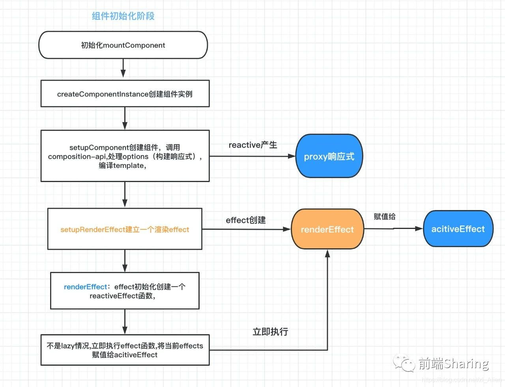

[Vue3 响应式原理](https://juejin.cn/post/6858899262596448270)


### [Vue3.0 性能优化及新特性深度解析](https://mp.weixin.qq.com/s/r90ABtYXcOwB7J_ILLYBpg)

- 性能
- Tree-shaking 支持
- Composition API
- Fragment、Teleport、Suspense
- 自定义渲染API
- 更好的 TS 支持

#### 编译时对VDom的性能优化

1. PatchFlag

只能带patchFlag 的 Node 才被认为是动态的元素，会被追踪属性的修改。并且 PatchFlag 会标识动态的属性类型有哪些

2. hoistStatic 静态节点提升

当使用hoistStatic时，所有 静态的节点都被提升到render方法之外。这意味着，他们只会在应用启动的时候被创建一次，而后随着每次的渲染被不停的复用。

3. cacheHandler 事件监听缓存

编辑器会为你动态创建一个内联函数，内联函数里面再去饮用当前组件上最新的handler。之后编辑器会将内联函数缓存。每次重新渲染时如果事件处理器没有变，就会使用缓存中的事件处理而不会重新获取事件处理器。这个节点就可以被看作是一个静态的节点。这种优化更大的作用在于当其作用域组件时，之前每次重新渲染都会导致组件的重新渲染，在通过handler缓存之后，不会导致组件的重新渲染了。

4. SSR 服务端渲染

5. StaticNode 静态节点

#### Tree Shaking

因为ES6模块是静态引用的，所以我们可以在编译时正确的判断到底加载了哪些代码。对代码全局做一个分析，找到那些没用被用到的模块、函数、变量，并把这些去掉。

#### Composition API

对options Api的优化， 使得逻辑复用及代码组合更清楚

核心 API
- reactive
- ref
- computed
- readonly
- watchEffect
- watch
- Lifecycle Hooks

#### Fragment、Teleport、Suspense
- Fragment

Vue3中不在要求模版的根节点必须是只能有一个节点。根节点和render函数返回的可以是纯文字、数组、单个节点，如果是数组，会自动转化为 Fragments。

- Teleport

对标 React Portal。更方便的方式创建弹窗组件等

- Suspense

等待嵌套的异步依赖。再把一个嵌套的组件树渲染到页面上之前，先在内存中进行渲染，并记录所有的存在异步依赖的组件。只有所有的异步依赖全部被resolve之后，才会把整个书渲染到dom中。当你的组件中有一个 async的 setup函数，这个组件可以被看作是一个Async Component，只有当这个组件被Resolve之后，再把整个树渲染出来

#### Typescript

### 响应式原理

使用新的api，Proxy，vue2.0 用 Object.defineProperty 作为响应式原理的实现，但是会有它的局限性，比如 无法监听数组基于下标的修改，不支持 Map、Set、WeakMap 和 WeakSet等缺陷 。

用到的捕获器有5种
- get(target, propKey, receiver)
- set(target,propKey, value,receiver)
- deleteProperty(target, propKey)
- has(target, propKey)，拦截操作： propKey in proxy; 不包含for...in循环
- ownKeys(target)：拦截操作1、Object.getOwnPropertyNames(proxy)；2、Object.getOwnPropertySymbols(proxy)；3、Object.keys(proxy)；4、for...in...循环

composition-api中的reactive直接构建响应式和使用传统的options Api本质上原理都是一样的。

1. reactive： 建立响应式reactive，返回proxy对象，这个reactive可以深层次递归，也就是如果发现展开的属性值是引用类型的而且被引用，还会用reactive递归处理。而且属性是可以被修改的。
2. shallowReactive： 建立响应式shallowReactive，返回proxy对象。和reactive的区别是只建立一层的响应式，也就是说如果发现展开属性是引用类型也不会递归。
3. readonly：返回的proxy处理的对象，可以展开递归处理，但是属性是只读的，不能修改。可以做props传递给子组件使用。
4. shallowReadonly： 返回经过处理的proxy对象，但是建立响应式属性是只读的，不展开引用也不递归转换，可以这用于为有状态组件创建props代理对象。

vue3.0采用了`WeakMap`去储存这些对象关系。WeakMaps 保持了对键名所引用的对象的弱引用，即垃圾回收机制不将该引用考虑在内。只要所引用的对象的其他引用都被清除，垃圾回收机制就会释放该对象所占用的内存。也就是说，一旦不再需要，WeakMap 里面的键名对象和所对应的键值对会自动消失，不用手动删除引用。
```typescript
const rawToReactive = new WeakMap<any, any>() // { [targetObject] : obseved }
const reactiveToRaw = new WeakMap<any, any>() // { [target] : obseved }
const rawToReadonly = new WeakMap<any, any>() /* 只读的 */
const readonlyToRaw = new WeakMap<any, any>() /* 只读的 */
```
baseHandlers: 对应对象，及数组


组件初始化阶段： 使用effect代替2.0的watcher

第一步: 创建component 实例。
第二步：初始化组件,建立proxy ,根据字符窜模版得到render函数。生命周期钩子函数处理等等。
第三步：建立一个渲染effect，执行effect。

```typescript
export function effect<T = any>(
  fn: () => T,
  options: ReactiveEffectOptions = EMPTY_OBJ
): ReactiveEffect<T> {
  const effect = createReactiveEffect(fn, options)
  /* 如果不是懒加载 立即执行 effect函数 */
  if (!options.lazy) {
    effect()
  }
  return effect
}
function createReactiveEffect<T = any>(
  fn: (...args: any[]) => T, /**回调函数 */
  options: ReactiveEffectOptions
): ReactiveEffect<T> {
  const effect = function reactiveEffect(...args: unknown[]): unknown {
    try {
        enableTracking()
        effectStack.push(effect) //往effect数组中里放入当前 effect
        activeEffect = effect //TODO: effect 赋值给当前的 activeEffect
        return fn(...args) //TODO:    fn 为effect传进来 componentEffect
      } finally {
        effectStack.pop() //完成依赖收集后从effect数组删掉这个 effect
        resetTracking() 
        /* 将activeEffect还原到之前的effect */
        activeEffect = effectStack[effectStack.length - 1]
    }
  } as ReactiveEffect
  /* 配置一下初始化参数 */
  effect.id = uid++
  effect._isEffect = true
  effect.active = true
  effect.raw = fn
  effect.deps = [] /* TODO:用于收集相关依赖 */
  effect.options = options
  return effect
}
```
createReactiveEffect的作用主要是配置了一些初始化的参数，然后包装了之前传进来的fn，重要的一点是把当前的effect赋值给了activeEffect,这一点非常重要，和收集依赖有着直接的关系



在vue2.0的时候。响应式是在初始化的时候就深层次递归处理了，但是与vue2.0不同的是，**即便是深度响应式我们也只能在获取上一级get之后才能触发下一级的深度响应式。** 

这样做好处是， 1、初始化的时候不用递归去处理对象，造成了不必要的性能开销。 2、有一些没有用上的state，这里就不需要在深层次响应式处理。

track->依赖收集器

根据 proxy对象，获取存放deps的depsMap，然后通过访问的属性名key获取对应的dep,然后将当前激活的effect存入当前dep收集依赖。
```typescript

/* target 对象本身 ，key属性值  type 为 'GET' */
export function track(target: object, type: TrackOpTypes, key: unknown) {
  /* 当打印或者获取属性的时候 console.log(this.a) 是没有activeEffect的 当前返回值为0  */
  let depsMap = targetMap.get(target)
  if (!depsMap) {
    /*  target -map-> depsMap  */
    targetMap.set(target, (depsMap = new Map()))
  }
  let dep = depsMap.get(key)
  if (!dep) {
    /* key : dep dep观察者 */
    depsMap.set(key, (dep = new Set()))
  }
   /* 当前activeEffect */
  if (!dep.has(activeEffect)) {
    /* dep添加 activeEffect */
    dep.add(activeEffect)
    /* 每个 activeEffect的deps 存放当前的dep */
    activeEffect.deps.push(dep)
  }
}
```
