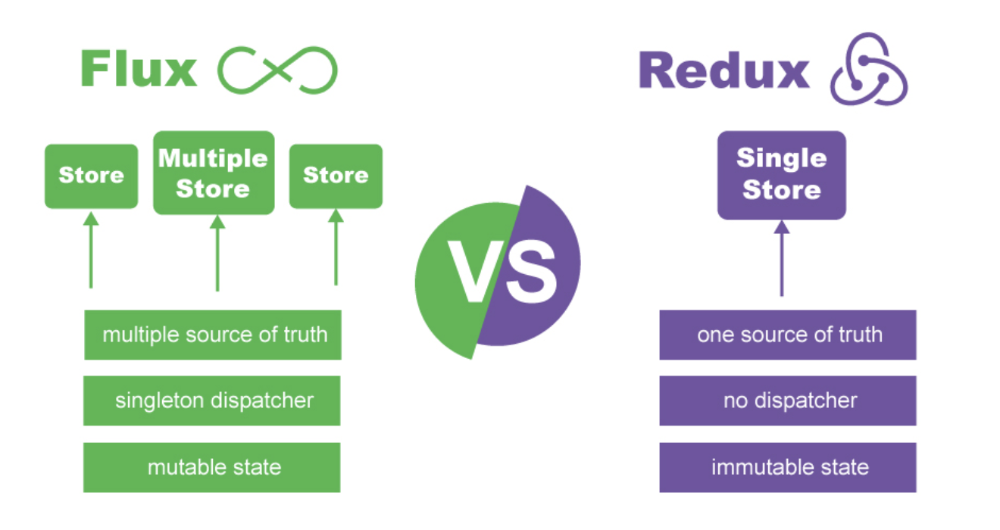
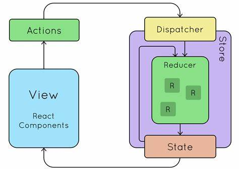

- [Vuex、Flux、Redux、Redux-saga、Dva、MobX](https://zhuanlan.zhihu.com/p/53599723)

不管是Vue，还是 React，都需要管理状态（state），比如组件之间都有**共享状态**的需要。什么是共享状态？比如一个组件需要使用另一个组件的状态，或者一个组件需要改变另一个组件的状态，都是共享状态。

为了使得状态便于管理、追踪，测试，总结来说就是不混乱，根据一些设计思想，比如约定大于配置，中间件模式等，状态管理的解决思路就是：**把组件之间需要共享的状态抽取出来，遵循特定的约定，统一来管理，让状态的变化可以预测。**

### Flux


Flux将一个应用分成四个部分。

- View： 视图层
- Action（动作）：视图层发出的消息（比如mouseClick）
- Dispatcher（派发器）：用来接收Actions、执行回调函数
- Store（数据层）：用来存放应用的状态，一旦发生变动，就提醒Views要更新页面

Flux 的最大特点，就是数据的**单向流动**。

### Redux

三大原则：

- **单一数据源**：整个应用的 state 被储存在一棵 object tree 中，并且这个 object tree 只存在于唯一一个 store 中。
- State 是只读的: 唯一改变 state 的方法就是触发 action，action 是一个用于描述已发生事件的普通对象。
- 使用纯函数reducer来执行修改，Redux 的 Reducer 就是 reduce 一个列表（action的列表）和一个 initialValue（初始的 State）到一个新的 value（新的 State）。



1. Redux 单一数据源：Flux 的数据源可以是多个，Flux可以有多个store，Redux只有一个
2. Redux的State 是只读的：Flux 的 State 可以随便改
3. Redux使用纯函数来执行修改：Flux 执行修改的不一定是纯函数

Reducer 是一个纯函数，对于相同的输入，永远都只会有相同的输出，不会影响外部的变量，也不会被外部变量影响，不得改写参数。它的作用大概就是这样，根据应用的状态和当前的 action 推导出**新的** state。


```javascript
import { createStore } from 'redux';
const store = createStore(reducer);

// reducer
const defaultState = 0;
const reducer = (state = defaultState, action) => {
  switch (action.type) {
    case 'ADD':
      return state + action.payload;
    default: 
      return state;
  }
};

const createStore = (reducer) => {
  let state;
  let listeners = [];

  const getState = () => state;

  const dispatch = (action) => {
      state = reducer(state, action)
      listeners.forEach(listener => listener())
  }
  
  const subscribe = (listener) => {
      listeners.push(listener)
      return () => {
      	listeners = listeners.filter(l => l !== listener)
      } 
  }
  dispatch({});
  return {
    getState,
    dispatch,
    subscribe
  }
}
```
Redux 有很多的 Reducer，对于大型应用来说，State 必然十分庞大，导致 Reducer 函数也十分庞大，所以需要做拆分。Redux 里每一个 Reducer 负责维护 State 树里面的一部分数据，多个 Reducer 可以通过 combineReducers 方法合成一个根 Reducer，这个根 Reducer 负责维护整个 State。

```javascript
import { combineReducers } from 'redux';

// 注意这种简写形式，State 的属性名必须与子 Reducer 同名
const rootReducer = combineReducers({
  Reducer1,
  Reducer2,
  Reducer3
})

const combineReducers = reducers => {
  return (state = {}, action) => {
    return Object.keys(reducers).reduce(
      (nextState, key) => {
        nextState[key] = reducers[key](state[key], action);
        return nextState;
      },
      {} 
    );
  };
};
```

### react-redux

Redux中一个组件如果想从store存取公用状态，需要进行四步操作：import引入store、getState获取状态、dispatch修改状态、subscribe订阅更新，代码相对冗余，我们想要合并一些重复的操作，而react-redux就提供了一种合并操作的方案：react-redux提供`Provider`和`connect`两个API，Provider将store放进this.context里，省去了import这一步，connect将getState、dispatch合并进了this.props，并自动订阅更新，简化了另外三步

Redux将React组件分为容器型组件和展示型组件，容器型组件一般通过`connect`函数生成，它订阅了全局状态的变化，通过`mapStateToProps`函数，可以对全局状态进行过滤，而展示型组件不直接从`global state`获取数据，其数据来源于父组件。


### Vuex
- [vuex工作原理详解](https://www.jianshu.com/p/d95a7b8afa06)
- [Vuex源码解读](https://mp.weixin.qq.com/s/uOVFpApoFJ7culotTQ5f3A)


Vuex 是一个专为 Vue.js 应用程序开发的状态管理模式。它采用集中式存储管理应用的所有组件的状态，并以相应的规则保证状态以一种可预测的方式发生变化。

状态自管理应用包含以下几个部分：

- **state**，驱动应用的数据源；
- **view**，以声明方式将 state 映射到视图；
- **actions**，响应在 view 上的用户输入导致的状态变化。

一个表示“单向数据流”理念的简单示意：


应用遇到多个组件共享状态时，单向数据流的简洁性很容易被破坏：

- 多个视图依赖于同一状态。
- 来自不同视图的行为需要变更同一状态。

对于问题一，传参的方法对于多层嵌套的组件将会非常繁琐，并且对于兄弟组件间的状态传递无能为力。

对于问题二，我们经常会采用父子组件直接引用或者通过事件来变更和同步状态的多份拷贝。以上的这些模式非常脆弱，通常会导致无法维护的代码。

**把组件的共享状态抽取出来，以一个全局单例模式管理**，通过定义和隔离状态管理中的各种概念并通过强制规则维持视图和状态间的独立性，代码将会变得更结构化且易维护。

vuex借鉴了Flux、Redux的思想，如数据的抽离到store，通过dispatch才能更改store的数据，数据与视图的流向。但特别的是，
vuex利用vue.js自身的细粒度数据响应机制来进行高效的状态更新。


本质上Vuex是在内部生成了一个Vue实例，state即是这个vm的data。

这样就能解释了为什么vuex中的state的对象属性必须提前定义好，如果该state中途增加一个属性，因为该属性没有被defineReactive，所以其依赖系统没有检测到，自然不能更新。
在vue中`this.$store._vm.$data.$$state === this.$store.state`

在`resetStoreVM`中试下了响应式更新。getter的缓存机制也是借助`computed`实现。
 ::: details 点击查看代码
```javascript
  function applyMixin (Vue) {
    var version = Number(Vue.version.split('.')[0]);

    if (version >= 2) {
      Vue.mixin({ beforeCreate: vuexInit });
    } else {
      // override init and inject vuex init procedure
      // for 1.x backwards compatibility.
      var _init = Vue.prototype._init;
      Vue.prototype._init = function (options) {
        if ( options === void 0 ) options = {};

        options.init = options.init
          ? [vuexInit].concat(options.init)
          : vuexInit;
        _init.call(this, options);
      };
    }

    /**
     * Vuex init hook, injected into each instances init hooks list.
     */

    function vuexInit () {
      var options = this.$options;
      // store injection
      if (options.store) {
        this.$store = typeof options.store === 'function'
          ? options.store()
          : options.store;
      } else if (options.parent && options.parent.$store) {
        this.$store = options.parent.$store;
      }
    }
  }
  function resetStoreVM (store, state, hot) {
    var oldVm = store._vm;

    // bind store public getters
    store.getters = {};
    // reset local getters cache
    store._makeLocalGettersCache = Object.create(null);
    var wrappedGetters = store._wrappedGetters;
    var computed = {};
    forEachValue(wrappedGetters, function (fn, key) {
      // use computed to leverage its lazy-caching mechanism
      // direct inline function use will lead to closure preserving oldVm.
      // using partial to return function with only arguments preserved in closure environment.
      computed[key] = partial(fn, store);
      Object.defineProperty(store.getters, key, {
        get: function () { return store._vm[key]; },
        enumerable: true // for local getters
      });
    });

    // use a Vue instance to store the state tree
    // suppress warnings just in case the user has added
    // some funky global mixins
    var silent = Vue.config.silent;
    Vue.config.silent = true;
    store._vm = new Vue({
      data: {
        $$state: state
      },
      computed: computed
    });
    Vue.config.silent = silent;

    // enable strict mode for new vm
    if (store.strict) {
      enableStrictMode(store);
    }

    if (oldVm) {
      if (hot) {
        // dispatch changes in all subscribed watchers
        // to force getter re-evaluation for hot reloading.
        store._withCommit(function () {
          oldVm._data.$$state = null;
        });
      }
      Vue.nextTick(function () { return oldVm.$destroy(); });
    }
  }
```
 ::: 
 为什么`mutation`要是同步写法，其实这是常见的软件工程模式，及约定大于配置，实际测试，mutation里面也是可以异步执行的，但是这样就代表不可控，且develop tool也不好跟踪。
 加action是因为要区分可追踪，不可追踪。mutation绝对可以追踪，action不追踪。action中最后必须调用mutation的commit方法；action的作用1.告诉你这个不可追踪2.这个是异步 至于异步竞争/顺序，这些自己控制。

